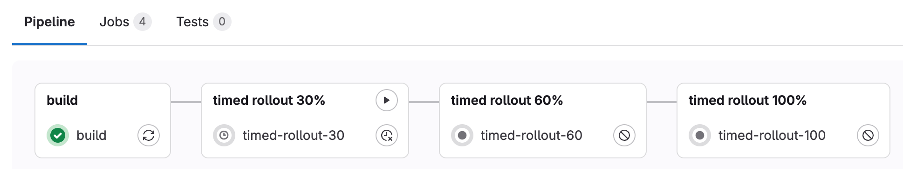



- Tier: 基础版，专业版，旗舰版
- Offering: JihuLab.com，私有化部署



在向你的应用程序推出变更时，可以只将生产变更发布到部分 Kubernetes pod，以此作为风险缓解策略。通过逐步发布生产变更，可以监控错误率或性能下降情况，如果没有问题，再更新所有 pod。

极狐GitLab 支持通过增量发布，对 Kubernetes 生产系统进行手动触发和定时发布。使用手动发布时，每一批 pod 的发布都需要手动触发。而使用定时发布时，发布会在默认暂停 5 分钟后分批进行。定时发布也可以在暂停时间结束前手动触发。

手动和定时发布会自动包含在由 [Auto DevOps](../../topics/autodevops/_index.md) 控制的项目中，但也可以通过极狐GitLab CI/CD 在 `.gitlab-ci.yml` 配置文件中进行配置。

手动触发的发布可以实现持续交付，而定时发布无需人工干预，可以作为持续部署策略的一部分。你还可以将两者结合，使应用自动部署，除非必要时你最终手动干预。

以下示例应用展示了这三种选项，你可以将它们作为构建自己应用的参考：

- [手动增量发布](https://gitlab.com/gl-release/incremental-rollout-example/blob/master/.gitlab-ci.yml)
- [定时增量发布](https://gitlab.com/gl-release/timed-rollout-example/blob/master/.gitlab-ci.yml)
- [手动与定时结合的发布](https://gitlab.com/gl-release/incremental-timed-rollout-example/blob/master/.gitlab-ci.yml)

<a id="manual-rollouts"></a>

## 手动发布

可以通过 `.gitlab-ci.yml` 将极狐GitLab 配置为手动进行增量发布。手动配置可以更好地控制此功能。增量发布的步骤取决于为部署定义的 pod 数量，这些数量在创建 Kubernetes 集群时进行配置。

例如，如果你的应用有 10 个 pod，并且运行了一个 10% 的发布作业，那么新版本的应用将部署到单个 pod，而其余 pod 仍显示应用的先前版本。

首先，[将模板定义为手动](https://gitlab.com/gl-release/incremental-rollout-example/blob/master/.gitlab-ci.yml#L100-103)：

```yaml
.manual_rollout_template: &manual_rollout_template
  <<: *rollout_template
  stage: production
  when: manual
```

接下来，[为每个步骤定义发布比例](https://gitlab.com/gl-release/incremental-rollout-example/blob/master/.gitlab-ci.yml#L152-155)：

```yaml
rollout 10%:
  <<: *manual_rollout_template
  variables:
    ROLLOUT_PERCENTAGE: 10
```

构建作业后，选择作业名称旁边的 **运行** () 来发布每个阶段的 pod。你也可以通过运行较低百分比的作业来进行回滚。一旦达到 100%，就无法使用此方法回滚。要回滚部署，请参阅[重试或回滚部署](deployments.md#retry-or-roll-back-a-deployment)。

一个[可部署的应用](https://gitlab.com/gl-release/incremental-rollout-example)可供参考，它演示了手动触发的增量发布。

<a id="timed-rollouts"></a>

## 定时发布

定时发布的行为与手动发布相同，不同之处在于每个作业在部署前都定义了以分钟为单位的延迟。选择作业会显示倒计时。



可以将此功能与手动增量发布结合使用，这样作业会先倒计时，然后再进行部署。

首先，[将模板定义为定时](https://gitlab.com/gl-release/timed-rollout-example/blob/master/.gitlab-ci.yml#L86-89)：

```yaml
.timed_rollout_template: &timed_rollout_template
  <<: *rollout_template
  when: delayed
  start_in: 1 minutes
```

你可以使用 `start_in` 键定义延迟时间：

```yaml
start_in: 1 minutes
```

接下来，[为每个步骤定义发布比例](https://gitlab.com/gl-release/timed-rollout-example/blob/master/.gitlab-ci.yml#L97-101)：

```yaml
timed rollout 30%:
  <<: *timed_rollout_template
  stage: timed rollout 30%
  variables:
    ROLLOUT_PERCENTAGE: 30
```

一个[可部署的应用](https://gitlab.com/gl-release/timed-rollout-example)可供参考，它[演示了定时发布的配置](https://gitlab.com/gl-release/timed-rollout-example/blob/master/.gitlab-ci.yml#L86-95)。

<a id="blue-green-deployment"></a>

## 蓝绿部署

> [!note]
> 团队可以利用 Ingress 注解和[设置流量权重](../../user/project/canary_deployments.md#how-to-change-the-traffic-weight-on-a-canary-ingress-deprecated)作为此处记录的蓝绿部署策略的替代方法。

这种技术有时也被称为 A/B 部署或红黑部署，用于减少部署期间的停机时间和风险。与增量发布结合使用时，可以最大程度地减少部署引发问题的影响。

使用此技术时，会有两个部署（“蓝”和“绿”，但可以使用任何命名）。在任何给定时间，除了增量发布期间外，只有其中一个部署处于活动状态。

例如，你的蓝色部署可以在生产环境中处于活动状态，而绿色部署在测试环境中“存活”，但未部署到生产环境。如果发现问题，可以更新绿色部署而不影响生产部署（当前为蓝色）。如果测试未发现问题，则将生产切换到绿色部署，此时蓝色部署可用于测试下一个版本。

此过程减少了停机时间，因为无需关闭生产部署即可切换到另一个部署。两个部署并行运行，并且可以随时切换。

一个[示例可部署应用](https://gitlab.com/gl-release/blue-green-example)可供参考，其中包含一个演示蓝绿部署的 [`.gitlab-ci.yml` CI/CD 配置文件](https://gitlab.com/gl-release/blue-green-example/blob/master/.gitlab-ci.yml)。