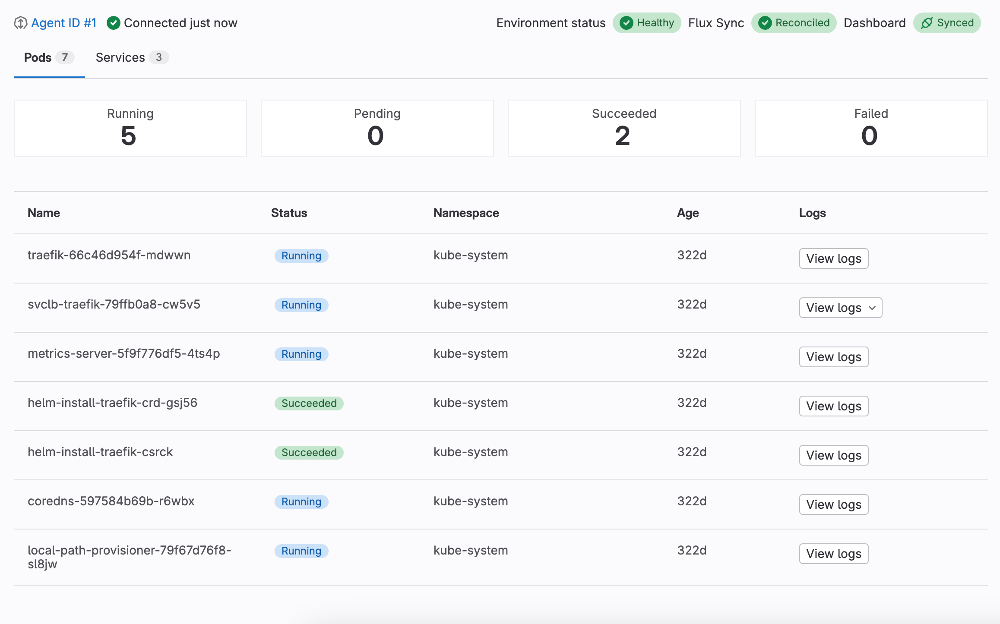
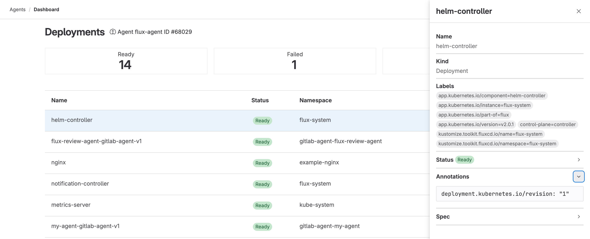



- Tier: 基础版，专业版，旗舰版
- Offering: JihuLab.com，私有化部署
- Status: 测试版





- 在极狐GitLab 16.1 中引入，带有功能标志 `environment_settings_to_graphql`、`kas_user_access`、`kas_user_access_project` 和 `expose_authorized_cluster_agents`。此功能处于 [beta](../../policy/development_stages_support.md#beta) 阶段。
- 功能标志 `environment_settings_to_graphql` 在极狐GitLab 16.2 中已移除。
- 功能标志 `kas_user_access`、`kas_user_access_project` 和 `expose_authorized_cluster_agents` 在极狐GitLab 16.2 中已移除。
- 在 16.10 中移到了环境详情页面。



使用 Kubernetes 仪表盘，通过直观的可视化界面了解集群的状态。
该仪表盘适用于所有已连接的 Kubernetes 集群，无论您是通过 CI/CD 还是 GitOps 部署的。



<a id="configure-a-dashboard"></a>

## 配置仪表盘



- 按命名空间过滤资源在极狐GitLab 16.2 中引入，带有功能标志 `kubernetes_namespace_for_environment`。默认禁用。
- 按命名空间过滤资源在极狐GitLab 16.3 中默认启用。功能标志 `kubernetes_namespace_for_environment` 已移除。
- 选择相关的 Flux 资源在极狐GitLab 16.3 中引入，带有功能标志 `flux_resource_for_environment`。
- 选择相关的 Flux 资源在极狐GitLab 16.4 中 GA。功能标志 `flux_resource_for_environment` 已移除。



配置仪表盘以便用于特定环境。
您可以为已有环境配置仪表盘，也可以在创建环境时添加仪表盘。

先决条件：

- 极狐GitLab Kubernetes Agent 已安装，并且已为环境所属项目或其父群组配置了 [`user_access`](../../user/clusters/agent/user_access.md)。





1. 在顶部栏中，选择 **搜索或跳转到** 并找到您的项目。
1. 在左侧边栏中，选择 **运维** > **环境**。
1. 选择要与 Kubernetes Agent 关联的环境。
1. 选择 **编辑**。
1. 选择极狐GitLab Kubernetes Agent。
1. 可选。从 **Kubernetes 命名空间** 下拉列表中选择一个命名空间。
1. 可选。从 **Flux 资源** 下拉列表中选择一个 Flux 资源。
1. 选择 **保存**。





1. 在顶部栏中，选择 **搜索或跳转到** 并找到您的项目。
1. 在左侧边栏中，选择 **运维** > **环境**。
1. 选择 **新建环境**。
1. 填写 **名称** 字段。
1. 选择极狐GitLab Kubernetes Agent。
1. 可选。从 **Kubernetes 命名空间** 下拉列表中选择一个命名空间。
1. 可选。从 **Flux 资源** 下拉列表中选择一个 Flux 资源。
1. 选择 **保存**。





<a id="configure-a-dashboard-for-a-dynamic-environment"></a>

### 为动态环境配置仪表盘



- 在极狐GitLab 17.6 中引入。



要为动态环境配置仪表盘：

- 在您的 `.gitlab-ci.yml` 文件中指定 Agent。您必须指定 Agent 配置项目的完整路径，后跟冒号和 Agent 名称。

例如：

```yaml
deploy_review_app:
  stage: deploy
  script: make deploy
  environment:
    name: review/$CI_COMMIT_REF_SLUG
    kubernetes:
      agent: path/to/agent/project:agent-name
```

更多信息，请参见 [CI/CD YAML 语法参考](../yaml/_index.md#environmentkubernetes)。

<a id="view-a-dashboard"></a>

## 查看仪表盘



- Kubernetes Watch API 集成在极狐GitLab 16.6 中引入，带有功能标志 `k8s_watch_api`。默认禁用。
- Kubernetes Watch API 集成在极狐GitLab 16.7 中默认启用。
- 在极狐GitLab 17.1 中 GA。功能标志 `k8s_watch_api` 已移除。



查看仪表盘以了解已连接集群的状态。
您的 Kubernetes 资源和 Flux 协调的状态会实时更新。

要查看已配置的仪表盘：

1. 在顶部栏中，选择 **搜索或跳转到** 并找到您的项目。
1. 在左侧边栏中，选择 **运维** > **环境**。
1. 选择与 Kubernetes Agent 关联的环境。
1. 选择 **Kubernetes 概览** 选项卡。

将显示 Pod 列表。选择一个 Pod 以查看其详细信息。

<a id="flux-sync-status"></a>

### Flux 同步状态



- 在极狐GitLab 16.3 中引入。
- 自定义 Flux 资源名称在极狐GitLab 16.3 中引入，带有功能标志 `flux_resource_for_environment`。
- 自定义 Flux 资源名称在极狐GitLab 16.4 中 GA。功能标志 `flux_resource_for_environment` 已移除。



您可以从仪表盘查看 Flux 部署的同步状态。
要显示部署状态，您的仪表盘必须能够检索 `Kustomization` 和 `HelmRelease` 资源，这需要为环境配置命名空间。

极狐GitLab 会搜索环境设置中 **Flux 资源** 下拉列表指定的 `Kustomization` 和 `HelmRelease` 资源。

仪表盘会显示以下状态徽章之一：

| 状态 | 描述 |
|---------|-------------|
| **已协调** | 部署已成功与其环境协调。 |
| **协调中** | 协调正在进行中。 |
| **停滞** | 协调因无法自动解决的错误而停滞。 |
| **失败** | 因不可恢复的错误，部署无法协调。 |
| **未知** | 无法检索部署的同步状态。 |
| **不可用** | 无法检索 `Kustomization` 或 `HelmRelease` 资源。 |

<a id="trigger-flux-reconciliation"></a>

### 触发 Flux 协调



- 在极狐GitLab 17.3 中引入。



您可以手动协调您的部署及其 Flux 资源。

要触发协调：

1. 在仪表盘上，选择 Flux 部署的同步状态徽章。
1. 选择 **操作** () > **触发协调** ()。

<a id="suspend-or-resume-flux-reconciliation"></a>

### 暂停或恢复 Flux 协调



- 在极狐GitLab 17.5 中引入。



您可以从 UI 中手动暂停或恢复 Flux 协调。

要暂停或恢复协调：

1. 在仪表盘上，选择 Flux 部署的同步状态徽章。
1. 选择 **操作** ()，然后选择以下之一：
   - **暂停协调** () 以暂停 Flux 协调。
   - **恢复协调** () 以重新开始 Flux 协调。

<a id="view-pod-logs"></a>

### 查看 Pod 日志



- 在极狐GitLab 17.2 中引入。



当您想要快速了解并排查跨环境的问题时，可以从已配置的仪表盘查看 Pod 日志。您可以查看 Pod 中每个容器的日志。

- 选择 **查看日志**，然后选择要查看日志的容器。

您也可以从 Pod 详细信息中查看 Pod 日志。

<a id="delete-a-pod"></a>

### 删除 Pod



- 在极狐GitLab 17.3 中引入。



要重新启动失败的 Pod，请从 Kubernetes 仪表盘中删除它。

要删除 Pod：

1. 在 **Kubernetes 概览** 选项卡上，找到要删除的 Pod。
1. 选择 **操作** () > **删除 Pod** ()。

您也可以从 Pod 详细信息中删除 Pod。

<a id="detailed-dashboard"></a>

## 详细仪表盘



- 在极狐GitLab 16.4 中引入，带有功能标志 `k8s_dashboard`。默认禁用。
- 在极狐GitLab 16.7 中面向部分用户于 JihuLab.com 上启用。



> [!flag]
> 此功能的可用性由功能标志控制。有关更多信息，请参见历史记录。此功能可用于测试，但尚未准备好用于生产环境。

详细仪表盘提供有关以下 Kubernetes 资源的信息：

- Pod
- 服务
- 部署
- ReplicaSet
- StatefulSet
- DaemonSet
- Job
- CronJob

每个仪表盘都显示资源列表及其状态、命名空间和存在时间。
您可以选择一个资源以打开包含更多信息的抽屉，其中包括标签以及 YAML 格式的状态、注解和规格。



<a id="view-a-detailed-dashboard"></a>

### 查看详细仪表盘

先决条件：

- 极狐GitLab Kubernetes Agent 已配置，并且使用 [`user_access`](../../user/clusters/agent/user_access.md) 关键字与环境所属项目或其父群组共享。

详细仪表盘未在侧边栏导航中链接。
要查看详细仪表盘：

1. 找到您的 Kubernetes Agent ID：
   1. 在顶部栏中，选择 **搜索或跳转到** 并找到您的项目。
   1. 选择 **运维** > **Kubernetes 集群**。
   1. 复制要访问的 Agent 的数字 ID。
1. 转到以下 URL 之一，将 `<agent_id>` 替换为您的 Agent ID：

   | 资源类型 | URL |
   | --- | --- |
   | Pod | `https://myinstance.gitlab.com/-/kubernetes/<agent_id>/pods` |
   | 服务 | `https://myinstance.gitlab.com/-/kubernetes/<agent_id>/services` |
   | 部署 | `https://myinstance.gitlab.com/-/kubernetes/<agent_id>/deployments` |
   | ReplicaSet | `https://myinstance.gitlab.com/-/kubernetes/<agent_id>/replicaSets` |
   | StatefulSet | `https://myinstance.gitlab.com/-/kubernetes/<agent_id>/statefulSets` |
   | DaemonSet | `https://myinstance.gitlab.com/-/kubernetes/<agent_id>/daemonSets` |
   | Job | `https://myinstance.gitlab.com/-/kubernetes/<agent_id>/jobs` |
   | CronJob | `https://myinstance.gitlab.com/-/kubernetes/<agent_id>/cronJobs` |

<a id="troubleshooting"></a>

## 故障排查

在使用 Kubernetes 仪表盘时，您可能会遇到以下问题。

<a id="user-cannot-list-resource-in-api-group"></a>

### 用户无法在 API 组中列出资源

您可能会收到一条错误，指出 `Error: services is forbidden: User "gitlab:user:<user-name>" cannot list resource "<resource-name>" in API group "" at the cluster scope`。

当用户在 [Kubernetes RBAC](https://kubernetes.io/docs/reference/access-authn-authz/rbac/) 中未被允许执行指定操作时，会发生此错误。

要解决此问题，请检查您的 [RBAC 配置](../../user/clusters/agent/user_access.md#configure-kubernetes-access)。如果 RBAC 配置正确，请联系您的 Kubernetes 管理员。

<a id="gitlab-agent-dropdown-list-is-empty"></a>

### 极狐GitLab Agent 下拉列表为空

当您配置新环境时，即使您已配置了 Kubernetes 集群，**极狐GitLab Agent** 下拉列表也可能为空。

要填充 **极狐GitLab Agent** 下拉列表，请使用 [`user_access`](../../user/clusters/agent/user_access.md) 关键字授予 Agent Kubernetes 访问权限。