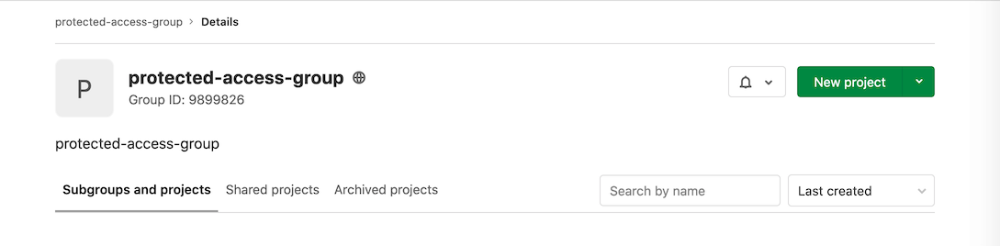



- Tier: 专业版，旗舰版
- Offering: JihuLab.com，私有化部署



[环境](_index.md)既可以用于测试，也可以用于生产。

由于部署作业可能由具有不同角色的不同用户触发，因此保护特定环境免受未经授权用户的影响非常重要。

默认情况下，受保护的环境确保只有具有适当权限的人才能部署到该环境，从而保证环境安全。

> [!note]
> 极狐GitLab 管理员可以使用所有环境，包括受保护的环境。

要保护或取消保护环境，您至少需要维护者角色。此外，要更新环境属性（如 `external_url`、`tier` 或 `description`），您还必须位于**允许部署**列表中。

> [!note]
> 受保护的环境是 CI/CD 设置的一部分。如果项目的 [CI/CD 已关闭](../../user/project/settings/_index.md#turn-off-cicd-for-a-project)，则受保护的环境在 UI 和 [API](../../api/protected_environments.md) 中均不可用。API 对所有请求（包括列出受保护的环境）返回 `403 Forbidden`。

<a id="protecting-environments"></a>

## 保护环境

先决条件：

- 当向审批人群组授予**允许部署**权限时，配置受保护环境的用户必须是待添加审批人群组的**直接成员**。否则，该群组或子群组不会出现在下拉列表中。有关更多信息，请参阅 [议题 345140](https://gitlab.com/gitlab-org/gitlab/-/issues/345140)。
- 当向审批人群组或项目授予**审批人**权限时，默认情况下只有审批人群组或项目的直接成员才能获得这些权限。要将这些权限也授予审批人群组或项目的继承成员：
  - 选中**启用群组继承**复选框。
  - [使用 API](../../api/protected_environments.md#group-inheritance-types)。

要保护环境：

1. 在顶部栏中，选择**搜索或跳转到**并找到您的项目。
1. 在左侧边栏中，选择**设置** > **CI/CD**。
1. 展开**受保护的环境**。
1. 选择**保护环境**。
1. 从**环境**列表中，选择要保护的环境。
1. 在**允许部署**列表中，选择您希望授予部署访问权限的角色、用户或群组。请注意：
   - 您可以从两个角色中选择：
     - **维护者**：允许项目中所有具有维护者角色的用户访问。
     - **开发者**：允许项目中所有具有维护者和开发者角色的用户访问。
   - 您还可以选择已[邀请](../../user/project/members/sharing_projects_groups.md#invite-a-group-to-a-project)到项目的群组。以报告者角色添加到项目的受邀群组会出现在[仅部署访问](#deployment-only-access-to-protected-environments)的下拉列表中。
   - 您还可以选择特定用户。用户必须具有开发者、维护者或所有者角色才能出现在**允许部署**列表中。
1. 在**审批人**列表中，选择您希望授予部署访问权限的角色、用户或群组。请注意：

   - 您可以从两个角色中选择：
     - **维护者**：允许项目中所有具有维护者角色的用户访问。
     - **开发者**：允许项目中所有具有维护者和开发者角色的用户访问。
   - 您只能选择已[邀请](../../user/project/members/sharing_projects_groups.md#invite-a-group-to-a-project)到项目的群组。
   - 用户必须具有开发者、维护者或所有者角色才能出现在**审批人**列表中。

1. 在**审批规则**部分：

   - 确保此数字小于或等于规则中的成员数。
   - 有关此功能的更多信息，请参阅[部署审批](deployment_approvals.md)。

1. 选择**保护**。

受保护的环境现在会出现在受保护的环境列表中。

<a id="use-the-api-to-protect-an-environment"></a>

### 使用 API 保护环境

或者，您可以使用 API 来保护环境：

1. 使用一个由 CI 创建环境的项目。例如：

   ```yaml
   stages:
     - test
     - deploy

   test:
     stage: test
     script:
       - 'echo "Testing Application: ${CI_PROJECT_NAME}"'

   production:
     stage: deploy
     when: manual
     script:
       - 'echo "Deploying to ${CI_ENVIRONMENT_NAME}"'
     environment:
       name: ${CI_JOB_NAME}
   ```

1. 使用 UI [创建新群组](../../user/group/_index.md#create-a-group)。
   例如，此群组名为 `protected-access-group`，群组 ID 为 `9899826`。请注意，这些步骤中的其余示例均使用此群组。

   

1. 使用 API 将用户作为报告者添加到群组中：

   ```shell
   $ curl --request POST --header "PRIVATE-TOKEN: <your_access_token>" \
          --data "user_id=3222377&access_level=20" "https://gitlab.com/api/v4/groups/9899826/members"

   {"id":3222377,"name":"Sean Carroll","username":"sfcarroll","state":"active","avatar_url":"https://gitlab.com/uploads/-/system/user/avatar/3222377/avatar.png","web_url":"https://gitlab.com/sfcarroll","access_level":20,"created_at":"2020-10-26T17:37:50.309Z","expires_at":null}
   ```

1. 使用 API 将群组作为报告者添加到项目中：

   ```shell
   $ curl --request POST --header "PRIVATE-TOKEN: <your_access_token>" \
          --request POST "https://gitlab.com/api/v4/projects/22034114/share?group_id=9899826&group_access=20"

   {"id":1233335,"project_id":22034114,"group_id":9899826,"group_access":20,"expires_at":null}
   ```

1. 使用 API 添加具有受保护环境访问权限的群组：

   ```shell
   curl --header 'Content-Type: application/json' --request POST --data '{"name": "production", "deploy_access_levels": [{"group_id": 9899826}]}' \
        --header "PRIVATE-TOKEN: <your_access_token>" "https://gitlab.com/api/v4/projects/22034114/protected_environments"
   ```

该群组现在具有访问权限，并且可以在 UI 中看到。

<a id="environment-access-by-group-membership"></a>

## 按群组成员身份访问环境

用户可以作为[群组成员身份](../../user/group/_index.md)的一部分被授予对受保护环境的访问权限。具有报告者角色的用户只能通过此方法授予对受保护环境的访问权限。

<a id="deployment-branch-access"></a>

## 部署分支访问权限

具有开发者角色的用户可以通过以下任一方法授予对受保护环境的访问权限：

- 作为个人贡献者，通过角色。
- 通过群组成员身份。

如果用户对部署到生产环境的分支也具有推送或合并访问权限，则他们拥有以下权限：

- [停止环境](_index.md#stopping-an-environment)。
- [删除环境](_index.md#delete-an-environment)。
- [创建环境终端](_index.md#web-terminals-deprecated)。

<a id="deployment-only-access-to-protected-environments"></a>

## 对受保护环境的仅部署访问权限

被授予对受保护环境的访问权限，但对其部署的分支没有推送或合并访问权限的用户，仅被授予部署该环境的访问权限。以[报告者角色](../../user/permissions.md#project-permissions)添加到项目的[受邀群组](../../user/project/members/sharing_projects_groups.md#invite-a-group-to-a-project)会出现在仅部署访问的下拉列表中。

要添加仅部署访问权限：

1. 如果尚不存在，请创建一个群组，其成员被授予对受保护环境的访问权限。
1. 以报告者角色[邀请该群组](../../user/project/members/sharing_projects_groups.md#invite-a-group-to-a-project)加入项目。
1. 按照[保护环境](#protecting-environments)中的步骤操作。

<a id="modifying-and-unprotecting-environments"></a>

## 修改和取消保护环境

维护者可以：

- 随时更新保护设置，包括**允许部署**列表和审批规则。
- 通过为环境选择**取消保护**来取消保护受保护的环境。

要在受保护的环境上更新环境属性（如 `external_url`、`tier` 或 `description`），用户还必须位于**允许部署**列表中。

环境取消保护后，所有访问条目都将被删除，如果环境被重新保护，则必须重新输入这些条目。

删除审批规则后，先前已批准的部署不会显示谁批准了该部署。有关谁批准部署的信息仍可在[项目审计事件](../../user/compliance/audit_events.md#project-audit-events)中获取。如果添加了新规则，则先前的部署会显示新规则，但没有批准部署的选项。[议题 506687](https://gitlab.com/gitlab-org/gitlab/-/issues/506687) 提议显示部署的完整审批历史，即使审批规则被删除。

有关更多信息，请参阅[部署安全](deployment_safety.md)。

<a id="protected-environments-for-groups"></a>

## 群组的受保护环境

通常，大型企业组织在[开发者和运维人员](https://about.gitlab.com/topics/devops/)之间有明确的权限边界。开发者构建和测试他们的代码，运维人员部署和监控应用程序。通过群组的受保护环境，运维人员可以限制开发者对关键环境的访问。他们将[项目的受保护环境](#protecting-environments)扩展到群组。

部署的权限可以用下表说明：

| 环境 | 开发者 | 运维人员 | 类别 |
|-------------|------------|----------|----------|
| 开发 | 允许 | 允许 | 较低环境 |
| 测试 | 允许 | 允许 | 较低环境 |
| 预发布 | 不允许 | 允许 | 较高环境 |
| 生产 | 不允许 | 允许 | 较高环境 |

_（参考：[维基百科上的部署环境](https://en.wikipedia.org/wiki/Deployment_environment)）_

<a id="protected-environment-names-for-groups"></a>

### 群组的受保护环境名称

与项目的受保护环境不同，群组的受保护环境使用[部署层级](_index.md#deployment-tier-of-environments)作为其名称。

一个群组可能包含许多具有唯一名称的项目环境。例如，项目 A 有一个 `gprd` 环境，项目 B 有一个 `Production` 环境，因此保护特定环境名称并不能很好地扩展。通过使用部署层级，两者都被识别为 `production` 部署层级，并同时受到保护。

<a id="configure-group-memberships"></a>

### 配置群组成员身份

为了最大限度地发挥群组受保护环境的效用，必须正确配置[群组成员身份](../../user/group/_index.md)：

- 运维人员应被授予顶级群组的所有者角色。他们可以在群组设置页面中维护较高环境（如生产）的 CI/CD 配置，其中包括群组的受保护环境、[群组的 Runner](../runners/runners_scope.md#group-runners) 和[群组的集群](../../user/group/clusters/_index.md)。这些配置作为只读条目继承到子项目。这确保了只有运维人员才能配置组织范围的部署规则集。
- 开发者应被授予顶级群组不超过开发者的角色，或被明确授予子项目的所有者角色。他们无权访问顶级群组中的 CI/CD 配置，因此运维人员可以确保关键配置不会被开发者意外更改。
- 对于子群组和子项目：
  - 如果父群组已为其自身配置了受保护的环境，则其[子群组](../../user/group/subgroups/_index.md)无法覆盖它。
  - [项目的受保护环境](#protecting-environments)可以与群组设置结合使用。如果两种配置都存在，要运行部署作业，用户必须同时被两个规则集允许。
  - 在顶级群组的项目或子群组中，可以安全地为开发者分配维护者角色，以调整其较低环境（如 `testing`）。

有了此配置：

- 如果用户即将在项目中运行部署作业并被允许部署到该环境，则部署作业将继续进行。
- 如果用户即将在项目中运行部署作业但不允许部署到该环境，则部署作业将失败并显示错误消息。

<a id="protect-critical-environments-under-a-group"></a>

### 保护群组下的关键环境

要为群组保护环境，请确保您的环境在 `.gitlab-ci.yml` 中定义了正确的 [`deployment_tier`](_index.md#deployment-tier-of-environments)。

<a id="using-the-ui"></a>

#### 使用 UI

1. 在顶部栏中，选择**搜索或跳转到**并找到您的群组。
1. 在左侧边栏中，选择**设置** > **CI/CD**。
1. 展开**受保护的环境**。
1. 从**环境**列表中，选择要保护的[环境部署层级](_index.md#deployment-tier-of-environments)。
1. 在**允许部署**列表中，选择您希望授予部署访问权限的[子群组](../../user/group/subgroups/_index.md)。
1. 选择**保护**。

<a id="using-the-api"></a>

#### 使用 API

通过使用 [REST API](../../api/group_protected_environments.md) 为群组配置受保护的环境。

<a id="deployment-approvals"></a>

## 部署审批

受保护的环境也可用于在部署前要求手动审批。有关更多信息，请参阅[部署审批](deployment_approvals.md)。

<a id="troubleshooting"></a>

## 故障排除

<a id="reporter-cant-run-a-trigger-job-that-deploys-to-a-protected-environment-in-downstream-pipeline"></a>

### 报告者无法运行在下游流水线中部署到受保护环境的触发作业

使用 [`trigger`](../yaml/_index.md#trigger) 关键字的作业可能无法运行，即使具有[对受保护环境的仅部署访问权限](#deployment-only-access-to-protected-environments)也是如此。

当触发作业未设置 [`environment`](../yaml/_index.md#environment) 关键字时，会出现此问题。没有它，极狐GitLab 无法将作业与受保护的环境关联，因此该作业会回退到[常规 CI/CD 权限模型](../../user/permissions.md#project-cicd)，该模型不授予用户的仅部署角色运行它的权限。

要解决此问题，请直接将 `environment` 关键字添加到触发作业中。
