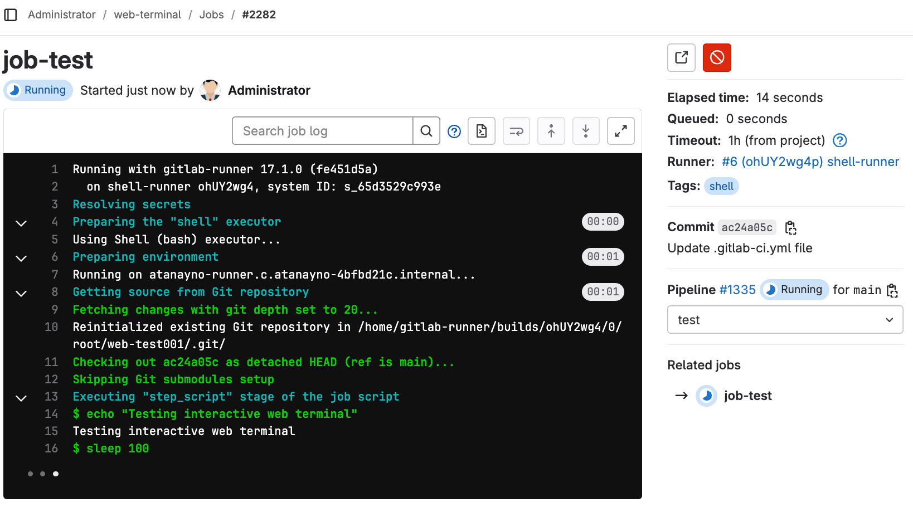
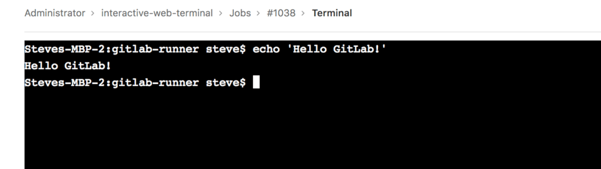
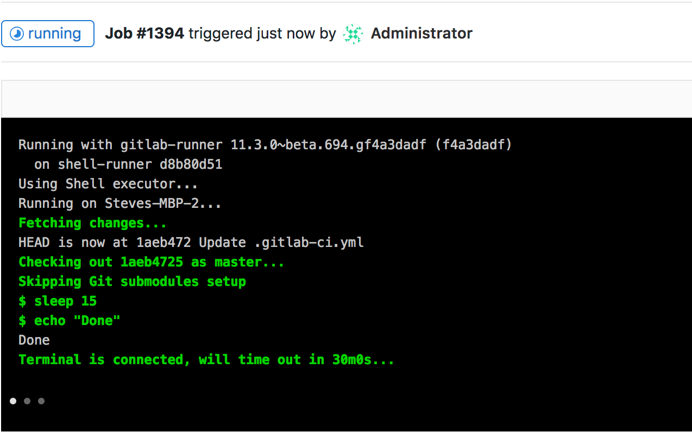



- Tier: 基础版，专业版，旗舰版
- Offering: JihuLab.com，私有化部署



交互式 Web 终端为用户提供了在极狐GitLab 中访问终端的能力，用于为其 CI 流水线运行一次性命令。您可以将其视为一种通过 SSH 进行调试的方法，但直接从任务页面完成。由于这赋予了用户对部署了 [极狐GitLab Runner](https://gitlab.cn/docs/runner) 的环境的 Shell 访问权限，因此采取了一些[安全预防措施](../../administration/integration/terminal.md#security)来保护用户。

> [!note]
> [JihuLab.com 上的实例 runner](../runners/_index.md) 不提供交互式 Web 终端。关注
> [此议题](https://jihulab.com/gitlab-cn/gitlab/-/issues/24674) 了解添加支持的进展。对于托管在 JihuLab.com 上的群组和项目，当使用您自己的群组或项目 runner 时，交互式 Web
> 终端可用。

## 配置

要使交互式 Web 终端正常工作，需要配置两件事：

- Runner 需要正确配置
  [`[session_server]`](https://gitlab.cn/docs/runner/configuration/advanced-configuration/#the-session_server-section)
- 如果您在极狐GitLab 实例前使用了反向代理，则需要[启用](../../administration/integration/terminal.md#enabling-and-disabling-terminal-support) Web 终端

### 对 Helm Chart 的部分支持

交互式 Web 终端在 `gitlab-runner` Helm Chart 中得到部分支持。
它们在以下情况下启用：

- 副本数为 1
- 您使用 `loadBalancer` 服务

修复这些限制的支持在以下议题中跟踪：

- [支持多个副本](https://jihulab.com/gitlab-cn/charts/gitlab-runner/-/issues/323)
- [支持更多服务类型](https://jihulab.com/gitlab-cn/charts/gitlab-runner/-/issues/324)

## 调试正在运行的任务

> [!note]
> 并非所有执行器都
> [受支持](https://gitlab.cn/docs/runner/executors/#compatibility-chart)。
>
> `docker` 执行器在构建脚本完成后不会保持运行。届时，终端会自动
> 断开连接，不会等待用户完成。关注
> [此议题](https://jihulab.com/gitlab-cn/gitlab-runner/-/issues/3605) 了解改进此行为的更新。

有时，当任务运行时，事情并不像您预期的那样。如果能有一个 Shell 来帮助调试，将会很有帮助。当任务运行时，
右侧面板会显示一个 **调试** 按钮（），用于打开当前任务的终端。只有启动任务的人才能调试它。

选中后，会打开一个新选项卡进入终端页面，您可以在其中访问
终端并像在标准 Shell 中一样输入命令。

如果您的终端在任务完成后仍处于打开状态，
任务不会完成，直到超过配置的
[`[session_server].session_timeout`](https://gitlab.cn/docs/runner/configuration/advanced-configuration/#the-session_server-section)
持续时间。为避免这种情况，您可以在任务完成后关闭终端。

