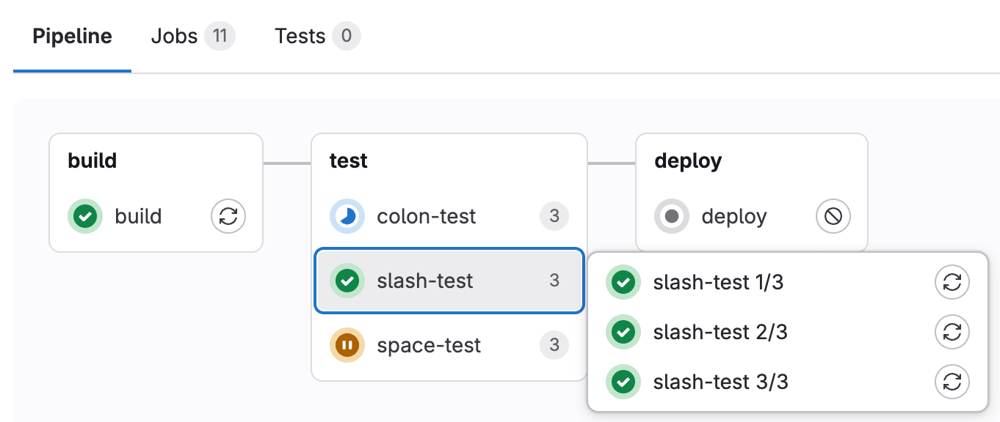
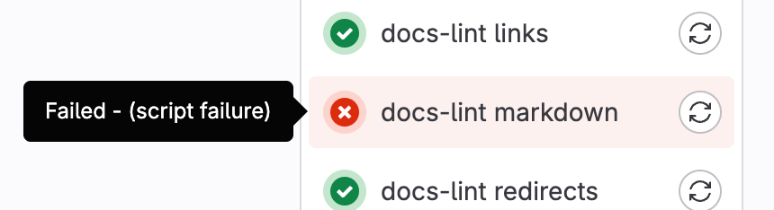



- Tier: 基础版，专业版，旗舰版
- Offering: JihuLab.com，私有化部署



CI/CD 任务是[极狐GitLab CI/CD 流水线](../pipelines/_index.md)的基本元素。
任务在 `.gitlab-ci.yml` 文件中通过一系列要执行的命令进行配置，
以完成构建、测试或部署代码等任务。

任务：

- 在 [runner](../runners/_index.md) 上执行，例如在 Docker 容器中。
- 独立于其他任务运行。
- 拥有完整的执行日志，即[任务日志](job_logs.md)。

任务通过 [YAML 关键字](../yaml/_index.md)定义，这些关键字定义了任务执行的各个方面，包括用于以下目的的关键字：

- 控制[如何](job_control.md)及[何时](job_rules.md)运行任务。
- 将任务分组到称为[阶段](../yaml/_index.md#stages)的集合中。
  阶段按顺序运行，而同一阶段中的所有任务可以并行运行。
- 定义 [CI/CD 变量](../variables/_index.md)以实现灵活配置。
- 定义[缓存](../caching/_index.md)以加速任务执行。
- 将文件保存为[产物](job_artifacts.md)，供其他任务使用。

<a id="add-a-job-to-a-pipeline"></a>

## 添加一个任务到流水线

要将任务添加到流水线中，请将其添加到你的 `.gitlab-ci.yml` 文件中。该任务必须：

- 在 YAML 配置的顶层定义。
- 具有唯一的[任务名称](#job-names)。
- 包含一个 [`script`](../yaml/_index.md#script) 部分（定义要运行的命令），或者一个 [`trigger`](../yaml/_index.md#trigger) 部分（触发[下游流水线](../pipelines/downstream_pipelines.md)运行）。

例如：

```yaml
my-ruby-job:
  script:
    - bundle install
    - bundle exec my_ruby_command

my-shell-script-job:
  script:
    - my_shell_script.sh
```

<a id="job-names"></a>

### 任务名称

你不能使用以下关键字作为任务名称：

- `image`
- `services`
- `stages`
- `before_script`
- `after_script`
- `variables`
- `cache`
- `include`
- 为 `deploy` 阶段配置的 `pages:deploy`

此外，以下名称在加引号时是有效的，但不推荐使用，因为它们可能会使流水线配置不清晰：

- `"true":`
- `"false":`
- `"nil":`

任务名称不得超过 255 个字符。

为你的任务使用唯一的名称。如果文件中多个任务具有相同的名称，则只有一个会被添加到流水线中，并且难以预测会选择哪一个。
如果相同的任务名称在一个或多个包含文件中被使用，[参数会被合并](../yaml/includes.md#override-included-configuration-values)。

<a id="hide-a-job"></a>

### 隐藏一个任务

要暂时禁用一个任务而不从配置文件中删除它，请在任务名称开头添加一个句点 (`.`)。隐藏的任务不需要包含 `script` 或 `trigger` 关键字，但必须包含有效的 YAML 配置。

例如：

```yaml
.hidden_job:
  script:
    - run test
```

隐藏的任务不会被极狐GitLab CI/CD 处理，但它们可以用作可重用配置的模板，通过：

- [`extends` 关键字](../yaml/yaml_optimization.md#use-extends-to-reuse-configuration-sections)。
- [YAML 锚点](../yaml/yaml_optimization.md#anchors)。

<a id="set-default-values-for-job-keywords"></a>

## 为任务关键字设置默认值

你可以使用 `default` 关键字设置默认的任务关键字和值，这些值会被流水线中的所有任务默认使用。

例如：

```yaml
default:
  image: 'ruby:2.4'
  before_script:
    - echo Hello World

rspec-job:
  script: bundle exec rspec
```

当流水线运行时，该任务会使用默认的关键字：

```yaml
rspec-job:
  image: 'ruby:2.4'
  before_script:
    - echo Hello World
  script: bundle exec rspec
```

<a id="control-the-inheritance-of-default-keywords-and-variables"></a>

### 控制默认关键字和变量的继承

你可以控制以下内容的继承：

- [默认关键字](../yaml/_index.md#default) 通过 [`inherit:default`](../yaml/_index.md#inheritdefault)。
- [默认变量](../yaml/_index.md#default) 通过 [`inherit:variables`](../yaml/_index.md#inheritvariables)。

例如：

```yaml
default:
  image: 'ruby:2.4'
  before_script:
    - echo Hello World

variables:
  DOMAIN: example.com
  WEBHOOK_URL: https://my-webhook.example.com

rubocop:
  inherit:
    default: false
    variables: false
  script: bundle exec rubocop

rspec:
  inherit:
    default: [image]
    variables: [WEBHOOK_URL]
  script: bundle exec rspec

capybara:
  inherit:
    variables: false
  script: bundle exec capybara

karma:
  inherit:
    default: true
    variables: [DOMAIN]
  script: karma
```

在这个例子中：

- `rubocop`：
  - 继承：无。
- `rspec`：
  - 继承：默认的 `image` 和 `WEBHOOK_URL` 变量。
  - **不**继承：默认的 `before_script` 和 `DOMAIN` 变量。
- `capybara`：
  - 继承：默认的 `before_script` 和 `image`。
  - **不**继承：`DOMAIN` 和 `WEBHOOK_URL` 变量。
- `karma`：
  - 继承：默认的 `image` 和 `before_script`，以及 `DOMAIN` 变量。
  - **不**继承：`WEBHOOK_URL` 变量。

<a id="view-jobs-in-a-pipeline"></a>

## 查看流水线中的任务

当你访问一个流水线时，可以看到该流水线相关的任务。

流水线中任务的顺序取决于流水线图的类型。

- 对于[完整流水线图](../pipelines/_index.md#pipeline-details)，任务按名称字母顺序排序。
- 对于[流水线迷你图](../pipelines/_index.md#pipeline-mini-graphs)，任务按状态严重性排序，失败的任务排在最前面，然后按名称字母顺序排序。

选择一个单独的任务会显示其[任务日志](job_logs.md)，并允许你：

- 取消任务。
- 重试任务（如果失败）。
- 再次运行任务（如果通过）。
- 擦除任务日志。

<a id="view-project-jobs"></a>

### 查看项目任务



- Offering: JihuLab.com，私有化部署





- 任务名称过滤器在极狐GitLab 17.3 中作为[实验性功能](../../policy/development_stages_support.md)在 JihuLab.com 和私有化部署上[添加](https://gitlab.com/gitlab-org/gitlab/-/issues/387547)[通过功能标志](../../administration/feature_flags/_index.md) `populate_and_use_build_names_table` 用于 API 和 `fe_search_build_by_name` 用于 UI。默认禁用。
- 在极狐GitLab 18.人力 中[正式发布](https://gitlab.com/gitlab-org/gitlab/-/issues/512149)。功能标志 `populate_and_use_build_names_table` 和 `fe_search_build_by_name` 已移除。
- 任务类型过滤器在极狐GitLab 18.3 中[添加](https://gitlab.com/gitlab-org/gitlab/-/issues/555434)。



要查看项目中运行的任务：

1. 在顶部栏中，选择**搜索或跳转到**并找到你的项目。
1. 在左侧边栏中，选择**构建** > **任务**。

你可以按任务状态、来源、名称和类型过滤列表。

> [!note]
> 按名称过滤仅返回最近 30 天内创建的任务。此保留期适用于 UI 和 API 过滤。

默认情况下，过滤器仅显示构建任务。要查看触发任务，请清除过滤器，然后选择**类型** > **触发**。

> [!note]
> **类型**过滤器仅适用于项目任务。它在**管理员**区域中不可用。

<a id="available-job-statuses"></a>

### 可用的任务状态

CI/CD 任务可以具有以下状态：

- `canceled`：任务已被手动取消或自动中止。
- `canceling`：任务正在被取消，但 `after_script` 正在运行。
- `created`：任务已创建但尚未处理。
- `failed`：任务执行失败。
- `manual`：任务需要手动操作才能启动。
- `pending`：任务在队列中等待一个 runner。
- `preparing`：Runner 正在准备执行环境。
- `running`：任务正在 runner 上执行。
- `scheduled`：任务已调度，但尚未开始执行。
- `skipped`：由于条件或依赖关系，任务被跳过。
- `success`：任务成功完成。
- `waiting_for_callback`：任务正在等待来自外部服务的回调。
- `waiting_for_resource`：任务正在等待资源可用。

<a id="view-the-source-of-a-job"></a>

### 查看任务的来源



- 任务来源在极狐GitLab 17.9 中[引入](https://gitlab.com/gitlab-org/gitlab/-/merge_requests/181159)[通过功能标志](../../administration/feature_flags/_index.md) `populate_and_use_build_source_table`。默认启用。
- 在 JihuLab.com、私有化部署上，于极狐GitLab 17.11 中[正式发布](https://gitlab.com/groups/gitlab-org/-/epics/11796)。



极狐GitLab CI/CD 任务包含一个来源属性，指示触发该任务的操作。
使用此属性可跟踪任务是如何启动的，或根据特定的来源过滤任务运行。

#### 可用的任务来源

来源属性可以具有以下值：

- `api`：任务由对 Jobs API 的 REST 调用启动。
- `chat`：任务由使用极狐GitLab ChatOps 的聊天命令启动。
- `container_registry_push`：任务由容器镜像仓库推送启动。
- `duo_workflow`：任务由极狐GitLab Duo Agent Platform 启动。
- `external`：任务由与极狐GitLab 集成的外部仓库中的事件启动。这不包括拉取请求事件。
- `external_pull_request_event`：任务由外部仓库中的拉取请求事件启动。
- `merge_request_event`：任务由合并请求事件启动。
- `ondemand_dast_scan`：任务由按需 DAST 扫描启动。
- `ondemand_dast_validation`：任务由按需 DAST 验证启动。
- `parent_pipeline`：任务由父流水线启动。
- `pipeline`：任务由用户手动运行流水线启动。
- `pipeline_execution_policy`：任务由流水线执行策略启动。
- `pipeline_execution_policy_schedule`：任务由定时流水线执行策略启动。
- `push`：任务由代码推送启动。
- `scan_execution_policy`：任务由扫描执行策略启动。
- `schedule`：任务由定时流水线启动。
- `security_orchestration_policy`：任务由定时扫描执行策略启动。
- `trigger`：任务由另一个任务或流水线启动。
- `unknown`：任务由未知来源启动。
- `web`：任务由用户从极狐GitLab UI 启动。
- `webide`：任务由用户从 Web IDE 启动。

<a id="group-similar-jobs-together-in-pipeline-views"></a>

### 在流水线视图中将相似的任务分组

如果你有许多相似的任务，你的[流水线图](../pipelines/_index.md#pipeline-details)会变得很长且难以阅读。

你可以自动将相似的任务分组在一起。如果任务名称以某种方式格式化，它们会在常规的流水线图（不是迷你图）中折叠为一个组。

如果你看到任务名称旁边有一个数字，而不是重试或取消按钮，那么你可以识别出一个流水线中有分组的任务。该数字表示分组任务的数量。将鼠标悬停在其上会显示所有任务是都通过了还是有任何一个失败了。选中可展开它们。



要创建一组任务，在 `.gitlab-ci.yml` 文件中，用数字和以下符号之一分隔每个任务名称：

- 正斜杠或反斜杠（`/` 或 `\`），例如，`slash-test 1/3`、`slash-test 2/3`、`slash-test 3/3`。
- 冒号（`:`），例如，`colon-test 1:3`、`colon-test 2:3`、`colon-test 3:3`。
- 空格，例如 `space-test 0 3`、`space-test 1 3`、`space-test 2 3`。

你可以互换使用这些符号。

在以下示例中，这三个任务在一个名为 `build ruby` 的组中：

```yaml
build ruby 1/3:
  stage: build
  script:
    - echo "ruby1"

build ruby 2/3:
  stage: build
  script:
    - echo "ruby2"

build ruby 3/3:
  stage: build
  script:
    - echo "ruby3"
```

流水线图显示一个名为 `build ruby` 的组，包含三个任务。

任务按从左到右比较数字来排序。你通常希望第一个数字是索引，第二个数字是总数。

<a id="retry-jobs"></a>

## 重试任务

你可以在任务完成后重试它，无论其最终状态（失败、成功或取消）。

当你重试任务时：

- 会创建一个新的任务实例，具有新的任务 ID。
- 任务使用与原始任务相同的参数和变量运行。
- 如果任务产生产物，会创建并存储新的产物。
- 新任务与发起重试的用户关联，而不是与创建原始流水线的用户关联。
- 之前被跳过的任何后续作业都会被重新分配给发起重试的用户。

当你重试一个触发下游流水线的[触发任务](../yaml/_index.md#trigger)时：

- 触发任务会生成一个新的下游流水线。
- 下游流水线也与发起重试的用户关联。
- 下游流水线使用重试时存在的配置运行，这可能与原始运行时的配置不同。

<a id="retry-a-job"></a>

### 重试一个任务

先决条件：

- 你必须具有项目的开发者、维护者或所有者角色。
- 该任务不能是[已归档的](../../administration/settings/continuous_integration.md#archive-pipelines)。

要从合并请求重试任务：

1. 在顶部栏中，选择**搜索或跳转到**并找到你的项目。
1. 在你的合并请求中，执行以下操作之一：
   - 在流水线小部件中，在你想重试的任务旁边，选择**再次运行** ()。
   - 选择**流水线**选项卡，在你想重试的任务旁边，选择**再次运行** ()。

要从任务日志重试任务：

1. 转到该任务的日志页面。
1. 在右上角，选择**再次运行** ()。

要从流水线重试任务：

1. 在顶部栏中，选择**搜索或跳转到**并找到你的项目。
1. 在左侧边栏中，选择**构建** > **流水线**。
1. 找到包含你想重试的任务的流水线。
1. 从流水线图中，在你想重试的任务旁边，选择**再次运行** ()。

<a id="retry-all-failed-or-canceled-jobs-in-a-pipeline"></a>

### 重试流水线中所有失败或取消的任务

如果一个流水线有多个失败或取消的任务，你可以一次性重试它们：

1. 在顶部栏中，选择**搜索或跳转到**并找到你的项目。
1. 执行以下操作之一：
   - 选择**构建** > **流水线**。
   - 转到一个合并请求并选择**流水线**选项卡。
1. 对于有失败或取消的任务的流水线，选择**重试所有失败或取消的任务** ()。

<a id="cancel-jobs"></a>

## 取消任务

你可以取消一个尚未完成的 CI/CD 任务。

当你取消一个任务时，接下来会发生什么取决于其状态和极狐GitLab Runner 的版本：

- 对于尚未开始执行的任务，任务会立即被取消。
- 对于正在运行的任务：
  - 对于极狐GitLab Runner 16.10 及更高版本与极狐GitLab 17.0 及更高版本：
    1. 任务被标记为 `canceling`。
    1. 当前正在运行的命令被允许完成。任务的 [`before_script`](../yaml/_index.md#before_script) 或 [`script`](../yaml/_index.md#script) 中的其余命令被跳过。
    1. 如果任务有 `after_script` 部分，它总是会启动并运行到完成。
    1. 任务被标记为 `canceled`。
  - 对于极狐GitLab Runner 16.9 及更早版本与极狐GitLab 16.11 及更早版本，任务会立即被 `canceled`，而不会运行 `after_script`。

如果你需要立即取消任务而不等待 `after_script`，请使用[强制取消](#force-cancel-a-job)。

<a id="cancel-a-job"></a>

### 取消一个任务

先决条件：

- 你必须具有项目的开发者、维护者或所有者角色，或者拥有[取消流水线或任务所需的最低角色](../pipelines/settings.md#restrict-roles-that-can-cancel-pipelines-or-jobs)。

要从合并请求取消任务：

1. 在顶部栏中，选择**搜索或跳转到**并找到你的项目。
1. 在你的合并请求中，执行以下操作之一：
   - 在流水线小部件中，在你想取消的任务旁边，选择**取消** ()。
   - 选择**流水线**选项卡，在你想取消的任务旁边，选择**取消** ()。

要从任务日志取消任务：

1. 转到该任务的日志页面。
1. 在右上角，选择**取消** ()。

要从流水线取消任务：

1. 在顶部栏中，选择**搜索或跳转到**并找到你的项目。
1. 在左侧边栏中，选择**构建** > **流水线**。
1. 找到包含你想取消的任务的流水线。
1. 从流水线图中，在你想取消的任务旁边，选择**取消** ()。

<a id="cancel-all-running-jobs-in-a-pipeline"></a>

### 取消流水线中所有正在运行的任务

你可以一次性取消正在运行的流水线中的所有任务。

1. 在顶部栏中，选择**搜索或跳转到**并找到你的项目。
1. 执行以下操作之一：
   - 选择**构建** > **流水线**。
   - 转到一个合并请求并选择**流水线**选项卡。
1. 对于你想取消的流水线，选择**取消正在运行的流水线** ()。

<a id="force-cancel-a-job"></a>

### 强制取消一个任务



- 在极狐GitLab 17.10 中作为[实验性功能](../../policy/development_stages_support.md)[引入](https://gitlab.com/gitlab-org/gitlab/-/issues/467107)[通过功能标志](../../administration/feature_flags/_index.md) `force_cancel_build`。默认禁用。
- 在极狐GitLab 17.11 中[正式发布](https://gitlab.com/gitlab-org/gitlab/-/issues/519313)。功能标志 `force_cancel_build` 已移除。



如果你不想等待 `after_script` 完成或某个任务无响应，你可以强制取消它。
强制取消会立即将任务从 `canceling` 状态转变为 `canceled`。

当你强制取消一个任务时，[任务令牌](ci_job_token.md)会被立即撤销。
如果 runner 仍在执行该任务，它将失去对极狐GitLab 的访问权。
Runner 会中止该任务，而不会等待 `after_script` 完成。

先决条件：

- 你必须具有项目的维护者或所有者角色。
- 该任务必须处于 `canceling` 状态，这需要：
  - 极狐GitLab 17.0 及更高版本。
  - 极狐GitLab Runner 16.10 及更高版本。

要强制取消一个任务：

1. 转到该任务的日志页面。
1. 在右上角，选择**强制取消**。

<a id="troubleshoot-a-failed-job"></a>

## 排查失败的任务

当一个流水线失败或被允许失败时，你可以在以下几个地方找到原因：

- 在[流水线图](../pipelines/_index.md#pipeline-details)中，在流水线详情视图。
- 在流水线小部件中，在合并请求和提交页面。
- 在任务视图中，在任务的全局和详细视图中。

在每个地方，如果你将鼠标悬停在失败的任务上，就可以看到它失败的原因。



你也可以在任务详情页面看到它失败的原因。

<a id="with-root-cause-analysis"></a>

### 使用根因分析

你可以在极狐GitLab Duo Chat中使用极狐GitLab Duo 根因分析来[排查失败的 CI/CD 任务](../../user/gitlab_duo_chat/examples.md#troubleshoot-failed-cicd-jobs-with-root-cause-analysis)。

<a id="deployment-jobs"></a>

## 部署任务

部署任务是使用[环境](../environments/_index.md)的 CI/CD 任务。
部署任务是指任何使用 `environment` 关键字和 [`start` 环境 `action`](../yaml/_index.md#environmentaction) 的任务。
部署任务不需要位于 `deploy` 阶段。下面的 `deploy me` 任务就是一个部署任务的例子。`action: start` 是默认行为，为了清晰在此处定义了出来，但你可以省略它：

```yaml
deploy me:
  script:
    - deploy-to-cats.sh
  environment:
    name: production
    url: https://cats.example.com
    action: start
```

部署任务的行为可以通过[部署安全性](../environments/deployment_safety.md)设置来控制，例如[防止过时的部署任务](../environments/deployment_safety.md#prevent-outdated-deployment-jobs)和[确保一次只运行一个部署任务](../environments/deployment_safety.md#ensure-only-one-deployment-job-runs-at-a-time)。