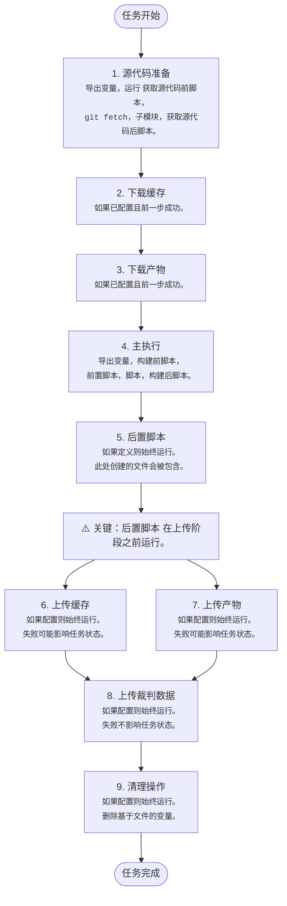



- Tier: 基础版，专业版，旗舰版
- Offering: JihuLab.com，私有化部署



任务执行流程描述了极狐GitLab Runner 如何处理 CI/CD 任务从开始到结束。

极狐GitLab Runner 在接收到任务后执行 CI/CD 任务，从保管库检索密钥（如果已配置），并准备执行器。每个 CI/CD 任务都作为一系列顺序步骤执行，每个步骤在独立的 Shell 上下文中运行。Runner：

1. 为任务准备源代码：

   - 将变量导出到 Shell 上下文
   - 如果配置中定义了 `获取源代码前脚本`，则运行它
   - 执行 `git fetch` 和其他源代码处理命令，除非配置了 `无` 策略
   - 如果存在子模块，则运行命令更新它们
   - 如果配置中定义了 `获取源代码后脚本`，则运行它

1. 如果配置了[缓存](../yaml/_index.md#cache)且上一步成功，则下载缓存文件：

   - 将变量导出到 Shell 上下文
   - 执行命令从之前的任务运行中下载缓存文件

1. 如果配置了产物下载且上一步成功，则从之前的任务下载[产物](../yaml/_index.md#artifacts)：

   - 将变量导出到 Shell 上下文
   - 执行命令从之前的任务下载产物文件

1. 如果上一步成功，则执行主任务脚本：

   - 将变量导出到 Shell 上下文
   - 如果配置中定义了 `构建前脚本`，则运行它
   - 如果定义了 `前置脚本` 命令，则执行它们
   - 执行主 `脚本` 命令
   - 如果配置中定义了 `构建后脚本`，则运行它

1. 如果定义了 `后置脚本` 命令，则执行它们，无论前面的步骤是否失败：

   - 将变量导出到新的 Shell 上下文
   - 执行 `后置脚本` 命令
   - 这些命令的失败不影响整体任务状态

1. 如果配置了缓存上传，则上传文件到缓存，无论前面的步骤是否失败：

   - 将变量导出到 Shell 上下文
   - 执行命令将指定文件上传到缓存存储
   - 此步骤的失败可能影响整体任务状态

1. 如果配置了产上传，则上传产物，无论前面的步骤是否失败：

   - 将变量导出到 Shell 上下文
   - 执行命令将指定文件作为任务产物上传
   - 此步骤的失败可能影响整体任务状态

1. 如果配置了裁判数据上传，则上传裁判数据，无论前面的步骤是否失败：

   - 将变量导出到 Shell 上下文
   - 执行命令上传裁判信息
   - 这些命令的失败不影响整体任务状态

1. 如果配置了清理操作，则执行清理操作，无论前面的步骤是否失败：

   - 将变量导出到 Shell 上下文
   - 执行命令从工作目录中删除基于文件的变量
   - 这些命令的失败不影响整体任务

## Shell 上下文隔离

每个 Shell 上下文在设计上是隔离的。上下文之间的唯一联系是共享的工作目录文件系统。

- 在一个上下文中手动导出的变量（如 `export my_variable=$(date)`）在其他上下文中不可用
- 每个脚本都使用 `set -eo pipefail`（对于 Unix Shell）运行，以便在第一个错误时尽早失败
- 每个步骤的结果会影响后续步骤是否执行，并影响整体任务状态