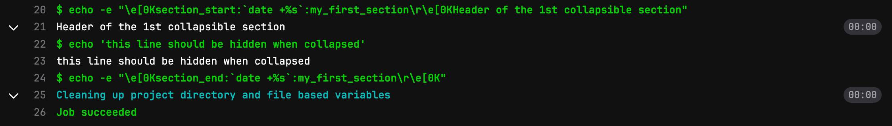
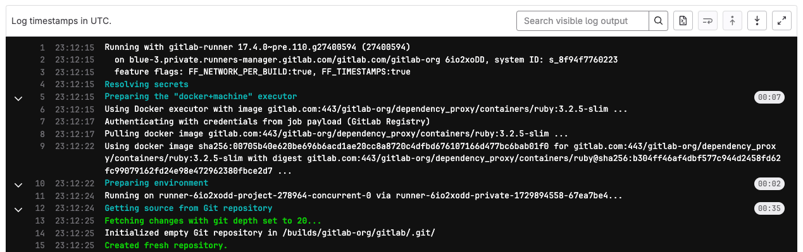



- Tier: 基础版，专业版，旗舰版
- Offering: JihuLab.com，私有化部署



作业日志显示 [CI/CD 作业](_index.md)的完整执行历史。

<a id="view-job-logs"></a>

## 查看作业日志

要查看作业日志：

1. 选择你要查看作业日志的项目。
1. 在左侧边栏中，选择 **CI/CD** > **流水线**。
1. 选择要检查的流水线。
1. 在流水线视图中，在作业列表中，选择一个作业以查看作业日志页面。

要查看作业及其日志输出的详细信息，请滚动浏览作业日志页面。

<a id="view-job-logs-in-full-screen-mode"></a>

## 以全屏模式查看作业日志



- 在极狐GitLab 16.7 引入。



你可以通过点击 **显示全屏** 来全屏查看作业日志内容。

要使用全屏模式，你的网络浏览器也必须支持。如果浏览器不支持全屏模式，则该选项不可用。

<a id="expand-and-collapse-job-log-sections"></a>

## 展开和折叠作业日志部分



- 在 Bash shell 中的多行命令输出在极狐GitLab 16.5 引入，[使用功能标志](https://gitlab.cn/docs/runner/configuration/feature-flags/) 命名为 `FF_SCRIPT_SECTIONS`。默认禁用。



> [!flag]
> 此功能的可用性由功能标志控制。有关更多信息，请参阅历史记录。

当启用 `FF_SCRIPT_SECTIONS` 时，多行脚本命令会在作业日志中显示为可折叠的部分。单行命令会直接以 `$` 前缀打印出来。不显示持续时间。

在 `powershell` 和 `pwsh` shell 中，`FF_SCRIPT_SECTIONS` 不会创建可折叠部分。命令仅打印彩色输出。

<a id="create-custom-collapsible-sections"></a>

### 创建自定义可折叠部分

你可以通过手动输出极狐GitLab用于分隔可折叠部分的特殊代码来在作业日志中创建可折叠部分：

- 部分开始标记：`\e[0Ksection_start:UNIX_TIMESTAMP:SECTION_NAME\r\e[0K` + `TEXT_OF_SECTION_HEADER`
- 部分结束标记：`\e[0Ksection_end:UNIX_TIMESTAMP:SECTION_NAME\r\e[0K`

你必须将这些代码添加到 CI 配置的脚本部分。例如，使用 `echo`：

```yaml
job1:
  script:
    - echo -e "\e[0Ksection_start:`date +%s`:my_first_section\r\e[0K第一个可折叠部分的标题"
    - echo '折叠后此行应被隐藏'
    - echo -e "\e[0Ksection_end:`date +%s`:my_first_section\r\e[0K"
```

转义语法可能因你的 runner 使用的 shell 而异。例如，如果它使用 Zsh，你可能需要使用 `\\e` 或 `\\r` 来转义特殊字符。

在上面的示例中：

- `date +%s`：生成 Unix 时间戳的命令（例如 `1560896352`）。
- `my_first_section`：赋予部分的名称。名称只能由字母、数字和 `_`、`.` 或 `-` 字符组成。
- `\r\e[0K`：转义序列，用于防止部分标记在渲染的（彩色）作业日志中显示。当查看原始作业日志时，这些标记会显示出来，可通过选择作业日志右上角的 **显示完整原始内容** () 访问。
  - `\r`：回车（将光标返回到行首）。
  - `\e[0K`：ANSI 转义码，清除从光标位置到行尾的整行。（单独使用 `\e[K` 无效；必须包含 `0`）。

原始作业日志示例：

```plaintext
\e[0Ksection_start:1560896352:my_first_section\r\e[0K第一个可折叠部分的标题
折叠后此行应被隐藏
\e[0Ksection_end:1560896353:my_first_section\r\e[0K
```

作业控制台日志示例：



<a id="improve-section-display-with-a-script"></a>

#### 通过脚本改善部分显示

要从作业输出中移除创建部分标记的 `echo` 语句，你可以将作业内容移到一个脚本文件中，并从作业中调用它：

1. 创建一个可以处理部分标题的脚本。例如：

   ```shell
   # 用于开始部分的函数
   function section_start () {
     local section_title="${1}"
     local section_description="${2:-$section_title}"

     echo -e "section_start:`date +%s`:${section_title}[collapsed=true]\r\e[0K${section_description}"
   }

   # 用于结束部分的函数
   function section_end () {
     local section_title="${1}"

     echo -e "section_end:`date +%s`:${section_title}\r\e[0K"
   }

   # 创建部分
   section_start "my_first_section" "第一个可折叠部分的标题"

   echo "折叠后此行应被隐藏"

   section_end "my_first_section"

   # 根据需要重复
   ```

1. 将脚本添加到 `.gitlab-ci.yml` 文件：

   ```yaml
   job:
     script:
       - source script.sh
   ```

<a id="collapse-sections-by-default"></a>

### 默认折叠部分

要默认折叠部分，请在部分开始标记中的部分名称之后、`\r` 之前添加 `[collapsed=true]`：

- 带 `[collapsed=true]` 的部分开始标记：`\e[0Ksection_start:UNIX_TIMESTAMP:SECTION_NAME[collapsed=true]\r\e[0K` + `TEXT_OF_SECTION_HEADER`
- 部分结束标记（不变）：`\e[0Ksection_end:UNIX_TIMESTAMP:SECTION_NAME\r\e[0K`

将更新后的部分开始文本添加到 CI 配置中。例如，使用 `echo`：

```yaml
job1:
  script:
    - echo -e "\e[0Ksection_start:`date +%s`:my_first_section[collapsed=true]\r\e[0K第一个可折叠部分的标题"
    - echo '加载作业日志后此行应被自动隐藏'
    - echo -e "\e[0Ksection_end:`date +%s`:my_first_section\r\e[0K"
```

<a id="delete-job-logs"></a>

## 删除作业日志

删除作业日志时，你也会[清除整个作业](../../api/jobs.md#erase-a-job)。

更多详情，请参阅[删除作业日志](../../user/storage_management_automation.md#delete-job-logs)。

<a id="timestamps"></a>

## 时间戳



- Tier: 基础版，专业版，旗舰版
- Offering: JihuLab.com，私有化部署





- 在极狐GitLab 17.1 引入，[使用功能标志](../../administration/feature_flags/_index.md) 命名为 `parse_ci_job_timestamps`。默认禁用。
- 功能标志 `parse_ci_job_timestamps` 在极狐GitLab 17.2 移除。
- 在极狐GitLab 18.9 GA。



默认情况下，作业日志的每一行都包含 [ISO 8601 格式](https://www.iso.org/iso-8601-date-and-time-format.html) 的时间戳。使用时间戳可以帮助排查性能问题、识别瓶颈，并衡量特定构建步骤所需的时间。

启用时间戳后，作业日志大约会多占用 10% 的存储空间。

以下显示了带时间戳的作业日志示例：



<a id="control-timestamps-in-job-logs"></a>

### 控制作业日志中的时间戳

前置条件：

- GitLab Runner 18.7 或更高版本。

要控制作业日志中是否显示时间戳，请使用 `FF_TIMESTAMPS` CI/CD 变量：

- 设置为 `false` 以禁用时间戳
- 设置为 `true` 以明确启用时间戳

例如：

```yaml
variables:
  FF_TIMESTAMPS: false  # 禁用时间戳

job:
  script:
    - echo "此作业的日志行为取决于 FF_TIMESTAMPS 的值"
```

有关更多信息，请参阅[在 `.gitlab-ci.yml` 文件中定义 CI/CD 变量](../variables/_index.md#define-a-cicd-variable-in-the-gitlab-ciyml-file)。

<a id="troubleshooting"></a>

## 故障排除

<a id="job-log-slow-to-update"></a>

### 作业日志更新缓慢

当你访问一个正在运行的作业的日志页面时，日志更新可能会有最多 60 秒的延迟。默认刷新时间是 60 秒，但是在 UI 中查看一次日志后，日志更新应每 3 秒进行一次。

<a id="error-this-job-does-not-have-a-trace-in-gitlab-180-or-later"></a>

### 错误：在极狐GitLab 18.0 或更高版本中 `This job does not have a trace`

将极狐GitLab 私有化部署实例升级至 18.0 或更高版本后，你可能会看到 `This job does not have a trace` 错误。这可能是因为实例同时具有以下情况导致升级迁移失败：

- 启用了对象存储
- 之前启用了增量日志记录，使用了已移除的功能标志 `ci_enable_live_trace`。此功能标志在极狐GitLab Environment Toolkit 或 Helm Chart 部署中默认启用，但也可能手动启用。

要恢复在受影响作业上查看作业日志的能力，请[重新启用增量日志记录](../../administration/settings/continuous_integration.md#configure-incremental-logging)。