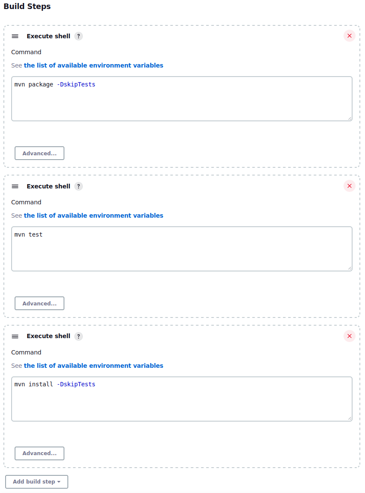
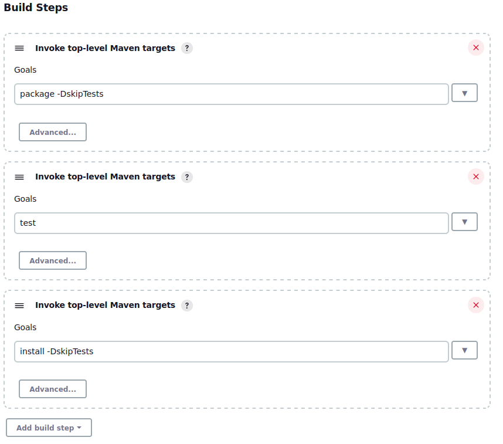



- Tier: 基础版，专业版，旗舰版
- Offering: JihuLab.com，私有化部署



如果你在 Jenkins 中有一个 Maven 构建，你可以使用 [Java Spring](https://jihulab.com/gitlab-cn/project-templates/spring) 项目模板将其迁移到极狐GitLab。该模板使用 Maven 作为其底层依赖管理。

## 示例 Jenkins 配置

以下三个 Jenkins 示例分别使用不同的方法来测试、构建并将一个 Maven 项目安装到一个 shell 代理中：

- 使用 shell 执行的自由风格
- 使用 Maven 任务插件的自由风格
- 使用 Jenkinsfile 的声明式流水线

所有三个示例都按顺序运行相同的三个命令，分为三个不同的阶段：

- `mvn test`：运行代码库中找到的所有测试
- `mvn package -DskipTests`：将代码编译为 POM 中定义的可执行类型，并跳过运行任何测试，因为这项工作已在第一个阶段完成。
- `mvn install -DskipTests`：将编译后的可执行文件安装到代理的本地 Maven `.m2` 仓库中，并再次跳过运行测试。

这些示例使用一个单一的、持久的 Jenkins 代理，这要求 Maven 已预先安装在代理上。这种执行方式类似于使用 [shell 执行器](https://gitlab.cn/docs/runner/executors/shell/)的极狐GitLab Runner。

<a id="freestyle-with-shell-execution"></a>

### 使用 shell 执行的自由风格

如果使用 Jenkins 内建的 shell 执行选项，直接从代理上的 shell 调用 `mvn` 命令，则配置可能类似于：



<a id="freestyle-with-maven-task-plugin"></a>

### 使用 Maven 任务插件的自由风格

如果使用 Jenkins 中的 Maven 插件来声明和执行 [Maven 构建生命周期](https://maven.apache.org/guides/introduction/introduction-to-the-lifecycle.html)中的任何特定目标，则配置可能类似于：



此插件要求 Jenkins 代理上已安装 Maven，并使用脚本包装器来调用 Maven 命令。

<a id="using-a-declarative-pipeline"></a>

### 使用声明式流水线

如果使用声明式流水线，则配置可能类似于：

```groovy
pipeline {
    agent any
    tools {
        maven 'maven-3.6.3'
        jdk 'jdk11'
    }
    stages {
        stage('Build') {
            steps {
                sh "mvn package -DskipTests"
            }
        }
        stage('Test') {
            steps {
                sh "mvn test"
            }
        }
        stage('Install') {
            steps {
                sh "mvn install -DskipTests"
            }
        }
    }
}
```

此示例使用 shell 执行命令而非插件。

默认情况下，声明式流水线配置要么存储在 Jenkins 流水线配置中，要么直接存储在 Git 仓库中的 `Jenkinsfile` 里。

## 将 Jenkins 配置转换为极狐GitLab CI/CD

虽然前面的示例各有不同，但它们都可以通过相同的流水线配置迁移到极狐GitLab CI/CD。

先决条件：

- 一个带有 Shell 执行器的极狐GitLab Runner
- 在 shell runner 上安装了 Maven 3.6.3 和 Java 11 JDK

此示例模仿了在 Jenkins 上进行构建、测试和安装的行为和语法。

在极狐GitLab CI/CD 流水线中，命令在“作业”中运行，这些作业被分组到阶段中。`.gitlab-ci.yml` 配置文件中的迁移后配置包括两个全局关键字（`stages` 和 `variables`），后跟 3 个作业：

```yaml
stages:
  - build
  - test
  - install

variables:
  MAVEN_OPTS: >-
    -Dhttps.protocols=TLSv1.2
    -Dmaven.repo.local=$CI_PROJECT_DIR/.m2/repository
  MAVEN_CLI_OPTS: >-
    -DskipTests

build-JAR:
  stage: build
  script:
    - mvn $MAVEN_CLI_OPTS package

test-code:
  stage: test
  script:
    - mvn test

install-JAR:
  stage: install
  script:
    - mvn $MAVEN_CLI_OPTS install
```

在此示例中：

- `stages` 定义了按顺序运行的三个阶段。与前面的 Jenkins 示例一样，测试作业首先运行，然后是构建作业，最后是安装作业。
- `variables` 定义了所有作业都可以使用的 [CI/CD 变量](../../variables/_index.md)：
  - `MAVEN_OPTS` 是每次执行 Maven 时所需的 Maven 环境变量：
    - `-Dhttps.protocols=TLSv1.2` 将流水线中任何 HTTP 请求的 TLS 协议设置为 1.2 版本。
    - `-Dmaven.repo.local=$CI_PROJECT_DIR/.m2/repository` 将本地 Maven 仓库的位置设置为 runner 上的极狐GitLab 项目目录，以便作业可以访问和修改该仓库。
  - `MAVEN_CLI_OPTS` 是要添加到 `mvn` 命令的特定参数：
    - `-DskipTests` 跳过 Maven 构建生命周期中的 `test` 阶段。
- `test-code`、`build-JAR` 和 `install-JAR` 是流水线中要运行的作业的用户自定义名称：
  - `stage` 定义作业在哪个阶段运行。一个流水线包含一个或多个阶段，一个阶段包含一个或多个作业。此示例包含三个阶段，每个阶段只有一个作业。
  - `script` 定义了在该作业中运行的命令，类似于 `Jenkinsfile` 中的 `steps`。作业可以按顺序运行多个命令，这些命令在镜像容器中执行，但在此示例中，每个作业只运行一个命令。

<a id="run-jobs-in-docker-containers"></a>

### 在 Docker 容器中运行作业

此示例没有像 Jenkins 示例那样使用持久化机器来处理此构建过程，而是使用一个临时的 Docker 容器来处理执行。使用容器消除了维护虚拟机及其上安装的 Maven 版本的需要，同时也增加了扩展和增强流水线功能的灵活性。

先决条件：

- 一个可供项目使用的带有 Docker 执行器的极狐GitLab Runner。如果你使用的是 JihuLab.com，则可以使用公共实例 runner。

这个迁移后的流水线配置由三个全局关键字（`stages`、`default` 和 `variables`）以及随后的 3 个作业组成。与前一个[示例](#convert-jenkins-configuration-to-gitlab-cicd)相比，此配置利用了额外的极狐GitLab CI/CD 功能来改进流水线：

```yaml
stages:
  - build
  - test
  - install

default:
  image: maven:3.6.3-openjdk-11
  cache:
    key: $CI_COMMIT_REF_SLUG
    paths:
      - .m2/

variables:
  MAVEN_OPTS: >-
    -Dhttps.protocols=TLSv1.2
    -Dmaven.repo.local=$CI_PROJECT_DIR/.m2/repository
  MAVEN_CLI_OPTS: >-
    -DskipTests

build-JAR:
  stage: build
  script:
    - mvn $MAVEN_CLI_OPTS package

test-code:
  stage: test
  script:
    - mvn test

install-JAR:
  stage: install
  script:
    - mvn $MAVEN_CLI_OPTS install
```

在此示例中：

- `stages` 定义了按顺序运行的三个阶段。与前面的 Jenkins 示例一样，测试作业首先运行，然后是构建作业，最后是安装作业。
- `default` 定义了所有作业默认重用的标准配置：
  - `image` 定义了要使用并在其中执行命令的 Docker 镜像容器。在此示例中，它是一个预装了一切所需内容的官方 Maven Docker 镜像。
  - `cache` 用于缓存和重用依赖项：
    - `key` 是特定缓存归档的唯一标识符。在此示例中，它是 Git 提交引用的缩短版本，作为[预定义 CI/CD 变量](../../variables/predefined_variables.md)自动生成。任何针对相同提交引用运行的作业都会重用相同的缓存。
    - `paths` 是要包含在缓存中的目录或文件。此示例缓存 `.m2/` 目录，以避免在作业运行之间重新安装依赖项。
- `variables` 定义了所有作业都可以使用的 [CI/CD 变量](../../variables/_index.md)：
  - `MAVEN_OPTS` 是每次执行 Maven 时所需的 Maven 环境变量：
    - `-Dhttps.protocols=TLSv1.2` 将流水线中任何 HTTP 请求的 TLS 协议设置为 1.2 版本。
    - `-Dmaven.repo.local=$CI_PROJECT_DIR/.m2/repository` 将本地 Maven 仓库的位置设置为 runner 上的极狐GitLab 项目目录，以便作业可以访问和修改该仓库。
  - `MAVEN_CLI_OPTS` 是要添加到 `mvn` 命令的特定参数：
    - `-DskipTests` 跳过 Maven 构建生命周期中的 `test` 阶段。
- `test-code`、`build-JAR` 和 `install-JAR` 是流水线中要运行的作业的用户自定义名称：
  - `stage` 定义作业在哪个阶段运行。一个流水线包含一个或多个阶段，一个阶段包含一个或多个作业。此示例包含三个阶段，每个阶段只有一个作业。
  - `script` 定义了在该作业中运行的命令，类似于 `Jenkinsfile` 中的 `steps`。作业可以按顺序运行多个命令，这些命令在镜像容器中执行，但在此示例中，每个作业只运行一个命令。
