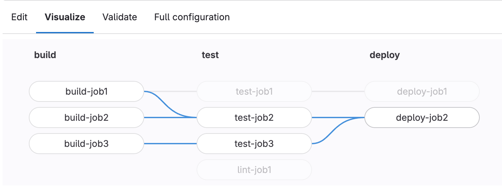



- Tier: 基础版，专业版，旗舰版
- Offering: JihuLab.com，私有化部署



流水线编辑器是编辑仓库根目录下 `.gitlab-ci.yml` 文件中极狐GitLab CI/CD 配置的主要位置。要访问编辑器，请转到 **构建** > **流水线编辑器**。

从流水线编辑器页面你可以：

- 选择要操作的分支。
- 在编辑文件时[验证 CI/CD 语法](#validate-cicd-syntax)。
- 进行更深入的[CI/CD 配置验证](#validate-cicd-configuration)，该验证会与通过 [`include`](../yaml/_index.md#include) 关键字添加的任何配置一起验证。
- 查看[通过 `include` 关键字添加的 CI/CD 配置列表](#view-included-cicd-configuration)。
- 查看当前配置的[可视化](#visualize-ci-configuration)。
- 查看[完整配置](#view-full-configuration)，该视图会显示包含 `include` 添加的配置在内的完整配置。
- 将更改[提交](#commit-changes-to-ci-configuration)到特定分支。

<a id="validate-cicd-syntax"></a>

## 验证 CI/CD 语法

在使用流水线编辑器时，流水线配置语法会根据极狐GitLab CI/CD 流水线模式持续进行验证。你的 CI/CD YAML 语法以及一些基本的逻辑验证会被检查。

验证结果显示在编辑器页面的顶部。如果验证失败，此部分会显示一条提示，帮助你解决问题。

<a id="validate-cicd-configuration"></a>

## 验证 CI/CD 配置



- 在极狐GitLab 18.4 中引入了选择不同分支的选项。



要在提交更改之前测试极狐GitLab CI/CD 配置的有效性，请使用流水线编辑器验证工具。此工具模拟由于 Git 推送事件而创建流水线，并可以帮助排查逻辑问题，包括不正确的 `rules` 和 `needs` 作业依赖关系：

1. 在顶部栏中，选择 **搜索或跳转到** 并找到你的项目。
1. 在左侧边栏中，选择 **构建** > **流水线编辑器**。
1. 选择 **验证** 选项卡。
1. 可选。使用 **流水线运行源** 下拉列表选择一个不同的分支用于模拟的推送事件。
1. 选择 **验证流水线**。

模拟的流水线使用来自 **编辑** 选项卡的现有流水线配置。

要验证 CI/CD YAML 片段而不将其添加到 **编辑** 选项卡，请改用 [CI Lint 工具](../yaml/lint.md#simulate-a-pipeline)。

<a id="view-included-cicd-configuration"></a>

## 查看包含的 CI/CD 配置



- 在极狐GitLab 15.0 中引入，并带有名为 `pipeline_editor_file_tree` 的功能标志，默认禁用。
- 在极狐GitLab 15.1 中移除了功能标志。



你可以在流水线编辑器中查看通过 [`include`](../yaml/_index.md#include) 关键字添加的配置。在右上角，选择文件树 () 以查看所有包含的配置文件列表。选中的文件会在新选项卡中打开以供查看。

<a id="visualize-ci-configuration"></a>

## 可视化 CI 配置

要查看 `.gitlab-ci.yml` 配置的可视化，请在你的项目中，转到 **构建** > **流水线编辑器**，然后选择 **可视化** 选项卡。可视化会显示所有阶段和作业。任何 [`needs`](../yaml/_index.md#needs) 关系都会显示为连接作业的线条，展示执行的层次结构。

将鼠标悬停在一个作业上会高亮显示其 `needs` 关系：



如果配置没有任何 `needs` 关系，则不会绘制任何线条，因为每个作业仅依赖于前一个阶段的成功完成。

<a id="view-full-configuration"></a>

## 查看完整配置



- **查看合并 YAML** 选项卡在极狐GitLab 16.0 中重命名为 **完整配置**。



要查看完全展开为一个合并文件的 CI/CD 配置，请转到流水线编辑器的 **完整配置** 选项卡。此选项卡显示展开的配置，其中：

- 通过 [`include`](../yaml/_index.md#include) 导入的配置被复制到视图中。
- 使用 [`extends`](../yaml/_index.md#extends) 的作业会显示[扩展配置合并到作业中](../yaml/yaml_optimization.md#merge-details)。
- [YAML 锚点](../yaml/yaml_optimization.md#anchors) 会被替换为链接的配置。
- [YAML `!reference` 标签](../yaml/yaml_optimization.md#reference-tags) 也会被替换为链接的配置。
- 条件规则会在假设默认分支推送事件的情况下进行评估。

使用 `!reference` 标签可能导致嵌套配置在展开视图中以行首多个连字符 (`-`) 显示。此行为是预期内的，额外的连字符不会影响作业的执行。例如，以下配置和完全展开的版本都是有效的：

- `.gitlab-ci.yml` 文件：

  ```yaml
  .python-req:
    script:
      - pip install pyflakes

  .rule-01:
    rules:
      - if: $CI_MERGE_REQUEST_SOURCE_BRANCH_NAME =~ /^feature/
        when: manual
        allow_failure: true
      - if: $CI_MERGE_REQUEST_SOURCE_BRANCH_NAME

  .rule-02:
    rules:
      - if: $CI_COMMIT_BRANCH == "main"
        when: manual
        allow_failure: true

  lint-python:
    image: python:latest
    script:
      - !reference [.python-req, script]
      - pyflakes python/
    rules:
      - !reference [.rule-01, rules]
      - !reference [.rule-02, rules]
  ```

- **完整配置** 选项卡中的展开配置：

  ```yaml
  ".python-req":
    script:
    - pip install pyflakes
  ".rule-01":
    rules:
    - if: "$CI_MERGE_REQUEST_SOURCE_BRANCH_NAME =~ /^feature/"
      when: manual
      allow_failure: true
    - if: "$CI_MERGE_REQUEST_SOURCE_BRANCH_NAME"
  ".rule-02":
    rules:
    - if: $CI_COMMIT_BRANCH == "main"
      when: manual
      allow_failure: true
  lint-python:
    image: python:latest
    script:
    - - pip install pyflakes                                     # <- 多余的连字符不影响作业的执行。
    - pyflakes python/
    rules:
    - - if: "$CI_MERGE_REQUEST_SOURCE_BRANCH_NAME =~ /^feature/" # <- 多余的连字符不影响作业的执行。
        when: manual
        allow_failure: true
      - if: "$CI_MERGE_REQUEST_SOURCE_BRANCH_NAME"               # <- 没有多余的连字符，但与上一条规则对齐
    - - if: $CI_COMMIT_BRANCH == "main"                          # <- 多余的连字符不影响作业的执行。
        when: manual
        allow_failure: true
  ```

<a id="commit-changes-to-ci-configuration"></a>

## 提交 CI 配置更改

提交表单会出现在编辑器的每个选项卡底部，因此你可以随时提交你的更改。

当你对更改感到满意后，添加一个描述性的提交消息并输入分支。分支字段默认为项目的默认分支。

如果你输入一个新的分支名称，**使用这些更改启动一个新的合并请求** 复选框会出现。选中它以在提交更改后启动一个新的合并请求。


<a id="editor-accessibility-options"></a>

## 编辑器辅助功能选项

流水线编辑器基于 [Monaco Editor](https://github.com/microsoft/monaco-editor)，该编辑器具有多项[辅助功能](https://github.com/microsoft/monaco-editor/wiki/Monaco-Editor-Accessibility-Guide)，包括：

| 功能 | Windows 或 Linux 上的快捷键 | macOS 上的快捷键 | 详情 |
|------|----------------------------|-----------------|------|
| 键盘导航命令列表 | <kbd>F1</kbd> | <kbd>F1</kbd> | 使编辑器在无需鼠标的情况下更容易使用的一个[命令列表](https://github.com/microsoft/monaco-editor/wiki/Monaco-Editor-Accessibility-Guide#keyboard-navigation)。 |
| 制表符捕获 | <kbd>Control</kbd>+<kbd>m</kbd> | <kbd>Control</kbd>+<kbd>Shift</kbd>+<kbd>m</kbd> | 启用[制表符捕获](https://github.com/microsoft/monaco-editor/wiki/Monaco-Editor-Accessibility-Guide#tab-trapping)以转到页面上的下一个可聚焦元素，而不是插入制表符。 |

<a id="troubleshooting"></a>

## 故障排查

<a id="unable-to-validate-cicd-configuration-message"></a>

### `无法验证 CI/CD 配置。` 消息

此消息是由于在流水线编辑器中验证语法时出现问题所致。当极狐GitLab 无法与验证语法的服务通信时，可能会发生这种情况。

以下部分中的信息可能无法正确显示：

- **编辑** 选项卡上的语法状态（有效或无效）。
- **可视化** 选项卡。
- **Lint** 选项卡。
- **完整配置** 选项卡。

你仍然可以处理你的 CI/CD 配置并提交你所作的更改，而不会出现任何问题。一旦服务再次可用，语法验证应该会立即显示。