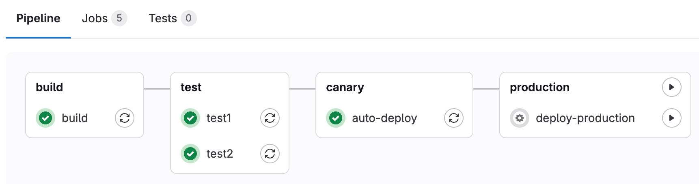
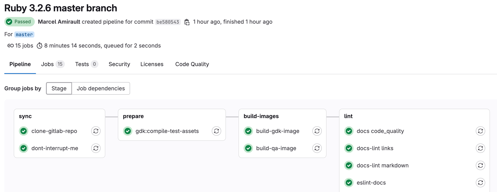
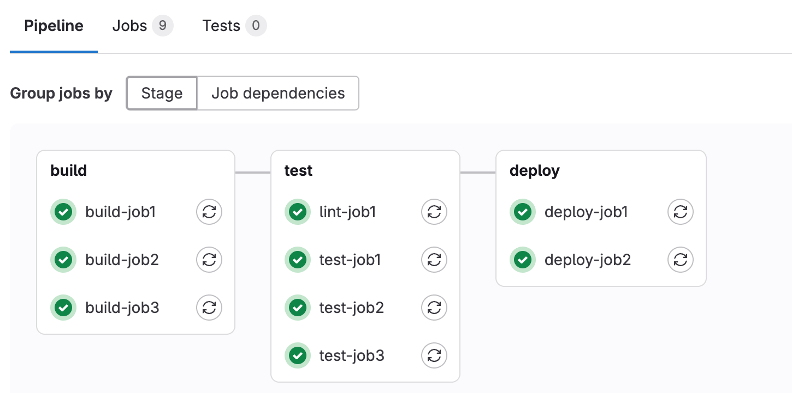
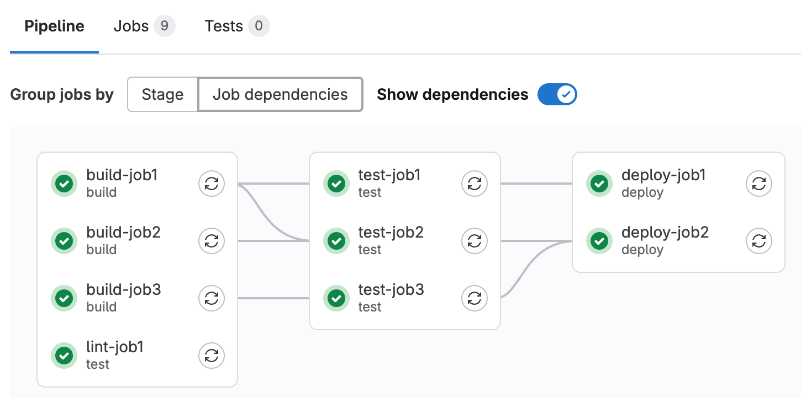
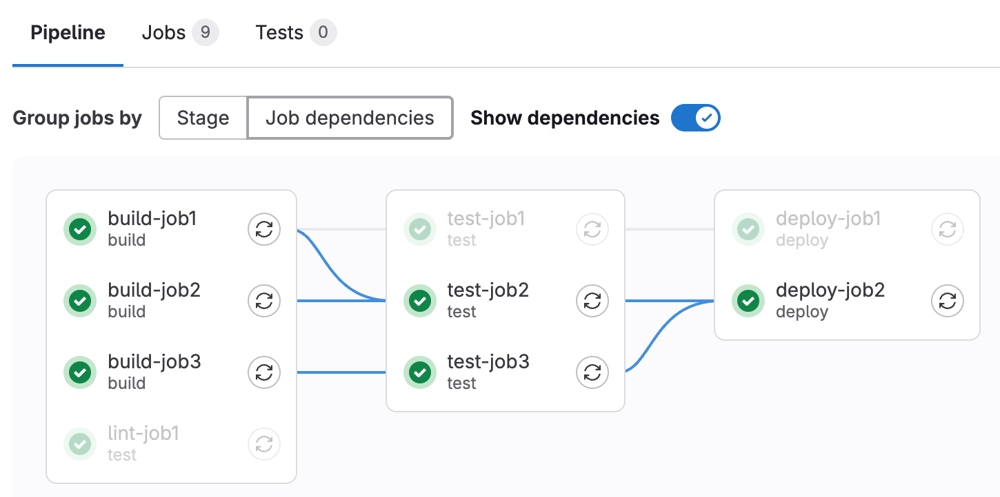
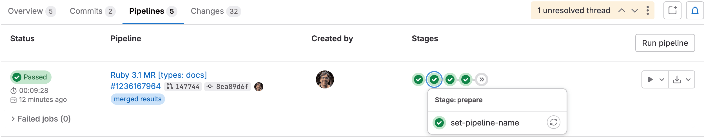



- Tier: 基础版，专业版，旗舰版
- Offering: JihuLab.com，私有化部署



CI/CD 流水线是极狐GitLab CI/CD 的基础组件。流水线通过`.gitlab-ci.yml`文件使用[YAML 关键字](../yaml/_index.md)进行配置。

流水线可以针对特定事件自动运行，例如推送到分支、创建合并请求或按照计划运行。需要时，您也可以手动运行流水线。

流水线由以下部分组成：

- [全局 YAML 关键字](../yaml/_index.md#global-keywords)，用于控制项目流水线的整体行为。
- [作业](../jobs/_index.md)，用于执行命令以完成任务。例如，作业可以编译、测试或部署代码。作业彼此独立运行，并由 [runners](../runners/_index.md) 执行。
- 阶段，用于定义如何将作业分组在一起。阶段按顺序运行，而同一阶段中的作业并行运行。例如，前阶段可以有进行代码 lint 和编译的作业，后阶段可以有进行测试和部署的作业。如果某个阶段中的所有作业都成功，流水线将进入下一阶段。如果某个阶段中的任何作业失败，则通常不会执行下一阶段，并且流水线会提前结束。

一个小型流水线可以包含三个阶段，按以下顺序执行：

- `build` 阶段，包含一个名为 `compile` 的作业，该作业编译项目代码。
- `test` 阶段，包含两个作业 `test1` 和 `test2`，分别对代码运行各种测试。这些测试仅在 `compile` 作业成功完成后才运行。
- `deploy` 阶段，包含一个名为 `deploy-to-production` 的作业。该作业仅在 `test` 阶段的两个作业均已成功开始并完成时才运行。

要开始您的第一个流水线，请参阅[创建和运行您的第一个极狐GitLab CI/CD 流水线](../quick_start/_index.md)。

<a id="types-of-pipelines"></a>

## 流水线类型

流水线可以通过多种不同方式进行配置：

- [基础流水线](pipeline_architectures.md#basic-pipelines)会在每个阶段并发运行所有内容，然后进入下一阶段。
- [使用 `needs` 关键字的流水线](../yaml/needs.md)基于作业之间的依赖关系运行，并且可以比基础流水线运行得更快。
- [合并请求流水线](merge_request_pipelines.md)仅针对合并请求运行（而不是针对每个提交）。
- [合并结果流水线](merged_results_pipelines.md)是一种合并请求流水线，其行为好像源分支的更改已经合并到目标分支中。
- [合并训练](merge_trains.md)使用合并结果流水线，一个接一个地排队合并。
- [工作负载流水线](pipeline_types.md#workload-pipeline)运行在临时 Git 引用上，用于按需执行流水线而无需创建临时分支。
- [父子流水线](downstream_pipelines.md#parent-child-pipelines)将复杂的流水线分解为一个父流水线，该父流水线可以触发多个子流水线，这些子流水线都在同一个项目中使用相同的 SHA 运行。此流水线架构通常用于单体仓库。
- [多项目流水线](downstream_pipelines.md#multi-project-pipelines)将不同项目的流水线组合在一起。

<a id="configure-a-pipeline"></a>

## 配置流水线

流水线及其组件作业和阶段通过每个项目的 CI/CD 流水线配置文件中的 [YAML 关键字](../yaml/_index.md)进行定义。在极狐GitLab 中编辑 CI/CD 配置时，您应该使用[流水线编辑器](../pipeline_editor/_index.md)。

您还可以通过极狐GitLab UI 配置流水线的特定方面：

- 每个项目的[流水线设置](settings.md)。
- [流水线计划](schedules.md)。
- [自定义 CI/CD 变量](../variables/_index.md#for-a-project)。

<a id="run-a-pipeline-manually"></a>

### 手动运行流水线



- **运行流水线** 名称在极狐GitLab 17.7 中更改为 **新流水线**。
- **输入参数** 选项在极狐GitLab 17.11 中[引入](https://gitlab.com/gitlab-org/gitlab/-/issues/525504)，并带有名为 `ci_inputs_for_pipelines` 的功能标志。默认启用。
- **输入参数** 选项在极狐GitLab 18.1 中[GA](https://gitlab.com/gitlab-org/gitlab/-/issues/536548)。功能标志 `ci_inputs_for_pipelines` 已移除。



流水线可以手动执行，并使用预定义或手动指定的[变量](../variables/_index.md)。

如果流水线的结果（例如代码构建）在流水线的标准操作之外需要时，您可能会这样做。

要手动执行流水线：

1. 在顶部栏中，选择**搜索或跳转到**并找到您的项目。
1. 在左侧边栏中，选择**构建** > **流水线**。
1. 选择**新流水线**。
1. 在**运行分支或标签名称**字段中，选择要运行流水线的分支或标签。
1. 可选。输入以下任何内容：
   - 运行流水线所需的[输入参数](../inputs/_index.md)。输入参数的默认值已经预先填充，但可以进行修改。输入值必须遵循预期的类型。
   - [CI/CD 变量](../variables/_index.md)。您可以将变量配置为在表单中[预填充其值](#prefill-variables-in-manual-pipelines)。使用输入参数来控制流水线行为比使用 CI/CD 变量提供了更好的安全性和灵活性。
1. 选择**新流水线**。

现在流水线将按照配置执行作业。

<a id="view-manual-pipeline-variables"></a>

#### 查看手动流水线变量



- 在极狐GitLab 17.2 中[引入](https://gitlab.com/gitlab-org/gitlab/-/issues/323097)，并带有名为 `ci_show_manual_variables_in_pipeline` 的功能标志。默认禁用。
- 在极狐GitLab 18.4 中[GA](https://gitlab.com/gitlab-org/gitlab/-/issues/505440)，并带有项目设置。功能标志 `ci_show_manual_variables_in_pipeline` 已移除。



您可以查看手动运行流水线时指定的所有变量。

先决条件：

- 您必须具有项目的所有者角色。

所需角色取决于您要执行的操作：

| 操作 | 最低角色 |
|--------|-------------|
| 查看变量名称 | 访客 |
| 查看变量值   | 开发者 |
| 配置可见性设置 | 所有者 |

> [!warning]
> 当您启用此设置时，具有开发者角色的用户可以查看来自任何手动流水线运行的变量值，这些值可能包含敏感信息。对于像凭据或令牌这样的敏感数据，请使用[受保护变量](../variables/_index.md#protect-a-cicd-variable)或[外部密钥管理](../secrets/_index.md)，而不是手动流水线变量。

要查看手动流水线变量：

1. 在顶部栏中，选择**搜索或跳转到**并找到您的项目。
1. 在左侧边栏中，选择**设置** > **CI/CD**。
1. 选择**显示流水线变量**。
1. 转到**构建** > **流水线**，并选择一个手动运行的流水线。
1. 选择**手动变量**选项卡。

变量值默认被屏蔽。如果您具有开发者、维护者或所有者角色，可以选择眼睛图标来显示值。

<a id="prefill-variables-in-manual-pipelines"></a>

#### 在手动流水线中预填充变量



- **运行流水线** 页面上的 Markdown 渲染在极狐GitLab 17.11 中[引入](https://gitlab.com/gitlab-org/gitlab/-/issues/441474)。



您可以使用 [`description` 和 `value`](../yaml/_index.md#variablesdescription) 关键字来[定义流水线级别的（全局）变量](../variables/_index.md#define-a-cicd-variable-in-the-gitlab-ciyml-file)，这些变量在手动运行流水线时会预填充。使用描述来解释诸如变量的用途以及可接受的值是什么之类的信息。您可以在描述中使用 Markdown。

作业级别的变量无法预填充。

在手动触发的流水线中，**新流水线** 页面会显示所有在 `.gitlab-ci.yml` 文件中定义了 `description` 的流水线级别变量。描述显示在变量下方。

您可以更改预填充的值，这会为该单次流水线运行[覆盖值](../variables/_index.md#use-pipeline-variables)。任何通过此过程覆盖的变量都会被[展开](../variables/_index.md#allow-cicd-variable-expansion)且不会被[屏蔽](../variables/_index.md#mask-a-cicd-variable)。如果您在配置文件中未为变量定义 `value`，则仍会列出变量名，但值字段为空。

例如：

```yaml
variables:
  DEPLOY_CREDENTIALS:
    description: "部署凭据。"
  DEPLOY_ENVIRONMENT:
    description: "选择部署目标。有效选项为：'canary'、'staging'、'production' 或您选择的稳定分支。"
    value: "canary"
```

在这个例子中：

- `DEPLOY_CREDENTIALS` 在**新流水线**页面中列出，但未设置值。用户需要在每次手动运行流水线时定义该值。
- `DEPLOY_ENVIRONMENT` 在**新流水线**页面中预填充，默认值为 `canary`，消息解释了其他选项。

> [!note]
> 由于[已知问题](https://gitlab.com/gitlab-org/gitlab/-/issues/382857)，使用[合规流水线](../../user/compliance/compliance_pipelines.md) 的项目在手动运行流水线时可能不会显示预填充变量。要解决此问题，请[更改合规流水线配置](../../user/compliance/compliance_pipelines.md#prefilled-variables-are-not-shown)。

<a id="configure-a-list-of-selectable-prefilled-variable-values"></a>

#### 配置可选预填充变量值列表



- 在极狐GitLab 15.5 中[引入](https://gitlab.com/gitlab-org/gitlab/-/issues/363660)，并带有名为 `run_pipeline_graphql` 的功能标志。默认禁用。
- `options` 关键字在极狐GitLab 15.7 中[引入](https://gitlab.com/gitlab-org/gitlab/-/merge_requests/105502)。
- 在极狐GitLab 15.7 中[GA](https://gitlab.com/gitlab-org/gitlab/-/merge_requests/106038)。功能标志 `run_pipeline_graphql` 已移除。
- 由于[一个错误](https://gitlab.com/gitlab-org/gitlab/-/issues/386245)，变量列表有时无法正确填充，该问题在极狐GitLab 15.9 中已解决。



您可以定义一组 CI/CD 变量值，供用户在手动运行流水线时从中选择。这些值会在**新流水线**页面中以下拉列表的形式显示。将值选项列表添加到 `options`，并使用 `value` 设置默认值。`value` 中的字符串也必须包含在 `options` 列表中。

例如：

```yaml
variables:
  DEPLOY_ENVIRONMENT:
    value: "staging"
    options:
      - "production"
      - "staging"
      - "canary"
    description: "部署目标。默认设置为 'staging'。"
```

<a id="run-a-pipeline-by-using-a-url-query-string"></a>

### 使用 URL 查询字符串运行流水线

您可以使用查询字符串预填充**新流水线**页面。例如，查询字符串 `.../pipelines/new?ref=my_branch&var[foo]=bar&file_var[file_foo]=file_bar` 会预填充**新流水线**页面如下：

- **在分支名称或标签中运行** 字段：`my_branch`。
- **变量** 部分：
  - 变量：
    - 键：`foo`
    - 值：`bar`
  - 文件：
    - 键：`file_foo`
    - 值：`file_bar`

`pipelines/new` URL 的格式为：

```plaintext
.../pipelines/new?ref=<branch>&var[<variable_key>]=<value>&file_var[<file_key>]=<value>
```

支持以下参数：

- `ref`：指定要填充到**在分支名称或标签中运行**中的分支。
- `var`：指定一个 `Variable` 变量。
- `file_var`：指定一个 `File` 变量。

对于每个 `var` 或 `file_var`，都需要一个键和一个值。

<a id="add-manual-interaction-to-your-pipeline"></a>

### 向流水线添加手动交互

[手动作业](../jobs/job_control.md#create-a-job-that-must-be-run-manually)允许您在流水线继续推进之前要求手动交互。

您可以直接从流水线图执行此操作。选择**运行** () 即可执行该特定作业。

例如，您的流水线可以自动启动，但需要手动操作才能[部署到生产环境](../environments/deployments.md#configure-manual-deployments)。在下面的示例中，`production` 阶段有一个包含手动操作的作业：



<a id="start-all-manual-jobs-in-a-stage"></a>

#### 启动阶段中的所有手动作业

如果某个阶段仅包含手动作业，则可以通过选择阶段上方的**全部手动运行** () 来同时启动所有作业。如果该阶段包含非手动作业，则不会显示该选项。

<a id="skip-a-pipeline"></a>

### 跳过流水线

要在不触发流水线的情况下推送提交，请在提交消息中添加 `[ci skip]` 或 `[skip ci]`，任意大小写均可。

或者，使用 Git 2.10 或更高版本，使用 `ci.skip` [Git 推送选项](../../topics/git/commit.md#push-options-for-gitlab-cicd)。`ci.skip` 推送选项不会跳过合并请求流水线。

当您跳过流水线时：

- 极狐GitLab 中仍然会创建一个空的流水线，没有作业或阶段。
  该流水线会显示在 UI 中，并可在 API 响应中返回。
- 流水线状态在 UI 中为 **Skipped**，在 API 中为 `skipped`。

> [!note]
> 流水线执行策略和扫描执行策略可以限制或禁用 `[skip ci]` 指令。
> 有关更多信息，请参阅：
>
> - 流水线执行策略中的 [`skip_ci` 类型](../../user/application_security/policies/pipeline_execution_policies.md#skip_ci-type)。
> - 扫描执行策略中的 [`skip_ci` 类型](../../user/application_security/policies/scan_execution_policies.md#skip_ci-type)。

<a id="delete-a-pipeline"></a>

### 删除流水线

具有项目所有者角色的用户可以删除流水线：

1. 在顶部栏中，选择**搜索或跳转到**并找到您的项目。
1. 在左侧边栏中，选择**构建** > **流水线**。
1. 选择要删除的流水线的流水线 ID（例如 `#123456789`）或流水线状态图标（例如 **Passed**）。
1. 在流水线详情页面的右上角，选择**删除**。

删除流水线不会自动删除其[子流水线](downstream_pipelines.md#parent-child-pipelines)。有关更多详细信息，请参阅[议题 39503](https://gitlab.com/gitlab-org/gitlab/-/issues/39503)。

> [!warning]
> 删除流水线会使得所有流水线缓存失效，并删除所有立即相关的对象，例如作业、日志、制品和触发器。
> **此操作无法撤销**。

<a id="pipeline-security-on-protected-branches"></a>

### 受保护分支上的流水线安全性

当流水线在[受保护分支](../../user/project/repository/branches/protected.md)上执行时，会强制执行严格的安全模型。

如果用户被[允许合并或推送](../../user/project/repository/branches/protected.md)到特定分支，则允许在受保护分支上进行以下操作：

- 运行手动流水线（使用 [Web UI](#run-a-pipeline-manually) 或 [流水线 API](#pipelines-api)）。
- 运行计划流水线。
- 使用触发令牌运行流水线。
- 运行按需 DAST 扫描。
- 在现有流水线上运行手动作业。
- 重试或取消现有作业（使用 Web UI 或流水线 API）。

标记为**受保护**的**变量**可供在受保护分支的流水线中运行的作业访问。仅当用户有权访问敏感信息（如部署凭据和令牌）时，才向其授予合并到受保护分支的权限。

标记为**受保护**的**Runner**只能在受保护分支上运行作业，从而防止不受信任的代码在受保护 Runner 上执行，并防止无意中访问部署密钥和其他凭据。为确保打算在受保护 Runner 上执行的作业不使用常规 Runner，必须相应地为其[打标签](../yaml/_index.md#tags)。

在[合并请求流水线](merge_request_pipelines.md#control-access-to-protected-variables-and-runners)的上下文中，了解受保护变量和 Runner 的访问方式。

有关保护流水线安全的其他安全建议，请参阅[部署安全性](../environments/deployment_safety.md)页面。

<a id="trigger-a-pipeline-when-an-upstream-project-is-rebuilt"></a>

## 在上游项目重新构建时触发流水线



- Tier: 专业版，旗舰版
- Offering: JihuLab.com，私有化部署



您可以将项目设置为根据其他项目中的标签自动触发流水线。当订阅项目中的新标签流水线完成时，无论标签流水线成功、失败还是取消，它都会在您项目的默认分支上触发一个流水线。

作为替代方案，您可以使用[带有流水线触发令牌的 CI/CD 作业](../triggers/_index.md#use-a-cicd-job)在另一个流水线运行时触发流水线。此方法比流水线订阅更可靠、更灵活，是推荐的方法。

先决条件：

- 上游项目必须是[公开的](../../user/public_access.md)。
- 用户必须具有上游项目中的开发者角色。

在上游项目重新构建时触发流水线：

1. 在顶部栏中，选择**搜索或跳转到**并找到您的项目。
1. 在左侧边栏中，选择**设置** > **CI/CD**。
1. 展开**流水线订阅**。
1. 选择**添加项目**。
1. 输入您要订阅的项目，格式为 `<namespace>/<project>`。
   例如，如果项目是 `https://gitlab.com/gitlab-org/gitlab`，则使用 `gitlab-org/gitlab`。
1. 选择**订阅**。

上游流水线订阅的默认最大数量为 2，适用于上游和下游项目。在私有化部署的极狐GitLab 上，管理员可以更改此[限制](../../administration/instance_limits.md#number-of-cicd-subscriptions-to-a-project)。

<a id="how-pipeline-duration-is-calculated"></a>

## 如何计算流水线耗时

给定流水线的总运行时间不包括：

- 任何被重试或手动重新运行的作业的初始运行耗时。
- 任何待处理（队列）时间。

这意味着，如果某个作业被重试或手动重新运行，则只有最新运行的耗时会计入总运行时间。

每个作业表示为一个 `Period`，由以下部分组成：

- `Period#first`（作业开始时间）。
- `Period#last`（作业完成时间）。

一个简单的例子：

- A (0, 2)
- A' (2, 4)
  - 这是重试 A
- B (1, 3)
- C (6, 7)

在这个例子中：

- A 从 0 开始，到 2 结束。
- A' 从 2 开始，到 4 结束。
- B 从 1 开始，到 3 结束。
- C 从 6 开始，到 7 结束。

可视化来看：

```plaintext
0  1  2  3  4  5  6  7
AAAAAAA
   BBBBBBB
      A'A'A'A
                  CCCC
```

因为 A 被重试，所以忽略它，只计入作业 A'。B、A' 和 C 的并集是 (1, 4) 和 (6, 7)。因此，总运行时间为：

```plaintext
(4 - 1) + (7 - 6) => 4
```

<a id="view-pipelines"></a>

## 查看流水线

要查看为您的项目运行的所有流水线：

1. 在顶部栏中，选择**搜索或跳转到**并找到您的项目。
1. 在左侧边栏中，选择**构建** > **流水线**。

您可以通过以下条件过滤**流水线**页面：

- 触发作者
- 分支名称
- 状态
- 标签
- 来源

在右上角的下拉列表中选择**流水线 ID** 以显示流水线 ID（实例范围的唯一 ID）。
选择 **流水线 IID** 以显示流水线 IID（内部 ID，仅在项目内唯一）。

要查看与特定合并请求相关的流水线，请转到合并请求中的**流水线**选项卡。

<a id="pipeline-details"></a>

### 流水线详情



- 流水线详情视图在极狐GitLab 16.6 中[更新](https://gitlab.com/gitlab-org/gitlab/-/issues/424403)，并带有名为 `new_pipeline_graph` 的功能标志。默认禁用。
- 更新后的流水线详情视图在极狐GitLab 16.8 中[在 GitLab.com 上启用](https://gitlab.com/gitlab-org/gitlab/-/issues/426902)。



选择一条流水线以打开流水线详情页面，该页面显示流水线中的每个作业。在此页面，您可以取消正在运行的流水线、重试失败的作业或[删除流水线](#delete-a-pipeline)。

流水线详情页面显示所有作业的图形：



您可以使用标准 URL 访问特定流水线的详情：

- `gitlab.example.com/my-group/my-project/-/pipelines/latest`：项目中默认分支上最新提交的最新流水线的详情页面。
- `gitlab.example.com/my-group/my-project/-/pipelines/<branch>/latest`：项目中分支 `<branch>` 上最新提交的最新流水线的详情页面。

<a id="group-jobs-by-stage-or-needs-configuration"></a>

#### 按阶段或 `needs` 配置对作业进行分组

当您使用 [`needs`](../yaml/_index.md#needs) 关键字配置作业时，对于如何在流水线详情页面对作业进行分组，您有两种选择。要在流水线详情页面中按阶段配置对作业进行分组，请在**按...分组作业**部分中选择**阶段**：



要按 [`needs`](../yaml/_index.md#needs) 配置对作业进行分组，请选择**作业依赖项**。您可以选择**显示依赖项**来在依赖作业之间绘制连线。



最左列的作业最先运行，依赖于它们的作业将分组在接下来的列中。
在此示例中：

- `lint-job` 配置为 `needs: []`，不依赖任何作业，因此它显示在第一列，尽管它属于 `test` 阶段。
- `test-job1` 依赖于 `build-job1`，而 `test-job2` 同时依赖于 `build-job1` 和 `build-job2`，因此这两个测试作业都显示在第二列。
- 两个 `deploy` 作业依赖于第二列的作业（这些作业本身又依赖于更早的作业），因此部署作业显示在第三列。

当您在**作业依赖项**视图中将鼠标悬停在一个作业上时，所选作业之前必须运行的每个作业都会高亮显示：



### 流水线迷你图

流水线迷你图占用空间更少，可以让您快速了解所有作业是否通过或是否有失败项。它们会显示单个提交的所有相关作业以及流水线每个阶段的最终结果。您可以快速查看失败项并进行修复。

流水线迷你图始终按阶段对作业进行分组，并在整个极狐GitLab 中显示流水线或提交详情时显示。



流水线迷你图中的阶段是可展开的。将鼠标悬停在各阶段上可查看名称和状态，选择一个阶段可展开其作业列表。

### 下游流水线图

当流水线包含触发[下游流水线](downstream_pipelines.md)的作业时，您可以在流水线详情视图和迷你图中看到下游流水线。

在流水线详情视图中，每个触发的下游流水线都会在流水线图右侧显示一个卡片。将鼠标悬停在卡片上可查看触发该下游流水线的作业。选择一张卡片可在流水线图右侧显示该下游流水线。

在流水线迷你图中，每个触发的下游流水线的状态会作为额外的状态图标显示在迷你图右侧。选择一个下游流水线状态图标可转到该下游流水线的详情页面。

## 流水线成功和耗时图表

流水线分析可在 [**CI/CD 分析** 页面](../../user/analytics/ci_cd_analytics.md)上获取。

## 流水线徽章

每个项目都提供并可配置流水线状态和测试覆盖率报告徽章。有关向项目添加流水线徽章的信息，请参阅[流水线徽章](settings.md#pipeline-badges)。

## 流水线 API

极狐GitLab 提供 API 端点用于：

- 执行基本功能。有关更多信息，请参阅[流水线 API](../../api/pipelines.md)。
- 维护流水线计划。有关更多信息，请参阅[流水线计划 API](../../api/pipeline_schedules.md)。
- 触发流水线运行。有关更多信息，请参阅：
  - [通过 API 触发流水线](../triggers/_index.md)。
  - [流水线触发令牌 API](../../api/pipeline_triggers.md)。

## Runner 的引用规范
当 runner 拾取一个流水线作业时，极狐GitLab 会提供该作业的元数据。这包括 [Git 引用规范](https://git-scm.com/book/en/v2/Git-Internals-The-Refspec)，它指示了从您的项目仓库中检出了哪个引用（如分支或标签）以及哪个提交（SHA1）。

下表列出了每种流水线类型注入的引用规范：

| 流水线类型                                            | 引用规范                                                                                          |
|------------------------------------------------------|---------------------------------------------------------------------------------------------------|
| 分支流水线                                           | `+<sha>:refs/pipelines/<id>` 和 `+refs/heads/<name>:refs/remotes/origin/<name>`                   |
| 标签流水线                                           | `+<sha>:refs/pipelines/<id>` 和 `+refs/tags/<name>:refs/tags/<name>`                              |
| [合并请求流水线](merge_request_pipelines.md)         | `+refs/pipelines/<id>:refs/pipelines/<id>`                                                        |
| [工作负载引用流水线](pipeline_types.md#workload-pipeline) | `+refs/pipelines/<id>:refs/pipelines/<id>`                                                        |

`refs/heads/<name>` 和 `refs/tags/<name>` 引用存在于您的项目仓库中。极狐GitLab 在运行的流水线作业期间会生成特殊的引用 `refs/pipelines/<id>`。即使相关联的分支或标签已被删除，也可以创建此引用。因此，它在某些功能中非常有用，例如 [自动停止环境](../environments/_index.md#stopping-an-environment)，以及在分支删除后可能运行流水线的 [合并火车](merge_trains.md)。

<a id="troubleshooting"></a>

## 故障排除

<a id="pipeline-subscriptions-continue-after-user-deletion"></a>

### 删除用户后流水线订阅仍然继续

当用户 [删除其 JihuLab.com 账号](../../user/profile/account/delete_account.md#delete-your-own-account) 时，删除操作不会立即执行，而是延迟七天进行。在此期间，该用户创建的任何流水线订阅会继续以用户原来的权限运行。为防止未经授权的流水线执行，请立即更新已删除用户的流水线订阅设置。

<a id="pre-filled-variables-do-not-show-up-in-new-pipeline-page"></a>

### 预填充变量未显示在 **新流水线** 页面上

如果流水线的预定义变量 [在一个单独的文件中定义](../yaml/includes.md)，则它们可能不会显示在 **新流水线** 页面上。您必须有权访问该单独的文件，否则无法显示预定义变量。