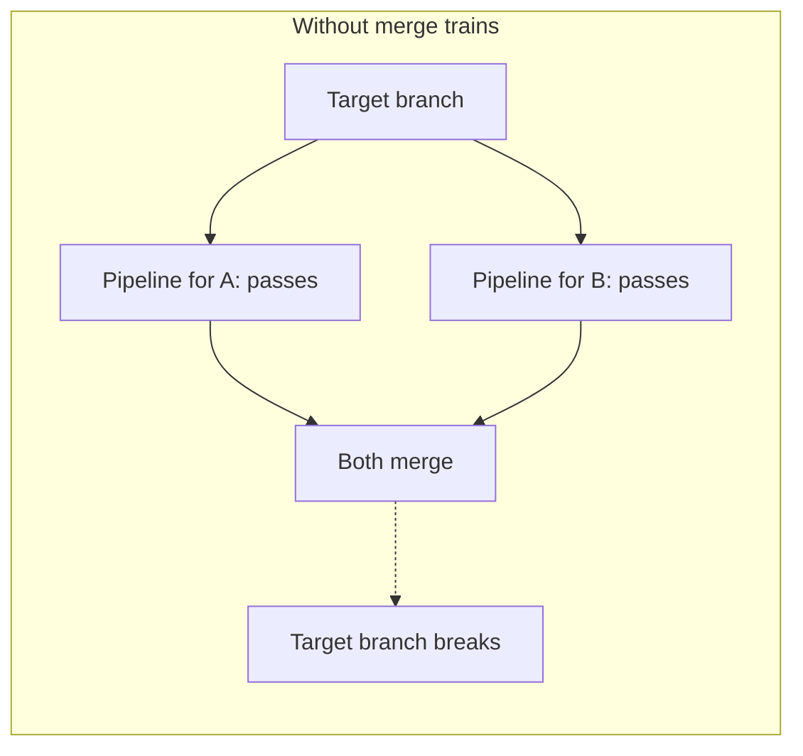
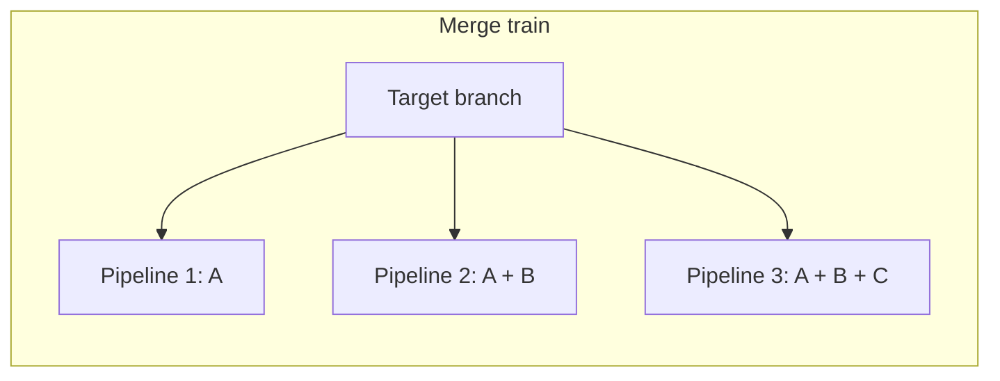



- Tier: 专业版，旗舰版
- Offering: JihuLab.com，私有化部署



在默认分支频繁合并的项目中，不同合并请求中的更改可能会相互冲突。使用合并列车将合并请求放入队列。每个合并请求都会与其他更早的合并请求进行比较，以确保它们都能协同工作。

[合并结果流水线](merged_results_pipelines.md) 会测试一个合并请求的更改
与目标分支合并后的结果。合并结果流水线不会考虑大约在同一时间合并的其他合并请求。两个合并请求可以各自通过自己的流水线，但它们的合并更改仍然可能冲突。如果两者都合并，即使每个流水线都成功，目标分支也可能会被破坏。

合并列车通过针对队列中其之前每个合并请求的合并更改来测试每个合并请求，从而防止这种情况。这会在冲突到达目标分支之前将其捕获。

如果您的项目具有以下情况，请使用合并列车：

- 频繁合并到默认分支
- 多个合并请求经常在同一时间准备好合并
- 需要始终保持默认分支上的流水线通过

## 合并列车工作流

当没有合并请求在等待合并，并且您选择 [**合并** 或 **设置为自动合并**](#start-a-merge-train) 时，合并列车就会启动。极狐GitLab 会启动一个合并列车流水线，以验证更改是否可以合并到默认分支。
这第一个流水线与 [合并结果流水线](merged_results_pipelines.md) 相同，
它在源分支和目标分支的合并更改上运行。内部合并结果提交的作者是发起合并的用户。

要在第一个流水线完成后立即将第二个合并请求排队合并，请选择 [**合并** 或 **设置为自动合并**](#add-a-merge-request-to-a-merge-train) 将其添加到列车中。这第二个合并列车流水线会在 _两个_ 合并请求与目标分支合并后的更改上运行。类似地，如果您添加第三个合并请求，则该流水线会在所有三个合并请求与目标分支合并后的更改上运行。这些流水线全部并行运行。

每个合并请求仅在以下条件满足后才合并到目标分支：

- 该合并请求的流水线成功完成。
- 所有排在其之前的其他合并请求均已合并。

如果合并列车流水线失败，则该合并请求不会被合并。极狐GitLab 会将该合并请求从合并列车中移除，并为所有排在其之后的合并请求启动新的流水线。

例如：

三个合并请求（`A`、`B` 和 `C`）按顺序添加到合并列车中，这会创建三个并行运行的合并结果流水线：

1. 第一个流水线在 `A` 与目标分支合并后的更改上运行。
1. 第二个流水线在 `A` 和 `B` 与目标分支合并后的更改上运行。
1. 第三个流水线在 `A`、`B` 和 `C` 与目标分支合并后的更改上运行。

如果流水线因 `B` 失败：

- 第一个流水线（`A`）继续运行。
- `B` 从列车中移除。
- 针对 `C` 的流水线 [被取消](#automatic-pipeline-cancellation)，并且一个新的流水线
  会在 `A` 和 `C` 与目标分支合并后的更改上启动（不包含 `B` 的更改）。

如果 `A` 随后成功完成，它将合并到目标分支，而 `C` 继续运行。任何添加到列车中的新合并请求都将包含现在位于目标分支中的 `A` 更改，以及来自合并列车的 `C` 更改。

### 自动流水线取消

极狐GitLab CI/CD 会检测冗余的流水线，并将其取消以节省资源。

当以下情况发生时，会出现冗余的合并列车流水线：

- 流水线因合并列车中的某个合并请求而失败。
- 您 [跳过合并列车并立即合并](#skip-the-merge-train-and-merge-immediately)。
- 您 [将合并请求从合并列车中移除](#remove-a-merge-request-from-a-merge-train)。

在这些情况下，极狐GitLab 必须为列车上部分或全部合并请求创建新的合并列车流水线。旧的流水线是在与合并列车中先前合并的更改进行比较，这些更改已不再有效，因此这些旧的流水线会被取消。

## 启用合并列车

先决条件：

- 您必须具有维护者角色。
- 您的代码仓库必须是极狐GitLab 代码仓库，而不是 [外部代码仓库](../ci_cd_for_external_repos/_index.md)。
- 您的流水线必须 [配置为使用合并请求流水线](merge_request_pipelines.md#prerequisites)。
  否则，您的合并请求可能会卡在未解决状态，或者您的流水线
  可能会被丢弃。
- 您必须已 [启用合并结果流水线](merged_results_pipelines.md#enable-merged-results-pipelines)。

要启用合并列车：

1. 在顶部栏中，选择 **搜索或跳转到** 并找到您的项目。
1. 在左侧边栏中，选择 **设置** > **合并请求**。
1. 在 **合并选项** 部分，确保 **启用合并结果流水线** 已启用，
   并选择 **启用合并列车**。
1. 选择 **保存更改**。

## 启动合并列车

先决条件：

- 您必须具有 [权限](../../user/permissions.md) 才能合并或推送到目标分支。

要启动合并列车：

1. 前往一个合并请求。
1. 选择：
   - 当没有流水线在运行时，选择 **合并**。
   - 当有流水线在运行时，选择 [**设置为自动合并**](../../user/project/merge_requests/auto_merge.md)。

该合并请求的合并列车状态会显示在流水线小组件下方，并带有类似于 `A new merge train has started and this merge request is the first of the queue. View merge train details.` 的消息。您可以选择该链接查看合并列车。

现在可以将其他合并请求添加到列车中。

## 查看合并列车

您可以查看合并列车，以更好地了解队列中合并请求的顺序和状态。合并列车详情页面显示队列中活跃的合并请求以及属于该列车的已合并合并请求。

要从合并请求列表访问合并列车详情：

1. 在顶部栏中，选择 **搜索或跳转到** 并找到您的项目。
1. 在左侧边栏中，选择 **代码** > **合并请求**。
1. 在合并请求列表上方，选择 **合并列车**。
1. 可选。按目标分支筛选合并列车。

您也可以通过从以下位置选择 **查看合并列车详情** 来访问此视图：

- 已添加到合并列车的合并请求上的流水线小组件和系统评论。
- 合并列车流水线的流水线详情页面。

您还可以从合并列车详情视图中移除 () 一个合并请求。

## 将合并请求添加到合并列车

先决条件：

- 您必须具有 [权限](../../user/permissions.md) 才能合并或推送到目标分支。

要将合并请求添加到合并列车：

1. 访问一个合并请求。
1. 选择：
   - 当没有流水线在运行时，选择 **合并**。
   - 当有流水线在运行时，选择 [**设置为自动合并**](../../user/project/merge_requests/auto_merge.md)。

该合并请求的合并列车状态会显示在流水线小组件下方，并带有类似于 `This merge request is 2 of 3 in queue.` 的消息。

每个合并列车可以 [并行运行最大数量的流水线](#merge-train-parallel-pipeline-limit)。
默认限制为 20。如果您添加到合并列车的合并请求数量超过限制，多余的合并请求将排队，直到有流水线完成。排队的合并请求数量不受限制。

在合并请求加入合并列车后，新的对话线程不会将其从列车中移除或阻止合并，即使启用了
[所有线程必须解决](../../user/project/merge_requests/_index.md#prevent-merge-unless-all-threads-are-resolved)
也是如此。此行为是有意为之。有关更多信息，请参阅
[议题 220916](https://gitlab.com/gitlab-org/gitlab/-/issues/220916)。

## 将合并请求从合并列车中移除

当您将合并请求从合并列车中移除时：

- 针对被移除的合并请求之后排队的合并请求的所有流水线都会重新启动。
- 冗余的流水线 [会被取消](#automatic-pipeline-cancellation)。

您可以稍后再次将合并请求添加到合并列车。

要将合并请求从合并列车中移除：

- 从合并请求中，选择 **取消自动合并**。
- 从 [合并列车详情](#view-a-merge-train) 中，在合并请求旁边，选择 。

## 跳过合并列车并立即合并

如果您有高优先级的合并请求，例如必须紧急合并的关键补丁，您可以选择 **立即合并**。

> [!warning]
> 立即合并可能会消耗大量 CI/CD 资源。请仅在关键情况下使用此选项。

当您立即合并合并请求时：

- 合并请求中的提交会被合并，忽略合并列车的状态。
- 列车上所有其他合并请求的合并列车流水线 [会被取消](#automatic-pipeline-cancellation)。
- 一个新的合并列车会启动，并且原始合并列车中的所有合并请求都会被添加到这个新的合并列车中，
  每个合并请求都会有一个新的合并列车流水线。这些新的合并列车流水线现在包含
  由立即合并的合并请求添加的提交。

> [!note]
> 如果您的项目使用 [快进](../../user/project/merge_requests/methods/_index.md#fast-forward-merge)
> 合并方法，并且源分支落后于目标分支，则 **立即合并** 选项可能不可用。有关更多详细信息，请参阅 [议题 434070](https://gitlab.com/gitlab-org/gitlab/-/issues/434070)。

### 不重启合并列车流水线而立即合并



- Status: 实验



> [!flag]
> 在极狐GitLab 私有化部署上，此功能默认可用。要隐藏此功能，
> 管理员可以 [禁用功能标志](../../administration/feature_flags/_index.md)
> 名为 `merge_trains_skip_train`。在 JihuLab.com 上，此功能可用。

您可以允许合并请求在不完全重启正在运行的合并列车的情况下被合并。使用此功能可以快速合并可以安全跳过流水线的更改，例如次要文档更新。

您不能为快进或半线性合并方法跳过合并列车。有关更多信息，请参阅 [议题 429009](https://gitlab.com/gitlab-org/gitlab/-/issues/429009)。

跳过合并列车是一项实验性功能。它可能会在未来的版本中更改或完全移除。

> [!warning]
> 您可以使用此功能快速合并安全或错误修复，但跳过列车的合并请求中的更改
> 不会针对列车中的任何其他合并请求进行验证。如果这些其他合并列车流水线
> 成功完成并合并，则合并后的更改可能不兼容。
> 目标分支可能需要额外的工作来解决新的失败。

先决条件：

- 您必须具有维护者角色。
- 您必须已 [启用合并列车](#enable-merge-trains)。

要启用不重启流水线而跳过列车：

1. 在顶部栏中，选择 **搜索或跳转到** 并找到您的项目。
1. 在左侧边栏中，选择 **设置** > **合并请求**。
1. 在 **合并选项** 部分，确保 **启用合并结果流水线**
   和 **启用合并列车** 选项已启用。
1. 选择 **不重启合并列车而立即合并**。
1. 选择 **保存更改**。

要通过跳过合并列车来合并合并请求，请使用 [合并请求合并 API 端点](../../api/merge_requests.md#merge-a-merge-request)
并将属性 `skip_merge_train` 设置为 `true` 进行合并。

该合并请求会合并，现有的合并列车流水线不会被取消或重启。

### 合并列车并行流水线限制

默认情况下，每个合并列车最多可以并行运行 20 个流水线。当达到此限制时，额外的合并请求将排队，直到有可用的流水线槽位。

要为您的项目修改此限制：

1. 在顶部栏中，选择 **搜索或跳转到** 并找到您的项目。
1. 在左侧边栏中，选择 **设置** > **合并请求**。
1. 在 **合并选项** 部分，为 **每个合并列车的最大并行流水线数** 设置一个值。
   最小值为 `1`。值为 `1` 表示按顺序处理合并请求，无并行。
1. 选择 **保存更改**。

项目限制不能超过 [实例限制](../../administration/cicd/limits.md#merge-train-parallel-pipeline-limit)。

您也可以使用 [projects API](../../api/projects.md) 或
[GraphQL API](../../api/graphql/reference/_index.md#projectcicdsetting)。

## 强制使用合并列车

默认情况下，如果您有合并权限，则可以绕过合并列车。强制执行要求每个合并请求都必须经过列车。

启用强制执行后：

- 极狐GitLab 会隐藏 **立即合并** 选项，包括 **立即合并且不重启列车**。
- REST API 和 GraphQL API 会拒绝直接合并。
- 自动合并会将所有合并路由到列车。

合并列车强制执行有三个级别：

- **允许绕过**（默认）：具有合并权限的用户可以通过 UI 或 API 绕过合并列车。
- **对所有用户强制执行**：所有合并请求都必须经过合并列车。
  任何人都不能绕过合并列车，包括所有者和管理员。
- **强制执行并允许所有者覆盖**：所有合并请求都必须经过合并列车，
  但所有者和管理员可以针对单个合并请求绕过合并列车。

先决条件：

- 您必须具有维护者角色。
- 您必须为项目 [启用合并列车](#enable-merge-trains)。

要配置合并列车强制执行：

1. 在顶部栏中，选择 **搜索或跳转到** 并找到您的项目。
1. 在左侧边栏中，选择 **设置** > **合并请求**。
1. 在 **合并选项** 部分，在 **合并列车强制执行** 下，选择一个强制执行级别。
1. 选择 **保存更改**。

## 故障排除

### 合并请求从合并列车中移除

如果合并请求在流水线运行时无法再合并，则会自动将其从合并列车中移除。常见原因包括：

- 合并列车流水线未成功。
- 合并请求被标记为 [草稿](../../user/project/merge_requests/drafts.md)。
- 合并请求被关闭。
- 源分支已更新。
- 合并请求未通过所有合并检查，例如合并冲突。
- 合并请求中的更改无法与列车上更早的合并请求中的更改组合。
- 合并未及时完成。
- 发生意外错误。

要找出合并请求被移除的原因，请检查 **概述** 选项卡中的 **活动** 部分，查找类似于以下内容的消息：
`User removed this merge request from the merge train because ...`

| 系统评论文本 | 含义 | 操作 |
|-------------------|----------------|------------|
| `the merge could not be completed. Merge request is not mergeable. Explanation: The pipeline must succeed.` | 合并检查失败。“Merge request is not mergeable”并未说明原因。真正的原因在“Explanation:”之后。合并冲突就是一个例子。 | 修复原因，然后再次将合并请求添加到合并列车。 |
| `the merge train pipeline could not be prepared: Failed to create merge commit for source_sha ... and target_sha ...` | 更改无法与列车上更早的合并请求中的更改组合。原因通常是与其他合并请求冲突。 | 在目标分支上变基源分支，解决冲突，然后再次将合并请求添加到合并列车。 |
| `the merge train pipeline could not be prepared: merging commits: merge: there are conflicting files. Conflicts in: ...` | 更改与列车上更早的合并请求中的更改冲突。系统评论会列出最多 10 个冲突文件，并添加任何其他文件的数量。 | 在目标分支上变基源分支，解决冲突，然后再次将合并请求添加到合并列车。 |
| `an unexpected error occurred. Correlation ID: <id>` | 合并时发生意外错误。 | 将关联 ID 提供给您的管理员或极狐GitLab 支持，然后再次将合并请求添加到合并列车。 |
| `the merge did not complete in time. [Learn more](...)` | 合并已开始但卡住未完成，通常是由于后台故障。检测到卡住状态并将合并请求移除。 | 再次将合并请求添加到合并列车。如果这种情况持续发生，请联系您的管理员或极狐GitLab 支持。 |

### 无法使用自动合并

当启用合并列车时，您不能使用 [自动合并](../../user/project/merge_requests/auto_merge.md)
（以前称为 **当流水线成功时合并**）来跳过合并列车。
有关更多信息，请参阅 [议题 12267](https://gitlab.com/gitlab-org/gitlab/-/issues/12267)。

### 无法重试合并列车流水线

当合并列车流水线失败时，合并请求会从列车中移除，并且该流水线在失败后无法重试。合并列车流水线在合并请求中的更改与已在列车上的其他合并请求的更改的合并结果上运行。如果合并请求从列车中移除，则合并结果已过期，并且该流水线无法重试。

您可以：

- 再次 [将合并请求添加到列车](#add-a-merge-request-to-a-merge-train)，
  这会触发一个新的流水线。
- 如果作业间歇性失败，请向作业添加 [`retry`](../yaml/_index.md#retry) 关键字。
  如果重试后成功，则合并请求不会从合并列车中移除。

### 无法将合并请求添加到合并列车

当启用了 [**流水线必须成功**](../../user/project/merge_requests/auto_merge.md#require-a-successful-pipeline-for-merge)
但最新的流水线失败时：

- **设置为自动合并** 或 **合并** 选项不可用。
- 合并请求会显示 `The pipeline for this merge request failed. Please retry the job or push a new commit to fix the failure.`

在您可以重新将合并请求添加到合并列车之前，您可以尝试：

- 重试失败的作业。如果通过，并且没有其他作业失败，则流水线会被标记为成功。
- 重新运行整个流水线。在 **流水线** 选项卡上，选择 **运行流水线**。
- 推送一个修复问题的新提交，这也会触发一个新的流水线。

有关更多信息，请参阅 [议题 35135](https://gitlab.com/gitlab-org/gitlab/-/issues/35135)。

### 自动化工具因 405 错误而无法合并

如果启用了合并列车强制执行，任何调用
[合并请求 API](../../api/merge_requests.md#merge-a-merge-request) 而未使用 `auto_merge=true` 的工具
都会收到 `405 Method Not Allowed` 响应。这包括脚本、CI/CD 作业和机器人。

要解决此问题，请更新工具以传递 `auto_merge=true`，这会将合并请求添加到合并列车，而不是直接合并它。例如，如果您使用
[Renovate](https://docs.renovatebot.com/configuration-options/#platformautomerge)，请启用
`platformAutomerge` 配置选项。
