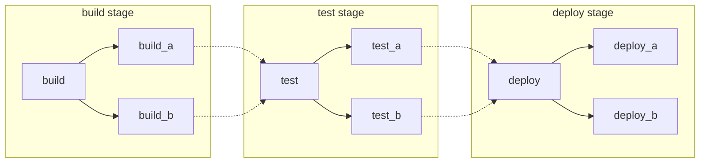
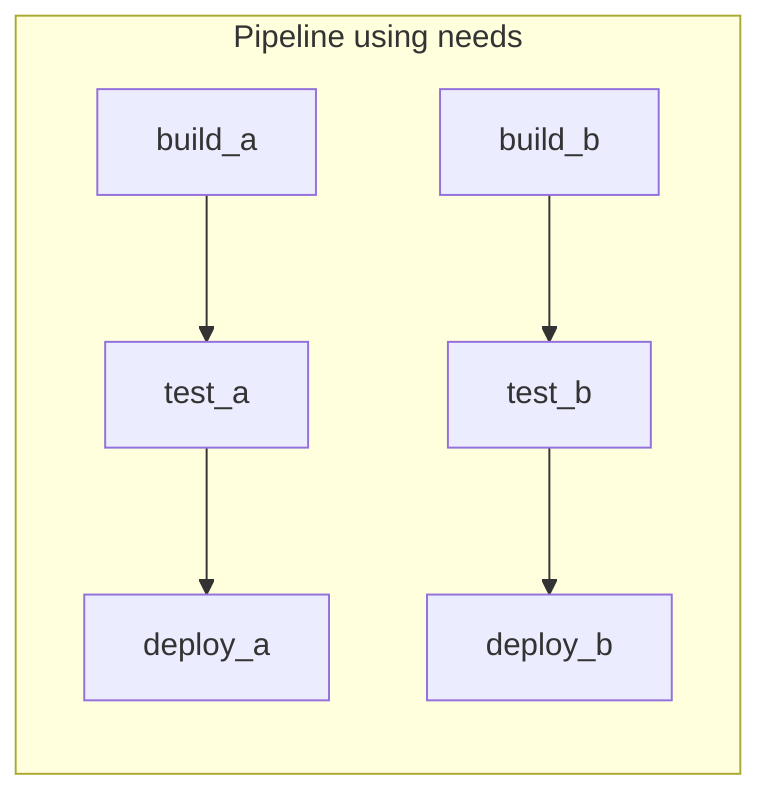
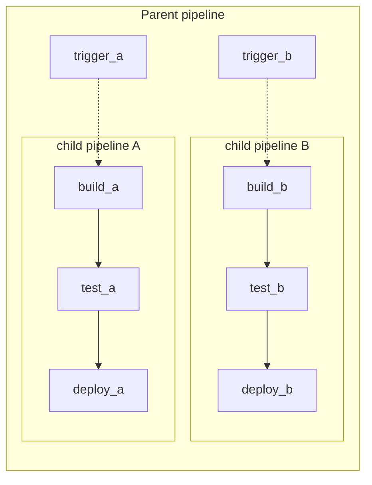



- Tier: 基础版，专业版，旗舰版
- Offering: JihuLab.com，私有化部署



流水线是极狐GitLab 中 CI/CD 的基本构建块。以下是与它们相关的一些重要概念。

您可以使用不同的方法构建您的流水线，每种方法都有各自的优势。如有需要，这些方法可以混合搭配使用：

- [基本流水线](#basic-pipelines)：适用于所有配置都在一个位置、结构简单的项目。
- [使用 `needs` 关键字的流水线](#pipelines-with-the-needs-keyword)：适用于需要高效执行的大型复杂项目。

<a id="basic-pipelines"></a>

## 基本流水线

基本流水线是极狐GitLab 中最简单的流水线。它们会并发运行构建阶段的所有作业，当所有这些作业完成后，再以相同方式运行测试阶段及后续阶段的所有作业。这种方式并非最高效，如果步骤很多，可能会变得复杂，但更易于维护：



与上图匹配的基本 `/.gitlab-ci.yml` 流水线配置示例：

```yaml
stages:
  - build
  - test
  - deploy

default:
  image: alpine

build_a:
  stage: build
  script:
    - echo "This job builds something."

build_b:
  stage: build
  script:
    - echo "This job builds something else."

test_a:
  stage: test
  script:
    - echo "This job tests something. It will only run when all jobs in the"
    - echo "build stage are complete."

test_b:
  stage: test
  script:
    - echo "This job tests something else. It will only run when all jobs in the"
    - echo "build stage are complete too. It will start at about the same time as test_a."

deploy_a:
  stage: deploy
  script:
    - echo "This job deploys something. It will only run when all jobs in the"
    - echo "test stage complete."
  environment: production

deploy_b:
  stage: deploy
  script:
    - echo "This job deploys something else. It will only run when all jobs in the"
    - echo "test stage complete. It will start at about the same time as deploy_a."
  environment: production
```

<a id="pipelines-with-the-needs-keyword"></a>

## 使用 `needs` 关键字的流水线

如果效率很重要，并且您希望所有作业尽快运行，可以使用 [`needs` 关键字](../yaml/needs.md) 来定义作业之间的依赖关系。当极狐GitLab 了解作业之间的依赖关系后，作业可以尽可能快地运行，甚至可以比同一阶段的其他作业更早开始。

在以下示例中，如果 `build_a` 和 `test_a` 比 `build_b` 和 `test_b` 快得多，即使 `build_b` 仍在运行，极狐GitLab 也会启动 `deploy_a`。



与上图匹配的 `/.gitlab-ci.yml` 配置示例：

```yaml
stages:
  - build
  - test
  - deploy

default:
  image: alpine

build_a:
  stage: build
  script:
    - echo "This job builds something quickly."

build_b:
  stage: build
  script:
    - echo "This job builds something else slowly."

test_a:
  stage: test
  needs: [build_a]
  script:
    - echo "This test job will start as soon as build_a finishes."
    - echo "It will not wait for build_b, or other jobs in the build stage, to finish."

test_b:
  stage: test
  needs: [build_b]
  script:
    - echo "This test job will start as soon as build_b finishes."
    - echo "It will not wait for other jobs in the build stage to finish."

deploy_a:
  stage: deploy
  needs: [test_a]
  script:
    - echo "Since build_a and test_a run quickly, this deploy job can run much earlier."
    - echo "It does not need to wait for build_b or test_b."
  environment: production

deploy_b:
  stage: deploy
  needs: [test_b]
  script:
    - echo "Since build_b and test_b run slowly, this deploy job will run much later."
  environment: production
```

<a id="parent-child-pipelines"></a>

## 父子流水线

随着流水线变得越来越复杂，一些相关问题开始出现：

- 分阶段结构中，一个阶段的所有步骤必须完成，下一阶段的第一个作业才能开始，这会导致等待，从而拖慢速度。
- 单一全局流水线的配置变得难以管理。
- 使用 [`include`](../yaml/_index.md#include) 导入会增加配置的复杂性，并可能导致命名空间冲突，使作业被意外重复。
- 流水线的用户体验因作业和阶段过多而难以操作。

此外，有时流水线的行为需要更具动态性。您可以选择是否启动子流水线，这在 YAML 是动态生成时尤其有用。

在之前的 [基本流水线](#basic-pipelines) 和 [`needs` 流水线](#pipelines-with-the-needs-keyword) 示例中，有两个可以独立构建的软件包。这些情况非常适合使用 [父子流水线](downstream_pipelines.md#parent-child-pipelines)。它们将配置分离到多个文件中，使事情更简单。您可以将父子流水线与以下方式结合：

- [`rules` 关键字](../yaml/_index.md#rules)：例如，仅当该区域有更改时才触发子流水线。
- [`include` 关键字](../yaml/_index.md#include)：引入通用行为，确保您不重复自己。
- 在子流水线内部使用 [`needs` 关键字](#pipelines-with-the-needs-keyword)，兼得两者的优点。



与上图匹配的父流水线的 `/.gitlab-ci.yml` 配置示例：

```yaml
stages:
  - triggers

trigger_a:
  stage: triggers
  trigger:
    include: a/.gitlab-ci.yml
  rules:
    - changes:
        - a/*

trigger_b:
  stage: triggers
  trigger:
    include: b/.gitlab-ci.yml
  rules:
    - changes:
        - b/*
```

位于 `/a/.gitlab-ci.yml` 的子 `a` 流水线配置示例，使用了 `needs` 关键字：

```yaml
stages:
  - build
  - test
  - deploy

default:
  image: alpine

build_a:
  stage: build
  script:
    - echo "This job builds something."

test_a:
  stage: test
  needs: [build_a]
  script:
    - echo "This job tests something."

deploy_a:
  stage: deploy
  needs: [test_a]
  script:
    - echo "This job deploys something."
  environment: production
```

位于 `/b/.gitlab-ci.yml` 的子 `b` 流水线配置示例，使用了 `needs` 关键字：

```yaml
stages:
  - build
  - test
  - deploy

default:
  image: alpine

build_b:
  stage: build
  script:
    - echo "This job builds something else."

test_b:
  stage: test
  needs: [build_b]
  script:
    - echo "This job tests something else."

deploy_b:
  stage: deploy
  needs: [test_b]
  script:
    - echo "This job deploys something else."
  environment: production
```

在极狐GitLab 中，作业可以设置为在触发子流水线之前或之后运行，从而允许执行通用设置步骤或统一部署。
