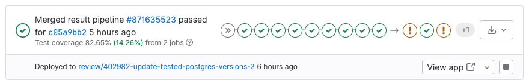
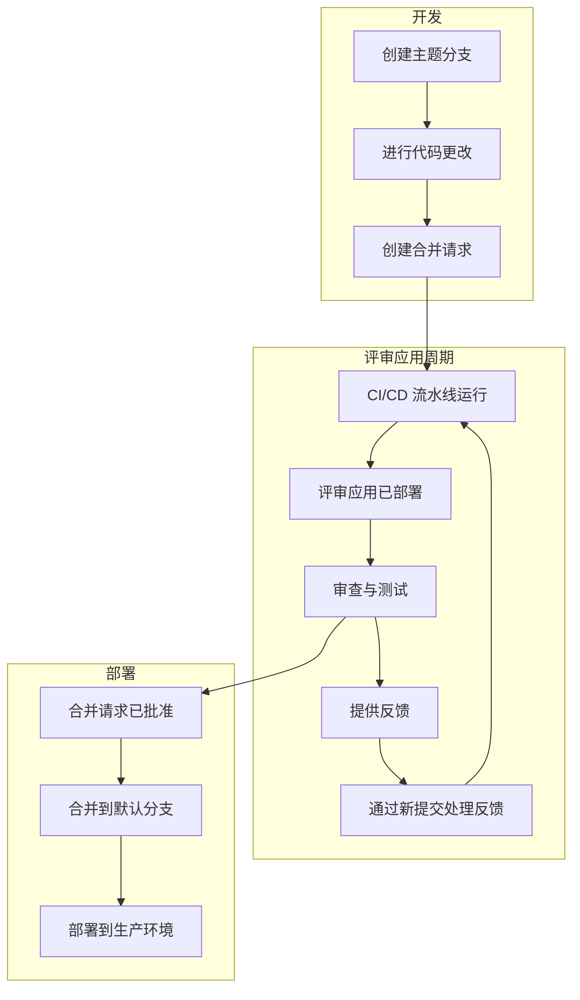
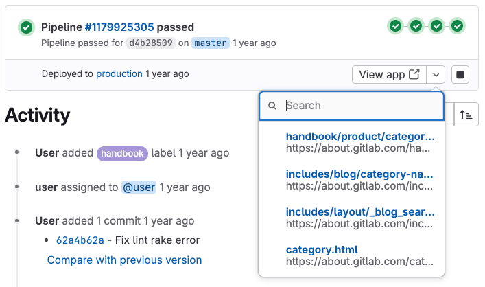



- Tier: 基础版，专业版，旗舰版
- Offering: JihuLab.com，私有化部署



评审应用是为每个分支或合并请求自动创建的临时测试环境。
你可以预览和验证变更，而无需设置本地开发环境。

基于[动态环境](../environments/_index.md#create-a-dynamic-environment)构建，
评审应用为每个分支或合并请求提供唯一的环境。



这些环境通过以下方式帮助简化开发工作流：

- 无需本地设置即可测试变更。
- 为所有团队成员提供一致的环境。
- 使利益相关者能够通过 URL 预览变更。
- 在变更到达生产环境之前加快反馈循环。

> [!note] 如果你有 Kubernetes 集群，可以使用 [Auto DevOps](../../topics/autodevops/_index.md) 自动设置评审应用。

<a id="review-app-workflow"></a>

## 评审应用工作流

评审应用工作流可能类似于：



<a id="configure-review-apps"></a>

## 配置评审应用

当你想要为每个分支或合并请求提供应用程序的预览环境时，配置评审应用。

先决条件：

- 你必须具有项目的开发者、维护者或所有者角色。
- 项目中必须提供 CI/CD 流水线。
- 你必须设置用于托管和部署评审应用的基础设施。

要在你的项目中配置评审应用：

1. 在顶部栏中，选择 **搜索或跳转到** 并找到你的项目。
1. 在左侧边栏中，选择 **构建** > **流水线编辑器**。
1. 在你的 `.gitlab-ci.yml` 文件中，添加一个创建[动态环境](../environments/_index.md#create-a-dynamic-environment)的作业。
   你可以使用[预定义 CI/CD 变量](../variables/predefined_variables.md)来区分
   每个环境。例如，使用 `CI_COMMIT_REF_SLUG` 预定义变量：

   ```yaml
   review_app:
     stage: deploy
     script:
       - echo "部署到评审应用环境"
       # 在此处添加你的部署命令
     environment:
       name: review/$CI_COMMIT_REF_SLUG
       url: https://$CI_COMMIT_REF_SLUG.example.com
     rules:
       - if: $CI_COMMIT_BRANCH && $CI_COMMIT_BRANCH != $CI_DEFAULT_BRANCH
   ```

1. 可选。向作业添加 `when: manual` 以仅手动部署评审应用。
1. 可选。添加一个作业以在不再需要时[停止评审应用](#stop-review-apps)。
1. 输入提交信息并选择 **提交变更**。

<a id="use-the-review-apps-template"></a>

### 使用评审应用模板

极狐GitLab 提供了一个内置模板，该模板默认配置用于合并请求流水线。

要使用和自定义此模板：

1. 在顶部栏中，选择 **搜索或跳转到** 并找到你的项目。
1. 在左侧边栏中，选择 **运维** > **环境**。
1. 选择 **启用评审应用**。
1. 从出现的 **启用评审应用** 对话框中，复制 YAML 模板：

   ```yaml
   deploy_review:
     stage: deploy
     script:
       - echo "在此处添加将代码部署到你的基础设施的脚本"
     environment:
       name: review/$CI_COMMIT_REF_NAME
       url: https://$CI_ENVIRONMENT_SLUG.example.com
     rules:
       - if: $CI_PIPELINE_SOURCE == "merge_request_event"
   ```

1. 选择 **构建** > **流水线编辑器**。
1. 将模板粘贴到你的 `.gitlab-ci.yml` 文件中。
1. 根据你的部署需求自定义模板：

   - 修改部署脚本和环境 URL 以适用于你的基础设施。
   - 如果你想要为没有合并请求的分支部署评审应用，请调整[规则部分](../jobs/job_rules.md)。

   例如，部署到 Heroku：

   ```yaml
   deploy_review:
     stage: deploy
     image: ruby:latest
     script:
       - apt-get update -qy
       - apt-get install -y ruby-dev
       - gem install dpl
       - dpl --provider=heroku --app=$HEROKU_APP_NAME --api-key=$HEROKU_API_KEY
     environment:
       name: review/$CI_COMMIT_REF_NAME
       url: https://$HEROKU_APP_NAME.herokuapp.com
       on_stop: stop_review_app
     rules:
       - if: $CI_PIPELINE_SOURCE == "merge_request_event"
   ```

   此配置设置了一个自动部署到 Heroku 的流程，每当合并请求的流水线运行时就会触发。
   它使用 Ruby 的 `dpl` 部署工具来处理该过程，并创建一个可以通过指定 URL 访问的动态评审环境。

1. 输入提交信息并选择 **提交变更**。

<a id="stop-review-apps"></a>

### 停止评审应用

你可以配置评审应用以手动或自动停止，以节省资源。

有关停止评审应用环境的更多信息，请参阅[停止环境](../environments/_index.md#stopping-an-environment)。

<a id="auto-stop-review-apps-on-merge"></a>

#### 合并时自动停止评审应用

要配置评审应用在关联的合并请求合并或分支删除时自动停止：

1. 向你的部署作业添加 [`on_stop`](../yaml/_index.md#environmenton_stop) 关键字。
1. 使用 [`environment:action: stop`](../yaml/_index.md#environmentaction) 创建一个停止作业。
1. 可选。向停止作业添加 [`when: manual`](../yaml/_index.md#when)，以便可以随时手动停止评审应用。

例如：

```yaml
# 在你的 .gitlab-ci.yml 文件中
deploy_review:
  # 其他配置...
  environment:
    name: review/${CI_COMMIT_REF_NAME}
    url: https://${CI_ENVIRONMENT_SLUG}.example.com
    on_stop: stop_review_app  # 引用 stop_review_app 作业

stop_review_app:
  stage: deploy
  script:
    - echo "停止评审应用"
    # 在此处添加你的清理命令
  environment:
    name: review/${CI_COMMIT_REF_NAME}
    action: stop
  when: manual  # 使此作业可手动触发
  rules:
    - if: $CI_PIPELINE_SOURCE == "merge_request_event"
```

<a id="time-based-automatic-stop"></a>

#### 基于时间的自动停止

要配置评审应用在一段时间后自动停止，
请向你的部署作业添加 [`auto_stop_in`](../yaml/_index.md#environmentauto_stop_in) 关键字：

```yaml
# 在你的 .gitlab-ci.yml 文件中
review_app:
  script: deploy-review-app
  environment:
    name: review/$CI_COMMIT_REF_SLUG
    auto_stop_in: 1 week  # 一周不活动后停止
  rules:
    - if: $CI_MERGE_REQUEST_ID
```

<a id="view-review-apps"></a>

## 查看评审应用

要部署和访问评审应用：

1. 转到你的合并请求。
1. 可选。如果评审应用作业是手动的，选择 **运行** () 以开始部署。
1. 当流水线完成时，选择 **查看应用** 以在浏览器中打开评审应用。

<a id="example-implementations"></a>

## 示例实现

这些项目展示了不同的评审应用实现：

| 项目                                                                                 | 配置文件 |
| --------------------------------------------------------------------------------------- | ------------------ |
| [NGINX](https://gitlab.com/gitlab-examples/review-apps-nginx)                           | [`.gitlab-ci.yml`](https://gitlab.com/gitlab-examples/review-apps-nginx/-/blob/b9c1f6a8a7a0dfd9c8784cbf233c0a7b6a28ff27/.gitlab-ci.yml#L20) |
| [OpenShift](https://gitlab.com/gitlab-examples/review-apps-openshift)                   | [`.gitlab-ci.yml`](https://gitlab.com/gitlab-examples/review-apps-openshift/-/blob/82ebd572334793deef2d5ddc379f38942f3488be/.gitlab-ci.yml#L42) |
| [HashiCorp Nomad](https://gitlab.com/gitlab-examples/review-apps-nomad)                 | [`.gitlab-ci.yml`](https://gitlab.com/gitlab-examples/review-apps-nomad/-/blob/ca372c778be7aaed5e82d3be24e98c3f10a465af/.gitlab-ci.yml#L110) |
| [极狐GitLab 文档](https://gitlab.com/gitlab-org/technical-writing/docs-gitlab-com) | [`build.gitlab-ci.yml`](https://gitlab.com/gitlab-org/technical-writing/docs-gitlab-com/-/blob/bdbf11814428a06e82d7b712c72b5cb53c750f29/.gitlab/ci/build.gitlab-ci.yml#L73-76) |
| [`https://about.gitlab.com/`](https://gitlab.com/gitlab-com/www-gitlab-com/)            | [`.gitlab-ci.yml`](https://gitlab.com/gitlab-com/www-gitlab-com/-/blob/6ffcdc3cb9af2abed490cbe5b7417df3e83cd76c/.gitlab-ci.yml#L332) |
| [极狐GitLab Insights](https://gitlab.com/gitlab-org/gitlab-insights/)                       | [`.gitlab-ci.yml`](https://gitlab.com/gitlab-org/gitlab-insights/-/blob/9e63f44ac2a5a4defc965d0d61d411a768e20546/.gitlab-ci.yml#L234) |

其他评审应用示例：

- [Android 评审应用](https://gitlab.cn/blog/how-to-create-review-apps-for-android-with-gitlab-fastlane-and-appetize-dot-io/)。

<a id="route-maps"></a>

## 路由映射

路由映射允许你直接从源文件导航到评审应用环境中对应的公共页面。
此功能使你更容易在合并请求中预览特定变更。

配置后，路由映射会添加上下文链接，让你查看与映射模式匹配的文件的评审应用版本。
这些链接出现在：

- 合并请求组件中。
- 提交和文件视图中。

<a id="configure-route-maps"></a>

### 配置路由映射

要设置路由映射：

1. 在你的仓库中创建文件 `.gitlab/route-map.yml`。
1. 定义源路径（在你的仓库中）和公共路径（在你的评审应用基础设施或网站上）之间的映射。

路由映射是一个 YAML 数组，其中每个条目将 `source` 路径映射到 `public` 路径。

路由映射中的每个映射遵循以下格式：

```yaml
- source: 'path/to/source/file'  # 仓库中的源文件
  public: 'path/to/public/page'  # 网站上的公共页面
```

你可以使用两种类型的映射：

- 精确匹配：用单引号括起来的字符串字面量
- 模式匹配：用正斜杠括起来的正则表达式

对于使用正则表达式的模式匹配：

- 正则表达式必须匹配整个源路径（隐含了 `^` 和 `$` 锚点）。
- 你可以使用捕获组 `()`，这些捕获组可以在 `public` 路径中引用。
- 使用 `\N` 表达式按出现顺序引用捕获组（`\1`、`\2` 等）。
- 将斜杠 (`/`) 转义为 `\/`，将点 (`.`) 转义为 `\.`。

极狐GitLab 按定义顺序评估映射。第一个匹配的 `source` 表达式决定 `public` 路径。

<a id="example-route-map"></a>

### 示例路由映射

以下示例展示了 [Middleman](https://middlemanapp.com) 的路由映射，Middleman 是一个用于[极狐GitLab 网站](https://about.gitlab.com)的静态站点生成器：

```yaml
# 团队数据
- source: 'data/team.yml'  # data/team.yml
  public: 'team/'  # team/

# 博客文章
- source: /source\/posts\/([0-9]{4})-([0-9]{2})-([0-9]{2})-(.+?)\..*/  # source/posts/2017-01-30-around-the-world-in-6-releases.html.md.erb
  public: '\1/\2/\3/\4/'  # 2017/01/30/around-the-world-in-6-releases/

# HTML 文件
- source: /source\/(.+?\.html).*/  # source/index.html.haml
  public: '\1'  # index.html

# 其他文件
- source: /source\/(.*)/  # source/images/blogimages/around-the-world-in-6-releases-cover.png
  public: '\1'  # images/blogimages/around-the-world-in-6-releases-cover.png
```

在此示例中：

- 映射按顺序评估。
- 第三个映射确保 `source/index.html.haml` 匹配 `/source\/(.+?\.html).*/` 而不是通配符 `/source\/(.*)/`。
  这产生的公共路径是 `index.html` 而不是 `index.html.haml`。

<a id="view-mapped-pages"></a>

### 查看映射页面

使用路由映射直接从源文件导航到评审应用中对应的页面。

先决条件：

- 你必须已在 `.gitlab/route-map.yml` 中配置路由映射。
- 必须为你的分支或合并请求部署了评审应用。

要从合并请求组件查看映射页面：

1. 在合并请求组件中，选择 **查看应用**。
   下拉列表最多显示 5 个映射页面（如果更多，则提供过滤功能）。



要从文件查看映射页面：

1. 使用以下方法之一转到与你的路由映射匹配的文件：
   - 从合并请求：在 **变更** 选项卡中，选择 **查看文件 @ [commit]**。
   - 从提交页面：选择文件名。
   - 从比较：在比较修订版本时，选择文件名。
1. 在文件页面上，选择右上角的 **在 [environment-name] 上查看** ()。

要从提交查看映射页面：

1. 转到具有评审应用部署的提交：
   - 对于分支流水线：在左侧边栏中，选择 **代码** > **提交**，然后选择带有流水线标记的提交。
   - 对于合并请求流水线：在你的合并请求中，选择 **提交** 选项卡并选择一个提交。
   - 对于合并结果流水线：在你的合并请求中，选择 **流水线** 选项卡并选择流水线提交。
1. 选择与你的路由映射匹配的文件名旁边的评审应用图标 ()。
   该图标会在你的评审应用中打开对应的页面。

> [!note] 合并结果流水线会创建一个内部提交，将你的分支与目标分支合并。
> 要访问这些流水线的评审应用链接，请使用 **流水线** 选项卡中的提交，
> 而不是 **提交** 选项卡中的提交。