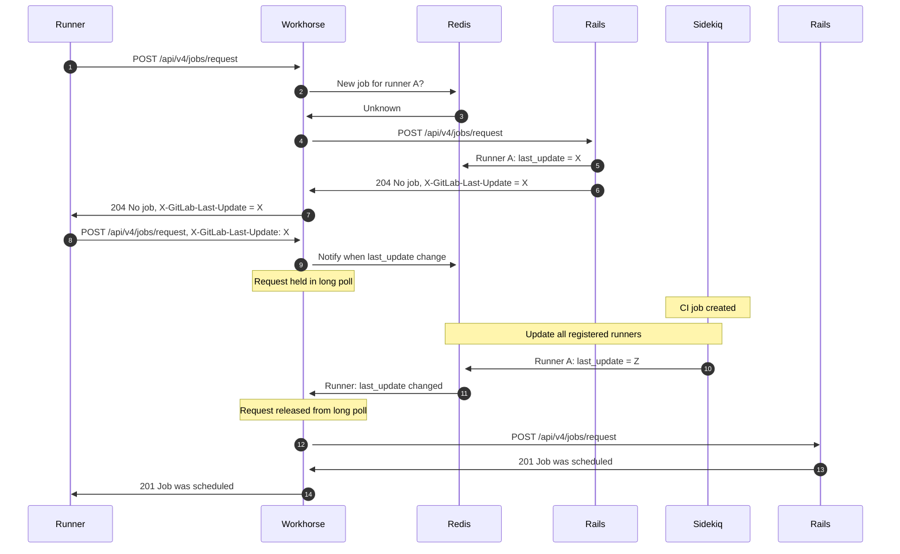



- Tier: 基础版，专业版，旗舰版
- Offering: JihuLab.com，私有化部署



默认情况下，极狐GitLab Runner 会定期轮询极狐GitLab 实例以获取新的 CI/CD 作业。实际轮询间隔[取决于 `check_interval` 以及 Runner 配置文件中配置的 Runner 数量](https://gitlab.cn/docs/runner/configuration/advanced-configuration/#how-check_interval-works)。

在处理许多 Runner 的服务器上，这种轮询可能导致以下性能问题：

- 更长的排队时间。
- 极狐GitLab 实例的 CPU 使用率更高。

为缓解这些问题，您应该启用长轮询。前提条件：您必须是管理员。

<a id="enable-long-polling"></a>

启用长轮询

您可以配置极狐GitLab 实例，将来自 Runner 的作业请求保持在一个长轮询中，直到有新作业准备就绪。为此，通过配置极狐GitLab Workhorse 长轮询持续时间（`apiCiLongPollingDuration`）来启用长轮询：





1. 编辑 `/etc/gitlab/gitlab.rb`：

   ```ruby
   gitlab_workhorse['api_ci_long_polling_duration'] = "50s"
   ```

1. 保存文件并重新配置极狐GitLab：

   ```shell
   sudo gitlab-ctl reconfigure
   ```





通过 `gitlab.webservice.workhorse.extraArgs` 设置启用长轮询。

1. 导出 Helm 值：

   ```shell
   helm get values gitlab > gitlab_values.yaml
   ```

1. 编辑 `gitlab_values.yaml`：

   ```yaml
   gitlab:
     webservice:
       workhorse:
         extraArgs: "-apiCiLongPollingDuration 50s"
   ```

1. 保存文件并应用新值：

   ```shell
   helm upgrade -f gitlab_values.yaml gitlab gitlab/gitlab
   ```





1. 编辑 `docker-compose.yml`：

   ```yaml
   version: "3.6"
   services:
     gitlab:
       image: 'registry.gitlab.cn/omnibus/gitlab-jh:latest'
       restart: always
       hostname: 'gitlab.example.com'
       environment:
         GITLAB_OMNIBUS_CONFIG: |
           gitlab_workhorse['api_ci_long_polling_duration'] = "50s"
   ```

1. 保存文件并重启极狐GitLab：

   ```shell
   docker compose up -d
   ```





<a id="metrics"></a>

指标

启用长轮询后，极狐GitLab Workhorse 会订阅 Redis PubSub 频道并等待通知。当 Runner 密钥发生更改或达到 `apiCiLongPollingDuration` 时，作业请求将从长轮询中释放。您可监控以下一些 Prometheus 指标：

| 指标 | 类型 | 描述 | 标签 |
| -----  | ---- | ----------- | ------ |
| `gitlab_workhorse_keywatcher_keywatchers` | Gauge | 极狐GitLab Workhorse 正在监视的密钥数量 | |
| `gitlab_workhorse_keywatcher_redis_subscriptions` | Gauge | Redis PubSub 订阅数量 | |
| `gitlab_workhorse_keywatcher_total_messages` | Counter | 极狐GitLab Workhorse 在 PubSub 频道上收到的消息总数 | |
| `gitlab_workhorse_keywatcher_actions_total` | Counter | 各种密钥监视程序操作的计数 | `action` |
| `gitlab_workhorse_keywatcher_received_bytes_total` | Counter | PubSub 频道上接收的总字节数 | |

您可以查看[一个示例，了解某用户如何使用这些指标发现了长轮询的问题](https://jihulab.com/gitlab-cn/omnibus-gitlab/-/issues/8329)。

<a id="long-polling-workflow"></a>

长轮询工作流

该图显示了启用长轮询后单个 Runner 获取作业的方式：



在步骤 1 中，当 Runner 请求新作业时，它会向 极狐GitLab 服务器发出 `POST` 请求（`/api/v4/jobs/request`），该请求首先由 Workhorse 处理。

Workhorse 从 `X-GitLab-Last-Update` HTTP 头中读取 Runner 令牌和值，构造一个键，然后订阅带有该键的 Redis PubSub 频道。如果该键不存在值，Workhorse 会立即将请求转发给 Rails（步骤 3 和 4）。

Rails 检查作业队列。如果没有可用的作业，Rails 会向 Runner 返回一个 `204 No job` 以及一个 `last_update` 令牌（步骤 5 到 7）。

Runner 使用该 `last_update` 令牌，再次请求作业，并将此令牌填充到 `X-GitLab-Last-Update` HTTP 头中。这次 Workhorse 会检查 Runner 的 `last_update` 令牌是否已更改。如果未更改，Workhorse 将保持该请求，最长可达 `apiCiLongPollingDuration` 指定的持续时间。

如果用户触发新的流水线或作业运行，Sidekiq 中的后台任务将更新可用于该作业的所有 Runner 的 `last_update` 值。Runner 可以针对项目、群组和/或实例进行注册。

步骤 10 和 11 中的此“滴答”信号会从 Workhorse 长轮询队列中释放作业请求，并将请求发送给 Rails（步骤 12）。Rails 寻找可用的作业，并将 Runner 分配给该作业（步骤 13 和 14）。

使用长轮询，Runner 会在新作业可用后立即收到通知。这不仅有助于减少作业排队时间，还能降低服务器开销，因为作业请求仅在有新工作时才会到达 Rails。

<a id="troubleshooting"></a>

故障排除

在使用长轮询时，您可能会遇到以下问题。

<a id="slow-job-pickup"></a>

作业提取缓慢

长轮询默认未启用，因为在某些 Runner 配置中，Runner 无法及时提取作业。请参阅[议题 27709](https://jihulab.com/gitlab-cn/gitlab-runner/-/issues/27709)。

如果 Runner `config.toml` 中的 `concurrent` 设置值低于定义的 Runner 数量，则可能发生这种情况。要解决此问题，请确保 `concurrent` 的值等于或大于 Runner 数量。

例如，如果在 `config.toml` 中有三个 `[[runners]]` 条目，请确保将 `concurrent` 设置为至少 3。

启用长轮询后，Runner 会：

1. 启动 `concurrent` 个 Goroutines。
1. 等待 Goroutines 在长轮询后返回。
1. 运行另一批请求。

例如，考虑以下情况，单个 `config.toml` 配置了：

- 为项目 A 配置了 3 个 Runner。
- 为项目 B 配置了 1 个 Runner。
- `concurrent` 设置为 3。

在本例中，Runner 会为前 3 个项目启动 Goroutines。在最坏的情况下，Runner 会等待项目 A 的完整长轮询间隔，然后再继续为项目 B 请求作业。