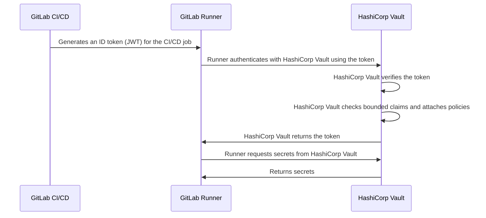



- Tier: 基础版，专业版，旗舰版
- Offering: JihuLab.com，私有化部署



ID 令牌是由极狐GitLab CI/CD 生成的 [JSON Web 令牌 (JWT)](https://www.rfc-editor.org/info/rfc7519/)。
CI/CD 作业可以使用 ID 令牌与第三方服务进行 OIDC 身份验证，包括：

- [密钥提供商](_index.md)
- [云服务](../cloud_services/_index.md)

例如，使用 ID 令牌与 HashiCorp Vault 进行身份验证的流程如下图所示：



ID 令牌也用于 [`secrets`](../yaml/_index.md#secrets) 关键字。

极狐GitLab Duo Agent Platform [任务流](../../user/duo_agent_platform/flows/execution/_index.md#configure-id-tokens)
和 [外部 Agent](../../user/duo_agent_platform/agents/external.md#authenticate-with-id-tokens)
也可以在执行期间声明 `id_tokens` 以与第三方服务进行身份验证。

<a id="configure-id-tokens-in-a-cicd-job"></a>

## 在 CI/CD 作业中配置 ID 令牌

要使用 ID 令牌，请使用 [`id_tokens`](../yaml/_index.md#id_tokens) 关键字配置 CI/CD 作业。
然后，您可以在 `script`、`before_script` 或 `after_script` 部分中使用该令牌。

例如：

```yaml
job_with_id_tokens:
  id_tokens:
    FIRST_ID_TOKEN:
      aud: https://first.service.com
    SECOND_ID_TOKEN:
      aud: https://second.service.com
  script:
    - first-service-authentication-script.sh $FIRST_ID_TOKEN
    - second-service-authentication-script.sh $SECOND_ID_TOKEN
```

在此示例中，两个令牌具有不同的 `aud` 声明。第三方服务可以配置为拒绝不具有与其绑定受众匹配的 `aud` 声明的令牌。使用此功能可以减少令牌可以对其进行身份验证的服务数量。这降低了令牌被泄露的严重性。

<a id="token-payload"></a>

## 令牌负载

每个 ID 令牌中包含以下标准声明：

| 字段                                                              | 描述 |
|--------------------------------------------------------------------|-------------|
| [`iss`](https://www.rfc-editor.org/rfc/rfc7519.html#section-4.1.1) | 令牌的签发者，即极狐GitLab 实例的域名（“签发者”声明）。 |
| [`sub`](https://www.rfc-editor.org/rfc/rfc7519.html#section-4.1.2) | 令牌的主体（“主体”声明）。默认为 `project_path:{group}/{project}:ref_type:{type}:ref:{branch_name}`。可以使用 [projects API](../../api/projects.md#update-a-project) 为项目配置。当作业指定环境时，`sub` 声明可以包含其他字段，例如 `ref_protected`，以及与环境相关的字段，例如 `environment_protected` 和 `deployment_tier`。在极狐GitLab 18.7 中引入。 |
| [`aud`](https://www.rfc-editor.org/rfc/rfc7519.html#section-4.1.3) | 令牌的预期受众（“受众”声明）。在 [ID 令牌](#configure-id-tokens-in-a-cicd-job) 配置中指定。默认为极狐GitLab 实例的域名。 |
| [`exp`](https://www.rfc-editor.org/rfc/rfc7519.html#section-4.1.4) | 过期时间（“过期时间”声明）。 |
| [`nbf`](https://www.rfc-editor.org/rfc/rfc7519.html#section-4.1.5) | 令牌生效的时间（“生效时间”声明）。 |
| [`iat`](https://www.rfc-editor.org/rfc/rfc7519.html#section-4.1.6) | JWT 的签发时间（“签发时间”声明）。 |
| [`jti`](https://www.rfc-editor.org/rfc/rfc7519.html#section-4.1.7) | 令牌的唯一标识符（“JWT ID”声明）。 |

令牌还包含极狐GitLab 提供的自定义声明：

| 字段                   | 何时包含                                       | 描述 |
|-------------------------|--------------------------------------------|-------------|
| `project_id`            | 始终                                     | 运行作业的项目的 ID。在合并请求流水线中，这是源项目的 ID。 |
| `project_path`          | 始终                                     | 运行作业的项目的路径。在合并请求流水线中，这是源项目的路径。 |
| `namespace_id`          | 始终                                     | 运行作业的项目的命名空间 ID。在合并请求流水线中，这是源项目的命名空间 ID。 |
| `namespace_path`        | 始终                                     | 运行作业的项目的命名空间路径。在合并请求流水线中，这是源项目的命名空间路径。 |
| `user_id`               | 始终                                     | 执行作业的用户的 ID。 |
| `user_login`            | 始终                                     | 执行作业的用户的用户名。 |
| `user_email`            | 始终                                     | 执行作业的用户的电子邮件。 |
| `user_access_level`     | 始终                                     | 执行作业的用户的访问级别。 |
| `job_project_id`        | 始终                                     | 运行作业的项目的 ID。使用此字段按 ID 限定项目范围。在极狐GitLab 18.4 中[引入](https://gitlab.com/gitlab-org/gitlab/-/issues/563038)。 |
| `job_project_path`      | 始终                                     | 运行作业的项目的路径。使用此字段按路径限定项目范围。在极狐GitLab 18.4 中[引入](https://gitlab.com/gitlab-org/gitlab/-/issues/563038)。 |
| `job_namespace_id`      | 始终                                     | 运行作业的项目的命名空间 ID。使用此字段按 ID 限定群组或用户级命名空间范围。在极狐GitLab 18.4 中[引入](https://gitlab.com/gitlab-org/gitlab/-/issues/563038)。 |
| `job_namespace_path`    | 始终                                     | 运行作业的项目的命名空间路径。使用此字段按路径限定群组或用户级命名空间范围。在极狐GitLab 18.4 中[引入](https://gitlab.com/gitlab-org/gitlab/-/issues/563038)。 |
| `user_identities`       | 用户偏好设置                    | 用户的外部身份列表。 |
| `pipeline_id`           | 始终                                     | 流水线的 ID。 |
| `pipeline_source`       | 始终                                     | [流水线来源](../jobs/job_rules.md#common-if-clauses-with-predefined-variables)。 |
| `job_id`                | 始终                                     | 作业的 ID。 |
| `ref`                   | 始终                                     | 作业的 Git 引用。在合并请求流水线中，这是源分支引用。 |
| `ref_type`              | 始终                                     | Git 引用类型，可以是 `branch` 或 `tag`。 |
| `ref_path`              | 始终                                     | 作业的完全限定引用。例如，`refs/heads/main`。在合并请求流水线中，这是源分支引用路径。 |
| `ref_protected`         | 始终                                     | 如果 Git 引用受保护，则为 `true`，否则为 `false`。 |
| `groups_direct`         | 用户是 0 到 200 个群组的直接成员 | 用户直接所属群组的路径。如果用户是超过 200 个群组的直接成员，则省略此字段。[功能标志](../../administration/feature_flags/_index.md) `ci_jwt_groups_direct` 在极狐GitLab 17.3 中[添加](https://gitlab.com/gitlab-org/gitlab/-/merge_requests/146881)。默认禁用。 |
| `environment`           | 作业指定了环境               | 此作业部署到的环境。 |
| `environment_protected` | 作业指定了环境               | 如果部署的环境受保护，则为 `true`，否则为 `false`。 |
| `deployment_tier`       | 作业指定了环境               | 作业指定的环境的[部署层级](../environments/_index.md#deployment-tier-of-environments)。 |
| `environment_action`    | 作业指定了环境               | 作业中指定的[环境操作 (`environment:action`)](../environments/_index.md)。 |
| `runner_id`             | 始终                                     | 执行作业的 Runner 的 ID。 |
| `runner_environment`    | 始终                                     | 作业使用的 Runner 类型。可以是 `gitlab-hosted` 或 `self-hosted`。 |
| `sha`                   | 始终                                     | 作业的提交 SHA。 |
| `ci_config_ref_uri`     | 始终                                     | 顶层流水线定义的引用路径，例如，`gitlab.example.com/my-group/my-project//.gitlab-ci.yml@refs/heads/main`。除非流水线定义位于同一项目中，否则此声明为 `null`。 |
| `ci_config_sha`         | 始终                                     | `ci_config_ref_uri` 的 Git 提交 SHA。除非流水线定义位于同一项目中，否则此声明为 `null`。 |
| `project_visibility`    | 始终                                     | 运行流水线的项目的[可见性](../../user/public_access.md)。可以是 `internal`、`private` 或 `public`。 |
| `job_source`            | 始终                                     | [作业来源](../jobs/_index.md#available-job-sources)。在极狐GitLab 18.9 中[引入](https://gitlab.com/gitlab-org/gitlab/-/work_items/459001)。 |
| `job_config`              | 作业由策略触发                  | 关于作业来源的元数据。对于策略作业，包括策略配置的 `sha` 和 `url`。在极狐GitLab 18.9 中[引入](https://gitlab.com/gitlab-org/gitlab/-/work_items/459001)。 |

```json
{
  "namespace_id": "72",
  "namespace_path": "my-group",
  "project_id": "20",
  "project_path": "my-group/my-project",
  "user_id": "1",
  "user_login": "sample-user",
  "user_email": "sample-user@example.com",
  "user_identities": [
      {"provider": "github", "extern_uid": "2435223452345"},
      {"provider": "bitbucket", "extern_uid": "john.smith"}
  ],
  "pipeline_id": "574",
  "pipeline_source": "push",
  "job_id": "302",
  "ref": "feature-branch-1",
  "ref_type": "branch",
  "ref_path": "refs/heads/feature-branch-1",
  "ref_protected": "false",
  "groups_direct": ["mygroup/mysubgroup", "myothergroup/myothersubgroup"],
  "environment": "test-environment2",
  "environment_protected": "false",
  "deployment_tier": "testing",
  "environment_action": "start",
  "job_source": "push",
  "job_config": {
    "url": "https://gitlab.example.com/my-group/my-policy-project/-/blob/ab035e64eca9a7a85bd62e485d3593f52a2804ac/.gitlab/security-policies/policy.yml",
    "sha": "ab035e64eca9a7a85bd62e485d3593f52a2804ac"
  },
  "runner_id": 1,
  "runner_environment": "self-hosted",
  "sha": "714a629c0b401fdce83e847fc9589983fc6f46bc",
  "project_visibility": "public",
  "ci_config_ref_uri": "gitlab.example.com/my-group/my-project//.gitlab-ci.yml@refs/heads/main",
  "ci_config_sha": "714a629c0b401fdce83e847fc9589983fc6f46bc",
  "jti": "235b3a54-b797-45c7-ae9a-f72d7bc6ef5b",
  "iss": "https://gitlab.example.com",
  "iat": 1681395193,
  "nbf": 1681395188,
  "exp": 1681398793,
  "sub": "project_path:my-group/my-project:ref_type:branch:ref:feature-branch-1",
  "aud": "https://vault.example.com"
}
```

ID 令牌使用 RS256 编码，并使用专用的私钥签名。令牌的过期时间设置为作业的超时时间（如果指定），如果未指定超时时间，则设置为 5 分钟。

<a id="use-id-token-claims-in-cloud-trust-policies"></a>

### 在云信任策略中使用 ID 令牌声明

将极狐GitLab 作为 OIDC 身份提供商进行联合的云提供商可以在信任策略中验证上述声明作为条件键。

在编写信任策略时，如果云提供商和极狐GitLab 交付方式支持，请在基于路径的声明（如 `sub`）旁边包含稳定、唯一的标识符，例如 `namespace_id` 和 `project_id`。`project_id` 是全局唯一的，并且在项目的整个生命周期内保持不变。`namespace_id` 在项目保留在其当前命名空间内时保持稳定。由于这两个标识符都独立于路径，因此包含它们的信任策略不会受到路径更改（例如群组或项目重命名）的影响。

对于 JihuLab.com 上的 AWS，以下极狐GitLab 声明可用作 `jihulab.com` OIDC 身份提供商的条件键：

- `namespace_id`
- `project_id`
- `user_id`
- `user_login`
- `user_email`
- `user_access_level`
- `ref_protected`
- `pipeline_source`

这些条件键仅适用于 `jihulab.com` OIDC 身份提供商。它们不适用于极狐GitLab 私有化部署，在私有化部署中，仅支持 `sub` 声明作为 AWS 条件键。

不要仅依赖 `user_login` 或 `user_email` 作为条件，因为用户可以更改它们。请根据 AWS 为极狐GitLab 身份提供商发布的已支持条件键，确认支持的确切声明集。

有关使用 `sub`、`namespace_id` 和 `project_id` 的完整 AWS 信任策略示例，请参阅[在 AWS 中配置 OpenID Connect](../cloud_services/aws/_index.md#configure-a-role-and-trust)。有关 HashiCorp Vault，请参阅[绑定声明](hashicorp_vault_tutorial.md)。

<a id="troubleshooting"></a>

## 故障排除

<a id="400-missing-token-status-code"></a>

### `400: missing token` 状态码

此错误表示 ID 令牌所需的一个或多个基本组件缺失或未按预期配置。

要查找问题，管理员可以在实例的
`exceptions_json.log` 中查找失败的特定方法的更多详细信息。

<a id="gitlabcijwtnosigningkeyerror"></a>

### `GitLab::Ci::Jwt::NoSigningKeyError`

`exceptions_json.log` 文件中的此错误可能是因为
签名密钥在数据库中缺失，导致无法生成令牌。要验证是否为此问题，
请在实例的 PostgreSQL 终端上运行以下查询：

```sql
SELECT encrypted_ci_jwt_signing_key FROM application_settings;
```

如果返回值为空，请使用以下 Rails 代码片段生成新密钥并在内部替换：

```ruby
  key = OpenSSL::PKey::RSA.new(2048).to_pem

  ApplicationSetting.find_each do |application_setting|
    application_setting.update(ci_jwt_signing_key: key)
  end
```

<a id="401-unauthorized-status-code"></a>

### `401: unauthorized` 状态码

此错误表示身份验证请求失败。当从极狐GitLab 流水线使用 OpenID Connect (OIDC) 身份验证到外部服务时，由于几个常见原因，可能会发生 `401 Unauthorized` 错误：

- 您使用了已弃用的令牌，例如 `$CI_JOB_JWT_V2`，而不是 [ID 令牌](#configure-id-tokens-in-a-cicd-job)。有关更多信息，请参阅[旧版 JSON Web 令牌已弃用](../../update/deprecations.md#old-versions-of-json-web-tokens-are-deprecated)。
- 您在 `.gitlab-ci.yml` 文件和外部服务上的 OIDC 身份提供商配置之间不匹配 `provider_name` 值。
- 您遗漏或不匹配极狐GitLab 签发的 ID 令牌与外部服务期望的 `aud`（受众）声明。
- 您未在极狐GitLab CI/CD 作业中启用或配置 `id_tokens:` 块。

要解决此错误，请在您的作业中解码令牌：

```shell
echo $OIDC_TOKEN | cut -d '.' -f2 | base64 -d | jq .
```

确保：

- `aud`（受众）与预期受众匹配（例如，外部服务的 URL）。
- `sub`（主体）已映射到服务的身份提供商设置中。
- `preferred_username` 默认不存在于极狐GitLab ID 令牌中。

<a id="error-id-token-issuance-is-disabled"></a>

### 错误：`ID token issuance is disabled`

当 CI/CD 作业请求 ID 令牌时，您可能会收到此错误：

```plaintext
ID token issuance is disabled in CI because this project's path was previously used by a different project.
```

当配置的 `sub` 声明包含的 `project_path` 路径曾被另一个项目使用时，极狐GitLab 会阻止 ID 令牌签发。此限制可防止新项目继承属于先前项目的外部信任策略。

要解决此错误，请使用 [projects API](../../api/projects.md#update-a-project) 设置
`ci_id_token_sub_claim_components`，并将 `project_id` 作为第一个值：

```json
{
  "ci_id_token_sub_claim_components": ["project_id", "ref_type", "ref"]
}
```

生成的 `sub` 声明具有以下格式：

```plaintext
project_id:<id>:ref_type:<type>:ref:<ref>
```

更新每个外部服务信任策略以匹配新的主体。如果路径历史记录异常，请让实例管理员进行审查。

有关云服务信任策略的指导，请参阅
[使用项目 ID 作为主体](../cloud_services/_index.md#use-the-project-id-as-the-subject)。
