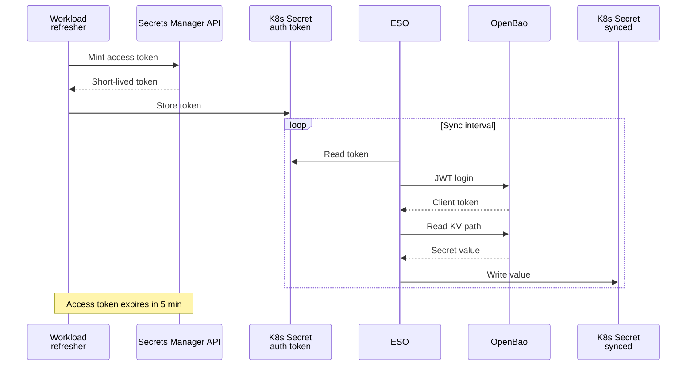



- Tier: 专业版，旗舰版
- Offering: JihuLab.com，私有化部署
- Status: 测试版



CI/CD 作业通过极狐GitLab Runner 读取 [极狐GitLab 密钥管理器](_index.md) 中的密钥。
其他工作负载通过 [密钥管理器 API](../../../api/secrets_manager.md) 读取密钥。
例如 Kubernetes 应用和基础设施即代码工具。

读取操作直接访问 OpenBao 后端，因此密钥的可用性不依赖于极狐GitLab 应用。

<a id="access-token-flow"></a>

## 访问令牌流程

1. 客户端使用具有 `api` 权限的个人访问令牌、服务账号令牌或项目/群组访问令牌向极狐GitLab 进行身份验证。
1. 客户端调用密钥管理器 API 来生成一个短期访问令牌。
   响应中包含该令牌和 OpenBao 连接详情。
1. 客户端向 OpenBao 后端出示该令牌以读取密钥值。

访问令牌在五分钟后过期。
由于 OpenBao 实现了 Vault API，您可以使用任何兼容 [HashiCorp Vault](https://developer.hashicorp.com/vault) 的客户端来出示该令牌。

所有 OpenBao 连接详情均来自生成响应，因此您无需自行构造命名空间、挂载点或认证路径。

<a id="prerequisites"></a>

## 前提条件

- 已为项目或群组启用密钥管理器。
- 密钥管理器已在极狐GitLab 19.2 或更高版本中完成配置。
- 您使用具有 `api` 权限的个人访问令牌、项目/群组访问令牌或服务账号令牌进行身份验证。
- 您的角色至少为报告者。
- 要读取密钥值，您需要被授予该密钥的读取值权限。
  仅报告者角色无法查看密钥值。

> [!note]
> 在极狐GitLab 19.2 之前配置的密钥管理器不支持来自外部请求或服务的访问。
> 要启用外部访问，请参阅[从外部请求启用密钥访问](../../../administration/secrets_manager/maintenance.md#enable-secrets-access-from-external-requests)。

<a id="read-a-secret"></a>

## 读取密钥

此示例为项目生成访问令牌，向 OpenBao 进行身份验证，然后读取密钥值。

1. 生成访问令牌。您用于身份验证的令牌必须具有 `api` 权限：

   ```shell
   RESPONSE=$(curl --silent --request POST \
     --header "PRIVATE-TOKEN: <your_access_token>" \
     --url "https://gitlab.example.com/api/v4/projects/<project_id>/secrets_manager/access_token")
   ```

   响应包含一个 `provider.vault` 对象，其中包含 `server`、`namespace`、`path`、
   `secrets_path` 和 `auth.jwt` 详情，以及一个短期 `token`。

1. 使用返回的令牌向 OpenBao 进行身份验证，然后读取值：

   ```shell
   SERVER=$(echo "$RESPONSE" | jq --raw-output .provider.vault.server)
   NAMESPACE=$(echo "$RESPONSE" | jq --raw-output .provider.vault.namespace)
   MOUNT=$(echo "$RESPONSE" | jq --raw-output .provider.vault.path)
   SECRETS_PATH=$(echo "$RESPONSE" | jq --raw-output .provider.vault.secrets_path)
   AUTH_PATH=$(echo "$RESPONSE" | jq --raw-output .provider.vault.auth.jwt.path)
   ROLE=$(echo "$RESPONSE" | jq --raw-output .provider.vault.auth.jwt.role)
   JWT=$(echo "$RESPONSE" | jq --raw-output .provider.vault.auth.jwt.token)

   # Exchange the JWT for a short-lived OpenBao token.
   VAULT_TOKEN=$(curl --silent --request POST \
     --header "X-Vault-Namespace: $NAMESPACE" \
     --data "{\"role\":\"$ROLE\",\"jwt\":\"$JWT\"}" \
     "$SERVER/v1/auth/$AUTH_PATH/login" | jq --raw-output .auth.client_token)

   # Read the secret value.
   curl --silent \
     --header "X-Vault-Token: $VAULT_TOKEN" \
     --header "X-Vault-Namespace: $NAMESPACE" \
     "$SERVER/v1/$MOUNT/data/$SECRETS_PATH/<secret_name>"
   ```

在 JihuLab.com 上，`server` 为 `https://secrets.gitlab.com`。
在极狐GitLab 私有化部署上，`server` 是为实例配置的 OpenBao URL。

有关完整的请求和响应格式，请参阅[密钥管理器 API](../../../api/secrets_manager.md)。

<a id="use-with-the-vault-cli"></a>

## 与 Vault CLI 一起使用

由于 OpenBao 实现了 Vault API，您可以将响应中的值与 [Vault CLI](https://developer.hashicorp.com/vault/docs/commands) 一起使用：

```shell
export VAULT_ADDR="<server>"
export VAULT_NAMESPACE="<namespace>"

# Exchange the minted JWT for an OpenBao token, then export it.
vault write "auth/<auth_jwt_path>/login" role=<role> jwt=<token>
export VAULT_TOKEN="<client_token>"

# Read the secret value.
vault kv get -mount=<path> "<secrets_path>/<secret_name>"
```

<a id="use-with-the-external-secrets-operator"></a>

## 与 External Secrets Operator 一起使用

[External Secrets Operator](https://external-secrets.io) 通过其 HashiCorp Vault 提供程序将极狐GitLab 密钥同步到 Kubernetes 密钥中。
集群中的工作负载（例如 [CronJob](https://kubernetes.io/docs/concepts/workloads/controllers/cron-jobs/)）会在 Kubernetes 密钥中保持一个新的访问令牌，而该 Operator 会读取该令牌以向 OpenBao 进行身份验证。

将生成响应映射到 `SecretStore`，并通过 `<secrets_path>/<secret_name>` 引用每个密钥：

```yaml
apiVersion: external-secrets.io/v1
kind: SecretStore
metadata:
  name: gitlab-secrets-manager
  namespace: my-app
spec:
  provider:
    vault:
      server: https://secrets.gitlab.com     # provider.vault.server
      path: secrets/kv                        # provider.vault.path
      version: v2
      namespace: org_5/group_42/project_99    # provider.vault.namespace
      auth:
        jwt:
          path: api_jwt/cel                   # provider.vault.auth.jwt.path
          role: all_api                       # provider.vault.auth.jwt.role
          secretRef:
            name: gitlab-access-token         # Kubernetes secret holding the minted token
            key: token
---
apiVersion: external-secrets.io/v1
kind: ExternalSecret
metadata:
  name: my-secret
  namespace: my-app
spec:
  refreshInterval: 1m
  secretStoreRef:
    name: gitlab-secrets-manager
    kind: SecretStore
  target:
    name: synced-secret
  data:
    - secretKey: value
      remoteRef:
        key: explicit/<secret_name>           # <secrets_path>/<secret_name>
        property: value
```

访问令牌在五分钟后过期，因此工作负载必须在其过期前刷新 `gitlab-access-token` Kubernetes 密钥。

在[史诗 20382](https://gitlab.com/groups/gitlab-org/-/epics/20382) 中提出了原生 Kubernetes 集成方案。

<a id="authentication-flow"></a>

### 认证流程

您可以在下图中查看与 External Secrets Operator 的认证流程：



<a id="use-with-terraform"></a>

## 与 Terraform 一起使用

Terraform 或 OpenTofu 配置可以将极狐GitLab 密钥作为数据源读取。
Terraform 本身无法生成访问令牌，因此 [`external` 数据源](https://registry.terraform.io/providers/hashicorp/external/latest/docs/data-sources/external) 会运行一个脚本，该脚本调用密钥管理器 API 并返回 `provider.vault` 连接详情。
然后，[Vault 提供程序](https://registry.terraform.io/providers/hashicorp/vault/latest/docs) 使用生成的 JWT 进行身份验证并读取密钥。

该脚本生成令牌并以 JSON 格式打印连接详情。它从 `GITLAB_TOKEN` 环境变量中读取极狐GitLab 令牌：

```shell
#!/usr/bin/env bash
# scripts/mint_token.sh
set -euo pipefail
eval "$(jq --raw-output '@sh "PROJECT_ID=\(.project_id)"')"

curl --silent --request POST \
  --header "PRIVATE-TOKEN: ${GITLAB_TOKEN}" \
  --url "https://gitlab.example.com/api/v4/projects/${PROJECT_ID}/secrets_manager/access_token" \
  | jq '{
      server:       .provider.vault.server,
      namespace:    .provider.vault.namespace,
      mount:        .provider.vault.path,
      secrets_path: .provider.vault.secrets_path,
      auth_path:    .provider.vault.auth.jwt.path,
      role:         .provider.vault.auth.jwt.role,
      jwt:          .provider.vault.auth.jwt.token
    }'
```

从 `external` 数据源引用该脚本，配置 Vault 提供程序，然后读取密钥：

```hcl
data "external" "gitlab_secrets_token" {
  program = ["bash", "${path.module}/scripts/mint_token.sh"]

  query = {
    project_id = var.gitlab_project_id
  }
}

provider "vault" {
  address   = data.external.gitlab_secrets_token.result.server
  namespace = data.external.gitlab_secrets_token.result.namespace

  auth_login_jwt {
    mount = data.external.gitlab_secrets_token.result.auth_path
    role  = data.external.gitlab_secrets_token.result.role
    jwt   = data.external.gitlab_secrets_token.result.jwt
  }
}

data "vault_kv_secret_v2" "my_secret" {
  mount = data.external.gitlab_secrets_token.result.mount
  name  = "${data.external.gitlab_secrets_token.result.secrets_path}/<secret_name>"
}

output "secret_value" {
  value     = data.vault_kv_secret_v2.my_secret.data["value"]
  sensitive = true
}
```

生成的令牌有效期为五分钟，因此 `terraform apply` 必须在该时间窗口内运行。

在[史诗 21177](https://gitlab.com/groups/gitlab-org/-/epics/21177) 中提出了原生极狐GitLab Terraform 提供程序集成方案。
