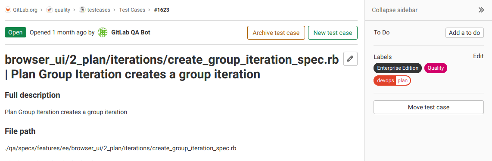



- Tier: 旗舰版
- Offering: JihuLab.com，私有化部署



测试用例将测试计划直接集成到你的极狐GitLab 工作流中。
团队可以：

- 在管理代码的同一平台上记录测试场景。
- 与开发任务并行跟踪测试需求。
- 在实现团队和测试团队之间共享测试计划。
- 使用保密设置管理测试用例的可见性。
- 根据需要存档和重新打开测试用例。

团队使用测试用例来简化开发团队和测试团队之间的协作，
这消除了对外部测试计划工具的需求。

## 创建测试用例



- 在极狐GitLab 17.7 中，将最低用户角色从报告者更改为计划者。



先决条件：

- 你必须具有计划者、报告者、开发者、维护者或所有者角色。

要在极狐GitLab 项目中创建测试用例：

1. 在顶部栏中，选择 **搜索或跳转到** 并找到你的项目。
1. 在左侧边栏中，选择 **构建** > **测试用例**。
1. 选择 **新建测试用例**。你将进入新建测试用例表单。在这里，你可以输入新用例的标题、[描述](../../user/markdown.md)，附加文件，并分配[标签](../../user/project/labels.md)。
1. 选择 **提交测试用例**。你将进入查看新测试用例的页面。

## 查看测试用例

你可以在测试用例列表中查看项目中的所有测试用例。使用搜索查询筛选议题列表，包括标签或测试用例标题。

先决条件：

- 公开项目中的非保密测试用例：你无需成为项目成员。
- 私有项目中的非保密测试用例：你必须具有项目的访客、计划者、报告者、开发者、维护者或所有者角色。
- 保密测试用例（无论项目可见性如何）：你必须具有项目的计划者、报告者、开发者、维护者或所有者角色。

要查看测试用例：

1. 在顶部栏中，选择 **搜索或跳转到** 并找到你的项目。
1. 在左侧边栏中，选择 **构建** > **测试用例**。
1. 选择你要查看的测试用例的标题。你将进入测试用例页面。

## 编辑测试用例



- 在极狐GitLab 17.7 中，将最低用户角色从报告者更改为计划者。



你可以编辑测试用例的标题和描述。

先决条件：

- 你必须具有计划者、报告者、开发者、维护者或所有者角色。
- 被降级为访客角色的用户仍然可以编辑他们在较高角色时创建的测试用例。

要编辑测试用例：

1. [查看测试用例](#view-a-test-case)。
1. 在右上角，选择 **编辑**。
1. 编辑测试用例的标题或描述。
1. 选择 **保存更改**。

## 将测试用例设为保密



- 在极狐GitLab 16.5 中，为[新建](https://gitlab.com/gitlab-org/gitlab/-/issues/422121)和[现有](https://gitlab.com/gitlab-org/gitlab/-/issues/422120)测试用例引入。
- 在极狐GitLab 17.7 中，将最低用户角色从报告者更改为计划者。



如果你处理的测试用例包含私有信息，可以将其设为保密。

先决条件：

- 你必须具有计划者、报告者、开发者、维护者或所有者角色。

要将测试用例设为保密：

- 当你[创建测试用例](#create-a-test-case)时：在 **保密性** 下，选中 **此测试用例是保密的** 复选框。
- 当你[编辑测试用例](#edit-a-test-case)时：在右侧边栏中，**保密性** 旁边，选择 **编辑**，然后选择 **开启**。

你还可以在创建新测试用例或编辑现有测试用例时使用 [`/confidential` 快速操作](../../user/project/quick_actions.md#confidential)。

## 存档测试用例



- 在极狐GitLab 17.7 中，将最低用户角色从报告者更改为计划者。



当你想停止使用测试用例时，可以将其存档。你可以稍后[重新打开已存档的测试用例](#reopen-an-archived-test-case)。

先决条件：

- 你必须具有计划者、报告者、开发者、维护者或所有者角色。

要存档测试用例，请在测试用例页面上选择 **存档测试用例**。

要查看已存档的测试用例：

1. 在顶部栏中，选择 **搜索或跳转到** 并找到你的项目。
1. 在左侧边栏中，选择 **构建** > **测试用例**。
1. 选择 **已存档**。

## 重新打开已存档的测试用例



- 在极狐GitLab 17.7 中，将最低用户角色从报告者更改为计划者。



如果你决定再次使用已存档的测试用例，可以重新打开它。

先决条件：

- 你必须具有计划者、报告者、开发者、维护者或所有者角色。

要重新打开已存档的测试用例：

1. [查看测试用例](#view-a-test-case)。
1. 选择 **重新打开测试用例**。