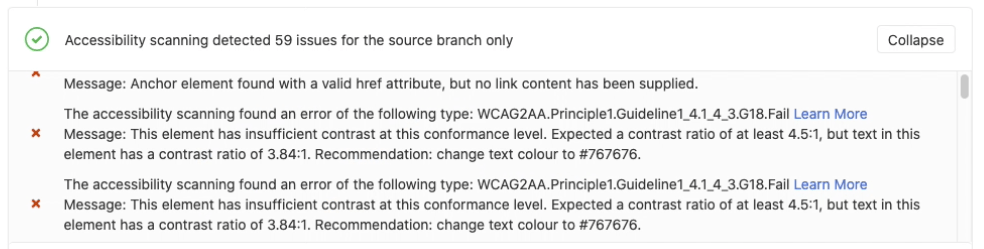



- Tier: 基础版，专业版，旗舰版
- Offering: JihuLab.com，私有化部署



如果您的应用程序提供 Web 界面，您可以使用
[极狐GitLab CI/CD](../_index.md) 来确定未决代码变更的可访问性
影响。

[Pa11y](https://pa11y.org/) 是一款免费且开源的工具，用于
衡量网站的可访问性。极狐GitLab 将 Pa11y 集成到
[CI/CD 作业模板](https://gitlab.com/gitlab-org/gitlab/-/blob/master/lib/gitlab/ci/templates/Verify/Accessibility.gitlab-ci.yml) 中。
`a11y` 作业分析一组已定义的网页，并在名为
`accessibility` 的文件中报告
可访问性违规、警告和通知。

Pa11y 使用 [WCAG 2.1 规则](https://www.w3.org/TR/WCAG21/#new-features-in-wcag-2-1)。

<a id="accessibility-merge-request-widget"></a>

## 可访问性合并请求小组件

极狐GitLab 在合并请求小组件区域显示 **可访问性报告**：



<a id="configure-accessibility-testing"></a>

## 配置可访问性测试

您可以使用
[极狐GitLab Accessibility Docker 镜像](https://gitlab.com/gitlab-org/ci-cd/accessibility) 通过 极狐GitLab CI/CD 运行 Pa11y。

要定义 `a11y` 作业：

1. 从您的 极狐GitLab 安装中
   [包含](../yaml/_index.md#includetemplate)
   [`Accessibility.gitlab-ci.yml` 模板](https://gitlab.com/gitlab-org/gitlab/-/blob/master/lib/gitlab/ci/templates/Verify/Accessibility.gitlab-ci.yml)。
1. 将以下配置添加到您的 `.gitlab-ci.yml` 文件中。

   ```yaml
   stages:
     - accessibility

   variables:
     a11y_urls: "https://about.gitlab.com https://gitlab.com/users/sign_in"

   include:
     - template: "Verify/Accessibility.gitlab-ci.yml"
   ```

1. 自定义 `a11y_urls` 变量以列出要用 Pa11y 测试的网页的 URL。

您的 CI/CD 流水线中的 `a11y` 作业会生成以下文件：

- 针对 `a11y_urls` 变量中列出的每个 URL 生成一个 HTML 报告。
- 一个包含收集的报告数据的文件。此
  文件名为 `gl-accessibility.json`。

您可以 [在浏览器中查看作业产物](../jobs/job_artifacts.md#download-job-artifacts)。

> [!note]
> 模板提供的作业定义不支持 Kubernetes。
> 您无法通过 CI 配置将配置传递给 Pa11y。
> 要更改配置，请在您的 CI 文件中编辑模板的副本。