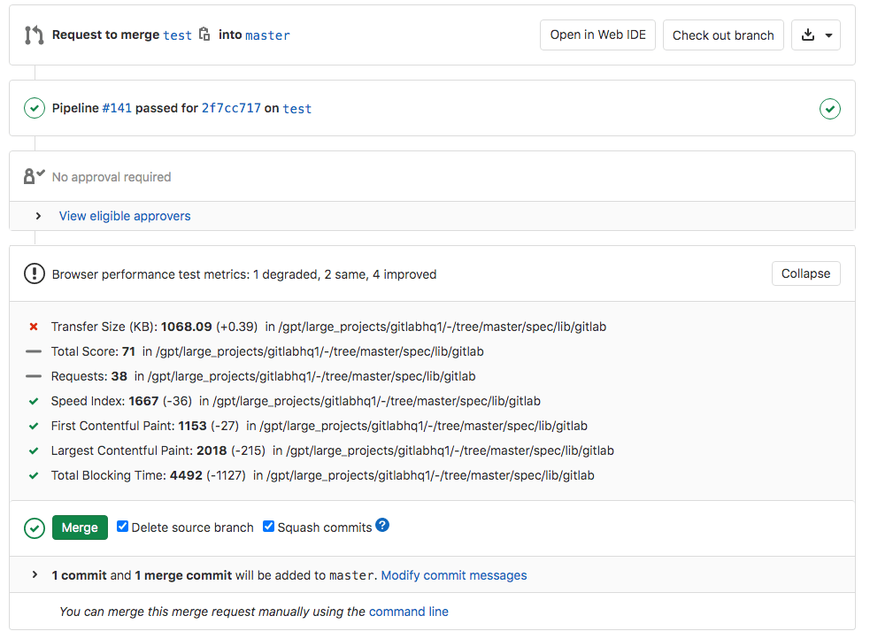



- Tier: 专业版，旗舰版
- Offering: JihuLab.com，私有化部署



使用浏览器性能测试来衡量您的 Web 应用程序的渲染性能，并在它们到达生产环境之前检测回归。极狐GitLab 使用 [sitespeed.io](https://www.sitespeed.io) 对每个页面进行评分，并将结果输出到名为 `browser-performance.json` 的文件中。

结果直接显示在合并请求中，因此您可以在审查过程中捕获性能回归。例如，在 `<head>` 中添加的 JavaScript 库导致页面速度评分下降。

> [!note]
> 您可以使用 [Auto DevOps](../../topics/autodevops/_index.md) 自动化此功能。

<a id="browser-performance-results-in-merge-requests"></a>

## 合并请求中的浏览器性能结果

在您的 `.gitlab-ci.yml` 文件中定义一个作业，生成 [浏览器性能报告产物](../yaml/artifacts_reports.md#artifactsreportsbrowser_performance)。极狐GitLab 检查此报告，比较源分支和目标分支之间每个页面的关键性能指标，并在合并请求中显示结果。



> [!note]
> 该小部件仅在目标分支上至少运行过一次作业后才会显示，并且仅当作业在合并请求的最新流水线中运行时才会显示。

<a id="configure-browser-performance-testing"></a>

## 配置浏览器性能测试



- `SITESPEED_DOCKER_OPTIONS` 变量在极狐GitLab 16.6 中引入。



先决条件：

- [使用 Docker-in-Docker 配置的极狐GitLab Runner](../docker/using_docker_build.md#use-docker-in-docker)。

要在您的代码上运行 [sitespeed.io 容器](https://hub.docker.com/r/sitespeedio/sitespeed.io/)，请使用带有 Docker-in-Docker 的极狐GitLab CI/CD：

1. 在您的 `.gitlab-ci.yml` 文件中，添加以下内容：

   ```yaml
   include:
     template: Verify/Browser-Performance.gitlab-ci.yml

   browser_performance:
     variables:
       URL: https://example.com
   ```

极狐GitLab 创建一个 `browser_performance` 作业，针对 URL 运行 sitespeed.io，并将完整的 HTML 报告保存为 [浏览器性能产物](../yaml/artifacts_reports.md#artifactsreportsbrowser_performance)。如果启用了 [极狐GitLab Pages](../../user/project/pages/_index.md)，您可以在浏览器中查看报告。

> [!note]
> 此模板不适用于 Kubernetes 集群。请改用 [`template: Jobs/Browser-Performance-Testing.gitlab-ci.yml`](https://gitlab.com/gitlab-org/gitlab/-/blob/master/lib/gitlab/ci/templates/Jobs/Browser-Performance-Testing.gitlab-ci.yml)。

您可以使用 CI/CD 变量自定义作业：

| Variable                   | Default                    | Description |
| -------------------------- | -------------------------- | ----------- |
| `SITESPEED_IMAGE`          | `sitespeedio/sitespeed.io` | 要使用的 Docker 镜像。不控制版本。 |
| `SITESPEED_VERSION`        | `14.1.0`                   | Docker 镜像的版本。 |
| `SITESPEED_OPTIONS`        | none                       | 额外的 sitespeed.io 选项。有关更多信息，请参阅 [sitespeed.io 配置](https://www.sitespeed.io/documentation/sitespeed.io/configuration/)。 |
| `SITESPEED_DOCKER_OPTIONS` | none                       | 传递给 `docker run` 的额外选项，例如 `--network` 以连接到特定的 Docker 网络。 |

例如，要覆盖运行次数并更改版本：

```yaml
include:
  template: Verify/Browser-Performance.gitlab-ci.yml

browser_performance:
  variables:
    URL: https://www.sitespeed.io/
    SITESPEED_VERSION: 13.2.0
    SITESPEED_OPTIONS: -n 5
```

<a id="configure-the-degradation-threshold"></a>

### 配置降级阈值

为避免因分数小幅下降而发出警报，请设置 `DEGRADATION_THRESHOLD` CI/CD 变量。仅当 `Total Score` 下降指定的点数或更多时，警报才会出现。

例如：

```yaml
include:
  template: Verify/Browser-Performance.gitlab-ci.yml

browser_performance:
  variables:
    URL: https://example.com
    DEGRADATION_THRESHOLD: 5
```

`Total Score` 是一个综合评分，范围在 0-100 之间，涵盖性能、可访问性和最佳实践。分数 100 表示页面没有问题需要解决。有关更多信息，请参阅 [coach 如何对页面评分](https://www.sitespeed.io/documentation/coach/how-to/#what-do-the-coach-do)。

<a id="configure-browser-performance-testing-for-review-apps"></a>

### 为审查应用配置浏览器性能测试

先决条件：

- `browser_performance` 作业必须在动态环境启动后运行。

要为审查应用配置浏览器性能测试：

1. 在 `review` 作业中，生成一个包含动态 URL 的 URL 列表文件：

   ```yaml
      script:
        - echo $CI_ENVIRONMENT_URL > environment_url.txt
   ```

1. 将文件保存为产物：

   ```yaml
      artifacts:
        paths:
          - environment_url.txt
   ```

1. 将文件作为 `URL` 变量传递给 `browser_performance` 作业。例如：

   ```yaml
   stages:
     - deploy
     - performance

   include:
     template: Verify/Browser-Performance.gitlab-ci.yml

   review:
     stage: deploy
     environment:
       name: review/$CI_COMMIT_REF_SLUG
       url: http://$CI_COMMIT_REF_SLUG.$APPS_DOMAIN
     script:
       - run_deploy_script
       - echo $CI_ENVIRONMENT_URL > environment_url.txt
     artifacts:
       paths:
         - environment_url.txt
     rules:
       - if: $CI_COMMIT_BRANCH == $CI_DEFAULT_BRANCH
         when: never
       - if: $CI_COMMIT_BRANCH

   browser_performance:
     dependencies:
       - review
     variables:
       URL: environment_url.txt
   ```