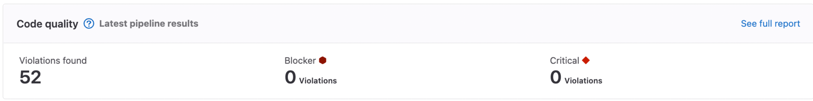



- Tier: 基础版，专业版，旗舰版
- Offering: JihuLab.com，私有化部署



代码质量可在问题成为技术债务之前识别可维护性问题。代码评审期间发生的自动化反馈可以帮助您的团队编写更好的代码。发现结果会直接显示在合并请求中，使问题在修复成本最低时变得可见。

代码质量支持多种编程语言，并与常见的 linter、样式检查器和复杂度分析器集成。您现有的工具可以接入代码质量工作流，在标准化结果展示方式的同时，保留您团队的偏好。

<a id="features-per-tier"></a>

## 各版本功能

不同 [极狐GitLab 版本](https://gitlab.cn/pricing) 提供不同的功能，如下表所示：

| 功能                                                                                     | 基础版     | 专业版  | 旗舰版 |
|:----------------------------------------------------------------------------------------|:------------|:------------|:------------|
| [从 CI/CD 作业导入代码质量结果](#import-code-quality-results-from-a-cicd-job) |  |  |  |
| [使用基于 CodeClimate 的扫描](#use-the-built-in-code-quality-cicd-template-deprecated)   |  |  |  |
| [在合并请求报告中查看发现结果](#merge-request-reports)                             |  |  |  |
| [在流水线报告中查看发现结果](#pipeline-details-view)                                 |   |  |  |
| [在合并请求变更视图中查看发现结果](#merge-request-changes-view)               |   |   |  |
| [在项目质量摘要视图中分析整体健康状况](#project-quality-view)           |   |   |  |

<a id="scan-code-for-quality-violations"></a>

## 扫描代码以发现质量问题

代码质量是一个开放系统，支持从许多扫描工具导入结果。要发现违规并呈现它们，您可以：

- 直接使用扫描工具并[导入其结果](#import-code-quality-results-from-a-cicd-job)。_（首选。）_
- [使用内置的 CI/CD 模板](#use-the-built-in-code-quality-cicd-template-deprecated) 启用扫描。该模板使用 CodeClimate 引擎，该引擎封装了常见的开源工具。_（已弃用。）_

您可以在单个流水线中捕获来自多个工具的结果。例如，您可以运行代码 linter 扫描代码，同时运行语言 linter 扫描文档，或者将独立工具与基于 CodeClimate 的扫描结合使用。代码质量会合并所有报告，以便您在[查看结果](#view-code-quality-results)时看到全部内容。

<a id="import-code-quality-results-from-a-cicd-job"></a>

### 从 CI/CD 作业导入代码质量结果

许多开发团队已经在他们的 CI/CD 流水线中使用 linter、样式检查器或其他工具来自动检测编码标准违规。您可以通过将这些工具与代码质量集成，使这些工具的发现结果更易于查看和修复。

要查看您的工具是否已有文档化的集成，请参阅[将常用工具与代码质量集成](#integrate-common-tools-with-code-quality)。

要将其他工具与代码质量集成：

1. 将工具添加到您的 CI/CD 流水线中。
1. 配置工具将报告输出为文件。
   - 该文件必须使用[特定的 JSON 格式](#code-quality-report-format)。
   - 许多工具原生支持此输出格式。它们可能将其称为“CodeClimate 报告”、“极狐GitLab 代码质量报告”或其他类似名称。
   - 其他工具有时可以使用自定义 JSON 格式或模板创建 JSON 输出。由于[报告格式](#code-quality-report-format)只有少数必填字段，因此这种输出类型可能适用于代码质量报告。
1. 声明一个与此文件匹配的 [`codequality` 报告产物](../yaml/artifacts_reports.md#artifactsreportscodequality)。

现在，在流水线运行后，质量工具的结果会被[处理和显示](#view-code-quality-results)。

<a id="use-the-built-in-code-quality-cicd-template-deprecated"></a>

### 使用内置的代码质量 CI/CD 模板（已弃用）

> [!warning]
> 此功能已在极狐GitLab 17.3 中[弃用](../../update/deprecations.md#codeclimate-based-code-quality-scanning-will-be-removed)，并计划在 19.0 中移除。
> 请改为[直接集成受支持工具的结果](#import-code-quality-results-from-a-cicd-job)。

代码质量还包含一个内置的 CI/CD 模板，`Code-Quality.gitlab-ci.yaml`。此模板基于开源 CodeClimate 扫描引擎运行扫描。

CodeClimate 引擎运行：

- 针对[一组受支持的语言](https://docs.codeclimate.com/docs/supported-languages-for-maintainability) 的基本可维护性检查。
- 一组可配置的[插件](https://docs.codeclimate.com/docs/list-of-engines)，这些插件封装了开源扫描器，用于分析您的源代码。

有关更多详细信息，请参阅[配置基于 CodeClimate 的代码质量扫描](code_quality_codeclimate_scanning.md)。

<a id="migrate-from-codeclimate-based-scanning"></a>

#### 从基于 CodeClimate 的扫描迁移

CodeClimate 引擎使用一组可定制的[分析插件](code_quality_codeclimate_scanning.md#configure-codeclimate-analysis-plugins)。有些默认开启；其他必须显式启用。以下集成可用于替换内置插件：

| 插件       | 默认开启                    | 替代方案 |
|--------------|----------------------------------|-------------|
| Duplication  |                       | [集成 PMD Copy/Paste Detector](#pmd-copypaste-detector)。 |
| ESLint       |                       | [集成 ESLint](#eslint)。 |
| gofmt        |                        | [集成 golangci-lint](#golangci-lint) 并启用 [gofmt linter](https://golangci-lint.run/usage/linters#gofmt)。 |
| golint       |                        | [集成 golangci-lint](#golangci-lint) 并启用其中一个可替代 golint 的内置 linter。golint 已[弃用并冻结](https://github.com/golang/go/issues/38968)。 |
| govet        |                        | [集成 golangci-lint](#golangci-lint)。golangci-lint [默认包含 govet](https://golangci-lint.run/usage/linters#enabled-by-default)。 |
| markdownlint | （社区支持） | [集成 markdownlint-cli2](#markdownlint-cli2)。 |
| pep8         |                        | 集成替代的 Python linter，如 [Flake8](#flake8)、[Pylint](#pylint) 或 [Ruff](#ruff)。 |
| RuboCop      |                       | [集成 RuboCop](#rubocop)。 |
| SonarPython  |                        | 集成替代的 Python linter，如 [Flake8](#flake8)、[Pylint](#pylint) 或 [Ruff](#ruff)。 |
| Stylelint    | （社区支持） | [集成 Stylelint](#stylelint)。 |
| SwiftLint    |                        | [集成 SwiftLint](#swiftlint)。 |

<a id="view-code-quality-results"></a>

## 查看代码质量结果

代码质量结果显示在：

- [合并请求报告](#merge-request-reports)
- [合并请求变更视图](#merge-request-changes-view)
- [流水线详情视图](#pipeline-details-view)
- [项目质量视图](#project-quality-view)

<a id="merge-request-reports"></a>

### 合并请求报告

代码质量分析结果显示在合并请求的 **报告** 选项卡中。具有相同指纹的多个代码质量发现结果会显示为单个条目。

有关更多信息，请参阅 [合并请求报告](../../user/project/merge_requests/reports.md)。

<a id="merge-request-changes-view"></a>

### 合并请求变更视图



- Tier: 旗舰版
- Offering: JihuLab.com，私有化部署



代码质量结果显示在合并请求的 **变更** 视图中。包含代码质量问题的行会在装订线旁用符号标记。选择该符号可查看问题列表，然后选择某个问题以查看其详细信息。


<a id="pipeline-details-view"></a>

### 流水线详情视图



- Tier: 专业版，旗舰版
- Offering: JihuLab.com，私有化部署



由流水线生成的完整代码质量违规列表显示在流水线详情页面的 **代码质量** 选项卡中。流水线详情视图显示在其运行的分支上发现的所有代码质量发现结果。


<a id="project-quality-view"></a>

### 项目质量视图



- Tier: 旗舰版
- Offering: JihuLab.com，私有化部署
- Status: 测试版



项目质量视图显示代码质量发现结果的概览。该视图位于 **分析** > **CI/CD 分析** 下，并且需要为此特定项目启用 [`project_quality_summary_page`](../../administration/feature_flags/_index.md) 功能标志。



<a id="code-quality-report-format"></a>

## 代码质量报告格式

您可以从任何能够以以下格式输出报告的工具[导入代码质量结果](#import-code-quality-results-from-a-cicd-job)。此格式是 [CodeClimate 报告格式](https://github.com/codeclimate/platform/blob/master/spec/analyzers/SPEC.md#data-types) 的一个版本，包含较少的字段。

您作为 [代码质量报告产物](../yaml/artifacts_reports.md#artifactsreportscodequality) 提供的文件必须包含一个 JSON 数组。该数组中的每个对象必须至少具有以下属性：

| 名称                                                      | 类型    | 描述 |
|-----------------------------------------------------------|---------|-------------|
| `description`                                             | 字符串  | 代码质量违规的可读描述。 |
| `check_name`                                              | 字符串  | 表示与此违规关联的检查或规则的唯一名称。 |
| `fingerprint`                                             | 字符串  | 用于标识此特定代码质量违规的唯一指纹，例如其内容的哈希值。 |
| `location.path`                                           | 字符串  | 包含代码质量违规的文件，表示为代码仓库中的相对路径。不要以 `./` 开头。 |
| `location.lines.begin` 或 `location.positions.begin.line` | 整数 | 发生代码质量违规的行。 |
| `severity`                                                | 字符串  | 违规的严重性，可以是 `info`、`minor`、`major`、`critical` 或 `blocker` 之一。 |

此格式与 [CodeClimate 报告格式](https://github.com/codeclimate/platform/blob/master/spec/analyzers/SPEC.md#data-types) 的不同之处在于：

- 尽管 [CodeClimate 报告格式](https://github.com/codeclimate/platform/blob/master/spec/analyzers/SPEC.md#data-types) 支持更多属性，但代码质量仅处理前面列出的字段。
- 极狐GitLab 解析器不允许文件开头有[字节顺序标记](https://en.wikipedia.org/wiki/Byte_order_mark)。某些工具默认会向其输出添加 UTF-8 字节顺序标记，尤其是源自 Windows 或 .NET 环境的工具。要检查并移除 UTF-8 字节顺序标记，请运行：

  ```shell
  [ "$(head -c3 report.json | od -An -tx1 | tr -d ' \n')" = "efbbbf" ] && {
    sed -i.bak '1s/^\xEF\xBB\xBF//' report.json &&
      echo "BOM removed" ||
      echo "BOM detected but removal failed"
  } || echo "No BOM found, nothing changed"
  ```

例如，这是一个合规的报告：

```json
[
  {
    "description": "'unused' is assigned a value but never used.",
    "check_name": "no-unused-vars",
    "fingerprint": "7815696ecbf1c96e6894b779456d330e",
    "severity": "minor",
    "location": {
      "path": "lib/index.js",
      "lines": {
        "begin": 42
      }
    }
  }
]
```

<a id="integrate-common-tools-with-code-quality"></a>

## 将常用工具与代码质量集成

许多工具原生支持所需的[报告格式](#code-quality-report-format)，以将其结果与代码质量集成。它们可能将其称为“CodeClimate 报告”、“极狐GitLab 代码质量报告”或其他类似名称。

其他工具可以通过提供自定义模板或格式规范来配置为创建 JSON 输出。由于[报告格式](#code-quality-report-format)只有少数必填字段，因此这种输出类型可能适用于代码质量报告。

如果您已经在 CI/CD 流水线中使用某个工具，则应调整现有作业以添加代码质量报告。调整现有作业可以避免运行一个单独的作业，这可能会让开发者感到困惑，并使您的流水线运行时间更长。

如果您尚未使用某个工具，您可以从头编写一个 CI/CD 作业，或者通过使用 [CI/CD 目录](../components/_index.md#cicd-catalog) 中的组件来采用该工具。

<a id="code-scanning-tools"></a>

### 代码扫描工具

<a id="eslint"></a>

#### ESLint

如果您已经在 CI/CD 流水线中有一个 [ESLint](https://eslint.org/) 作业，则应添加一个报告以将其输出发送到代码质量。要集成其输出：

1. 在您的项目中添加 [`eslint-formatter-gitlab`](https://www.npmjs.com/package/eslint-formatter-gitlab) 作为开发依赖项。
1. 在您用于运行 ESLint 的命令中添加 `--format gitlab` 选项。
1. 声明一个指向报告文件位置的 [`codequality` 报告产物](../yaml/artifacts_reports.md#artifactsreportscodequality)。
   - 默认情况下，格式化程序会读取您的 CI/CD 配置并推断应保存报告的文件名。如果格式化程序无法推断您在产物声明中使用的文件名，请将 CI/CD 变量 `ESLINT_CODE_QUALITY_REPORT` 设置为为您的产物指定的文件名，例如 `gl-code-quality-report.json`。

您还可以使用或调整 [ESLint CI/CD 组件](https://gitlab.com/explore/catalog/components/code-quality-oss/codequality-os-scanners-integration) 来运行扫描并将其输出与代码质量集成。

<a id="stylelint"></a>

#### Stylelint

如果您已经在 CI/CD 流水线中有一个 [Stylelint](https://stylelint.io/) 作业，则应添加一个报告以将其输出发送到代码质量。要集成其输出：

1. 在您的项目中添加 [`@studiometa/stylelint-formatter-gitlab`](https://www.npmjs.com/package/@studiometa/stylelint-formatter-gitlab) 作为开发依赖项。
1. 在您用于运行 Stylelint 的命令中添加 `--custom-formatter=@studiometa/stylelint-formatter-gitlab` 选项。
1. 声明一个指向报告文件位置的 [`codequality` 报告产物](../yaml/artifacts_reports.md#artifactsreportscodequality)。
   - 默认情况下，格式化程序会读取您的 CI/CD 配置并推断应保存报告的文件名。如果格式化程序无法推断您在产物声明中使用的文件名，请将 CI/CD 变量 `STYLELINT_CODE_QUALITY_REPORT` 设置为为您的产物指定的文件名，例如 `gl-code-quality-report.json`。

有关更多详细信息和示例 CI/CD 作业定义，请参阅 [`@studiometa/stylelint-formatter-gitlab` 的文档](https://www.npmjs.com/package/@studiometa/stylelint-formatter-gitlab#usage)。

<a id="mypy"></a>

#### MyPy

如果您已经在 CI/CD 流水线中有一个 [MyPy](https://mypy-lang.org/) 作业，则应添加一个报告以将其输出发送到代码质量。要集成其输出：

1. 在您的项目中安装 [`mypy-gitlab-code-quality`](https://pypi.org/project/mypy-gitlab-code-quality/) 作为依赖项。
1. 更改您的 `mypy` 命令以将其输出发送到文件。
1. 在您的作业 `script` 中添加一个步骤，使用 `mypy-gitlab-code-quality` 将文件重新处理为所需格式。例如：

   ```yaml
   - mypy $(find -type f -name "*.py" ! -path "**/.venv/**") --no-error-summary > mypy-out.txt || true  # "|| true" is used for preventing job failure when mypy find errors
   - mypy-gitlab-code-quality < mypy-out.txt > gl-code-quality-report.json
   ```

1. 声明一个指向报告文件位置的 [`codequality` 报告产物](../yaml/artifacts_reports.md#artifactsreportscodequality)。

您还可以使用或调整 [MyPy CI/CD 组件](https://gitlab.com/explore/catalog/components/code-quality-oss/codequality-os-scanners-integration) 来运行扫描并将其输出与代码质量集成。

<a id="flake8"></a>

#### Flake8

如果您已经在 CI/CD 流水线中有一个 [Flake8](https://flake8.pycqa.org/en/latest/) 作业，则应添加一个报告以将其输出发送到代码质量。要集成其输出：

1. 在您的项目中安装 [`flake8-gl-codeclimate`](https://github.com/awelzel/flake8-gl-codeclimate) 作为依赖项。
1. 在您用于运行 Flake8 的命令中添加参数 `--format gl-codeclimate --output-file gl-code-quality-report.json`。
1. 声明一个指向报告文件位置的 [`codequality` 报告产物](../yaml/artifacts_reports.md#artifactsreportscodequality)。

您还可以使用或调整 [Flake8 CI/CD 组件](https://gitlab.com/explore/catalog/components/code-quality-oss/codequality-os-scanners-integration) 来运行扫描并将其输出与代码质量集成。

<a id="pylint"></a>

#### Pylint

如果您已经在 CI/CD 流水线中有一个 [Pylint](https://pypi.org/project/pylint/) 作业，则应添加一个报告以将其输出发送到代码质量。要集成其输出：

1. 在您的项目中安装 [`pylint-gitlab`](https://pypi.org/project/pylint-gitlab/) 作为依赖项。
1. 在您用于运行 Pylint 的命令中添加参数 `--output-format=pylint_gitlab.GitlabCodeClimateReporter`。
1. 更改您的 `pylint` 命令以将其输出发送到文件。
1. 声明一个指向报告文件位置的 [`codequality` 报告产物](../yaml/artifacts_reports.md#artifactsreportscodequality)。

您还可以使用或调整 [Pylint CI/CD 组件](https://gitlab.com/explore/catalog/components/code-quality-oss/codequality-os-scanners-integration) 来运行扫描并将其输出与代码质量集成。

<a id="ruff"></a>

#### Ruff

如果您已经在 CI/CD 流水线中有一个 [Ruff](https://docs.astral.sh/ruff/) 作业，则应添加一个报告以将其输出发送到代码质量。要集成其输出：

1. 在您用于运行 Ruff 的命令中添加参数 `--output-format=gitlab`。
1. 更改您的 `ruff check` 命令以将其输出发送到文件。
1. 声明一个指向报告文件位置的 [`codequality` 报告产物](../yaml/artifacts_reports.md#artifactsreportscodequality)。

您还可以使用或调整[文档化的 Ruff 极狐GitLab CI/CD 集成](https://docs.astral.sh/ruff/integrations/#gitlab-cicd) 来运行扫描并将其输出与代码质量集成。

<a id="golangci-lint"></a>

#### golangci-lint

如果您已经在 CI/CD 流水线中有一个 [`golangci-lint`](https://golangci-lint.run/) 作业，则应添加一个报告以将其输出发送到代码质量。要集成其输出：

1. 在您用于运行 `golangci-lint` 的命令中添加参数。

   - 对于 v1，添加 `--out-format code-climate:gl-code-quality-report.json,line-number`。
   - 对于 v2，添加 `--output.code-climate.path=gl-code-quality-report.json`。

1. 声明一个指向报告文件位置的 [`codequality` 报告产物](../yaml/artifacts_reports.md#artifactsreportscodequality)。

您还可以使用或调整 [golangci-lint CI/CD 组件](https://gitlab.com/explore/catalog/components/code-quality-oss/codequality-os-scanners-integration) 来运行扫描并将其输出与代码质量集成。

<a id="pmd-copypaste-detector"></a>

#### PMD Copy/Paste Detector

[PMD Copy/Paste Detector (CPD)](https://pmd.github.io/pmd/pmd_userdocs_cpd.html) 需要额外配置，因为其默认输出不符合所需格式。

您可以使用或调整 [PMD CI/CD 组件](https://gitlab.com/explore/catalog/components/code-quality-oss/codequality-os-scanners-integration) 来运行扫描并将其输出与代码质量集成。

<a id="swiftlint"></a>

#### SwiftLint

使用 [SwiftLint](https://realm.github.io/SwiftLint/) 需要额外配置，因为其默认输出不符合所需格式。

您可以使用或调整 [SwiftLint CI/CD 组件](https://gitlab.com/explore/catalog/components/code-quality-oss/codequality-os-scanners-integration) 来运行扫描并将其输出与代码质量集成。

<a id="rubocop"></a>

#### RuboCop

使用 [RuboCop](https://rubocop.org/) 需要额外配置，因为其默认输出不符合所需格式。

您可以使用或调整 [RuboCop CI/CD 组件](https://gitlab.com/explore/catalog/components/code-quality-oss/codequality-os-scanners-integration) 来运行扫描并将其输出与代码质量集成。

<a id="roslynator"></a>

#### Roslynator

使用 [Roslynator](https://josefpihrt.github.io/docs/roslynator/) 需要额外配置，因为其默认输出不符合所需格式。

您可以使用或调整 [Roslynator CI/CD 组件](https://gitlab.com/explore/catalog/components/code-quality-oss/codequality-os-scanners-integration) 来运行扫描并将其输出与代码质量集成。

<a id="documentation-scanning-tools"></a>

### 文档扫描工具

您可以使用代码质量扫描代码仓库中存储的任何文件，即使它不是代码。

<a id="vale"></a>

#### Vale

如果您已经在 CI/CD 流水线中有一个 [Vale](https://vale.sh/) 作业，则应添加一个报告以将其输出发送到代码质量。要集成其输出：

1. 在您的代码仓库中创建一个定义所需格式的 Vale 模板文件。
   - 您可以复制用于检查 GitLab 文档的开源[模板](https://gitlab.com/gitlab-org/gitlab/-/blob/master/doc/.vale/vale-json.tmpl)。
   - 您也可以使用其他开源变体，例如社区 [`gitlab-ci-utils` Vale 项目](https://gitlab.com/gitlab-ci-utils/container-images/vale/-/blob/main/vale/vale-glcq.tmpl) 中使用的变体。此社区项目还提供了[一个预制的容器镜像](https://gitlab.com/gitlab-ci-utils/container-images/vale)，其中包含相同的模板，因此您可以直接在您的流水线中使用它。
1. 在您用于运行 Vale 的命令中添加参数 `--output="$VALE_TEMPLATE_PATH" --no-exit`。
1. 更改您的 `vale` 命令以将其输出发送到文件。
1. 声明一个指向报告文件位置的 [`codequality` 报告产物](../yaml/artifacts_reports.md#artifactsreportscodequality)。

您还可以使用或调整开源作业定义来运行扫描并将其输出与代码质量集成，例如：

- 用于检查 GitLab 文档的 [Vale linting 步骤](https://gitlab.com/gitlab-org/gitlab/-/blob/94f870b8e4b965a41dd2ad576d50f7eeb271f117/.gitlab/ci/docs.gitlab-ci.yml#L71-87)。
- 社区 [`gitlab-ci-utils` Vale 项目](https://gitlab.com/gitlab-ci-utils/container-images/vale#usage)。

<a id="markdownlint-cli2"></a>

#### markdownlint-cli2

如果您已经在 CI/CD 流水线中有一个 [markdownlint-cli2](https://github.com/DavidAnson/markdownlint-cli2) 作业，则应添加一个报告以将其输出发送到代码质量。要集成其输出：

1. 在您的项目中添加 [`markdownlint-cli2-formatter-codequality`](https://www.npmjs.com/package/markdownlint-cli2-formatter-codequality) 作为开发依赖项。
1. 如果您还没有，请在您的代码仓库顶层创建一个 `.markdownlint-cli2.jsonc` 文件。
1. 向 `.markdownlint-cli2.jsonc` 添加一个 `outputFormatters` 指令：

   ```json
   {
     "outputFormatters": [
       [ "markdownlint-cli2-formatter-codequality" ]
     ]
   }
   ```

1. 声明一个指向报告文件位置的 [`codequality` 报告产物](../yaml/artifacts_reports.md#artifactsreportscodequality)。默认情况下，报告文件名为 `markdownlint-cli2-codequality.json`。
   1. 建议。将报告的文件名添加到代码仓库的 `.gitignore` 文件中。

有关更多详细信息和示例 CI/CD 作业定义，请参阅 [`markdownlint-cli2-formatter-codequality` 的文档](https://www.npmjs.com/package/markdownlint-cli2-formatter-codequality)。
