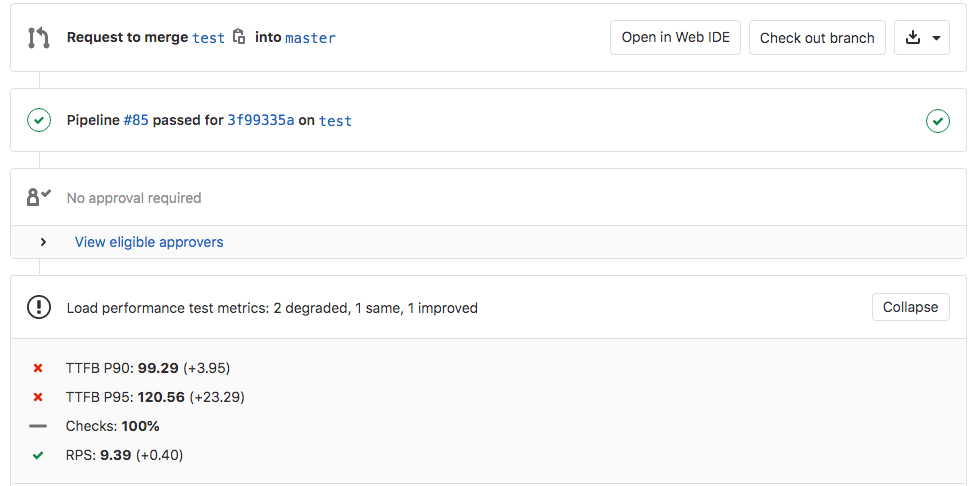



- Tier: 专业版，旗舰版
- Offering: JihuLab.com，私有化部署



使用负载性能测试来衡量代码变更对应用程序后端性能的影响。极狐GitLab 使用 [k6](https://k6.io/) 来模拟对应用程序端点（如 API 和 Web 控制器）的负载，并将结果输出到名为 `load-performance.json` 的文件中。

与测量网页在浏览器中渲染性能的[浏览器性能测试](browser_performance_testing.md)不同，负载性能测试侧重于服务器端，可以评估负载下的响应时间和吞吐量。

结果会直接显示在合并请求中，因此你可以在审查过程中及时发现性能衰退。

<a id="load-performance-results-in-merge-requests"></a>

## 合并请求中的负载性能测试结果

在 `.gitlab-ci.yml` 文件中定义一个会生成[负载性能报告产物](../yaml/artifacts_reports.md#artifactsreportsload_performance)的作业。极狐GitLab 会检查此报告，比较源分支和目标分支之间的关键负载性能指标，并在合并请求中显示结果。



合并请求微件中显示的关键指标有：

- **Checks**：k6 测试中配置的[检查](https://k6.io/docs/using-k6/checks)的百分比通过率。
- **TTFB P90**：开始接收响应所需时间的第 90 个百分位数，也称为[首字节时间](https://en.wikipedia.org/wiki/Time_to_first_byte) (TTFB)。
- **TTFB P95**：TTFB 的第 95 个百分位数。
- **RPS**：测试能够达到的平均每秒请求数 (RPS)。

> [!note]
> 该微件直到作业在目标分支上至少运行一次后才会显示。

<a id="configure-load-performance-testing"></a>

## 配置负载性能测试

使用极狐GitLab 附带提供的
[`Verify/Load-Performance-Testing.gitlab-ci.yml`](https://jihulab.com/gitlab-cn/gitlab/-/blob/master/lib/gitlab/ci/templates/Verify/Load-Performance-Testing.gitlab-ci.yml)
模板来针对你的应用程序运行 [k6 负载测试](https://k6.io/docs/testing-guides)。

前提条件：

- 配置了可以运行 Docker 容器的 GitLab Runner，例如
  [Docker-in-Docker 工作流](../docker/using_docker_build.md#use-docker-in-docker)。
- 为负载测试配置的预生产测试环境。有关更多信息，请参阅
  [计算用于负载测试的并发用户数](https://k6.io/blog/monthly-visits-concurrent-users)。
- 项目代码仓中有一个 k6 测试文件。相关指导请参阅
  [编写你的第一个 k6 测试](https://grafana.com/docs/k6/latest/get-started/write-your-first-test/)。

要配置负载性能测试，请将以下内容添加到你的 `.gitlab-ci.yml` 文件中：

```yaml
include:
  template: Verify/Load-Performance-Testing.gitlab-ci.yml

load_performance:
  variables:
    K6_TEST_FILE: <项目中的 K6 测试文件路径>
```

极狐GitLab 会创建一个 `load_performance` 作业，该作业运行 k6 测试并将结果保存为[负载性能报告产物](../yaml/artifacts_reports.md#artifactsreportsload_performance)。始终使用最新的可用产物。如果启用了 [GitLab Pages](../../user/project/pages/_index.md)，你可以直接在浏览器中查看报告。

你可以使用 CI/CD 变量自定义作业：

| 变量                  | 默认值        | 描述 |
| --------------------- | ------------ | ----------- |
| `K6_IMAGE`            | `grafana/k6` | 要使用的 Docker 镜像。不控制版本。 |
| `K6_VERSION`          | `0.54.0`     | Docker 镜像的版本。 |
| `K6_TEST_FILE`        | 无           | 项目代码仓中 k6 测试文件的路径。 |
| `K6_OPTIONS`          | 无           | 额外的 k6 选项。有关更多信息，请参阅 [k6 选项参考](https://k6.io/docs/using-k6/k6-options/reference/)。 |
| `K6_DOCKER_OPTIONS`   | 无           | 传递给 `docker run` 的额外选项，例如 `--env-file` 用于向 k6 容器传递环境变量。 |

例如，要覆盖测试的持续时间：

```yaml
include:
  template: Verify/Load-Performance-Testing.gitlab-ci.yml

load_performance:
  variables:
    K6_TEST_FILE: <项目中的 K6 测试文件路径>
    K6_OPTIONS: '--duration 30s'
```

> [!note]
> 此模板不适用于 Kubernetes 集群。请改用
> [`Jobs/Load-Performance-Testing.gitlab-ci.yml`](https://jihulab.com/gitlab-cn/gitlab/-/blob/master/lib/gitlab/ci/templates/Jobs/Load-Performance-Testing.gitlab-ci.yml)。

对于大规模 k6 测试，请确保 GitLab Runner 实例能够处理该负载。对于大多数大规模 k6 测试而言，[默认的共享 JihuLab.com runners](../runners/hosted_runners/linux.md) 的规格可能不够。有关详细信息，请参阅
[k6 关于运行大规模测试的指南](https://k6.io/docs/testing-guides/running-large-tests#hardware-considerations)。

<a id="configure-load-performance-testing-for-review-apps"></a>

### 为审核应用配置负载性能测试

前提条件：

- `load_performance` 作业必须在动态环境启动之后运行。

要为审核应用配置负载性能测试，请将动态 URL 捕获到一个
[`.env` 文件](https://docs.docker.com/compose/environment-variables/env-file/)中，并使用 `K6_DOCKER_OPTIONS` 将其传递给 k6 容器。然后，k6 就可以在测试脚本中使用标准的 JavaScript 来使用该文件中的环境变量，例如：
``http.get(`${__ENV.ENVIRONMENT_URL}`)``。

例如：

```yaml
stages:
  - deploy
  - performance

include:
  template: Verify/Load-Performance-Testing.gitlab-ci.yml

review:
  stage: deploy
  environment:
    name: review/$CI_COMMIT_REF_SLUG
    url: http://$CI_ENVIRONMENT_SLUG.example.com
  script:
    - run_deploy_script
    - echo "ENVIRONMENT_URL=$CI_ENVIRONMENT_URL" >> review.env
  artifacts:
    paths:
      - review.env
  rules:
    - if: $CI_COMMIT_BRANCH

load_performance:
  dependencies:
    - review
  variables:
    K6_DOCKER_OPTIONS: '--env-file review.env'
  rules:
    - if: $CI_COMMIT_BRANCH
```