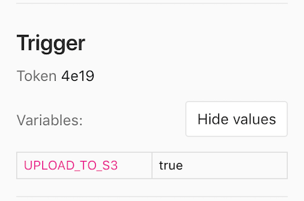



- Tier: 基础版，专业版，旗舰版
- Offering: JihuLab.com，私有化部署



您可以使用 API 调用 [流水线触发器 API 端点](../../api/pipeline_triggers.md) 来为特定分支或标签触发流水线。

您也可以使用 `trigger` 关键字从 CI/CD 作业 [触发下游流水线](../pipelines/downstream_pipelines.md)。

如果您正在 [迁移到极狐GitLab CI/CD](../migration/plan_a_migration.md)，您可以通过从其他提供商的作业调用 API 端点来触发极狐GitLab CI/CD 流水线。例如，作为从 [Jenkins](../migration/jenkins.md) 或 [CircleCI](../migration/circleci.md) 迁移的一部分。

使用 API 进行身份验证时，您可以使用：

- 使用 [流水线触发令牌](#create-a-pipeline-trigger-token) 通过 [流水线触发器 API 端点](../../api/pipeline_triggers.md) 触发分支或标签流水线。
- 使用 [CI/CD 作业令牌](../jobs/ci_job_token.md) [触发多项目流水线](../pipelines/downstream_pipelines.md#trigger-a-multi-project-pipeline-by-using-the-api)。
- 使用另一个 [具有 API 访问权限的令牌](../../security/tokens/_index.md) 通过 [项目流水线 API 端点](../../api/pipelines.md#create-a-new-pipeline) 创建新流水线。

<a id="create-a-pipeline-trigger-token"></a>

## 创建流水线触发令牌

您可以通过生成流水线触发令牌并使用它来对 API 调用进行身份验证，从而为分支或标签触发流水线。该令牌模拟用户的项目访问权限和权限。

先决条件：

- 您必须具有项目的维护者或所有者角色。

创建触发令牌：

1. 在顶部栏中，选择 **搜索或跳转到** 并找到您的项目。
2. 在左侧边栏中，选择 **设置** > **CI/CD**。
3. 展开 **流水线触发令牌**。
4. 选择 **添加新令牌**
5. 输入描述并选择 **创建流水线触发令牌**。
   - 您可以查看并复制您创建的所有触发器的完整令牌。
   - 您只能看到其他项目成员创建的令牌的前 4 个字符。

> [!warning]
> 在公共项目中将令牌以明文形式保存，或以恶意用户可访问的方式存储，存在安全风险。泄露的触发令牌可能被用于强制非计划部署、尝试访问 CI/CD 变量或其他恶意用途。[掩码 CI/CD 变量](../variables/_index.md#mask-a-cicd-variable) 有助于提高触发令牌的安全性。有关保持令牌安全的更多信息，请参阅 [安全注意事项](../../security/tokens/_index.md#security-considerations)。

<a id="trigger-a-pipeline"></a>

## 触发流水线

在 [创建流水线触发令牌](#create-a-pipeline-trigger-token) 之后，您可以使用它通过能够访问 API 的工具或 webhook 来触发流水线。

<a id="use-curl"></a>

### 使用 cURL

您可以使用 cURL 通过 [流水线触发器 API 端点](../../api/pipeline_triggers.md) 触发流水线。例如：

- 使用多行 cURL 命令：

  ```shell
  curl --request POST \
       --form token=<token> \
       --form ref=<ref_name> \
       "https://gitlab.example.com/api/v4/projects/<project_id>/trigger/pipeline"
  ```

- 使用 cURL 并在查询字符串中传递 `<token>` 和 `<ref_name>`：

  ```shell
  curl --request POST \
       "https://gitlab.example.com/api/v4/projects/<project_id>/trigger/pipeline?token=<token>&ref=<ref_name>"
  ```

在每个示例中，替换：

- 将 URL 替换为 `https://jihulab.com` 或您的实例的 URL。
- 将 `<token>` 替换为您的触发令牌。
- 将 `<ref_name>` 替换为分支或标签名称，例如 `main`。
- 将 `<project_id>` 替换为您的项目 ID，例如 `123456`。项目 ID 显示在 [项目概览页面](../../user/project/working_with_projects.md#find-the-project-id) 上。

<a id="use-a-cicd-job"></a>

### 使用 CI/CD 作业

您可以使用带有流水线触发令牌的 CI/CD 作业在另一个流水线运行时触发流水线。

例如，要在 `project-A` 中创建标签时触发 `project-B` 的 `main` 分支上的流水线，请将以下作业添加到项目 A 的 `.gitlab-ci.yml` 文件中：

```yaml
trigger_pipeline:
  stage: deploy
  script:
    - 'curl --fail --request POST --form token=$MY_TRIGGER_TOKEN --form ref=main "${CI_API_V4_URL}/projects/123456/trigger/pipeline"'
  rules:
    - if: $CI_COMMIT_TAG
  environment: production
```

在此示例中：

- `1234` 是 `project-B` 的项目 ID。项目 ID 显示在 [项目概览页面](../../user/project/working_with_projects.md#find-the-project-id) 上。
- [`rules`](../yaml/_index.md#rules) 导致每次向 `project-A` 添加标签时运行该作业。
- `MY_TRIGGER_TOKEN` 是一个包含触发令牌的 [掩码 CI/CD 变量](../variables/_index.md#mask-a-cicd-variable)。

<a id="use-a-webhook"></a>

### 使用 webhook

要从另一个项目的 webhook 触发流水线，请使用类似以下用于推送和标签事件的 webhook URL：

```plaintext
https://gitlab.example.com/api/v4/projects/<project_id>/ref/<ref_name>/trigger/pipeline?token=<token>
```

替换：

- 将 URL 替换为 `https://jihulab.com` 或您的实例的 URL。
- 将 `<project_id>` 替换为您的项目 ID，例如 `123456`。项目 ID 显示在 [项目概览页面](../../user/project/working_with_projects.md#find-the-project-id) 上。
- 将 `<ref_name>` 替换为分支或标签名称，例如 `main`。此值优先于 webhook 负载中的 `ref_name`。负载中的 `ref` 是在源仓库中触发触发器的分支。如果 `ref_name` 包含斜杠，您必须对其进行 URL 编码。
- 将 `<token>` 替换为您的流水线触发令牌。

<a id="access-webhook-payload"></a>

#### 访问 webhook 负载

如果您使用 webhook 触发流水线，则可以使用 `TRIGGER_PAYLOAD` [预定义 CI/CD 变量](../variables/predefined_variables.md) 访问 webhook 负载。负载作为 [文件类型变量](../variables/_index.md#use-file-type-cicd-variables) 公开，因此您可以使用 `cat $TRIGGER_PAYLOAD` 或类似命令访问数据。

<a id="pass-cicd-variables-in-the-api-call"></a>

### 在 API 调用中传递 CI/CD 变量

您可以在触发器 API 调用中传递任意数量的 [CI/CD 变量](../variables/_index.md)，尽管 [使用输入来控制流水线行为](#pass-pipeline-inputs-in-the-api-call) 相比 CI/CD 变量提供了更高的安全性和灵活性。

这些变量具有 [最高优先级](../variables/_index.md#cicd-variable-precedence)，并覆盖所有同名变量。

参数格式为 `variables[key]=value`，例如：

```shell
curl --request POST \
     --form token=TOKEN \
     --form ref=main \
     --form "variables[UPLOAD_TO_S3]=true" \
     "https://gitlab.example.com/api/v4/projects/123456/trigger/pipeline"
```

触发流水线中的 CI/CD 变量显示在每个作业的页面上，但只有具有所有者和维护者角色的用户才能查看这些值。



使用输入来控制流水线行为相比 CI/CD 变量提供了更高的安全性和灵活性。

<a id="pass-pipeline-inputs-in-the-api-call"></a>

### 在 API 调用中传递流水线输入

您可以在触发器 API 调用中传递流水线输入。[输入](../inputs/_index.md) 提供了一种结构化的方式，通过内置验证和文档来参数化您的流水线。

参数格式为 `inputs[name]=value`，例如：

```shell
curl --request POST \
     --form token=TOKEN \
     --form ref=main \
     --form "inputs[environment]=production" \
     "https://gitlab.example.com/api/v4/projects/123456/trigger/pipeline"
```

输入值根据流水线的 `spec:inputs` 部分中定义的类型和约束进行验证：

```yaml
spec:
  inputs:
    environment:
      type: string
      description: "Deployment environment"
      options: [dev, staging, production]
      default: dev
```

<a id="revoke-a-pipeline-trigger-token"></a>

## 撤销流水线触发令牌

撤销流水线触发令牌：

1. 在顶部栏中，选择 **搜索或跳转到** 并找到您的项目。
2. 在左侧边栏中，选择 **设置** > **CI/CD**。
3. 展开 **流水线触发器**。
4. 在要撤销的触发令牌左侧，选择 **撤销** ()。

已撤销的触发令牌无法重新添加。

<a id="configure-cicd-jobs-to-run-in-triggered-pipelines"></a>

## 配置 CI/CD 作业在触发的流水线中运行

要 [配置何时在触发的流水线中运行作业](../jobs/job_control.md)，您可以：

- 使用带有 `$CI_PIPELINE_SOURCE` [预定义 CI/CD 变量](../variables/predefined_variables.md) 的 [`rules`](../yaml/_index.md#rules)。
- 使用 [`only`/`except`](../yaml/deprecated_keywords.md#onlyrefs--exceptrefs) 关键字，但 `rules` 是首选关键字。

| `$CI_PIPELINE_SOURCE` 值 | `only`/`except` 关键字 | 触发方法 |
|---------------------------|------------------------|----------|
| `trigger`                 | `triggers`             | 在使用 [触发令牌](#create-a-pipeline-trigger-token) 通过 [流水线触发器 API](../../api/pipeline_triggers.md) 触发的流水线中。 |
| `pipeline`                | `pipelines`            | 在使用 [`$CI_JOB_TOKEN`](../jobs/ci_job_token.md) 或 CI/CD 配置文件中的 [`trigger`](../yaml/_index.md#trigger) 关键字通过 [流水线触发器 API](../../api/pipeline_triggers.md) 触发的 [多项目流水线](../pipelines/downstream_pipelines.md#trigger-a-multi-project-pipeline-by-using-the-api) 中。 |

此外，在使用流水线触发令牌触发的流水线中，预定义 CI/CD 变量 `$CI_PIPELINE_TRIGGERED` 设置为 `true`。

<a id="see-which-pipeline-trigger-token-was-used"></a>

## 查看使用了哪个流水线触发令牌

您可以通过访问单个作业页面来查看哪个流水线触发令牌导致作业运行。触发令牌的一部分显示在右侧边栏的 **作业详情** 下。

在使用触发令牌触发的流水线中，作业在 **构建** > **作业** 中标记为 `triggered`。

<a id="troubleshooting"></a>

## 故障排除

<a id="403-forbidden-when-you-trigger-a-pipeline-with-a-webhook"></a>

### 使用 webhook 触发流水线时出现 403 Forbidden

当您使用 webhook 触发流水线时，API 可能会返回 `{"message":"403 Forbidden"}` 响应。为避免触发循环，请勿使用 [流水线事件](../../user/project/integrations/webhook_events.md#pipeline-events) 来触发流水线。

<a id="404-not-found-when-triggering-a-pipeline"></a>

### 触发流水线时出现 404 Not Found

触发流水线时出现 `{"message":"404 Not Found"}` 响应可能是由于使用了 [个人访问令牌](../../user/profile/personal_access_tokens.md) 而不是流水线触发令牌。请 [创建新的触发令牌](#create-a-pipeline-trigger-token) 并使用它来代替个人访问令牌。

触发流水线时出现 `{"message":"404 Not Found"}` 响应也可能是由于使用了 `GET` 请求。只能使用 `POST` 请求触发流水线。

<a id="the-requested-url-returned-error-400-when-triggering-a-pipeline"></a>

### 触发流水线时请求的 URL 返回错误：400

如果您尝试使用一个不存在的分支名称作为 `ref` 来触发流水线，极狐GitLab 会返回 `The requested URL returned error: 400`。

例如，您可能不小心在一个默认分支使用不同分支名称的项目中使用了 `main` 作为分支名称。

此错误的另一个可能原因是当 `CI_PIPELINE_SOURCE` 值为 `trigger` 时，存在阻止创建流水线的规则，例如：

```yaml
rules:
  - if: $CI_PIPELINE_SOURCE == "trigger"
    when: never
```

请检查您的 [`workflow:rules`](../yaml/_index.md#workflowrules)，以确保当 `CI_PIPELINE_SOURCE` 值为 `trigger` 时可以创建流水线。