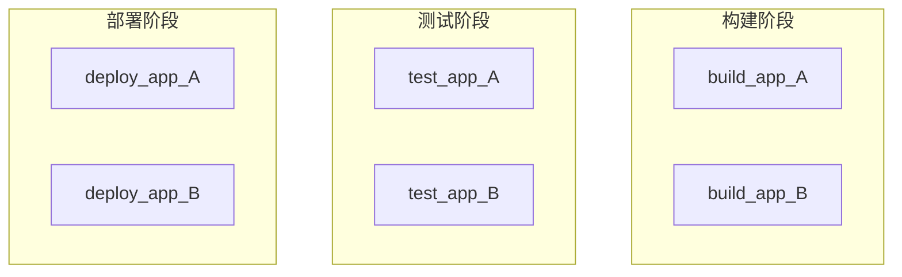
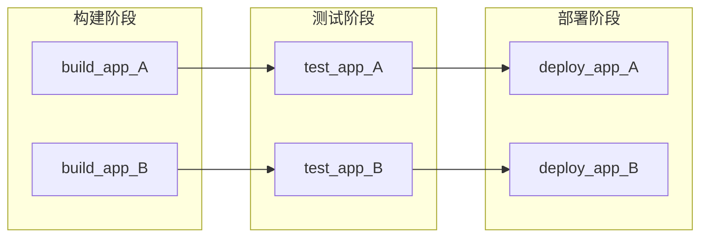
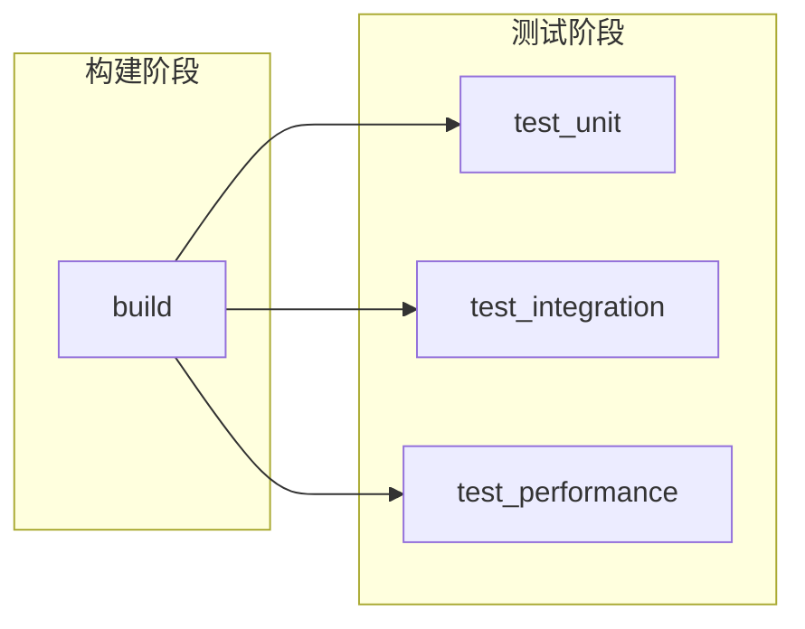
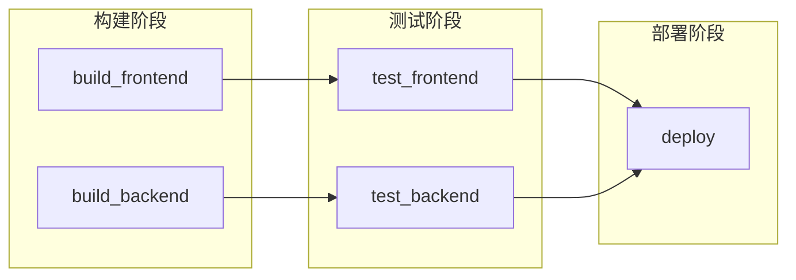
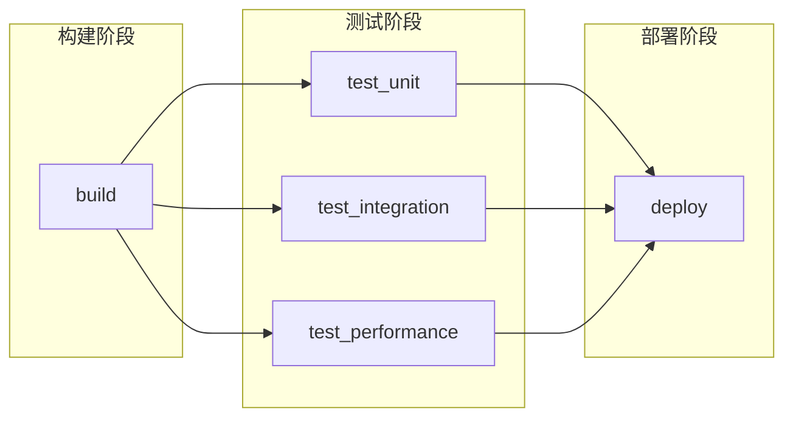
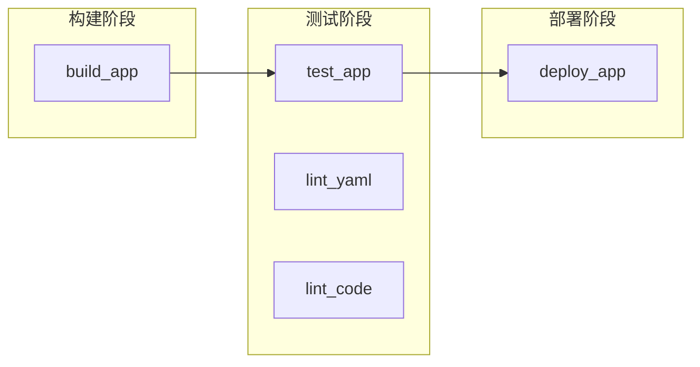
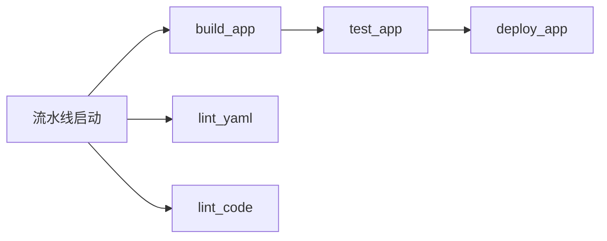



- Tier: 基础版，专业版，旗舰版
- Offering: JihuLab.com，私有化部署



使用 [`needs`](_index.md#needs) 关键字在流水线中指定作业依赖关系。
作业在其依赖项完成后立即启动，无需等待流水线阶段完成。
这让你能够更早运行作业，避免不必要的等待。

使用场景：

- 单仓库：在并行执行路径中构建和测试独立服务。
- 多平台构建：为不同平台编译，无需等待所有构建完成。
- 更快反馈：更早获取测试结果和错误信息。

> [!note]
> `needs: project` 和 `needs: pipeline` 关键字不用于指定作业依赖关系。
> 使用 [`needs: project`](_index.md#needsproject) 从其他流水线获取产物。
> 使用 [`needs: pipeline`](_index.md#needspipeline) 从上游流水线镜像流水线状态。

<a id="how-needs-works"></a>

## `needs` 的工作原理

默认情况下，作业按阶段运行。一个阶段中的所有作业必须成功完成，后续阶段的作业才能启动。例如，使用默认的 `build`、`test` 和 `deploy` 阶段时，`build` 中的所有作业必须运行并完成，`test` 中的任何作业才能启动。

使用 `needs`，你可以列出某个作业所依赖的特定作业。该作业在这些依赖项完成后立即启动，即使早期阶段的其他作业仍在运行。
这将创建一个具有[有向无环图 (DAG)](https://en.wikipedia.org/wiki/Directed_acyclic_graph) 结构的流水线。

你可以在同一流水线中混合使用阶段性作业和具有 `needs` 依赖关系的作业。

此外，你可以使用 `needs: []` 将作业设置为立即运行，无需等待早期作业或阶段完成。通常，当 lint 作业或扫描器可以直接对源代码运行且不依赖于构建结果时，会让它们立即运行。

<a id="needs-compared-to-staged-jobs"></a>

## `needs` 与阶段性作业的对比

为了展示 `needs` 的优势，我们可以对比两个包含六个作业的流水线。

以下流水线将六个作业按阶段组织。如果不使用 `needs`，一个阶段中的所有作业必须完成，下一个阶段才能启动，即使某些作业是相互独立的：



```yaml
stages:
  - build
  - test
  - deploy

build_app_A:
  stage: build
  script: echo "正在构建 A..."

build_app_B:
  stage: build
  script: echo "正在构建 B..."

test_app_A:
  stage: test
  script: echo "正在测试 A..."

test_app_B:
  stage: test
  script: echo "正在测试 B..."

deploy_app_A:
  stage: deploy
  script: echo "正在部署 A..."

deploy_app_B:
  stage: deploy
  script: echo "正在部署 B..."
```

在此示例中，在 `build` 阶段的所有作业完成之前，不会运行任何测试或部署作业。
如果 B 作业需要很长时间才能运行完成，则 A 的测试和部署作业可能会因等待 B 作业完成而延迟。

使用 `needs`，你可以定义两条独立的执行路径。每个作业仅依赖于它实际需要的作业，从而允许两条路径并行执行：



```yaml
stages:
  - build
  - test
  - deploy

build_app_A:
  stage: build
  script: echo "正在构建 A..."

build_app_B:
  stage: build
  script: echo "正在构建 B..."

test_app_A:
  stage: test
  needs: ["build_app_A"]
  script: echo "正在测试 A..."

test_app_B:
  stage: test
  needs: ["build_app_B"]
  script: echo "正在测试 B..."

deploy_app_A:
  stage: deploy
  needs: ["test_app_A"]
  script: echo "正在部署 A..."

deploy_app_B:
  stage: deploy
  needs: ["test_app_B"]
  script: echo "正在部署 B..."
```

在此示例中，`test_app_A` 在 `build_app_A` 成功完成后立即运行，即使 `build_app_B` 仍在运行。同样，`deploy_app_A` 可以在 `build_app_B` 完成之前运行并部署。

<a id="view-dependencies-between-jobs"></a>

### 查看作业间的依赖关系

你可以在流水线图上查看作业之间的依赖关系。

要启用此视图，从流水线详情页面：

- 选择 **任务依赖关系**。
- 可选。切换 **显示依赖关系** 以显示连接作业的连线。


<a id="needs-examples"></a>

## `needs` 示例

使用 `needs` 创建作业之间的依赖关系，减少作业等待启动的时间。
模式可以包括扇出、扇入和菱形依赖。

<a id="fan-out"></a>

### 扇出

要创建扇出作业依赖图，配置多个作业依赖于一个作业。

例如：



```yaml
stages:
  - build
  - test

build:
  stage: build
  script: echo "正在构建..."

test_unit:
  stage: test
  needs: ["build"]
  script: echo "单元测试..."

test_integration:
  stage: test
  needs: ["build"]
  script: echo "集成测试..."

test_performance:
  stage: test
  needs: ["build"]
  script: echo "性能测试..."
```

<a id="fan-in"></a>

### 扇入

要创建扇入依赖图，配置一个作业等待多个作业完成。

例如：



```yaml
stages:
  - build
  - test
  - deploy

build_frontend:
  stage: build
  script: echo "正在构建前端..."

build_backend:
  stage: build
  script: echo "正在构建后端..."

test_frontend:
  stage: test
  needs: ["build_frontend"]
  script: echo "正在测试前端..."

test_backend:
  stage: test
  needs: ["build_backend"]
  script: echo "正在测试后端..."

deploy:
  stage: deploy
  needs: ["test_frontend", "test_backend"]
  script: echo "正在部署..."
```

<a id="diamond-dependency"></a>

### 菱形依赖

要创建菱形依赖图，结合扇出和扇入。一个作业扇出到多个作业，这些作业再扇入回单个作业。例如：



```yaml
stages:
  - build
  - test
  - deploy

build:
  stage: build
  script: echo "正在构建..."

test_unit:
  stage: test
  needs: ["build"]
  script: echo "单元测试..."

test_integration:
  stage: test
  needs: ["build"]
  script: echo "集成测试..."

test_performance:
  stage: test
  needs: ["build"]
  script: echo "性能测试..."

deploy:
  stage: deploy
  needs: ["test_unit", "test_integration", "test_performance"]
  script: echo "正在部署..."
```

<a id="immediate-start"></a>

### 立即启动

使用 `needs: []` 将作业设置为在流水线创建时立即启动，无需等待其他作业或阶段。适用于那些可以立即运行但应出现在后续阶段（如 `test`）中的 lint 或扫描工具。

例如：

```yaml
stages:
  - build
  - test
  - deploy

build_app:
  stage: build
  script: echo "正在构建应用..."

test_app:
  stage: test
  script: echo "正在测试应用..."

lint_yaml:
  stage: test
  needs: []
  script: echo "正在对 YAML 进行 lint 检查..."

lint_code:
  stage: test
  needs: []
  script: echo "正在对代码进行 lint 检查..."

deploy_app:
  stage: deploy
  script: echo "正在部署应用..."
```

在此示例中，`lint_yaml` 和 `lint_code` 通过 `needs: []` 立即启动，无需等待 `build_app` 或 `test` 阶段完成。`deploy_app` 未使用 `needs`，因此它会等待早期阶段的所有作业完成后才启动。

流水线视图按阶段分组显示作业：



作业会尽早开始运行：



<a id="stageless-pipelines"></a>

## 无阶段流水线

你可以省略 `stage` 和 `stages` 关键字，仅使用 `needs` 来定义作业顺序。
所有没有 `stage` 关键字的作业都在默认的 `test` 阶段中运行：

```yaml
compile:
  script: echo "正在编译..."

unit_tests:
  needs: ["compile"]
  script: echo "正在运行单元测试..."

integration_tests:
  needs: ["compile"]
  script: echo "正在运行集成测试..."

package:
  needs: ["unit_tests", "integration_tests"]
  script: echo "正在打包..."
```

要查看此流水线的结构，从流水线详情页面[选择 **任务依赖关系**](#view-dependencies-between-jobs)。如果使用默认视图，所有作业都会分组到 `test` 阶段下。

<a id="optional-dependencies"></a>

## 可选依赖

在 `needs` 中使用 `optional: true`，仅在作业存在于流水线中时才依赖它。
在将 `needs` 与 [`rules`](_index.md#rules) 结合使用时，使用此选项来处理可能运行也可能不运行的作业。

例如：

```yaml
stages:
  - build
  - test
  - deploy

build:
  stage: build
  script: echo "正在构建..."

test:
  stage: test
  needs: ["build"]
  script: echo "正在测试..."

test_optional:
  stage: test
  rules:
    - if: $RUN_OPTIONAL_TESTS == "true"
  script: echo "可选测试..."

deploy:
  stage: deploy
  needs:
    - job: "test"
    - job: "test_optional"
      optional: true
  script: echo "正在部署..."
```

在此示例中：

- `deploy` 依赖于：
  - `test`，它始终存在于流水线中。
  - `test_optional`，仅当 `RUN_OPTIONAL_TESTS` 为 `true` 时才存在于流水线中。
- 当 `RUN_OPTIONAL_TESTS` 为：
  - `false` 时，`test_optional` 不存在于流水线中，`deploy` 在 `test` 完成后运行。
  - `true` 时，`test_optional` 存在于流水线中，`deploy` 等待 `test` 和 `test_optional` 都完成。

如果不使用 `optional: true`，流水线创建将失败，因为 `deploy` 作业期望 `test_optional` 存在，但它并不在流水线中。

<a id="combine-needs-with-parallelmatrix"></a>

## 将 `needs` 与 `parallel:matrix` 结合使用

`needs` 关键字与 `parallel:matrix` 配合使用，可以[定义指向并行作业的依赖关系](../jobs/job_control.md#specify-needs-between-parallelized-jobs)。

<a id="troubleshooting"></a>

## 故障排除

<a id="error-job-does-not-exist-in-the-pipeline"></a>

### 错误：`'job'` 不存在于流水线中

当你将 `needs` 与 `rules` 结合使用时，流水线可能无法创建并显示此错误：

```plaintext
'unit_tests' 作业依赖于 'compile' 作业，但 'compile' 不存在于流水线中。
这可能是由于 only、except 或 rules 关键字导致的。如果需要依赖的作业
有时不存在于流水线中，请使用 needs:optional。
```

此错误是由于一个作业通过 `needs` 依赖的另一个作业不存在于流水线中导致的。
要解决此问题，你必须执行以下操作之一：

- 为作业依赖关系添加 [`optional: true`](#optional-dependencies)，以便在所需作业不存在于流水线中时忽略它。
- 更新所需作业的 `rules` 配置，确保它在需要时始终运行。

例如：

```yaml
#
# 方法 1：使用 rules 可能导致作业不存在
#
compile:
  stage: build
  rules:
    - if: $COMPILE == "true"
  script: echo "正在编译..."

unit_tests:
  stage: test
  needs:
    - job: "compile"        # 如果 $COMPILE == "false"，compile 作业不会被添加
      optional: true        # 到流水线中，此依赖关系将被忽略。
  script: echo "正在运行单元测试..."

#
# 方法 2：使用 rules 确保作业始终匹配依赖作业
#
build:
  stage: build
  rules:
    - if: $BUILD == "true"
  script: echo "正在构建..."

test:
  stage: test
  rules:                    # 两个作业具有相同的 rules，将始终同时存在
    - if: $BUILD == "true"  # 于流水线中。
  needs: ["build"]
  script: echo "正在测试..."
```