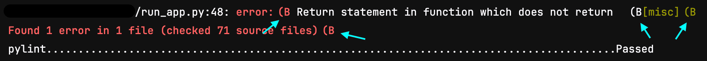

<a id="syntax-is-incorrect-in-scripts-that-use-colon"></a>

## 在使用 `:` 的脚本中出现 `语法不正确`

如果您在脚本中使用冒号 (`:`)，极狐GitLab 可能输出：

- `语法不正确`
- `脚本配置应为一个字符串或一个多层嵌套数组，最多 10 层深`

例如，如果您将 `"PRIVATE-TOKEN: ${PRIVATE_TOKEN}"` 用作 cURL 命令的一部分：

```yaml
pages-job:
  stage: deploy
  script:
    - curl --header 'PRIVATE-TOKEN: ${PRIVATE_TOKEN}' "https://gitlab.example.com/api/v4/projects"
  environment: production
```

YAML 解析器认为 `:` 定义了一个 YAML 关键字，并输出 `语法不正确` 错误。

要使用包含冒号的命令，您应该将整个命令用单引号包裹。您可能需要将现有的单引号 (`'`) 更改为双引号 (`"`)：

```yaml
pages-job:
  stage: deploy
  script:
    - 'curl --header "PRIVATE-TOKEN: ${PRIVATE_TOKEN}" "https://gitlab.example.com/api/v4/projects"'
  environment: production
```

<a id="job-does-not-fail-when-using-and-and-in-a-script"></a>

## 在脚本中使用 `&&` 时作业不会失败

如果您使用 `&&` 在单个脚本行中将两个命令组合在一起，即使其中一个命令失败，作业也可能返回成功。例如：

```yaml
job-does-not-fail:
  script:
    - invalid-command xyz && invalid-command abc
    - echo $?
    - echo "作业本应已经失败，但此行仍意外执行。"
```

即使两个命令失败，`&&` 运算符仍返回退出代码 `0`，作业继续运行。要强制脚本在任一命令失败时退出，请将整行括在圆括号中：

```yaml
job-fails:
  script:
    - (invalid-command xyz && invalid-command abc)
    - echo "作业已经失败，此行不会执行。"
```

<a id="multiline-commands-not-preserved-by-folded-yaml-multiline-block-scalar"></a>

## 折叠的 YAML 多行块标量无法保留多行命令

如果您使用 `- >` 折叠的 YAML 多行块标量来拆分长命令，额外的缩进会导致各行作为单独的命令处理。

例如：

```yaml
script:
  - >
    RESULT=$(curl --silent
      --header
        "Authorization: Bearer $CI_JOB_TOKEN"
      "${CI_API_V4_URL}/job"
    )
```

这会因为缩进导致换行被保留而失败：

```plaintext
$ RESULT=$(curl --silent # 折叠多行命令
curl: 未指定 URL！
curl: 请尝试 'curl --help' 或 'curl --manual' 查看更多信息
/bin/bash: 行 149: --header: 未找到命令
/bin/bash: 行 150: https://gitlab.example.com/api/v4/job: 没有那个文件或目录
```

通过以下任一方式解决：

- 删除额外的缩进：

  ```yaml
  script:
    - >
      RESULT=$(curl --silent
      --header
      "Authorization: Bearer $CI_JOB_TOKEN"
      "${CI_API_V4_URL}/job"
      )
  ```

- 修改脚本以处理额外的换行，例如使用 shell 行续行：

  ```yaml
  script:
    - >
      RESULT=$(curl --silent \
        --header \
          "Authorization: Bearer $CI_JOB_TOKEN" \
        "${CI_API_V4_URL}/job")
  ```

<a id="job-log-output-is-not-formatted-as-expected-or-contains-unexpected-characters"></a>

## 作业日志输出未按预期格式化或包含意外字符

有时，依赖 `TERM` 环境变量进行着色或格式化的工具在作业日志中显示格式不正确。例如，使用 `mypy` 命令：



极狐GitLab Runner 以非交互模式运行容器的 shell，因此 shell 的 `TERM` 环境变量设置为 `dumb`。要修复这些工具的格式，您可以：

- 添加一条额外的脚本行，在运行命令之前在 shell 环境中设置 `TERM=ansi`。
- 添加一个 `TERM` [CI/CD 变量](../variables/_index.md)并赋值为 `ansi`。

<a id="after-script-section-execution-stops-early-and-incorrect-ci-job-status-values"></a>

## `after_script` 部分执行提前停止，且 `$CI_JOB_STATUS` 变量值不正确

在极狐GitLab Runner 16.9.0 至 16.11.0 中：

- `after_script` 部分执行有时会提前停止。
- 预定义变量 `$CI_JOB_STATUS` 的状态在[作业取消时被错误地设置为 `failed`](https://jihulab.com/gitlab-cn/gitlab-runner/-/issues/37485)。