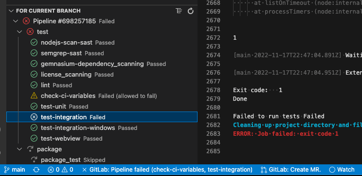
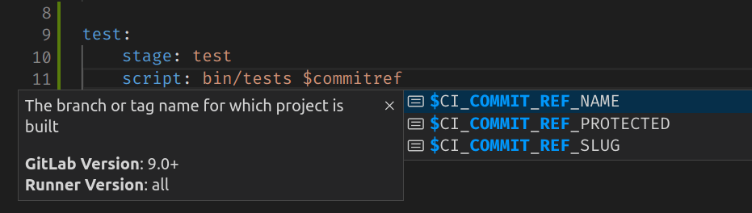
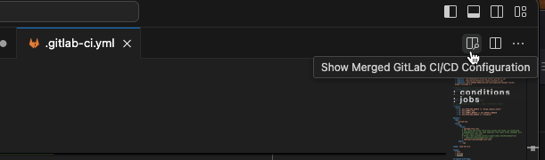



- Tier: 基础版，专业版，旗舰版
- Offering: JihuLab.com，私有化部署





- 在极狐GitLab 18.1 及更高版本中，在极狐GitLab VS Code 扩展 6.14.0 中引入了此功能。
- 在极狐GitLab 18.1 及更高版本中添加了下游流水线日志。



如果你的项目使用极狐GitLab CI/CD 流水线，你可以使用极狐GitLab for VS Code 扩展直接在 IDE 中启动、监控和更新流水线。

## 先决条件

- [验证扩展](setup.md#connect-to-gitlab) 并连接到极狐GitLab 上的仓库。

## 监控和管理流水线

使用扩展来监控和管理您项目的流水线。

先决条件：

- 您的项目使用 CI/CD 流水线。
- 您当前 Git 分支存在合并请求。
- 您当前 Git 分支的最新提交具有 CI/CD 流水线。

### 查看流水线状态

要查看分支流水线的状态，请检查 VS Code 底部的状态栏。

可能的状态包括：

- 流水线已取消
- 流水线失败
- 流水线通过
- 流水线处理中
- 流水线运行中
- 流水线已跳过
- 无流水线（如果尚未运行流水线）。

### 管理流水线

要在极狐GitLab 中启动、监控和调试 CI/CD 流水线：

1. 在 VS Code 底部的状态栏中，选择流水线状态以打开 **命令面板** 并访问可用的操作。
1. 选择您需要的操作并按照提示进行：

   - **从当前分支创建新流水线**
   - **取消上次流水线**
   - **从最新流水线下载产物**
   - **重试上次流水线**
   - **在极狐GitLab 上查看最新流水线**

### 查看 CI/CD 作业输出

要查看当前分支上 CI/CD 作业的输出：

1. 在左侧边栏中，选择 **极狐GitLab**（）。
1. 展开 **针对当前分支** 以查看最近的流水线。
1. 选择一个作业以在新的 VS Code 标签页中打开它：

   

要打开下游流水线的作业日志：

1. 在分支流水线作业列表下找到下游流水线。
1. 选择箭头图标以展开或折叠下游流水线信息。
1. 选择一个下游流水线以在新的 VS Code 标签页中打开作业日志。

### 管理流水线警报

当您当前分支的流水线完成时，扩展可以在 VS Code 中显示警报：

要打开或关闭流水线警报：

1. 在 VS Code 中，打开 **设置** 编辑器：
   - 对于 macOS，按 <kbd>Command</kbd>+<kbd>,</kbd>。
   - 对于 Windows 或 Linux，按 <kbd>Control</kbd>+<kbd>,</kbd>。
1. 根据您的配置，选择 **用户** 或 **工作区** 设置。
1. 选择 **扩展** > **极狐GitLab** > **其他**。
1. 在 **极狐GitLab：显示流水线更新通知** 下，选择或取消选择复选框。

## 管理您的 CI/CD 配置

扩展还提供了可用于创建和管理项目 CI/CD 配置的工具。

### 自动补全 CI/CD 变量

当您编写或编辑 CI/CD 配置文件时，使用变量自动补全功能快速查找变量。

先决条件：

- 您的 CI/CD 配置文件的名称以 `.gitlab-ci` 开头，以 `.yml` 或 `.yaml` 结尾。例如，`.gitlab-ci.yml` 或 `.gitlab-ci.production.yml`。

要自动补全变量：

1. 在 VS Code 中，打开您的 `.gitlab-ci.yml` 文件，并确保该文件的标签页处于焦点。
1. 开始输入变量名称。扩展将显示自动补全选项。
1. 选择一个选项以使用它：

   

### 测试极狐GitLab CI/CD 配置

要本地测试项目的极狐GitLab CI/CD 配置：

1. 在 VS Code 中，打开您的 `.gitlab-ci.yml` 文件，并确保文件的标签页处于焦点。
1. 打开 **命令面板**：
   - 对于 macOS，按 <kbd>Command</kbd>+<kbd>Shift</kbd>+<kbd>P</kbd>。
   - 对于 Windows 或 Linux，按 <kbd>Control</kbd>+<kbd>Shift</kbd>+<kbd>P</kbd>。
1. 输入 `极狐GitLab：验证极狐GitLab CI 配置` 并按 <kbd>Enter</kbd>。

如果扩展检测到您的配置有问题，它会显示警报。

### 显示合并后的配置文件

要预览合并后的 CI/CD 配置文件，包含所有已解析的 `includes` 和引用：

1. 在 VS Code 中，打开您的 `.gitlab-ci.yml` 文件，并确保文件的标签页处于焦点。
1. 在右上角，选择 **显示合并后的极狐GitLab CI/CD 配置**：

   

VS Code 会打开一个包含完整信息的新标签页（`.gitlab-ci (Merged).yml`）。

