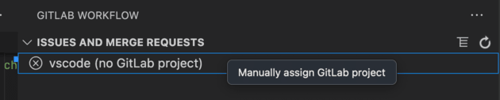

使用 极狐GitLab for VS Code 时，你可能会遇到以下问题。

如果下面的内容未涵盖你的问题，请收集[支持所需的信息](#required-information-for-support)
并向 极狐GitLab 支持团队反馈。

<a id="logs"></a>

## 日志

极狐GitLab for VS Code 扩展以及为其提供支持的 极狐GitLab Language Server 都会输出日志，帮助你排查问题。

<a id="enable-debug-logs"></a>

### 启用调试日志

要启用调试日志：

1. 在 VS Code 中，打开设置编辑器：
   - 在 macOS 上，按 <kbd>Command</kbd>+<kbd>,</kbd>。
   - 在 Windows 或 Linux 上，按 <kbd>Control</kbd>+<kbd>,</kbd>。
1. 选择 **扩展** > **极狐GitLab** > **其他**。
1. 在 **极狐GitLab：调试** 下，选中复选框以开启调试模式。
1. 重新加载窗口以重启扩展。
   1. 打开命令面板：
      - 在 macOS 上，按 <kbd>Command</kbd>+<kbd>Shift</kbd>+<kbd>P</kbd>。
      - 在 Windows 或 Linux 上，按 <kbd>Control</kbd>+<kbd>Shift</kbd>+<kbd>P</kbd>。
   1. 输入 `Developer：重新加载窗口` 并按 <kbd>Enter</kbd>。

<a id="view-debug-logs"></a>

### 查看调试日志

要查看调试日志：

1. 在 VS Code 中，选择 **查看** > **输出**。
1. 在输出面板的右上角，选择下拉列表以筛选 **极狐GitLab** 或 **极狐GitLab Language Server** 日志。
1. 检查是否存在错误、警告、连接问题或身份验证问题。

<a id="authentication"></a>

## 身份验证

你可能会遇到以下身份验证错误。

<a id="error-cant-access-the-os-keychain"></a>

### 错误：`……无法访问操作系统密钥串`

在 macOS 和 Ubuntu 上，当扩展无法访问操作系统密钥串进行身份验证时，你可能会收到错误。

例如：

```plaintext
极狐GitLab 扩展无法访问操作系统密钥串。
如果你使用的是 Ubuntu，请查看相关的已知问题。
```

```plaintext
错误：无法获取密码
at I.$getPassword (vscode-file://vscode-app/snap/code/97/usr/share/code/resources/app/out/vs/workbench/workbench.desktop.main.js:1712:49592)
```

请按照以下适用于你的操作系统的变通方案操作。

<a id="macos-workaround"></a>

#### macOS 变通方案

要在 macOS 上解决此错误：

1. 在你的机器上，打开 **钥匙串访问**，并搜索 `vscodegitlab.gitlab-workflow`。
1. 从你的钥匙串中删除 `vscodegitlab.gitlab-workflow`。
1. 按 <kbd>Command</kbd>+<kbd>Shift</kbd>+<kbd>P</kbd> 打开命令面板。
1. 输入 `GitLab：从 VS Code 中移除账户` 并按 <kbd>Enter</kbd>，以从 VS Code 中移除损坏的账户。
1. 再次打开命令面板并运行 `GitLab：认证` 以重新添加账户。

<a id="ubuntu-workaround"></a>

#### Ubuntu 变通方案

当你在 Ubuntu 20.04 和 22.04 上通过 `snap` 安装 VS Code 时，VS Code 无法从操作系统密钥串读取密码。扩展版本 3.44.0 及更高版本使用操作系统密钥串进行安全令牌存储。

如果你使用的 VS Code 版本早于 1.68.0，请尝试以下变通方案之一：

- 将 极狐GitLab for VS Code 扩展降级到 3.43.1 版本。
- 通过 `.deb` 包而不是 `snap` 安装 VS Code：
  1. 卸载 `snap` 版本的 VS Code。
  1. 从 [`.deb` 包](https://code.visualstudio.com/Download)安装 VS Code。
  1. 前往 Ubuntu 的 **密码与密钥**，找到 `vscodegitlab.workflow/gitlab-tokens` 条目并将其删除。
  1. 在 VS Code 中，按 <kbd>Control</kbd>+<kbd>Shift</kbd>+<kbd>P</kbd> 打开命令面板。
  1. 输入 `Gitlab：删除你的账户` 并按 <kbd>Enter</kbd>，以移除缺少凭据的账户。
  1. 再次打开命令面板并运行 `GitLab：认证` 以重新添加账户。

如果你使用 VS Code 1.68.0 或更高版本，请尝试重新认证：

1. 前往 Ubuntu 的 **密码与密钥**，找到 `vscodegitlab.workflow/gitlab-tokens` 条目并将其删除。
1. 在 VS Code 中，按 <kbd>Control</kbd>+<kbd>Shift</kbd>+<kbd>P</kbd> 打开命令面板。
1. 输入 `Gitlab：删除你的账户` 并按 <kbd>Enter</kbd>，以移除缺少凭据的账户。
1. 再次打开命令面板并运行 `GitLab：认证` 以重新添加账户。

<a id="connection-and-authorization-error-when-using-gdk"></a>

### 使用 GDK 时出现连接和授权错误

使用带有 GDK 的 VS Code 时，你可能会收到一个错误，表明你的系统无法与运行在本地主机上的 极狐GitLab 实例建立安全的 TLS 连接。

例如，如果你使用 `127.0.0.1:3000` 作为你的 极狐GitLab 服务器：

```plaintext
对于 https://127.0.0.1:3000/api/v4/version 的请求失败，原因：客户端网络套接字在建立安全 TLS 连接之前断开
```

如果你在 `http` 上运行 GDK，而你的 极狐GitLab 实例托管在 `https` 上，就会出现此问题。

要解决此问题：

1. 打开命令面板：
   - 在 macOS 上，按 <kbd>Command</kbd>+<kbd>Shift</kbd>+<kbd>P</kbd>。
   - 在 Windows 或 Linux 上，按 <kbd>Control</kbd>+<kbd>Shift</kbd>+<kbd>P</kbd>。
1. 输入 `GitLab：认证` 并按 <kbd>Enter</kbd>。
1. 选择手动输入实例的 `http` URL 的选项，并按 <kbd>Enter</kbd>。
1. 按照后续提示完成认证。

<a id="project-configuration"></a>

## 项目配置

你可能会遇到以下项目配置错误。

<a id="account-and-project-configuration-errors"></a>

### 账户和项目配置错误

当你在 VS Code 中打开一个项目时，可能会在 **极狐GitLab**（）标签页中的项目名称旁边看到一个错误消息。或者，你可能会在状态栏中看到关于多个账户或项目的警告消息。

这些消息出现是因为扩展无法确定要使用哪个代码仓、账户或项目。

要解决这些错误：

- 如果没有定义远程仓库或者你配置了多个远程仓库，请参阅[连接到你的代码仓](setup.md#connect-to-your-repository)。
- 如果状态栏中显示 **多个 极狐GitLab 账户**，请[切换账户](setup.md#switch-accounts)。
- 如果状态栏中显示 **（多个项目）**，请[选择一个项目](setup.md#select-a-project)。

如果这是你第一次在 VS Code 中使用 Git，有关初始化代码仓和工作区的信息（这发生在 极狐GitLab 扩展之外），请参阅[VS Code 中的源代码管理](https://code.visualstudio.com/docs/sourcecontrol/overview)。

<a id="git-remote-with-ssh-custom-alias"></a>

#### 使用 SSH 自定义别名的 Git 远程

如果你的代码仓远程使用 SSH 自定义别名，扩展可能无法正确将你的代码仓与你的 极狐GitLab 项目匹配。例如，如果你的远程使用 `git@my-work-gitlab:group/project.git` 而不是 `git@gitlab.com:group/project.git`。

要解决此问题，你可以：

- 将远程更改为使用 HTTP，或使用没有自定义别名的 SSH。
- 在扩展中配置默认的 极狐GitLab Duo 命名空间。

要配置默认命名空间：

1. [确定你的项目所在的命名空间](../../user/namespace/_index.md#determine-which-type-of-namespace-youre-in)。
1. 在 VS Code 中，打开设置编辑器：
   - 在 macOS 上，按 <kbd>Command</kbd>+<kbd>,</kbd>。
   - 在 Windows 或 Linux 上，按 <kbd>Control</kbd>+<kbd>,</kbd>。
1. 选择 **扩展** > **极狐GitLab** > **极狐GitLab Duo**。
1. 在 **GitLab › Duo Agent Platform：默认命名空间** 下，输入你的命名空间。

<a id="https-project-cloning-works-but-ssh-cloning-fails"></a>

### HTTPS 项目克隆正常但 SSH 克隆失败

你可能会遇到 SSH 克隆错误，而 HTTPS 克隆正常。当你的 SSH URL 主机或路径与 HTTPS 路径不同时，就会发生这种情况。

极狐GitLab for VS Code 扩展使用：

- 主机来匹配你设置的账户。
- 路径来获取命名空间和项目名称。

例如，VS Code 扩展项目的 URL 为：

- SSH：`git@gitlab.com:gitlab-org/gitlab-vscode-extension.git`
- HTTPS：`https://gitlab.com/gitlab-org/gitlab-vscode-extension.git`

两者都具有 `gitlab.com` 主机和 `gitlab-org/gitlab-vscode-extension` 路径。

要解决此错误：

1. 检查你的 SSH URL 是否在不同的主机上，或者路径中是否有额外的段。
1. 如果有任一项是，手动将 Git 代码仓分配给一个 极狐GitLab 项目：
   1. 在 VS Code 中，在左侧边栏中选择 **极狐GitLab**（）。
   1. 选择带有 `(no GitLab project)` 标记的项目，然后选择 **手动分配 极狐GitLab 项目**：
   
   1. 从列表中选择正确的项目。

<a id="network-and-connectivity"></a>

## 网络和连接

你可能会遇到以下网络和连接错误。

<a id="error-407-access-denied-failure-with-a-proxy"></a>

### 错误：`407 访问被拒绝` 代理失败

如果你使用需要认证的代理，你可能会遇到 `407 Access Denied (authentication_failed)` 错误。

例如：

```plaintext
请求失败：无法为 https://gitlab.com 添加 极狐GitLab 账户。请检查你的实例 URL 和网络连接。
从 https://gitlab.com/api/v4/personal_access_tokens/self 获取资源失败
```

要解决此错误，请为 极狐GitLab Language Server [启用代理认证](../language_server/_index.md#enable-proxy-authentication)。

<a id="errors-with-custom-certificates"></a>

### 自定义证书错误

如果你使用自定义证书连接到你的 极狐GitLab 实例，例如自签名证书，你可能会遇到错误。

如果你的证书使用以下设置，可能会出现这些错误：

| 设置名称 | 信息 |
|----------------------------------|-------------|
| `gitlab.ca` | 已弃用。有关如何设置自签名 CA 的更多信息，请参阅 [SSL 设置指南](ssl.md)。 |
| `gitlab.cert` | 不受支持。 |
| `gitlab.certKey` | 不受支持。 |
| `gitlab.ignoreCertificateErrors` | 不受支持。 |

要解决此问题，请参阅[为自定义证书颁发机构配置扩展](https://gitlab.com/gitlab-org/gitlab-vscode-extension/-/blob/main/docs/user/custom-certificates.md)。

<a id="expired-ssl-certificate"></a>

### SSL 证书过期

你可能会遇到误报的 SSL 证书过期错误。例如：

`API 请求失败 - 错误：证书已过期`。

要解决此错误，请禁用系统证书：

1. 在 VS Code 中，打开设置编辑器：
   - 在 macOS 上，按 <kbd>Command</kbd>+<kbd>,</kbd>。
   - 在 Windows 或 Linux 上，按 <kbd>Control</kbd>+<kbd>,</kbd>。
1. 在 **用户** 设置标签页中，选择 **应用程序** > **代理**。
1. 禁用 **代理严格 SSL** 和 **系统证书** 的设置。

<a id="gitlab-duo"></a>

## 极狐GitLab Duo

在 VS Code 中使用 极狐GitLab Duo 时，你可能会遇到以下问题。

<a id="gitlab-duo-features-are-unavailable"></a>

### 极狐GitLab Duo 功能不可用

要在 VS Code 中排查 极狐GitLab Duo 错误：

1. 确保你满足[前提条件](setup.md#configure-gitlab-duo)并且必要的设置已开启。
1. 确保[管理员模式已关闭](../../administration/settings/sign_in_restrictions.md#turn-off-admin-mode-for-your-session)。
1. 查看诊断输出：
   1. 按 <kbd>Command</kbd>+<kbd>Shift</kbd>+<kbd>P</kbd> 或 <kbd>Control</kbd>+<kbd>Shift</kbd>+<kbd>P</kbd> 打开命令面板。
   1. 运行命令 `GitLab：诊断` 并查看输出中是否有任何失败的检查。
1. 如果诊断显示某功能未开启：
   1. 在 VS Code 中，打开设置编辑器：
      - 在 macOS 上，按 <kbd>Command</kbd>+<kbd>,</kbd>。
      - 在 Windows 或 Linux 上，按 <kbd>Control</kbd>+<kbd>,</kbd>。
   1. 选择 **扩展** > **极狐GitLab** > **极狐GitLab Duo**。
   1. 找到缺失功能对应的 **极狐GitLab ›** 部分，并选中复选框以将其开启。
1. 如果诊断表明当前项目不支持 Agentic 聊天，请设置一个[默认的 极狐GitLab Duo 命名空间](../../user/profile/preferences.md#namespace-resolution-in-your-local-environment)。

有关 代码建议 的支持，请参阅[排查 代码建议 问题](../../user/project/repository/code_suggestions/troubleshooting.md#vs-code-troubleshooting)。

<a id="gitlab-duo-returns-http11-responses-instead-of-websocket-endpoints"></a>

### 极狐GitLab Duo 返回 `HTTP/1.1` 响应而非 WebSocket 端点

你可能会在日志中看到 极狐GitLab Duo 返回 `HTTP/1.1` 响应，而不是 `/-/cable` WebSocket 端点。

当你的 极狐GitLab 实例阻止 WebSocket 连接时，就会发生这种情况。

要解决此错误，请要求你的网络管理员修改你的 极狐GitLab 实例，以[允许来自 IDE 客户端的入站 WebSocket 连接](../../administration/gitlab_duo/configure/_index.md#allow-inbound-connections-from-clients-to-the-gitlab-instance)。

<a id="gitlab-duo-chat-fails-to-initialize-in-remote-environments"></a>

### 极狐GitLab Duo Chat 在远程环境中初始化失败

在远程开发环境（如基于浏览器的 VS Code 或远程 SSH 连接）中使用 极狐GitLab Duo Chat 时，你可能会遇到初始化失败，例如：

- 聊天面板空白或不加载。
- 日志中出现错误，如 `The webview didn't initialize in 10000ms`。
- 扩展尝试连接到无法访问的本地 URL。

要解决这些错误：

1. 在 VS Code 中，打开设置编辑器：
   - 在 macOS 上，按 <kbd>Command</kbd>+<kbd>,</kbd>。
   - 在 Windows 或 Linux 上，按 <kbd>Control</kbd>+<kbd>,</kbd>。
1. 在右上角，选择 **打开设置（JSON）** 以编辑你的 `settings.json` 文件。
1. 添加或修改此设置：

   ```json
   "gitlab.featureFlags.languageServerWebviews": false
   ```

1. 保存更改并重新加载窗口：
   1. 打开命令面板：
      - 在 macOS 上，按 <kbd>Command</kbd>+<kbd>Shift</kbd>+<kbd>P</kbd>。
      - 在 Windows 或 Linux 上，按 <kbd>Control</kbd>+<kbd>Shift</kbd>+<kbd>P</kbd>。
   1. 输入 `Developer：重新加载窗口` 并按 <kbd>Enter</kbd>。

<a id="gitlab-duo-commands-fail-or-run-indefinitely"></a>

### 极狐GitLab Duo 命令失败或无限运行

当你在 IDE 中使用 极狐GitLab Duo Agentic 聊天或软件开发流程时，极狐GitLab Duo 可能会陷入循环或在运行命令时遇到困难。

如果你使用像 `Oh My ZSH!` 或 `powerlevel10k` 这样的 Shell 主题或集成，可能会发生此问题。当 极狐GitLab Duo Agent 创建终端时，Shell 主题或集成可能会阻止命令正常运行。

作为变通方案，请按照以下说明为代理发送的命令使用更简单的主题。

<a id="edit-your-zshrc-file"></a>

#### 编辑你的 `.zshrc` 文件

在 VS Code 中，配置 `Oh My ZSH!` 或 `powerlevel10k`，使其在运行由代理发送的命令时使用更简单的主题。你可以使用 IDE 暴露的环境变量来设置这些值。

编辑你的 `~/.zshrc` 文件以包含以下代码：

```shell
# ~/.zshrc

# 你的 oh-my-zsh 安装路径
export ZSH="$HOME/.oh-my-zsh"

# ...

# 决定是加载完整的终端环境，还是为 IDE 中的 Agentic AI 保持最小环境
if [[ "$TERM_PROGRAM" == "vscode" ]]; then
  echo "检测到 IDE Agentic 环境，不加载完整的 Shell 集成"
else
  # Oh My ZSH
  source $ZSH/oh-my-zsh.sh
  # 主题：Powerlevel10k
  [[ ! -f ~/.p10k.zsh ]] || source ~/.p10k.zsh
  # 其他集成，如语法高亮
fi

# 其他设置，如 PATH 变量
```

<a id="edit-your-bash-shell"></a>

#### 编辑你的 Bash Shell

在 VS Code 中，你可以在 Bash 中关闭高级提示符。

编辑你的 `~/.bashrc` 或 `~/.bash_profile` 文件以包含以下代码：

```shell
# ~/.bashrc 或 ~/.bash_profile

# 决定是加载完整的终端环境，还是为 IDE 中的 Agentic AI 保持最小环境
if [[ "$TERM_PROGRAM" == "vscode" ]]; then
  echo "检测到 IDE Agentic 环境，不加载完整的 Shell 集成"

  # 仅为代理保留必要的设置
  export PS1='\$ '  # 最小提示符

else
  # 加载完整的 Bash 环境

  # 自定义提示符（例如 Starship、自定义 PS1）
  if command -v starship &> /dev/null; then
    eval "$(starship init bash)"
  else
    # ... 添加你自己的 PS1 变量
  fi

  # 加载其他集成
fi

# 始终加载必要的环境变量和别名
```

<a id="required-information-for-support"></a>

## 支持所需的信息

联系支持之前，请确保已安装最新版本的 极狐GitLab for VS Code 扩展。

在 [VS Code Marketplace](https://marketplace.visualstudio.com/items?itemName=GitLab.gitlab-workflow) 的 **版本历史** 标签页中查找最新版本。

从受影响的用户处收集以下信息并提供在你的错误报告中：

1. 向用户显示的错误消息。
1. **极狐GitLab** 和 **极狐GitLab Language Server** [日志](#logs)。
1. 诊断输出。
   1. 打开命令面板：
      - 在 macOS 上，按 <kbd>Command</kbd>+<kbd>Shift</kbd>+<kbd>P</kbd>。
      - 在 Windows 或 Linux 上，按 <kbd>Control</kbd>+<kbd>Shift</kbd>+<kbd>P</kbd>。
   1. 输入 `GitLab：诊断` 并按 <kbd>Enter</kbd>。
   1. 记录扩展版本。
1. 系统详情：
   - 在 VS Code 中的 **操作系统** 详情：
     - 在 macOS 上，前往 **代码** > **关于 Visual Studio Code** 并找到 **操作系统**。
     - 在 Windows 或 Linux 上，前往 **帮助** > **关于** 并找到 **操作系统**。
   - 机器规格（CPU、RAM）：请从你的机器提供这些信息，它们在 IDE 中不可见。
1. 描述影响范围。有多少用户受到影响？
1. 描述如何重现该错误。如果可能，请附上屏幕录像。
1. 描述其他 极狐GitLab Duo 功能受到的影响：
   - 极狐GitLab 快速聊天是否正常工作？
   - 代码建议 是否正常工作？
   - Web IDE 中的 极狐GitLab Duo Chat 是否返回响应？
1. 按照 [极狐GitLab for VS Code 扩展隔离指南](https://gitlab.com/gitlab-org/editor-extensions/gitlab-lsp/-/issues/814#step-2-extension-isolation-testing) 中所述执行扩展隔离测试。
   请尝试禁用（或卸载）所有其他扩展，以确定是否是其他扩展导致了该问题。