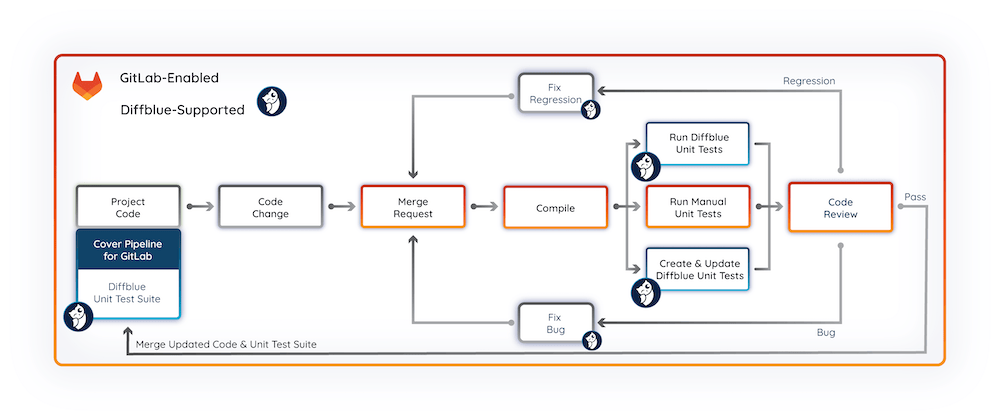
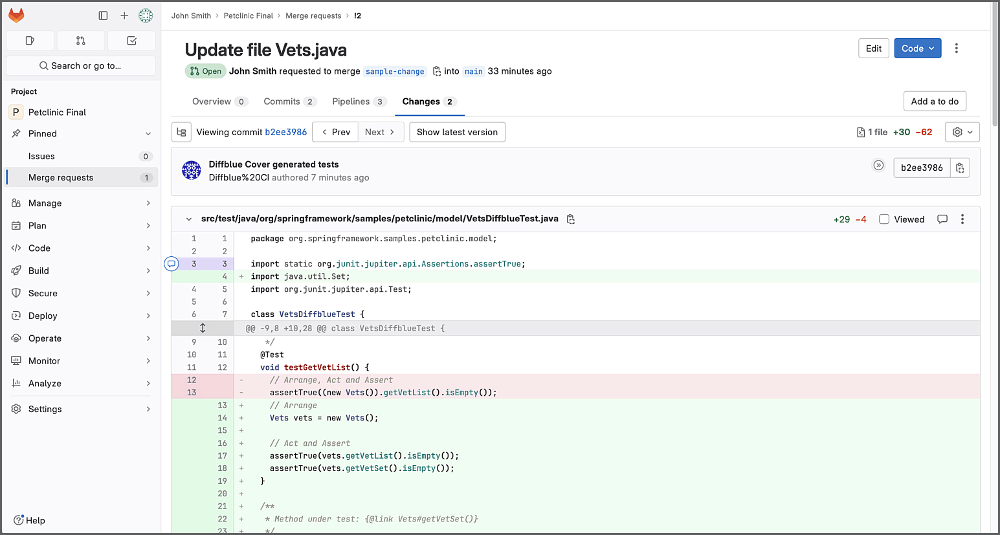



- Tier: 基础版，专业版，旗舰版
- Offering: JihuLab.com，私有化部署



## Diffblue Cover

你可以将 [Diffblue Cover](https://www.diffblue.com/) 强化学习 AI 工具集成到你的 CI/CD 流水线中，自动为你的极狐GitLab 项目编写和维护 Java 单元测试。
极狐GitLab 的 Diffblue Cover Pipeline 集成允许你自动执行以下操作：

- 为你的项目编写基线单元测试套件。
- 为新代码编写新的单元测试。
- 更新代码中现有的单元测试。
- 删除代码中不再需要的现有单元测试。

## 配置集成

要将 Diffblue Cover 集成到你的流水线中：

1. 查找并配置 Diffblue Cover 集成。
1. 使用极狐GitLab 流水线编辑器和 Diffblue Cover 流水线模板为示例项目配置流水线。
1. 为项目创建完整的基线单元测试套件。

### 配置 Diffblue Cover

1. 在顶部栏中，选择 **搜索或跳转到** 并找到你的项目。
   - 如果你想使用示例项目测试集成，你可以[导入](../user/import/third_party_systems/repo_by_url.md) Diffblue 的 [Spring PetClinic 示例项目](https://github.com/diffblue/demo-spring-petclinic)。
1. 选择 **设置** > **集成**。
1. 找到 **Diffblue Cover** 并选择 **配置**。
1. 填写以下字段：

   - 勾选 **激活** 复选框。
   - 输入你在欢迎邮件中或由你的组织提供的 Diffblue Cover **许可证密钥**。
     如有需要，选择 [**免费试用 Diffblue Cover**](https://www.diffblue.com/try-cover/gitlab/) 链接注册免费试用。
   - 输入你的极狐GitLab 访问令牌的详细信息（**名称** 和 **密钥**），以允许 Diffblue Cover 访问你的项目。
     通常，使用具有 `开发者` 角色、`api` 和 `write_repository` 作用域的极狐GitLab [项目访问令牌](../user/project/settings/project_access_tokens.md)。
     如有必要，你也可以使用[群组访问令牌](../user/group/settings/group_access_tokens.md)或[个人访问令牌](../user/profile/personal_access_tokens.md)，同样需要 `开发者` 角色、`api` 和 `write_repository` 作用域。

     > [!note]
     > 使用权限过高的访问令牌会带来安全风险。
     > 如果你使用个人访问令牌，请考虑创建一个专用用户，将其访问权限限制在该项目，以尽量减少令牌泄露的影响。

1. 选择 **保存更改**。
   你的 Diffblue Cover 集成现在处于 <mark style="color:green;">**激活**</mark> 状态，可以在你的项目中使用了。

### 配置流水线

为项目创建一个合并请求流水线，该流水线会下载最新版本的 Diffblue Cover，构建项目，为项目编写 Java 单元测试，并将更改提交到分支。

1. 在顶部栏中，选择 **搜索或跳转到** 并找到你的项目。
1. 将 [`Diffblue-Cover.gitlab-ci.yml` 模板](https://jihulab.com/gitlab-cn/gitlab/-/blob/master/lib/gitlab/ci/templates/Diffblue-Cover.gitlab-ci.yml)的内容复制到你的项目的 `.gitlab-ci.yml` 文件中。

   > [!note]
   > 当将 Diffblue Cover 流水线模板与你自己的项目和现有流水线文件一起使用时，将 Diffblue 模板内容添加到你的文件中并根据需要进行修改。
   > 更多信息，请参阅 Diffblue 文档中的 [极狐GitLab Cover Pipeline](https://docs.diffblue.com/features/cover-pipeline/cover-pipeline-for-gitlab)。
1. 输入提交信息。
1. 输入新的 **分支** 名称。例如，`add-diffblue-cover-pipeline`。
1. 选择 **使用这些更改创建新合并请求**。
1. 选择 **提交更改**。

### 创建基线单元测试套件

1. 在 **新建合并请求** 表单中，输入 **标题**（例如，“添加 Cover 流水线并创建基线单元测试套件”）并填写其他字段。
1. 选择 **创建合并请求**。合并请求流水线会运行 Diffblue Cover，为项目创建基线单元测试套件。
1. 流水线完成后，可以从 **更改** 选项卡查看更改。满意后，将更新合并到你的代码仓库中。转到项目仓库中的 `src/test` 文件夹，查看由 Diffblue Cover 创建的单元测试（文件名以 `*DiffblueTest.java` 为后缀）。

## 后续代码更改

当对项目进行后续代码更改时，合并请求流水线将运行 Diffblue Cover，但只会更新相关的测试。
然后可以分析生成的差异，以检查新行为、捕获回归，并发现任何计划外的代码行为更改。

## 下一步

本主题演示了极狐GitLab Cover Pipeline 的一些关键功能以及如何在流水线中使用该集成。
通过流水线模板中的 `dcover` 命令提供的更广泛、更深层的功能可以被实施，以进一步扩展你的单元测试能力。
更多信息，请参阅 Diffblue 文档中的 [极狐GitLab Cover Pipeline](https://docs.diffblue.com/features/cover-pipeline/cover-pipeline-for-gitlab)。