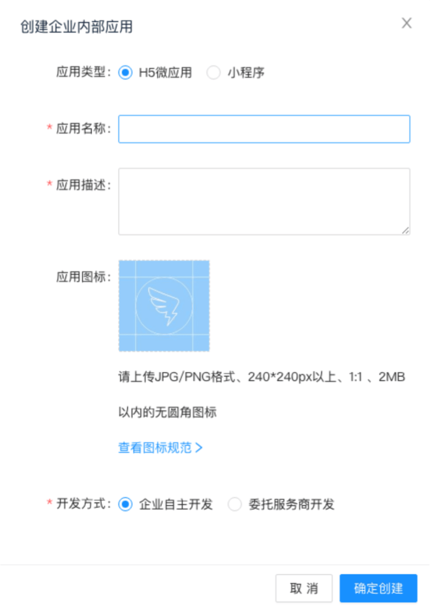
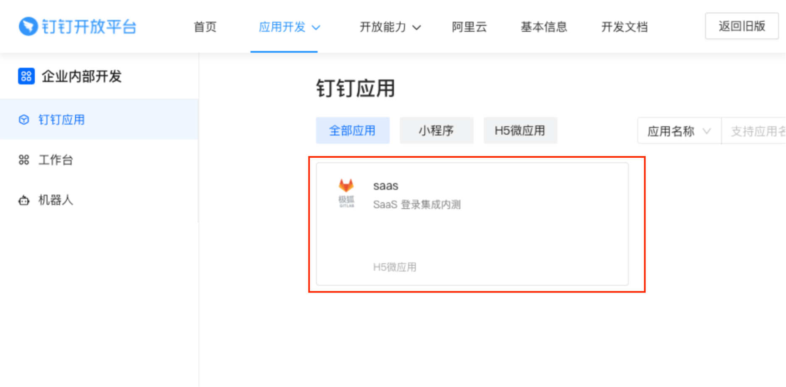



1. Tier: 基础版, 专业版, 旗舰版
1. Offering: 私有化部署



> - 引入于 14.5 版本。

您可以使用您的钉钉账号登录极狐GitLab。
登录钉钉开放平台，创建应用。钉钉会生成一个客户端 ID 和密钥供您使用。

1. 登录[钉钉开放平台](https://open-dev.dingtalk.com/)。

1. 在顶部栏上，选择 **应用程序开发 > 企业内部开发**，然后选择 **创建应用**。

   

1. 填写应用详细信息：

   - **应用名称**：可以是任何名称。考虑诸如`<Organization>'s GitLab` 或`<Your Name>'s GitLab` 之类的内容，或者其它描述性的内容。
   - **应用描述**：创建描述。
   - **应用图标**：如果需要，上传合格的图标。

   

1. 选择 **确定创建**。

1. 在左侧边栏中，选择 **钉钉应用**，找到您的应用。 选择它并转到应用程序信息页面。

   

1. 在 **应用凭证** 部分，应该有一个 AppKey 和 AppSecret（见下图）。继续配置时，请保持此页面打开。

   

1. 在您的 GitLab 服务器上，打开配置文件。

   对于 Omnibus 安装实例：

   ```shell
   sudo editor /etc/gitlab/gitlab.rb
   ```

   对于源安装实例：

   ```shell
   cd /home/git/gitlab

   sudo -u git -H editor config/gitlab.yml
   ```

1. 初始设置见[初始化配置](omniauth.md#初始化配置)。

1. 添加提供商配置：

   对于 Omnibus 安装实例：

   ```ruby
     gitlab_rails['omniauth_providers'] = [
       {
         name: "dingtalk",
         # label: "Provider name", # optional label for login button, defaults to "Ding Talk"
         app_id: "YOUR_APP_ID",
         app_secret: "YOUR_APP_SECRET"
       }
     ]
   ```
   对于源安装实例：

   ```yaml
   - { name: 'dingtalk',
       # label: 'Provider name', # optional label for login button, defaults to "Ding Talk"
       app_id: 'YOUR_APP_ID',
       app_secret: 'YOUR_APP_SECRET' }
   ```

1. 将 `YOUR_APP_ID` 改为来自步骤 6 中应用信息页面的 AppKey。

1. 将 `YOUR_APP_SECRET` 改为来自步骤 6 中应用信息页面的 AppSecret。

1. 保存配置文件。

1. 为使更改生效，对于 Omnibus 安装实例，需要[重新配置极狐GitLab](../administration/restart_gitlab.md#omnibus-gitlab-reconfigure)；对于源安装实例，需要[重启极狐GitLab](../administration/restart_gitlab.md#源安装实例)。
