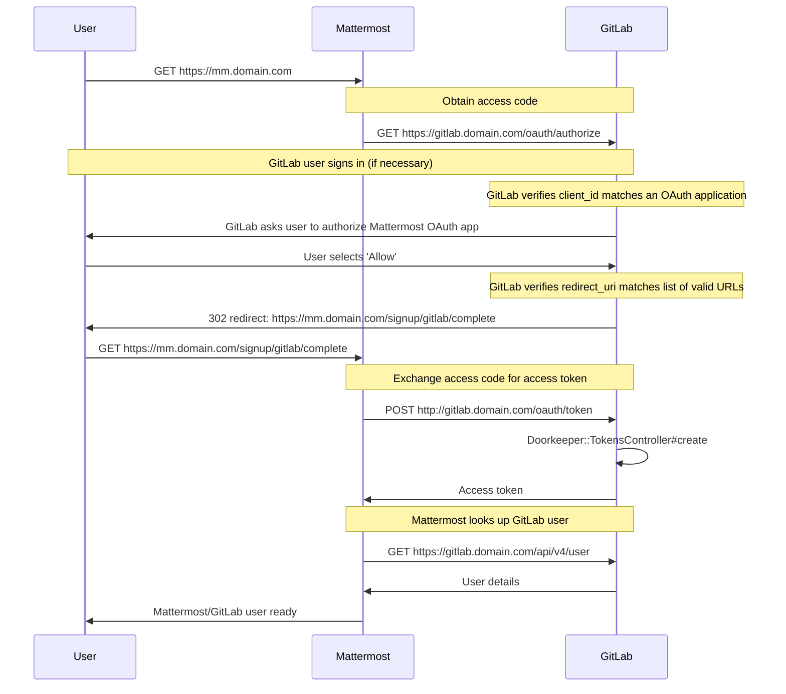



- Offering: 私有化部署



您可以在您的极狐GitLab 服务器上运行 [极狐GitLab Mattermost](https://jihulab.com/gitlab-cn/gitlab-mattermost) 服务。Mattermost 并非极狐GitLab 单一应用程序的一部分。不过 [Mattermost 与极狐GitLab](https://mattermost.com/solutions/mattermost-gitlab/) 之间有良好的集成，我们的 Linux 软件包允许您安装它。**然而，Mattermost 是来自另一家公司的独立应用程序**。极狐GitLab 支持团队无法协助您处理除与极狐GitLab 集成之外的 Mattermost 特定问题。如果您需要 Mattermost 本身的帮助，请参阅[社区支持资源](#community-support-resources)。

<a id="prerequisites"></a>

## 先决条件

极狐GitLab Mattermost 的每个发行版均在 Linux 的 AMD 64 芯片组上编译并进行手动测试。不支持 ARM 芯片组和操作系统，例如树莓派。

<a id="getting-started"></a>

## 入门

极狐GitLab Mattermost 预期在其自己的虚拟主机上运行。在您的 DNS 设置中，您需要两个指向同一台机器的条目。例如，`gitlab.example.com` 和 `mattermost.example.com`。

极狐GitLab Mattermost 默认处于禁用状态。要启用它：

1. 编辑 `/etc/gitlab/gitlab.rb` 并添加 Mattermost 外部 URL：

   ```ruby
   mattermost_external_url 'https://mattermost.example.com'
   ```

1. 重新配置极狐GitLab：

   ```shell
   sudo gitlab-ctl reconfigure
   ```

1. 确认极狐GitLab Mattermost 可通过 `https://mattermost.example.com` 访问，且已授权连接到极狐GitLab。通过授权 Mattermost 与极狐GitLab，用户可将极狐GitLab 作为 SSO 提供商来使用。

如果应用程序运行在同一台服务器上，Linux 软件包会尝试自动为极狐GitLab Mattermost 授予极狐GitLab 的访问权限。

自动授权需要访问极狐GitLab 数据库。如果极狐GitLab 数据库不可用，您需要按照[授权极狐GitLab Mattermost](#authorize-gitlab-mattermost)部分中描述的过程，手动为极狐GitLab Mattermost 授予访问极狐GitLab 的权限。

<a id="configuring-mattermost"></a>

## 配置 Mattermost

您可以使用 Mattermost 系统控制台来配置 Mattermost。Mattermost 的大量设置及其可设置的位置，可在 [Mattermost 文档](https://docs.mattermost.com/administration/config-settings.html)中找到。

虽然建议使用系统控制台，但您也可以使用以下选项之一来配置 Mattermost：

1. 直接通过 `/var/opt/gitlab/mattermost/config.json` 编辑 Mattermost 配置。
1. 通过在 `gitlab.rb` 中更改 `mattermost['env']` 设置，来指定用于运行 Mattermost 的环境变量。以这种方式配置的任何设置，在系统控制台中都处于禁用状态，并且在重启 Mattermost 之前无法更改。

<a id="running-gitlab-mattermost-with-https"></a>

## 通过 HTTPS 运行极狐GitLab Mattermost

将 SSL 证书和 SSL 证书密钥放在 `/etc/gitlab/ssl` 目录下。如果该目录不存在，请创建它：

```shell
sudo mkdir -p /etc/gitlab/ssl
sudo chmod 755 /etc/gitlab/ssl
sudo cp mattermost.gitlab.example.key mattermost.gitlab.example.crt /etc/gitlab/ssl/
```

在 `/etc/gitlab/gitlab.rb` 中指定以下配置：

```ruby
mattermost_external_url 'https://mattermost.gitlab.example'
mattermost_nginx['redirect_http_to_https'] = true
```

如果您的证书和密钥未命名为 `mattermost.gitlab.example.crt` 和 `mattermost.gitlab.example.key`，那么您还必须添加以下完整路径：

```ruby
mattermost_nginx['ssl_certificate'] = "/etc/gitlab/ssl/mattermost-nginx.crt"
mattermost_nginx['ssl_certificate_key'] = "/etc/gitlab/ssl/mattermost-nginx.key"
```

其中 `mattermost-nginx.crt` 是 SSL 证书，而 `mattermost-nginx.key` 是 SSL 密钥。

配置设置完成后，运行 `sudo gitlab-ctl reconfigure` 以应用更改。

<a id="running-gitlab-mattermost-with-an-external-postgresql-service"></a>

## 使用外部 PostgreSQL 服务运行极狐GitLab Mattermost

默认情况下，Mattermost 使用 Linux 软件包捆绑的 PostgreSQL 服务。如果您希望将 Mattermost 与外部 PostgreSQL 服务一起使用，则需要进行其特定的配置。极狐GitLab 所使用的现有[外部 PostgreSQL 连接配置](../../administration/postgresql/external.md)不会自动被 Mattermost 继承。

1. 编辑 `/etc/gitlab/gitlab.rb` 并指定以下配置：

   ```ruby
   mattermost['sql_driver_name'] = 'postgres'
   mattermost['sql_data_source'] = "user=gitlab_mattermost host=<hostname-of-postgresql-service> port=5432 sslmode=required dbname=<mattermost_production> password=<user-password>"
   ```

1. 创建一个 PostgreSQL 用户，使其与 `user` 值以及您在 `mattermost['sql_data_source']` 中定义的 `password` 值相匹配。
1. 创建一个与所使用的 `dbname` 值相匹配的 PostgreSQL 数据库。
1. 确保该 `user` 对以 `dbname` 创建的数据库具有相应权限。
1. 重新配置极狐GitLab 并重启 Mattermost 以应用更改：

   ```shell
   sudo gitlab-ctl reconfigure && sudo gitlab-ctl restart mattermost
   ```

<a id="running-gitlab-mattermost-on-its-own-server"></a>

## 在单独服务器上运行极狐GitLab Mattermost

如果您在两台不同的服务器上运行极狐GitLab 和极狐GitLab Mattermost，极狐GitLab 服务仍然会在您的极狐GitLab Mattermost 服务器上设置。但是，极狐GitLab 服务不会接受用户请求，也不会消耗系统资源。您可以使用极狐GitLab Mattermost 服务器上的以下设置和配置详情，来有效禁用 Linux 软件包中捆绑的极狐GitLab 服务。

```ruby
mattermost_external_url 'http://mattermost.example.com'

# 关闭 Mattermost 服务器上的极狐GitLab 服务
alertmanager['enable'] = false
gitlab_exporter['enable'] = false
gitlab_kas['enable'] = false
gitlab_rails['enable'] = false
grafana['enable'] = false
letsencrypt['enable'] = false
node_exporter['enable'] = false
postgres_exporter['enable'] = false
prometheus['enable'] = false
redis_exporter['enable'] = false
redis['enable'] = false
```

然后按照[授权极狐GitLab Mattermost](#authorize-gitlab-mattermost)部分的相应步骤进行操作。最后，要启用与极狐GitLab 的集成，请在极狐GitLab 服务器上添加以下内容：

```ruby
gitlab_rails['mattermost_host'] = "https://mattermost.example.com"
```

默认情况下，极狐GitLab Mattermost 要求所有用户通过极狐GitLab 注册，并禁用通过电子邮件创建账户的选项。请参阅 Mattermost 关于[极狐GitLab SSO](https://docs.mattermost.com/deployment/sso-gitlab.html) 的文档。

<a id="manually-(re)authorizing-gitlab-mattermost-with-gitlab"></a>

## 手动（重新）授权极狐GitLab Mattermost 与极狐GitLab

<a id="reauthorize-gitlab-mattermost"></a>

### 重新授权极狐GitLab Mattermost

要重新授权极狐GitLab Mattermost，您首先需要撤销现有的授权。这可以在极狐GitLab 的 **设置** > **应用** 区域完成。然后按照下一部分的步骤完成授权。

<a id="authorize-gitlab-mattermost"></a>

### 授权极狐GitLab Mattermost

进入极狐GitLab 的 **设置** > **应用** 区域。创建一个新的应用，并为 **重定向 URI** 使用以下内容（如果您使用 HTTPS，请将 `http` 替换为 `https`）：

```plaintext
http://mattermost.example.com/signup/gitlab/complete
http://mattermost.example.com/login/gitlab/complete
```

务必选择 **受信任的** 和 **机密** 设置。在 **范围** 下，选择 `read_user`。然后，选择 **保存应用**。

创建应用后，您会获得一个 `应用 ID` 和 `密钥`。另外需要的一项信息是极狐GitLab 实例的 URL。
返回运行极狐GitLab Mattermost 的服务器，并使用您之前收到的值，按如下方式编辑 `/etc/gitlab/gitlab.rb` 配置文件：

```ruby
mattermost['gitlab_enable'] = true
mattermost['gitlab_id'] = "12345656"
mattermost['gitlab_secret'] = "123456789"
mattermost['gitlab_scope'] = "read_user"
mattermost['gitlab_auth_endpoint'] = "http://gitlab.example.com/oauth/authorize"
mattermost['gitlab_token_endpoint'] = "http://gitlab.example.com/oauth/token"
mattermost['gitlab_user_api_endpoint'] = "http://gitlab.example.com/api/v4/user"
```

保存更改，然后运行 `sudo gitlab-ctl reconfigure`。如果没有错误，您的极狐GitLab 和极狐GitLab Mattermost 应该就已配置正确了。

<a id="specify-numeric-user-and-group-identifiers"></a>

## 指定数字用户和组标识符

Linux 软件包会创建一个名为 `mattermost` 的用户和组。您可以在 `/etc/gitlab/gitlab.rb` 中按如下方式指定这些用户的数字标识符：

```ruby
mattermost['uid'] = 1234
mattermost['gid'] = 1234
```

运行 `sudo gitlab-ctl reconfigure` 以应用更改。

<a id="setting-custom-environment-variables"></a>

## 设置自定义环境变量

如有必要，您可以通过 `/etc/gitlab/gitlab.rb` 设置供 Mattermost 使用的自定义环境变量。如果 Mattermost 服务器在公司互联网代理后面运行，这将非常有用。在 `/etc/gitlab/gitlab.rb` 中为 `mattermost['env']` 提供一个哈希值。例如：

```ruby
mattermost['env'] = {"HTTP_PROXY" => "my_proxy", "HTTPS_PROXY" => "my_proxy", "NO_PROXY" => "my_no_proxy"}
```

运行 `sudo gitlab-ctl reconfigure` 以应用更改。

<a id="connecting-to-the-bundled-postgresql-database"></a>

## 连接捆绑的 PostgreSQL 数据库

如果您需要连接捆绑的 PostgreSQL 数据库，并且使用的是默认的 Linux 软件包数据库配置，您可以作为 PostgreSQL 超级用户进行连接：

```shell
sudo gitlab-psql -d mattermost_production
```

<a id="back-up-gitlab-mattermost"></a>

## 备份极狐GitLab Mattermost

极狐GitLab Mattermost 不包含在常规的 [Linux 软件包备份](../../administration/backup_restore/_index.md) Rake 任务中。

通用的 Mattermost [备份和灾难恢复](https://docs.mattermost.com/deploy/backup-disaster-recovery.html)文档可以作为需要备份内容的指南。

<a id="back-up-the-bundled-postgresql-database"></a>

### 备份捆绑的 PostgreSQL 数据库

如果您需要备份捆绑的 PostgreSQL 数据库，并且使用的是默认的 Linux 软件包数据库配置，您可以使用以下命令进行备份：

```shell
sudo -i -u gitlab-psql -- /opt/gitlab/embedded/bin/pg_dump -h /var/opt/gitlab/postgresql mattermost_production | gzip > mattermost_dbdump_$(date --rfc-3339=date).sql.gz
```

<a id="back-up-the-data-directory-and-config-json"></a>

### 备份 `data` 目录和 `config.json`

Mattermost 还有一个 `data` 目录和 `config.json` 文件也需要备份：

```shell
sudo tar -zcvf mattermost_data_$(date --rfc-3339=date).gz -C /var/opt/gitlab/mattermost data config.json
```

<a id="restore-gitlab-mattermost"></a>

## 恢复极狐GitLab Mattermost

如果您之前已经[创建了极狐GitLab Mattermost 的备份](#back-up-gitlab-mattermost)，您可以运行以下命令来恢复它：

```shell
# 停止 Mattermost，以避免有任何打开的数据库连接
sudo gitlab-ctl stop mattermost

# 删除 Mattermost 数据库
sudo -u gitlab-psql /opt/gitlab/embedded/bin/dropdb -U gitlab-psql -h /var/opt/gitlab/postgresql -p 5432 mattermost_production

# 创建 Mattermost 数据库
sudo -u gitlab-psql /opt/gitlab/embedded/bin/createdb -U gitlab-psql -h /var/opt/gitlab/postgresql -p 5432 mattermost_production

# 执行数据库恢复
# 将 /tmp/mattermost_dbdump_2021-08-05.sql.gz 替换为您的备份文件
sudo -u mattermost sh -c "zcat /tmp/mattermost_dbdump_2021-08-05.sql.gz | /opt/gitlab/embedded/bin/psql -U gitlab_mattermost -h /var/opt/gitlab/postgresql -p 5432 mattermost_production"

# 恢复数据目录和 config.json
# 将 /tmp/mattermost_data_2021-08-09.gz 替换为您的备份文件
sudo tar -xzvf /tmp/mattermost_data_2021-08-09.gz -C /var/opt/gitlab/mattermost

# 如有必要，修复权限
sudo chown -R mattermost:mattermost /var/opt/gitlab/mattermost/data
sudo chown mattermost:mattermost /var/opt/gitlab/mattermost/config.json

# 启动 Mattermost
sudo gitlab-ctl start mattermost
```

<a id="mattermost-command-line-tool-cli"></a>

## Mattermost 命令行工具（CLI）

[`mmctl`](https://docs.mattermost.com/manage/mmctl-command-line-tool.html) 是一个用于 Mattermost 服务器的 CLI 工具，该工具在本地安装并使用 Mattermost API，但也可以远程使用。您必须将 Mattermost 配置为支持本地连接，或者使用本地登录凭据（而非通过极狐GitLab SSO）以管理员身份进行身份验证。该可执行文件位于 `/opt/gitlab/embedded/bin/mmctl`。

<a id="use-mmctl-through-a-local-connection"></a>

### 通过本地连接使用 `mmctl`

对于本地连接，`mmctl` 二进制文件和 Mattermost 必须在同一台服务器上运行。要启用本地套接字：

1. 编辑 `/var/opt/gitlab/mattermost/config.json`，并添加以下行：

   ```json
   {
       "ServiceSettings": {
          ...
           "EnableLocalMode": true,
           "LocalModeSocketLocation": "/var/tmp/mattermost_local.socket",
           ...
       }
   }
   ```

1. 重启 Mattermost：

   ```shell
   sudo gitlab-ctl restart mattermost
   ```

然后，您可以使用 `sudo /opt/gitlab/embedded/bin/mmctl --local` 在您的 Mattermost 实例上运行 `mmctl` 命令。

例如，要显示用户列表：

```shell
$ sudo /opt/gitlab/embedded/bin/mmctl --local user list

13dzo5bmg7fu8rdox347hbfxde: appsbot (appsbot@localhost)
tbnkwjdug3dejcoddboo4yuomr: boards (boards@localhost)
wd3g5zpepjgbfjgpdjaas7yj6a: feedbackbot (feedbackbot@localhost)
8d3zzgpurp85zgf1q88pef73eo: playbooks (playbooks@localhost)
本地实例上共有 4 个用户
```

<a id="use-mmctl-through-a-remote-connection"></a>

### 通过远程连接使用 `mmctl`

对于远程连接，或者无法使用套接字时的本地连接，请创建一个非 SSO 用户，并为该用户授予管理员权限。然后，可以使用这些凭据对 `mmctl` 进行身份验证：

```shell
$ /opt/gitlab/embedded/bin/mmctl auth login http://mattermost.example.com

连接名称: test
用户名: local-user
密码:
 为 "test" 存储的凭据: "local-user@http://mattermost.example.com"
```

<a id="configuring-gitlab-and-mattermost-integrations"></a>

## 配置极狐GitLab 与 Mattermost 集成

您可以使用插件来订阅 Mattermost，以便接收关于议题、合并请求和拉取请求的通知，以及关于合并请求审查、未读消息和任务分配的个人通知。如果您想使用斜杠命令来执行诸如创建和查看议题等操作，或触发部署，请使用极狐GitLab [Mattermost 斜杠命令](../../user/project/integrations/mattermost_slash_commands.md)。

该插件和斜杠命令可以一起使用，也可以单独使用。

<a id="email-notifications"></a>

## 邮件通知

<a id="setting-up-smtp-for-gitlab-mattermost"></a>

### 为极狐GitLab Mattermost 设置 SMTP

这些设置由系统管理员通过 Mattermost 系统控制台进行配置。在 **系统控制台** 的 **环境** > **SMTP** 选项卡中，您可以输入 SMTP 提供商提供的 SMTP 凭据，或者输入 `127.0.0.1` 和端口 `25` 以使用 `sendmail`。有关所需特定设置的更多信息，请参阅 [Mattermost 文档](https://docs.mattermost.com/install/smtp-email-setup.html)。

也可以在 `/var/opt/gitlab/mattermost/config.json` 中配置这些设置。

<a id="email-batching"></a>

### 邮件批量发送

启用此功能后，用户可以控制接收邮件通知的频率。

可以在 Mattermost **系统控制台** 中启用邮件批量发送，方法是导航到 **环境** > **SMTP** 选项卡，并将 **启用邮件批量发送** 设置设置为 **是**。

也可以在 `/var/opt/gitlab/mattermost/config.json` 中配置此设置。

<a id="upgrading-gitlab-mattermost"></a>

## 升级极狐GitLab Mattermost

> [!note]
> 升级 Mattermost 版本时，务必查阅 Mattermost 的[重要升级说明](https://docs.mattermost.com/administration/important-upgrade-notes.html)，以处理任何需要执行的更改或迁移。

极狐GitLab Mattermost 可以通过常规的 Linux 软件包更新流程进行升级。在升级极狐GitLab 的旧版本时，只有当 Mattermost 的配置设置在极狐GitLab 之外未被更改过时，才能使用该更新流程。也就是说，没有对 Mattermost 的 `config.json` 文件进行过任何更改——无论是直接更改，还是通过会保存更改到 `config.json` 的 Mattermost **系统控制台** 进行更改。

如果您只使用 `gitlab.rb` 配置了 Mattermost，则可以使用 Linux 软件包升级极狐GitLab，然后运行 `gitlab-ctl reconfigure` 将极狐GitLab Mattermost 升级到最新版本。

如果不是这种情况，有两种选择：

1. 将 `config.json` 中所做的更改更新到 [`gitlab.rb`](https://jihulab.com/gitlab-cn/omnibus-gitlab/-/blob/b350e3cd5b06a94adb463ece4d41b9f3df6ab282/files/gitlab-config-template/gitlab.rb.template#L549) 中。这可能需要添加一些参数，因为并非 `config.json` 中的所有设置在 `gitlab.rb` 中都可用。完成后，Linux 软件包应该能够将极狐GitLab Mattermost 从一个版本升级到下一个版本。
1. 将 Mattermost 迁移到 Linux 软件包控制的目录之外，以便可以独立进行管理和升级。请按照 [Mattermost 迁移指南](https://docs.mattermost.com/administration/migrating.html)将您的 Mattermost 配置设置和数据移动到独立于 Linux 软件包的另一个目录或服务器。

有关旧版本升级注意事项和特殊考虑的完整列表，请参阅 [Mattermost 文档](https://docs.mattermost.com/administration/important-upgrade-notes.html)。

<a id="gitlab-mattermost-versions-and-edition-shipped-with-the-linux-package-deprecated"></a>

### Linux 软件包中附带的极狐GitLab Mattermost 版本和版本（已弃用）

> [!warning]
> 与 Linux 软件包捆绑的 Mattermost 已在极狐GitLab 18.9 中[被弃用](../../update/deprecations.md#mattermost-bundled-with-linux-package)，并计划在 19.0 中移除。在升级到极狐GitLab 19.0 之前，请参阅[迁移到独立 Mattermost](https://docs.mattermost.com/administration-guide/onboard/migrate-gitlab-omnibus.html)。

下表概述了极狐GitLab 15.0 及之后版本的 Mattermost 版本变更：

| 初始的极狐GitLab 版本 | Mattermost 版本 |
|:---------------|:-------------------|
| 18.6           | 10.11              |
| 18.3           | 10.10              |
| 18.2           | 10.9               |
| 18.1           | 10.8               |
| 18.0           | 10.7               |
| 17.11          | 10.6               |
| 17.9           | 10.4               |
| 17.7           | 10.2               |
| 17.6           | 10.1               |
| 17.5           | 10.0               |
| 17.4           | 9.11               |
| 17.3           | 9.10               |
| 17.2           | 9.9                |
| 17.1           | 9.8                |
| 17.0           | 9.7                |
| 16.11          | 9.6                |
| 16.10          | 9.5                |
| 16.9           | 9.4                |
| 16.7           | 9.3                |
| 16.6           | 9.1                |
| 16.5           | 9.0                |
| 16.4           | 8.1                |
| 16.3           | 8.0                |
| 16.0           | 7.10               |
| 15.11          | 7.9                |
| 15.10          | 7.8                |
| 15.9           | 7.7                |
| 15.7           | 7.5                |
| 15.6           | 7.4                |
| 15.5           | 7.3                |
| 15.4           | 7.2                |
| 15.3           | 7.1                |
| 15.2           | 7.0                |
| 15.1           | 6.7                |
| 15.0           | 6.6                |

> [!note]
> Mattermost 的升级说明提到了与 PostgreSQL 数据库相比，使用 MySQL 数据库时的不同影响。Linux 软件包中包含的极狐GitLab Mattermost 使用的是 PostgreSQL 数据库。

Linux 软件包捆绑了 [Mattermost Team Edition](https://docs.mattermost.com/about/editions-and-offerings.html#mattermost-team-edition)，这是一个免费且开源的版本，不包含其商业功能。要升级到 [Mattermost Enterprise Edition](https://docs.mattermost.com/about/editions-and-offerings.html#mattermost-enterprise-edition)，请参阅 Mattermost 的[升级文档](https://docs.mattermost.com/install/enterprise-install-upgrade.html#upgrading-to-enterprise-edition-in-gitlab-omnibus)。

<a id="oauth-20-sequence-diagram"></a>

## OAuth 2.0 序列图

下图展示了极狐GitLab 如何作为 Mattermost 的 OAuth 2.0 提供商工作的序列图。您可以使用此图来排查集成工作中的错误：



<a id="community-support-resources"></a>

## 社区支持资源

有关极狐GitLab Mattermost 部署的帮助和支持，请参阅：

- [Mattermost 问题排查](https://docs.mattermost.com/install/troubleshooting.html)。
- [Mattermost 论坛](https://forum.mattermost.com/search?q=gitlab)。