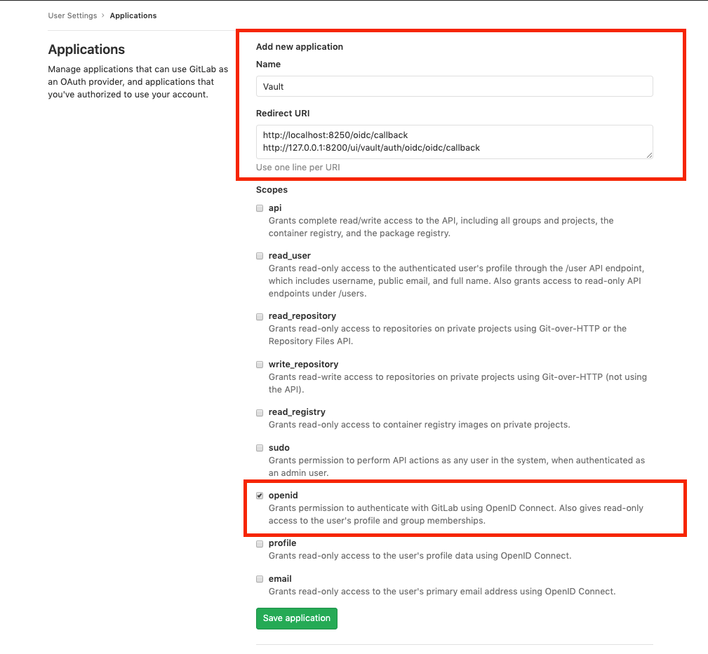
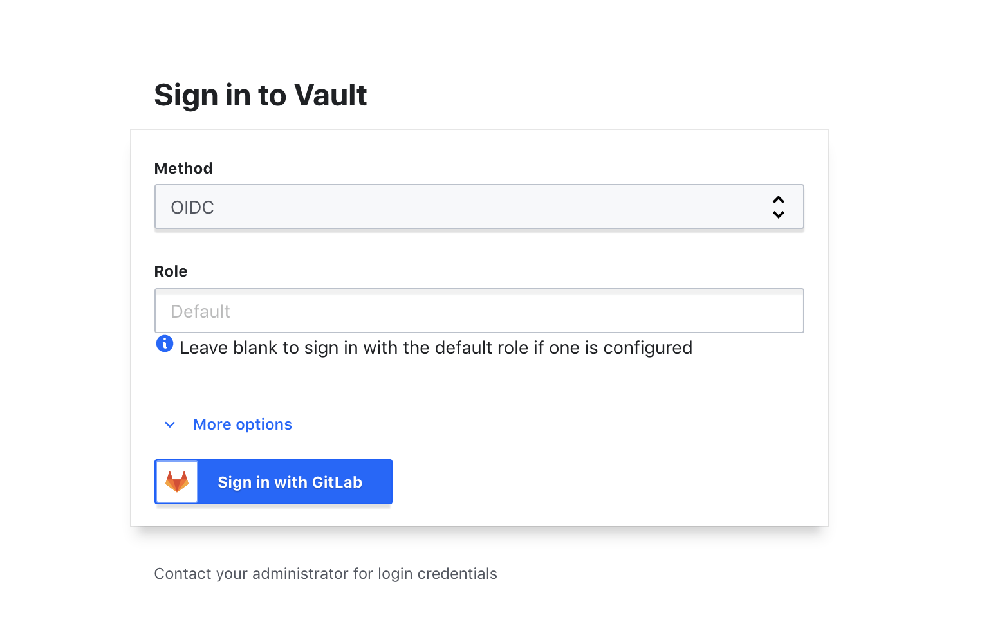
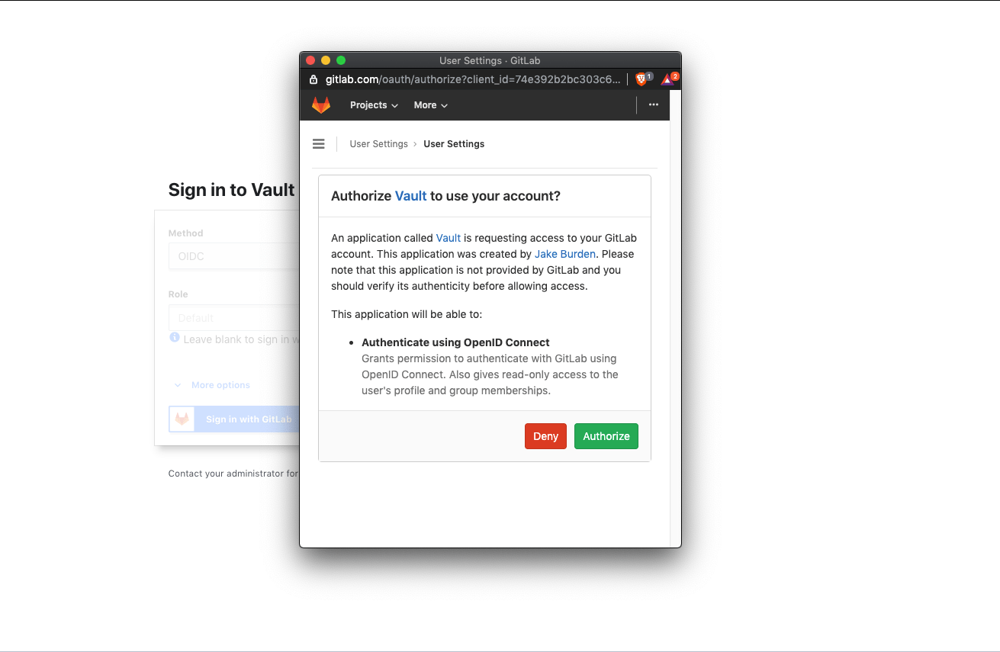
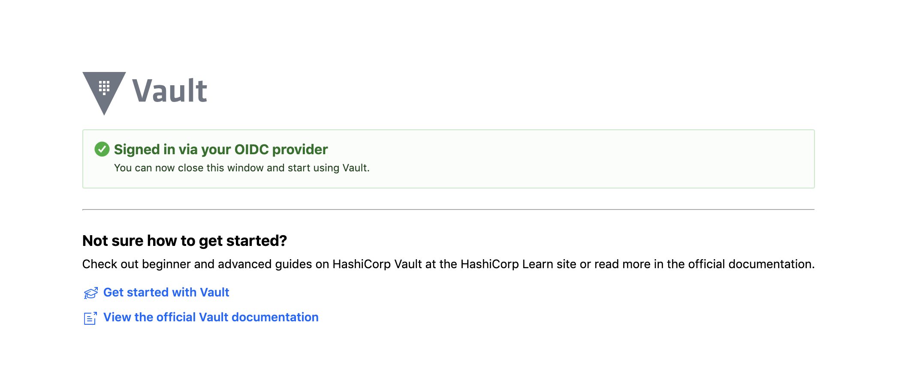



- Tier: 基础版，专业版，旗舰版
- Offering: 私有化部署



[Vault](https://www.vaultproject.io/) 是 HashiCorp 提供的一款密钥管理应用。它允许你存储和管理敏感信息，例如密钥环境变量、加密密钥和认证令牌。

Vault 提供基于身份的访问，这意味着 Vault 用户可以通过他们偏好的云提供商进行认证。

以下内容解释了 Vault 用户如何通过使用我们的 OpenID 认证功能，借助极狐GitLab 进行身份认证。

<a id="prerequisites"></a>

## 先决条件

1. [安装 Vault](https://developer.hashicorp.com/vault/install)。
1. 运行 Vault。

<a id="get-the-openid-connect-client-id-and-secret-from-gitlab"></a>

## 从极狐GitLab 获取 OpenID Connect 客户端 ID 和密钥

首先，你必须创建一个极狐GitLab 应用，以获取用于认证 Vault 的应用 ID 和密钥。为此，登录极狐GitLab 并按照以下步骤操作：

1. 在右上角，选择你的头像。
1. 选择 **编辑个人资料**。
1. 在左侧边栏中，选择 **访问** > **应用**。
1. 填写应用的 **名称** 和 [**重定向 URI**](https://developer.hashicorp.com/vault/docs/auth/jwt#redirect-uris)。
1. 选择 **OpenID** 范围。
1. 选择 **保存应用**。
1. 复制 **客户端 ID** 和 **客户端密钥**，或保持页面打开以供参考。



<a id="enable-openid-connect-on-vault"></a>

## 在 Vault 上启用 OpenID Connect

OpenID Connect (OIDC) 在 Vault 中默认未启用。

要在 Vault 中启用 OIDC 认证提供程序，打开终端会话并运行以下命令：

```shell
vault auth enable oidc
```

你应该在终端中看到以下输出：

```plaintext
成功！已在 oidc/ 启用 oidc 认证方法。
```

<a id="write-the-oidc-configuration"></a>

## 写入 OIDC 配置

要向 Vault 提供极狐GitLab 生成的应用 ID 和密钥，并允许 Vault 通过极狐GitLab 进行认证，在终端中运行以下命令：

```shell
vault write auth/oidc/config \
  oidc_discovery_url="https://jihulab.com" \
  oidc_client_id="<your_application_id>" \
  oidc_client_secret="<your_secret>" \
  default_role="demo" \
  bound_issuer="localhost"
```

将 `<your_application_id>` 和 `<your_secret>` 替换为你的应用生成的应用 ID 和密钥。

你应该在终端中看到以下输出：

```plaintext
成功！数据已写入：auth/oidc/config
```

<a id="write-the-oidc-role-configuration"></a>

## 写入 OIDC 角色配置

你必须告诉 Vault 在创建应用时提供给极狐GitLab 的 [**重定向 URI**](https://developer.hashicorp.com/vault/docs/auth/jwt#redirect-uris) 和范围。

在终端中运行以下命令：

```shell
vault write auth/oidc/role/demo - <<EOF
{
   "user_claim": "sub",
   "allowed_redirect_uris": "<your_vault_instance_redirect_uris>",
   "bound_audiences": "<your_application_id>",
   "oidc_scopes": "<openid>",
   "role_type": "oidc",
   "policies": "demo",
   "ttl": "1h",
   "bound_claims": { "groups": ["<yourGroup/yourSubgrup>"] }
}
EOF
```

替换：

- `<your_vault_instance_redirect_uris>` 为与你的 Vault 实例运行位置匹配的重定向 URI。
- `<your_application_id>` 为你的应用生成的应用 ID。

`oidc 范围` 字段必须包含 `openid`。

此配置以你正在创建的角色名称保存。此示例创建了一个 `demo` 角色。

> [!warning]
> 如果你使用公共极狐GitLab 实例，如 JihuLab.com，你必须指定 `绑定声明` 以仅允许你的群组或项目成员访问。否则，任何拥有公共账户的人都可以访问你的 Vault 实例。

<a id="sign-in-to-vault"></a>

## 登录 Vault

1. 转到你的 Vault UI。例如：<http://127.0.0.1:8200/ui/vault/auth?with=oidc>。
1. 如果未选择 `OIDC` 方法，打开下拉列表并选择它。
1. 选择 **使用极狐GitLab 登录**，这将打开一个对话框：

   
1. 要允许 Vault 通过极狐GitLab 登录，选择 **授权**。这将重定向你回到 Vault UI，作为已认证用户。

   

<a id="sign-in-using-the-vault-cli-optional"></a>

## 使用 Vault CLI 登录（可选）

你也可以使用 [Vault CLI](https://developer.hashicorp.com/vault/docs/commands) 登录 Vault。

1. 要使用你在前面示例中创建的角色配置登录，在终端中运行以下命令：

   ```shell
   vault login -method=oidc port=8250 role=demo
   ```

   此命令设置：

   - `role=demo` 以便 Vault 知道你要使用哪个配置登录。
   - `-method=oidc` 将 Vault 设置为使用 `OIDC` 登录方法。
   - `port=8250` 设置极狐GitLab 应重定向到的端口。此端口号必须与列出 [重定向 URI](https://developer.hashicorp.com/vault/docs/auth/jwt#redirect-uris) 时提供给极狐GitLab 的端口匹配。

   运行此命令后，你应该在终端中看到一个链接。
1. 在 Web 浏览器中打开此链接：

   

   你应该在终端中看到：

   ```plaintext
   成功！你现在已认证。以下显示的令牌信息已存储在令牌助手中。你无需再次运行 "vault login"。以后的 Vault 请求将自动使用此令牌。
   ```

