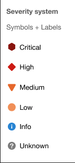
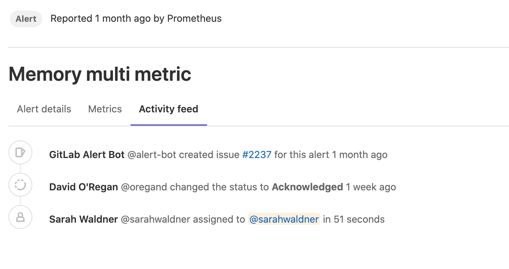
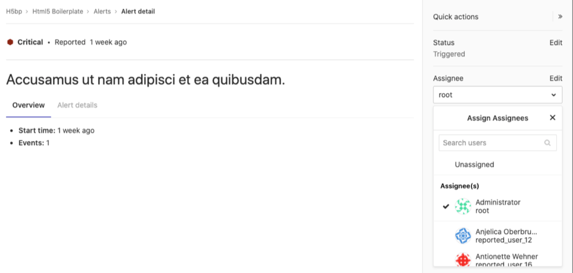



- Tier: 基础版，专业版，旗舰版
- Offering: JihuLab.com，私有化部署



警报是您的事件管理工作流程中的关键实体。它们代表一个值得关注的事件，可能表示服务中断或故障。极狐GitLab 提供了一个列表视图进行分类排查，以及一个详细视图用于深入了解事件。

## 警报列表

在项目侧边栏中，拥有开发者、维护者或所有者角色的用户可以通过 **监控** > **警报** 访问警报列表。警报列表默认按开始时间排序显示警报，但您可以通过选择警报列表的表头来更改排序顺序。

警报列表显示以下信息：

- **搜索**：警报列表支持对标题、描述、监控工具和服务字段进行简单的自由文本搜索。
- **严重性**：警报当前的重要性以及应给予多少关注。要了解所有状态，请阅读[警报管理严重性](#alert-severity)。
- **开始时间**：警报触发的时间。此字段使用极狐GitLab 标准的 `X 时间前` 模式，并根据用户的语言环境通过详细的日期/时间工具提示提供支持。
- **警报描述**：警报的描述，旨在捕获最有意义的数据。
- **事件计数**：警报被触发的次数。
- **议题**：为该警报创建的事件议题的链接。
- **状态**：警报的当前状态：
  - **已触发**：尚未开始调查。
  - **已确认**：有人正在积极调查问题。
  - **已解决**：无需进一步处理。
  - **已忽略**：不对该警报采取任何行动。

## 警报严重性

每个警报级别都包含一个形状独特且颜色编码的图标，以帮助您识别特定警报的严重性。这些严重性图标可帮助您立即确定应优先调查哪些警报：

警报包含以下图标之一：

<!-- vale gitlab_base.SubstitutionWarning = NO -->

| 严重性 | 图标                    | 颜色（十六进制） |
|--------|-------------------------|------------------|
| 关键   |  | `#8b2615`        |
| 高     |      | `#c0341d`        |
| 中     |    | `#fca429`        |
| 低     |       | `#fdbc60`        |
| 信息   |      | `#418cd8`        |
| 未知   |   | `#bababa`        |

<!-- vale gitlab_base.SubstitutionWarning = YES -->

## 警报详情页

访问[警报列表](#alert-list)并从列表中选择一个警报，即可进入警报详情视图。您需要拥有开发者、维护者或所有者角色才能访问警报。在列表中选择任何警报以查看其警报详情页。

警报提供 **概览** 和 **警报详情** 选项卡，为您提供所需的适量信息。

### 警报详情选项卡

**警报详情** 选项卡有两个部分。顶部分提供关键详细信息的简短列表，例如严重性、开始时间、事件数量和原始监控工具。第二部分显示完整的警报负载。

### 度量标准选项卡

在许多情况下，警报与度量标准相关联。您可以在 **度量标准** 选项卡中上传度量标准图表的截图。

为此，请执行以下任一操作：

- 选择 **上传**，然后从文件浏览器中选择一张图片。
- 从您的文件浏览器中拖动一个文件，并将其放到拖放区域。

当您上传图片时，可以为其添加文本描述，并将其链接到原始图表。

如果您添加了一个链接，它会显示在上传的图片上方。

### 活动摘要选项卡

**活动摘要** 选项卡是有关警报的活动日志。当您对警报执行操作时，这会被记录为系统笔记。这为您提供了警报的调查和分配历史的线性时间线。

以下操作会生成系统笔记：

- [更新警报的状态](#change-an-alerts-status)
- [基于警报创建事件](manage_incidents.md#from-an-alert)
- [将警报分配给用户](#assign-an-alert)
- [将警报升级给值班响应人员](paging.md#escalating-an-alert)

## 警报操作

极狐GitLab 中提供多种操作，以帮助对警报进行分类和响应。

### 更改警报状态

您可以更改警报的状态。

可用状态包括：

- 已触发（新警报的默认状态）
- 已确认
- 已解决

先决条件：

- 您必须拥有开发者、维护者或所有者角色。

要更改警报状态：

- 在[警报列表](#alert-list)中：
  1. 在 **状态** 列中，找到相应警报旁边的状态下拉列表。
  1. 选择一个状态。
- 在[警报详情页](#alert-details-page)中：
  1. 在右侧边栏中，选择 **编辑**。
  1. 选择一个状态。

要在已[启用邮件通知](paging.md#email-notifications-for-alerts)的项目中停止警报重复邮件的通知，请将警报状态从 **已触发** 更改为其他状态。

#### 通过关闭关联的事件来解决警报

先决条件：

- 您必须拥有报告者、开发者、维护者或所有者角色。

当您[关闭一个与警报关联的事件](manage_incidents.md#close-an-incident)时，极狐GitLab 会将[警报的状态更改为](#change-an-alerts-status) **已解决**。您将因此获得警报状态更改的功劳。

#### 作为值班响应者



- Tier: 专业版，旗舰版
- Offering: JihuLab.com，私有化部署



值班响应者可以通过更改警报状态来响应[警报通知](paging.md#escalating-an-alert)。

更改状态具有以下效果：

- 更改为 **已确认**：根据项目的[升级策略](escalation_policies.md)限制值班通知。
- 更改为 **已解决**：静默所有针对该警报的值班通知。
- 从 **已解决** 更改为 **已触发**：重新启动警报升级。

在极狐GitLab 15.1 及更早版本中，更新[带有关联事件的警报](manage_incidents.md#from-an-alert)的状态也会更新事件状态。在[极狐GitLab 15.2 及更高版本](https://gitlab.com/gitlab-org/gitlab/-/issues/356057)中，事件状态是独立的，不会随警报状态更改而更新。

### 分配警报

在大型团队中，当警报由多人共同负责时，可能很难跟踪谁正在调查和处理它。分配警报可以通过指明哪个用户负责警报来简化协作和委托。极狐GitLab 每个警报仅支持一个指派人。

要分配警报：

1. 显示当前警报列表：

   1. 在顶部栏中，选择 **搜索或跳转到** 并找到您的项目。
   1. 选择 **监控** > **警报**。

1. 选择您想要的警报以显示其详细信息。

   

1. 如果右侧边栏未展开，请选择
   **展开边栏** () 将其展开。

1. 在右侧边栏中，找到 **指派人**，然后选择 **编辑**。
   从列表中选择您要分配给该警报的每个用户。
   极狐GitLab 会为每个用户创建一个[待办事项](../../user/todos.md)。

在完成各自负责的调查或修复警报的任务后，用户可以取消分配自己。要移除指派人，请选择 **指派人** 下拉列表旁的 **编辑**，然后从指派人列表中清除该用户，或选择 **未分配**。

### 从警报创建待办事项

您可以手动从警报为自己创建一个[待办事项](../../user/todos.md)，并稍后在您的 **待办事项列表** 中查看。

要添加待办事项，请在右侧边栏中选择 **添加待办事项**。

### 从警报触发操作



- Tier: 旗舰版
- Offering: JihuLab.com，私有化部署



开启此功能，可在每当警报被触发时自动创建[事件](incidents.md)。

先决条件：

- 您必须拥有项目的维护者或所有者角色。

要配置操作：

1. 在顶部栏中，选择 **搜索或跳转到** 并找到您的项目。
1. 在左侧边栏中，选择 **设置** > **监控**。
1. 展开 **警报** 部分，然后选择 **警报设置** 选项卡。
1. 选中 **创建一个事件** 复选框。
1. 可选。要自定义事件，请从 **事件模板** 中选择一个模板，将之附加到[事件摘要](incidents.md#summary)中。
   如果下拉列表为空，
   请先[创建一个议题模板](../../user/project/description_templates.md#create-a-description-template)。
1. 可选。要发送[邮件通知](paging.md#email-notifications-for-alerts)，请选中
   **向所有者和维护者发送一封关于新警报的邮件通知** 复选框。
1. 选择 **保存更改**。