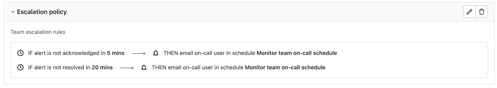



- Tier: 专业版，旗舰版
- Offering: JihuLab.com，私有化部署



升级策略可防止贵公司错过关键告警。升级策略包含带时间限制的步骤，如果上一步骤的响应者未响应，会自动呼叫升级步骤中的下一位响应者。你可以在管理[值班表](oncall_schedules.md)的极狐GitLab 项目中创建升级策略。

## 添加上报策略

前提条件：

- 你必须具有维护者或所有者角色。
- 你必须拥有一个[值班表](oncall_schedules.md)。

要创建升级策略：

1. 在顶部栏中，选择 **搜索或跳转到** 并找到你的项目。
1. 在左侧边栏中，选择 **监控** > **升级策略**。
1. 选择 **添加上报策略**。
1. 输入策略名称、描述，以及主要响应者错过告警时遵循的升级规则。
1. 选择 **添加上报策略**。

### 选择升级规则的响应者

配置升级规则时，你可以指定要呼叫的对象：

- **通过值班表邮件通知值班用户**：当规则触发时通知指定[值班表](oncall_schedules.md)中所有轮值的用户。
- **通过邮件通知用户**：直接通知指定用户。

通过值班表或直接方式向用户发送通知时，告警上会创建一条系统备注，列出被呼叫的用户。

为升级规则指定的时间必须介于 0 到 1440 分钟之间。

## 编辑升级策略

要更新升级策略：

1. 在顶部栏中，选择 **搜索或跳转到** 并找到你的项目。
1. 在左侧边栏中，选择 **监控** > **升级策略**。
1. 选择 **编辑升级策略** ()。
1. 编辑信息。
1. 选择 **保存更改**。

## 删除升级策略

要删除升级策略：

1. 在顶部栏中，选择 **搜索或跳转到** 并找到你的项目。
1. 在左侧边栏中，选择 **监控** > **升级策略**。
1. 选择 **删除升级策略** ()。
1. 在确认对话框中，选择 **删除升级策略**。