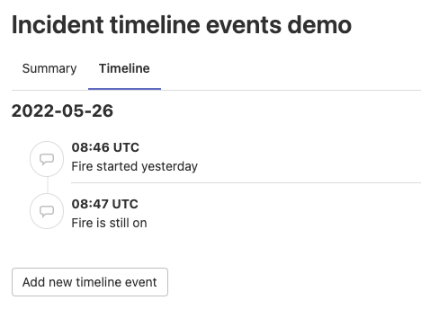



- Tier: 基础版，专业版，旗舰版
- Offering: JihuLab.com，私有化部署





- 在 极狐GitLab 15.2 中引入，关联功能标志 `incident_timeline`，默认启用。
- 在 极狐GitLab 15.3 中于 JihuLab.com 上启用。
- 在 极狐GitLab 15.5 中 GA，功能标志 `incident_timeline` 已移除。



事件时间线是事件记录留存的重要组成部分。
时间线可以向管理层和外部人员展示事件发生的过程，
以及为解决问题所采取的步骤。

## 查看时间线

事件时间线事件会按照日期和时间的升序排列。
它们以日期分组，并按发生时间的升序显示：

要查看某个事件的事件时间线：

1. 在顶部栏中，选择 **搜索或跳转到** 并找到你的项目。
1. 在左侧边栏中，选择 **监控** > **事件**。
1. 选择一个事件。
1. 选择 **时间线** 标签页。

## 创建事件

在 极狐GitLab 中，你可以通过多种方式创建时间线事件。

### 使用表单

使用表单手动创建时间线事件。

前提条件：

- 你必须具有该项目的 开发者、维护者 或 所有者 角色。

要创建时间线事件：

1. 在顶部栏中，选择 **搜索或跳转到** 并找到你的项目。
1. 在左侧边栏中，选择 **监控** > **事件**。
1. 选择一个事件。
1. 选择 **时间线** 标签页。
1. 选择 **添加新时间线事件**。
1. 填写必填字段。
1. 选择 **保存** 或 **保存并添加另一个事件**。

### 使用快速操作



- 在 极狐GitLab 15.4 中引入。



你可以使用 [`/timeline` 快速操作](../../user/project/quick_actions.md#timeline) 来创建时间线事件。

### 从事件的评论中创建



- 在 极狐GitLab 15.4 中引入。



前提条件：

- 你必须具有该项目的 开发者、维护者 或 所有者 角色。

> [!warning]
> 在公开和内部事件中，添加到事件时间线的内部备注对所有可以访问该事件的人可见。

要从事件的评论中创建时间线事件：

1. 在顶部栏中，选择 **搜索或跳转到** 并找到你的项目。
1. 在左侧边栏中，选择 **监控** > **事件**。
1. 选择一个事件。
1. 创建评论或选择一个已有的评论。
1. 在你想要添加的评论上，选择 **将评论添加到事件时间线**（）。

该评论会作为时间线事件显示在事件时间线上。

### 当事件严重性发生变化时



- 在 极狐GitLab 15.6 中引入。



当有人[更改事件的严重性](manage_incidents.md#change-severity)时，会创建一个新的时间线事件。

### 当标签发生变化时



- Status: Experiment





- 在 极狐GitLab 15.3 中引入，关联功能标志 `incident_timeline_events_from_labels`，默认禁用。



> [!flag]
> 此功能的可用性由功能标志控制。
> 更多信息，请参见历史记录。
> 此功能可用于测试，但不推荐用于生产环境。

当有人在事件上添加或移除[标签](../../user/project/labels.md)时，会创建一个新的时间线事件。

## 删除事件



- 在 极狐GitLab 15.7 中引入了编辑事件时删除事件的功能。



你还可以删除时间线事件。

前提条件：

- 你必须具有该项目的 开发者、维护者 或 所有者 角色。

要删除时间线事件：

1. 在顶部栏中，选择 **搜索或跳转到** 并找到你的项目。
1. 在左侧边栏中，选择 **监控** > **事件**。
1. 选择一个事件。
1. 选择 **时间线** 标签页。
1. 在时间线事件的右侧，选择 **更多操作**（），然后选择 **删除**。
1. 要确认，选择 **删除事件**。

或者：

1. 在时间线事件的右侧，选择 **更多操作**（），然后选择 **编辑**。
1. 选择 **删除**。
1. 要确认，选择 **删除事件**。

## 事件标签



- 在 极狐GitLab 15.9 中引入，关联功能标志 `incident_event_tags`，默认禁用。
- 在 极狐GitLab 15.9 中于 JihuLab.com 上启用。
- 在 极狐GitLab 15.10 中于私有化部署上启用。
- 在 极狐GitLab 15.11 中 GA，功能标志 `incident_event_tags` 已移除。



[当使用表单创建事件](#using-the-form)或编辑事件时，
你可以指定事件标签以捕获相关的事件时间戳。
时间线标签是可选的。每个事件可以选择多个标签。
当你创建时间线事件并选择标签时，事件备注会填充一条默认消息。
这样可以快速创建事件。如果已经设置了备注，则不会更改。
添加的标签会显示在时间戳旁边。

## 格式化规则

事件时间线事件支持以下 [极狐GitLab Flavored Markdown](../../user/markdown.md) 功能。

- [代码](../../user/markdown.md#code-spans-and-blocks)。
- [表情符号](../../user/markdown.md#emoji)。
- [强调](../../user/markdown.md#emphasis)。
- [极狐GitLab 特定引用](../../user/markdown.md#gitlab-specific-references)。
- [图像](../../user/markdown.md#images)，渲染为指向已上传图像的链接。
- [链接](../../user/markdown.md#links)。