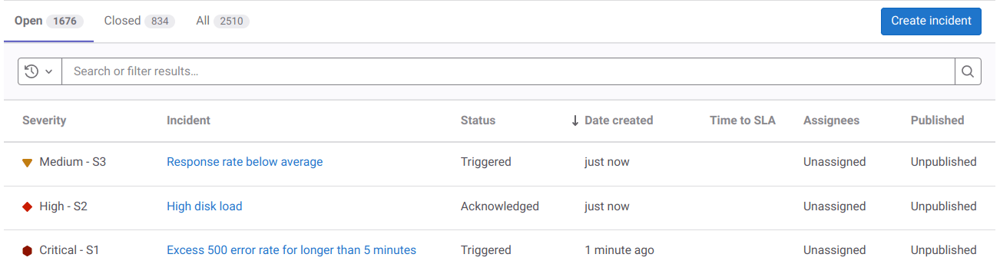
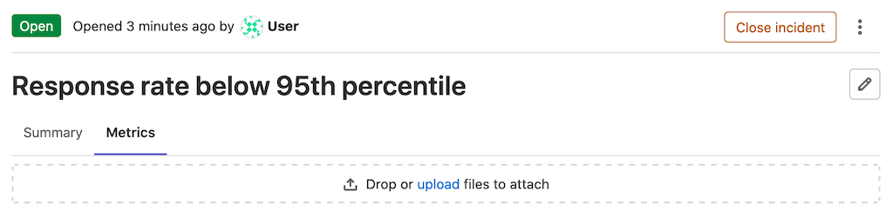
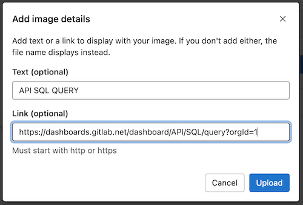
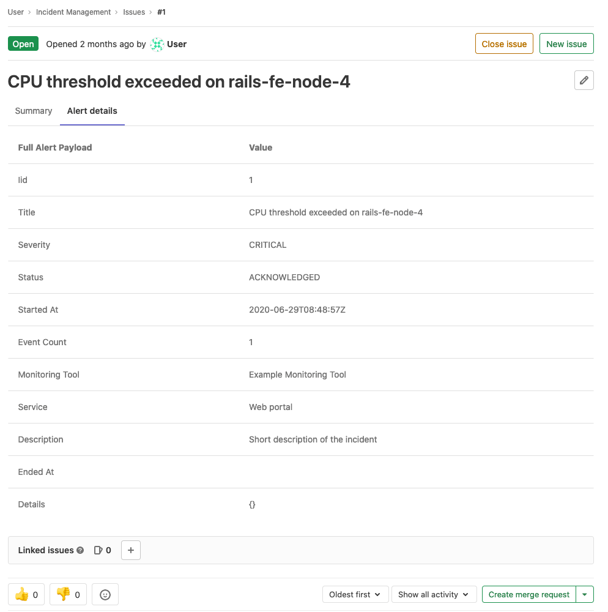



- Tier: 基础版，专业版，旗舰版
- Offering: JihuLab.com，私有化部署



事件是指需要紧急恢复的服务中断或故障。
事件在事件管理工作流中至关重要。
使用极狐GitLab 进行分类、响应和修复事件。

## 事件列表

当你[查看事件列表](manage_incidents.md#view-a-list-of-incidents)时，它包含以下内容：

- **状态**：要按事件的状态进行筛选，请在事件列表上方选择 **打开**、**已关闭**
  或 **全部**。
- **搜索**：搜索事件的标题和描述，或[筛选列表](#filter-the-incidents-list)。
- **严重程度**：特定事件的严重程度，可以为以下值之一：
  -  严重 - S1
  -  高 - S2
  -  中 - S3
  -  低 - S4
  -  未知
- **事件**：事件的标题，尝试捕获最有意义的信息。
- **状态**：事件的状态，可以为以下值之一：
  - 已触发
  - 已确认
  - 已解决

  在专业版或旗舰版中，此字段还关联事件的[待命升级](paging.md#escalating-an-incident)。

- **创建日期**：事件创建后多久。此字段使用极狐GitLab 标准的 `X time ago` 模式。将鼠标悬停在此值上可查看根据你的区域设置格式化的确切日期和时间。
- **指派人**：分配给事件的用户。
- **已发布**：事件是否已发布到[状态页面](status_page.md)。

有关事件列表的实际操作示例，请查看此
[演示项目](https://jihulab.com/gitlab-cn/monitor/monitor-sandbox/-/incidents)。

### 排序事件列表

事件列表显示的事件按创建日期排序，最新的显示在最前面。

要按其他列排序，或更改排序顺序，请选择该列。

可以排序的列包括：

- 严重程度
- 状态
- 距离 SLA 时间
- 已发布

### 筛选事件列表

要按作者或指派人筛选事件列表，请在搜索框中输入这些值。

## 事件详情

### 摘要

事件的摘要部分提供了有关事件的重要详细信息，以及议题模板的内容（如果[已选择](alerts.md#trigger-actions-from-alerts)）。事件顶部的高亮栏从左到右显示：

- 指向原始告警的链接。
- 告警开始时间。
- 事件计数。

在高亮栏下方，摘要包含以下字段：

- 开始时间
- 严重程度
- `full_query`
- 监控工具

事件摘要可以使用
[极狐GitLab 风格 Markdown](../../user/markdown.md)进一步自定义。

如果事件是从[告警创建](alerts.md#trigger-actions-from-alerts)的，并且告警提供了 Markdown，那么该 Markdown 会附加到摘要中。如果为项目配置了事件模板，则模板内容会附加在末尾。

评论以话题形式显示，但也可以通过[切换最近更新视图](#recent-updates-view)按时间顺序显示。

当你对事件进行更改时，极狐GitLab 会创建[系统笔记](../../user/project/system_notes.md)，并显示在摘要下方。

### 指标



- Tier: 专业版，旗舰版
- Offering: JihuLab.com，私有化部署



在许多情况下，事件与指标相关联。你可以在 **指标** 选项卡中上传指标图表的屏幕截图：

上传图片时，可以将图片与文本或指向原始图表的链接关联。

如果添加了链接，你可以通过选择上传图片上方的超链接来访问原始图表。

### 告警详情

事件在单独的选项卡中显示关联告警的详细信息。要填充此选项卡，事件必须是在创建时关联了告警。从告警自动创建的事件会填充此字段。

### 时间线事件

事件时间线提供了事件发生期间的高级概览，以及为解决问题所采取的步骤。

阅读更多关于[时间线事件](incident_timeline_events.md)以及如何启用此功能的信息。

### 最近更新视图



- Tier: 专业版，旗舰版
- Offering: JihuLab.com，私有化部署



要查看事件的最新更新，请在评论栏上选择
**开启最近更新视图**（）。评论会以非话题形式按从新到旧的顺序显示。

### 服务级别协议倒计时器



- Tier: 专业版，旗舰版
- Offering: JihuLab.com，私有化部署



你可以在事件上启用服务级别协议倒计时器，以跟踪你与客户签订的服务级别协议（SLA）。计时器会在事件创建时自动启动，并显示在 SLA 期限到期前的剩余时间。计时器还会每 15 分钟动态更新一次，因此你无需刷新页面即可查看剩余时间。

先决条件：

- 你必须具有项目的维护者或所有者角色。

配置计时器：

1. 在顶部栏中，选择 **搜索或跳转到** 并找到你的项目。
1. 在左侧边栏中，选择 **设置** > **监控**。
1. 展开 **事件** 部分，然后选择 **事件设置** 选项卡。
1. 选择 **激活“距离 SLA 时间”倒计时器**。
1. 以 15 分钟为增量设置时间限制。
1. 选择 **保存更改**。

启用 SLA 倒计时器后，**距离 SLA 时间** 列在事件列表中可用，并作为新事件的一个字段。如果事件在 SLA 期限结束前未关闭，极狐GitLab 会为该事件添加一个 `missed::SLA` 标签。

## 相关主题

- [创建事件](manage_incidents.md#create-an-incident)
- 当告警被触发时[自动创建事件](alerts.md#trigger-actions-from-alerts)
- [查看事件列表](manage_incidents.md#view-a-list-of-incidents)
- [分配给用户](manage_incidents.md#assign-to-a-user)
- [更改事件严重程度](manage_incidents.md#change-severity)
- [更改事件状态](manage_incidents.md#change-status)
- [更改升级策略](manage_incidents.md#change-escalation-policy)
- [关闭事件](manage_incidents.md#close-an-incident)
- [通过恢复告警自动关闭事件](manage_incidents.md#automatically-close-incidents-via-recovery-alerts)
- [添加待办事项](../../user/todos.md#create-a-to-do-item)
- [添加标签](../../user/project/labels.md)
- [分配里程碑](../../user/project/milestones/_index.md)
- [将事件设为保密](../../user/project/issues/confidential_issues.md)
- [设置截止日期](../../user/project/issues/due_dates.md)
- [切换通知](../../user/profile/notifications.md#subscribe-to-notifications-for-a-specific-issue-merge-request-or-epic)
- [跟踪花费的时间](../../user/project/time_tracking.md)
- [向事件添加 Zoom 会议](../../user/project/issues/associate_zoom_meeting.md)，方法与向议题添加会议相同
- [事件中的关联资源](linked_resources.md)
- [直接从 Slack](slack.md)创建事件并接收事件通知
- 使用[议题 API](../../api/issues.md)与事件进行交互