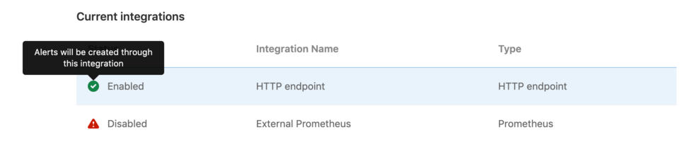
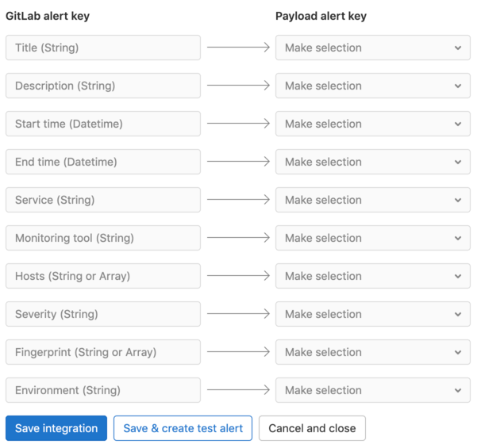
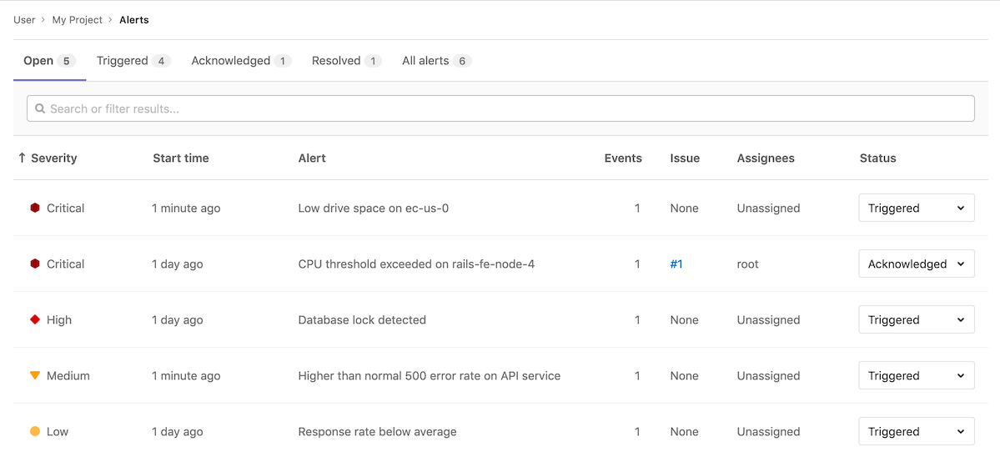



- Tier: 基础版，专业版，旗舰版
- Offering: JihuLab.com，私有化部署



极狐GitLab 可以通过 webhook 接收器接受来自任何来源的告警。[告警通知](alerts.md) 可以为值班轮换[触发寻呼](paging.md#paging)，或用于[创建事件](manage_incidents.md#from-an-alert)。

<a id="integrations-list"></a>

## 集成列表

拥有维护者或所有者角色，你可以通过导航到项目侧边栏菜单中的 **设置** > **监控**，并展开 **告警** 部分，查看已配置的告警集成列表。该列表显示集成名称、类型和状态（已启用或已禁用）：



<a id="configuration"></a>

## 配置

极狐GitLab 可以通过你配置的 HTTP 端点接收告警。

<a id="single-alerting-endpoint"></a>

### 单一告警端点

在极狐GitLab 项目中启用告警端点，即可激活它以 JSON 格式接收告警载荷。你可以随时根据需要[自定义载荷](#customize-the-alert-payload-outside-of-gitlab)。

1. 以拥有项目的维护者角色的用户身份登录极狐GitLab。
1. 转到项目中的 **设置** > **监控**。
1. 展开 **告警** 部分，在 **选择集成类型** 下拉列表中，如果要接收来自 Prometheus 的告警，选择 **Prometheus**；如果是其他监控工具，选择 **HTTP 端点**。
1. 切换 **激活** 告警设置。保存集成后，你可以在 **查看凭证** 选项卡中找到 webhook 配置的 URL 和授权密钥。你还必须在外部服务中输入该 URL 和授权密钥。

<a id="alerting-endpoints"></a>

### 告警端点



- Tier: 专业版，旗舰版
- Offering: JihuLab.com，私有化部署



在 [极狐GitLab 专业版](https://gitlab.cn/pricing) 中，你可以创建多个唯一的告警端点，以 JSON 格式接收来自任何外部来源的告警，并且你可以[自定义载荷](#customize-the-alert-payload-outside-of-gitlab)。

1. 以拥有项目的维护者角色的用户身份登录极狐GitLab。
1. 转到项目中的 **设置** > **监控**。
1. 展开 **告警** 部分。
1. 对于你要创建的每个端点：

   1. 选择 **添加新集成**。
   1. 在 **选择集成类型** 下拉列表中，如果要接收来自 Prometheus 的告警，选择 **Prometheus**；如果是其他监控工具，选择 **HTTP 端点**。详见详细信息
   1. 为集成命名。
   1. 切换 **激活** 告警设置。保存集成后，你可以在 **查看凭证** 选项卡中找到 webhook 配置的 **URL** 和 **授权密钥**。你还必须在外部服务中输入该 URL 和授权密钥。
   1. 可选。要将监控工具的告警字段映射到极狐GitLab 字段，请输入示例载荷，然后选择 **解析载荷进行自定义映射**。需要有效的 JSON。如果更新示例载荷，也必须重新映射字段。对于 Prometheus 集成，请输入载荷中 `alerts` 键下的单个告警，而不是整个载荷。

   1. 可选。如果提供了有效的示例载荷，请在 **载荷告警键** 中选择每个值，以[映射到 **极狐GitLab 告警键**](#map-fields-in-custom-alerts)。
   1. 要保存集成，请选择 **保存集成**。如果需要，你可以在集成创建后，从集成的 **发送测试告警** 选项卡发送测试告警。

新的 HTTP 端点会显示在[集成列表](#integrations-list)中。你可以通过选择集成列表右侧的  设置图标来编辑集成。

<a id="map-fields-in-custom-alerts"></a>

#### 在自定义告警中映射字段

你可以将监控工具的告警格式与极狐GitLab 告警集成。要在[告警列表](alerts.md#alert-list)和[告警详情页面](alerts.md#alert-details-page)中显示正确的信息，请在[创建 HTTP 端点](#alerting-endpoints)时将告警字段映射到极狐GitLab 字段：



<a id="add-integration-credentials-to-alertmanager-(prometheus-integrations-only)"></a>

### 将集成凭证添加到 Alertmanager（仅限 Prometheus 集成）

要将 Prometheus 告警通知发送到极狐GitLab，请将 [Prometheus 集成](#single-alerting-endpoint)中的 URL 和授权密钥复制到 Prometheus Alertmanager 配置的 [`webhook_configs`](https://prometheus.io/docs/alerting/latest/configuration/#webhook_config) 部分：

```yaml
receivers:
  - name: gitlab
    webhook_configs:
      - http_config:
          authorization:
            type: Bearer
            credentials: 1234567890abdcdefg
        send_resolved: true
        url: http://IP_ADDRESS:PORT/root/manual_prometheus/prometheus/alerts/notify.json
        # 其余配置已省略
        # ...
```

<a id="customize-the-alert-payload-outside-of-gitlab"></a>

## 在极狐GitLab 之外自定义告警载荷

<a id="expected-http-request-attributes"></a>

### 预期的 HTTP 请求属性

对于没有[自定义映射](#map-fields-in-custom-alerts)的 HTTP 端点，你可以通过发送以下参数来自定义载荷。所有字段都是可选的。如果传入的告警没有包含 `Title` 字段的值，则会应用默认值“新告警”。

| 属性                      | 类型            | 描述 |
| ------------------------- | --------------- | ----------- |
| `title`                   | 字符串          | 告警的标题。|
| `description`             | 字符串          | 问题的高级别摘要。 |
| `start_time`              | 日期时间        | 告警时间。如果没有提供，则使用当前时间。 |
| `end_time`                | 日期时间        | 告警的解决时间。如果提供，则告警被解决。 |
| `service`                 | 字符串          | 受影响的服务。 |
| `monitoring_tool`         | 字符串          | 关联的监控工具名称。 |
| `hosts`                   | 字符串或数组    | 一个或多个主机，指示此事件发生的位置。 |
| `severity`                | 字符串          | 告警的严重程度。不区分大小写。可以是以下值之一：`critical`、`high`、`medium`、`low`、`info`、`unknown`。如果缺失或值不在此列表中，则默认为 `critical`。 |
| `fingerprint`             | 字符串或数组    | 告警的唯一标识符。可用于对同一告警的出现进行分组。当 `generic_alert_fingerprinting` 功能启用时，指纹将根据载荷自动生成（排除 `start_time`、`end_time` 和 `hosts` 参数）。 |
| `gitlab_environment_name` | 字符串          | 关联的极狐GitLab [环境](../../ci/environments/_index.md)的名称。需要在[仪表板上显示告警](../../user/operations_dashboard/_index.md#adding-a-project-to-the-dashboard)所必需。 |

你也可以向告警的载荷添加自定义字段。额外参数的值不限于原始类型（如字符串或数字），而是可以成为嵌套的 JSON 对象。例如：

```json
{ "foo": { "bar": { "baz": 42 } } }
```

> [!note]
> 确保你的请求小于
> [载荷应用程序限制](../../administration/instance_limits.md#generic-alert-json-payloads)。

<a id="example-request-body"></a>

#### 请求体示例

示例载荷：

```json
{
  "title": "事件标题",
  "description": "事件的简短描述",
  "start_time": "2019-09-12T06:00:55Z",
  "service": "受影响的服务",
  "monitoring_tool": "value",
  "hosts": "value",
  "severity": "high",
  "fingerprint": "d19381d4e8ebca87b55cda6e8eee7385",
  "foo": {
    "bar": {
      "baz": 42
    }
  }
}
```

<a id="expected-prometheus-request-attributes"></a>

### 预期的 Prometheus 请求属性

告警应以 Prometheus [webhook 接收器](https://prometheus.io/docs/alerting/latest/configuration/#webhook_config)的格式进行格式化。

顶层必需属性：

- `alerts`
- `commonAnnotations`
- `commonLabels`
- `externalURL`
- `groupKey`
- `groupLabels`
- `receiver`
- `status`
- `version`

根据 Prometheus 载荷中的 `alerts`，会为数组中的每个条目创建一个极狐GitLab 告警。你可以更改下面列出的嵌套参数来配置极狐GitLab 告警。

| 属性                                                                  | 类型     | 必需 | 描述                          |
| -------------------------------------------------------------------------- | -------- | -------- | ------------------------------------ |
| 以下之一 `annotations/title`、`annotations/summary` 或 `labels/alertname`   | 字符串   | 是      | 告警的标题。              |
| `startsAt`                                                                 | 日期时间 | 是      | 告警的开始时间。         |
| `annotations/description`                                                  | 字符串   | 否       | 问题的高级别摘要。 |
| `annotations/gitlab_incident_markdown`                                     | 字符串   | 否       | 从告警创建的任何事件后将追加的[极狐GitLab Flavored Markdown](../../user/markdown.md)。 |
| `annotations/runbook`                                                      | 字符串   | 否       | 指向如何管理此告警的文档或说明的链接。 |
| `endsAt`                                                                   | 日期时间 | 否       | 告警的解决时间。    |
| `g0.expr` query parameter in `generatorUrl`                                | 字符串   | 否       | 关联指标的查询。          |
| `labels/gitlab_environment_name`                                           | 字符串   | 否       | 关联的极狐GitLab [环境](../../ci/environments/_index.md)的名称。需要在[仪表板上显示告警](../../user/operations_dashboard/_index.md#adding-a-project-to-the-dashboard)所必需。 |
| `labels/severity`                                                          | 字符串   | 否       | 告警的严重程度。应为 [Prometheus 严重程度选项](#prometheus-severity-options)之一。如果缺失或值不在此列表中，则默认为 `critical`。 |
| `status`                                                                   | 字符串   | 否       | 告警在 Prometheus 中的状态。如果值为 'resolved'，则告警被解决。 |
| 以下之一 `annotations/gitlab_y_label`、`annotations/title`、`annotations/summary` 或 `labels/alertname` | 字符串 | 否 | 在[极狐GitLab Flavored Markdown](../../user/markdown.md)中嵌入此告警的指标时使用的 Y 轴标签。 |

`annotations` 下包含的其他属性可在[告警详情页面](alerts.md#alert-details-page)上看到。其他任何属性都会被忽略。

属性不限于原始类型（如字符串或数字），而是可以成为嵌套的 JSON 对象。例如：

```json
{
    "target": {
        "user": {
            "id": 42
        }
    }
}
```

> [!note]
> 确保你的请求小于
> [载荷应用程序限制](../../administration/instance_limits.md#generic-alert-json-payloads)。

<a id="prometheus-severity-options"></a>

#### Prometheus 严重程度选项

来自 Prometheus 的告警可以为[告警严重程度](alerts.md#alert-severity)提供以下任意不区分大小写的值：

- **严重**：`critical`、`s1`、`p1`、`emergency`、`fatal`
- **高**：`high`、`s2`、`p2`、`major`、`page`
- **中**：`medium`、`s3`、`p3`、`error`、`alert`
- **低**：`low`、`s4`、`p4`、`warn`、`warning`
- **信息**：`info`、`s5`、`p5`、`debug`、`information`、`notice`

严重程度默认为 `critical`，如果缺失或不在列表中。

<a id="example-prometheus-alert"></a>

#### Prometheus 告警示例

示例告警规则：

```yaml
groups:
- name: example
  rules:
  - alert: ServiceDown
    expr: up == 0
    for: 5m
    labels:
      severity: high
    annotations:
      title: "示例标题"
      runbook: "http://example.com/my-alert-runbook"
      description: "服务已宕机超过 5 分钟。"
      gitlab_y_label: "y 轴标签"
      foo:
        bar:
          baz: 42
```

示例请求载荷：

```json
{
  "version" : "4",
  "groupKey": null,
  "status": "firing",
  "receiver": "",
  "groupLabels": {},
  "commonLabels": {},
  "commonAnnotations": {},
  "externalURL": "",
  "alerts": [{
    "startsAt": "2022-010-30T11:22:40Z",
    "generatorURL": "http://host?g0.expr=up",
    "endsAt": null,
    "status": "firing",
    "labels": {
      "gitlab_environment_name": "production",
      "severity": "high"
    },
    "annotations": {
      "title": "示例标题",
      "runbook": "http://example.com/my-alert-runbook",
      "description": "服务已宕机超过 5 分钟。",
      "gitlab_y_label": "y 轴标签",
      "foo": {
        "bar": {
          "baz": 42
        }
      }
    }
  }]
}
```

> [!note]
> 在[触发测试告警](#triggering-test-alerts)时，输入完整的示例如所示的整体载荷。
> 在[配置自定义映射](#map-fields-in-custom-alerts)时，仅输入 `alerts` 数组中的第一项作为示例载荷。

<a id="authorization"></a>

## 授权

支持以下授权方法：

- Bearer 授权头
- 基本认证

可以在配置告警集成时找到 `<authorization_key>` 和 `<url>` 值。

<a id="bearer-authorization-header"></a>

### Bearer 授权头

授权密钥可以用作 Bearer 令牌：

```shell
curl --request POST \
  --data '{"title": "事件标题"}' \
  --header "Authorization: Bearer <authorization_key>" \
  --header "Content-Type: application/json" \
  <url>
```

<a id="basic-authentication"></a>

### 基本认证

授权密钥可以用作 `password`。`username` 留空：

- username: `<blank>`
- password: `<authorization_key>`

```shell
curl --request POST \
  --data '{"title": "事件标题"}' \
  --header "Authorization: Basic <base_64_encoded_credentials>" \
  --header "Content-Type: application/json" \
  <url>
```

基本认证也可以直接在 URL 中使用凭证：

```shell
curl --request POST \
  --data '{"title": "事件标题"}' \
  --header "Content-Type: application/json" \
  <username:password@url>
```

> [!warning]
> 在 URL 中使用授权密钥是不安全的，因为它会在服务器日志中可见。如果工具支持，我们建议使用之前描述的标头选项之一。

<a id="response-body"></a>

## 响应体

JSON 响应体包含在请求中创建的任何告警的列表：

```json
[
  {
    "iid": 1,
    "title": "事件标题"
  },
  {
    "iid": 2,
    "title": "第二个事件标题"
  }
]
```

成功响应返回 `200` 状态码。

<a id="triggering-test-alerts"></a>

## 触发测试告警

在[项目维护者或所有者](../../user/permissions.md)配置集成后，你可以触发测试告警来确认集成正常工作。

1. 以开发者、维护者或所有者角色登录。
1. 转到项目中的 **设置** > **监控**。
1. 选择 **告警** 以展开该部分。
1. 在[列表](#integrations-list)中，选择集成右侧的  设置图标。
1. 选择 **发送测试告警** 选项卡将其打开。
1. 在载荷字段中输入测试载荷（需要有效的 JSON）。
1. 选择 **发送**。

极狐GitLab 会根据测试结果显示错误或成功消息。

<a id="automatic-grouping-of-identical-alerts"></a>

## 相同告警的自动分组



- Tier: 专业版，旗舰版
- Offering: JihuLab.com，私有化部署



极狐GitLab 根据载荷对告警进行分组。当传入的告警包含与另一个告警相同的载荷（不包括 `start_time` 和 `hosts` 属性）时，极狐GitLab 将这些告警分组在一起，并在[告警管理列表](incidents.md)和详情页面上显示一个计数器。

如果现有告警已经是 `resolved` 状态，则极狐GitLab 会创建一个新告警。



<a id="recovery-alerts"></a>

## 恢复告警

当 HTTP 端点收到设置了告警结束时间的载荷时，极狐GitLab 中的告警会自动解决。对于没有[自定义映射](#map-fields-in-custom-alerts)的 HTTP 端点，预期的字段是 `end_time`。使用自定义映射，你可以选择预期的字段。

极狐GitLab 根据可作为载荷一部分提供的 `fingerprint` 值来确定要解决哪个告警。
有关告警属性和映射的更多信息，请参见[在极狐GitLab 之外自定义告警载荷](#customize-the-alert-payload-outside-of-gitlab)。

你还可以配置在告警解决时自动[关闭关联的事件](manage_incidents.md#automatically-close-incidents-via-recovery-alerts)。

<a id="link-to-your-opsgenie-alerts"></a>

## 链接到你的 Opsgenie 告警



- Tier: 专业版，旗舰版
- Offering: JihuLab.com，私有化部署





- 在极狐GitLab 13.2 中引入。



> [!warning]
> 我们正在通过 [HTTP 端点集成](#single-alerting-endpoint) 构建与 Opsgenie 和其他告警工具的更深入集成，以便你可以在极狐GitLab 界面中查看告警。

你可以使用极狐GitLab 与 [Opsgenie](https://www.atlassian.com/software/opsgenie) 的集成来监控告警。

如果启用了 Opsgenie 集成，则不能同时激活其他极狐GitLab 告警服务。

要启用 Opsgenie 集成：

1. 以维护者或所有者角色登录。
1. 转到 **监控** > **告警**。
1. 在 **集成** 选择框中，选择 **Opsgenie**。
1. 选择 **激活** 切换开关。
1. 在 **API URL** 字段中，输入 Opsgenie 集成的基本 URL，例如 `https://app.opsgenie.com/alert/list`。
1. 选择 **保存更改**。

启用集成后，转到 **监控** > **告警** 的 **告警** 页面，然后选择 **在 Opsgenie 中查看告警**。