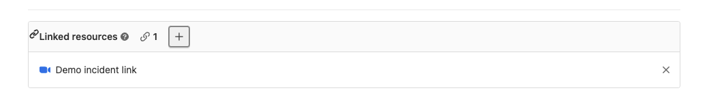



- Tier: 专业版，旗舰版
- Offering: JihuLab.com，私有化部署





- 在极狐GitLab 15.3 中引入，使用名为 `incident_resource_links_widget` 的功能标志，默认禁用。
- 在极狐GitLab 15.3 中于 JihuLab.com 上启用。
- 在极狐GitLab 15.5 中 GA。功能标志 `incident_resource_links_widget` 已移除。



为了帮助团队成员找到重要链接而无需搜索大量评论，你可以为事件议题添加关联资源。

你可能想要链接的资源包括：

- 事件 Slack 频道
- Zoom 会议
- 用于解决事件的资源

<a id="view-linked-resources-of-an-incident"></a>

## 查看事件的关联资源

事件的关联资源列在 **摘要** 标签页下。



要查看事件的关联资源：

1. 在顶部栏中，选择 **搜索或跳转到** 并找到你的项目。
1. 在左侧边栏中，选择 **监控** > **事件**。
1. 选择一个事件。

<a id="add-a-linked-resource"></a>

## 添加关联资源

从事件中手动添加关联资源。

先决条件：

- 你必须具有项目的报告者、开发者、维护者或所有者角色。

要添加关联资源：

1. 在顶部栏中，选择 **搜索或跳转到** 并找到你的项目。
1. 在左侧边栏中，选择 **监控** > **事件**。
1. 选择一个事件。
1. 在 **关联资源** 部分，选择加号图标 ()。
1. 填写必填字段。
1. 选择 **添加**。

<a id="using-a-quick-action"></a>

### 使用快速操作



- 在极狐GitLab 15.5 中引入。



要向事件添加多个链接，使用 [`/link` 快速操作](../../user/project/quick_actions.md#link)：

```plaintext
/link https://example.link.us/j/123456789
```

你也可以随链接提交简短描述。该描述将代替 URL 显示在事件的 **关联资源** 部分：

```plaintext
/link https://example.link.us/j/123456789 多个告警触发
```

<a id="link-zoom-meetings-from-an-incident"></a>

### 从事件链接 Zoom 会议



- 在极狐GitLab 15.4 中引入。



使用 [`/zoom` 快速操作](../../user/project/quick_actions.md#zoom) 向事件添加多个 Zoom 链接：

```plaintext
/zoom https://example.zoom.us/j/123456789
```

你也可以随链接提交可选的简短描述。该描述将代替 URL 显示在事件议题的 **关联资源** 部分：

```plaintext
/zoom https://example.zoom.us/j/123456789 内存不足事件
```

<a id="remove-a-linked-resource"></a>

## 移除关联资源

你也可以移除关联资源。

先决条件：

- 你必须具有项目的报告者、开发者、维护者或所有者角色。

要移除关联资源：

1. 在顶部栏中，选择 **搜索或跳转到** 并找到你的项目。
1. 在左侧边栏中，选择 **监控** > **事件**。
1. 选择一个事件。
1. 在 **关联资源** 部分，选择 **移除** ()。