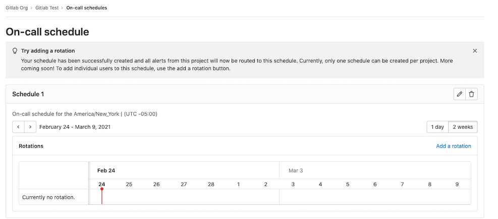
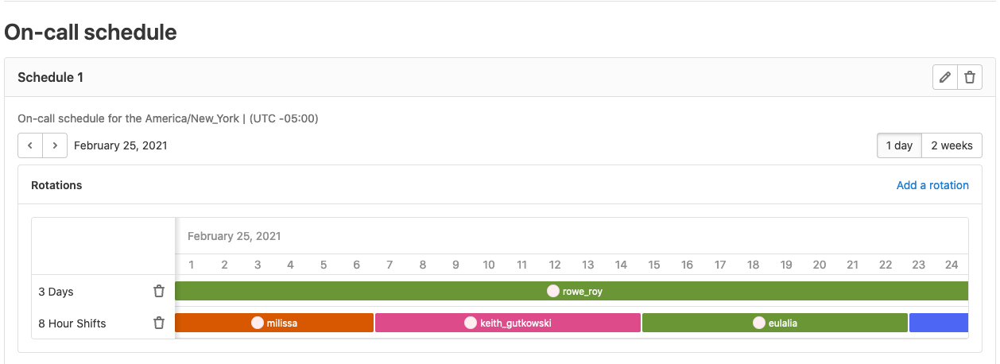



- Tier: 专业版，旗舰版
- Offering: JihuLab.com，私有化部署



使用值班排班管理为值班人员创建排班，以轮换值班职责。通过将团队设置为值班，维护软件服务的可用性。通过[升级策略](escalation_policies.md)和值班排班，你的团队在出现问题时能立即收到通知，从而快速响应服务中断和故障。

使用值班排班的步骤：

1. [创建排班](#排班)。
1. [向排班添加轮换](#轮换)。

## 排班

为你的团队设置值班排班，以便添加轮换。

前置条件：

- 你必须具有维护者或所有者角色。

创建值班排班：

1. 在顶部栏中，选择 **搜索或跳转到** 并找到你的项目。
1. 在左侧边栏中，选择 **监控** > **值班排班**。
1. 选择 **添加排班**。
1. 输入排班的名称和描述，并选择时区。
1. 选择 **添加排班**。

你现在拥有一个没有轮换的空排班。这将呈现为空状态，提示你为排班创建[轮换](#轮换)。

### 编辑排班

更新排班：

1. 在顶部栏中，选择 **搜索或跳转到** 并找到你的项目。
1. 在左侧边栏中，选择 **监控** > **值班排班**。
1. 选择 **编辑排班** ()。
1. 编辑信息。
1. 选择 **保存更改**。

如果你更改了排班的时区，极狐GitLab 会自动将轮换的限制时间区间（如果已设置）更新为新时区中对应的时间。

### 删除排班

删除排班：

1. 在顶部栏中，选择 **搜索或跳转到** 并找到你的项目。
1. 在左侧边栏中，选择 **监控** > **值班排班**。
1. 选择 **删除排班** ()。
1. 在确认对话框中，选择 **删除排班**。

## 轮换

向现有排班添加轮换，将你的团队成员设置为值班。

创建轮换：

1. 在顶部栏中，选择 **搜索或跳转到** 并找到你的项目。
1. 在左侧边栏中，选择 **监控** > **值班排班**。
1. 选择 **添加轮换** 链接。
1. 输入以下信息：

   - **名称**：你的轮换名称。
   - **参与者**：你想要加入轮换的人员。
   - **轮换时长**：轮换的持续时间。
   - **开始于**：轮换开始的日期和时间。
   - **启用结束日期**：开启开关后，你可以选择轮换结束的日期和时间。
   - **限制时间区间**：开启开关后，你可以将轮换限制在你选择的时间段内。

### 编辑轮换

编辑轮换：

1. 在顶部栏中，选择 **搜索或跳转到** 并找到你的项目。
1. 在左侧边栏中，选择 **监控** > **值班排班**。
1. 在 **轮换** 部分，选择 **编辑轮换** ()。
1. 编辑信息。
1. 选择 **保存更改**。

### 删除轮换

删除轮换：

1. 在顶部栏中，选择 **搜索或跳转到** 并找到你的项目。
1. 在左侧边栏中，选择 **监控** > **值班排班**。
1. 在 **轮换** 部分，选择 **删除轮换** ()。
1. 在确认对话框中，选择 **删除轮换**。

## 查看排班轮换

你可以查看单天或两周的值班排班。要在这两个时间段之间切换，请选择排班上的 **1 天** 或 **2 周** 按钮。默认视图为两周。

将鼠标悬停在排班中的任何轮换班次参与者上，可以查看他们的个人班次详情。

## 呼叫值班响应者

更多详情请参见[呼叫](paging.md#paging)。

## 移除或删除值班用户

如果值班用户被从项目或群组中移除，或其账户被删除，确认对话框会显示该用户的值班排班列表。如果确认移除或删除该用户，极狐GitLab 会重新计算值班轮换，并向项目所有者和轮换参与者发送邮件。