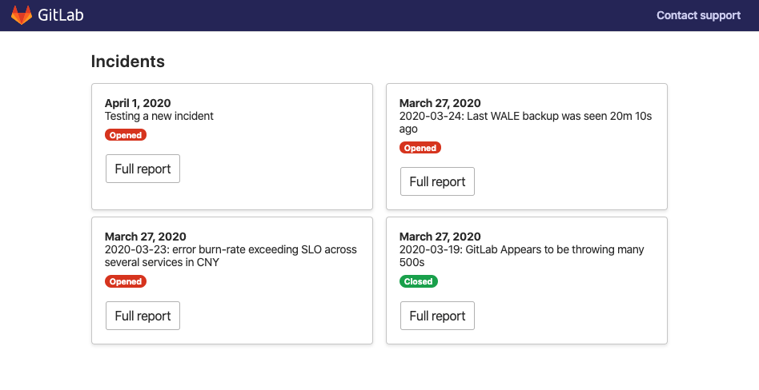
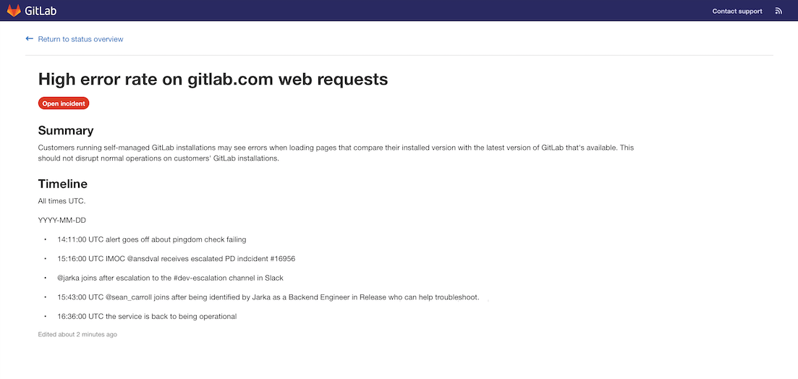
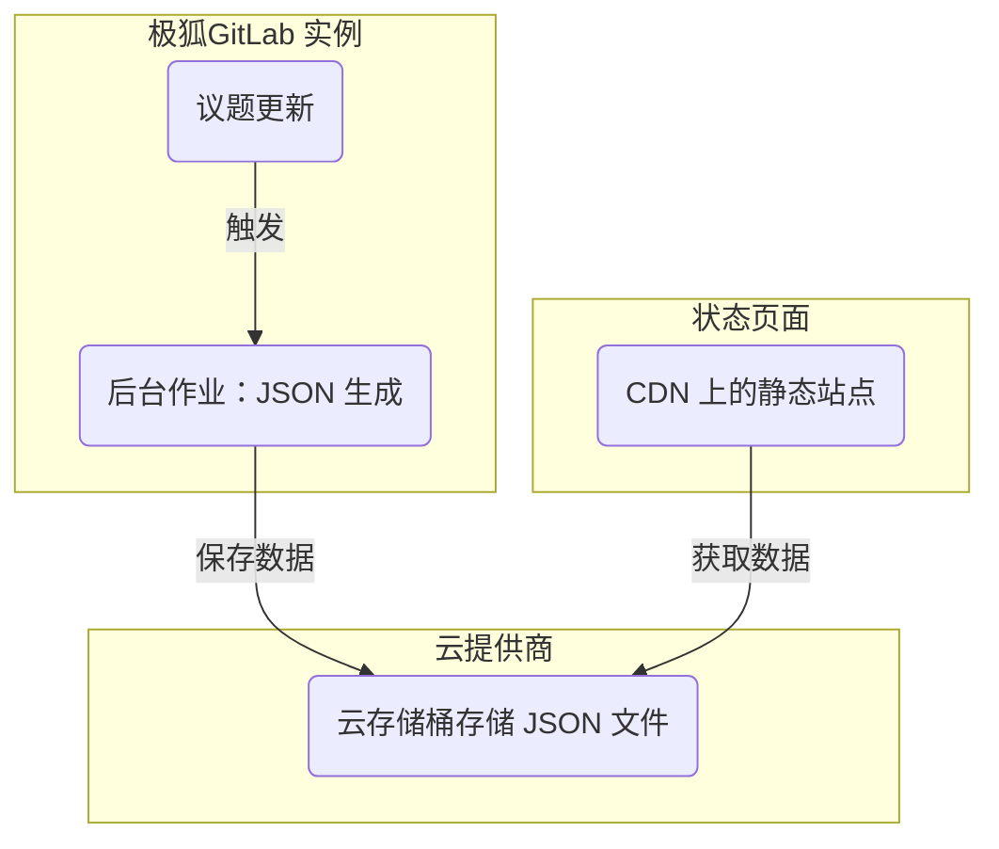
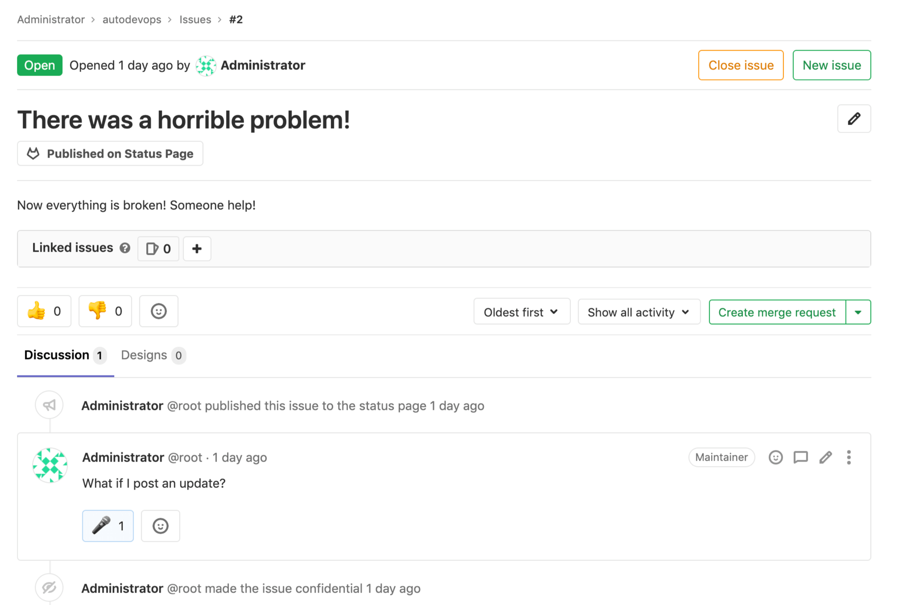



- Tier: 旗舰版
- Offering: JihuLab.com，私有化部署



## 状态页面

通过极狐GitLab 状态页面，您可以创建并部署一个静态网站，以便在事件期间高效地与用户沟通。状态页面着陆页显示近期事件的概览：

选择一个事件会显示一个详情页面，其中包含有关特定事件的更多信息：

- 事件状态，包括事件上次更新的时间。
- 事件标题，包括任何表情符号。
- 事件描述，包括表情符号。
- 事件描述或评论中附加的任何文件，需具有有效的图像扩展名。
- 按时间顺序排列的事件更新列表。

## 设置状态页面

要配置极狐GitLab 状态页面，您必须：

1. [使用云提供商信息配置极狐GitLab](#configure-gitlab-with-cloud-provider-information)。
1. [配置您的 AWS 账户](#configure-your-aws-account)。
1. [在极狐GitLab 上创建状态页面项目](#create-a-status-page-project)。
1. [将事件同步到状态页面](#sync-incidents-to-the-status-page)。

### 使用云提供商信息配置极狐GitLab

仅支持 AWS S3 作为部署目标。

先决条件：

- 您必须具备维护者或所有者角色。

要向极狐GitLab 提供将内容推送到您的状态页面所需的 AWS 账户信息：

1. 在顶部栏中，选择 **搜索或跳转到** 并找到您的项目。
1. 在左侧边栏中，选择 **设置** > **监控**。
1. 展开 **状态页面**。
1. 选中 **激活** 复选框。
1. 在 **状态页面 URL** 框中，提供您的外部状态页面的 URL。
1. 在 **S3 存储桶名称** 框中，输入您的 S3 存储桶名称。有关更多信息，请参阅
   [存储桶配置文档](https://docs.aws.amazon.com/AmazonS3/latest/dev/HostingWebsiteOnS3Setup.html)。
1. 在 **AWS 区域** 框中，输入您的存储桶所在的区域。有关更多信息，请参阅
   [AWS 文档](https://github.com/aws/aws-sdk-ruby#configuration)。
1. 输入您的 **AWS 访问密钥 ID** 和 **AWS 秘密访问密钥**。
1. 选择 **保存更改**。

### 配置您的 AWS 账户

1. 在您的 AWS 账户中，使用以下文件作为示例创建两个新的 IAM 策略：
   - [创建存储桶](https://jihulab.com/gitlab-cn/status-page/-/blob/master/deploy/etc/s3_create_policy.json)。
   - [更新存储桶内容](https://jihulab.com/gitlab-cn/status-page/-/blob/master/deploy/etc/s3_update_bucket_policy.json)（请记得将 `S3_BUCKET_NAME` 替换为您的存储桶名称）。
1. 使用第一步中创建的权限策略创建一个新的 AWS 访问密钥。

### 创建状态页面项目

配置 AWS 账户后，您必须添加状态页面项目并配置必要的 CI/CD 变量以将状态页面部署到 AWS S3：

1. Fork [状态页面](https://jihulab.com/gitlab-cn/status-page) 项目。
   您可以通过 [仓库镜像](https://jihulab.com/gitlab-cn/status-page#repository-mirroring) 来实现，
   这可以确保您获得最新的状态页面功能。
1. 在左侧边栏中，选择 **设置** > **CI/CD**。
1. 展开 **变量**。
1. 添加以下来自 Amazon 控制台的变量：
   - `S3_BUCKET_NAME` - Amazon S3 存储桶的名称。
     如果不存在具有该名称的存储桶，第一次流水线运行会创建一个并将其配置为
     [静态网站托管](https://docs.aws.amazon.com/AmazonS3/latest/dev/HostingWebsiteOnS3Setup.html)。

   - `AWS_DEFAULT_REGION` - AWS 区域。
   - `AWS_ACCESS_KEY_ID` - AWS 访问密钥 ID。
   - `AWS_SECRET_ACCESS_KEY` - AWS 秘密。
1. 在左侧边栏中，选择 **构建** > **流水线**。
1. 要将状态页面部署到 S3，选择 **新流水线**。

> [!warning]
> 请考虑限制谁可以访问此项目中的议题，因为任何可以查看事件的用户都可能[将评论发布到您的极狐GitLab 状态页面](#publish-comments-on-incidents)。

### 将事件同步到状态页面

创建 CI/CD 变量后，配置您要用于事件的项目：

1. 在顶部栏中，选择 **搜索或跳转到** 并找到您的项目。
1. 在左侧边栏中，选择 **设置** > **监控**。
1. 展开 **状态页面**。
1. 填写您的云提供商凭据，并确保选中 **激活** 复选框。
1. 选择 **保存更改**。

## 如何使用您的极狐GitLab 状态页面

配置极狐GitLab 实例后，相关更新会触发一个后台作业，该作业将有关事件的 JSON 格式数据推送到您的外部云提供商。
您的状态页面网站会定期获取这些 JSON 格式数据。它会对数据进行格式化并显示给用户，提供有关正在进行的事件的信息，而无需您的团队额外付出努力：

### 发布事件

要发布事件：

1. 在您启用了极狐GitLab 状态页面设置的项目中创建一个事件。
1. 一个[项目或群组所有者](../../user/permissions.md)必须使用
   [`/publish` 快速操作](../../user/project/quick_actions.md#publish)将事件发布到极狐GitLab 状态页面。[机密事件](../../user/project/issues/confidential_issues.md)无法发布。

一个后台工作器使用您在设置时提供的凭据将事件发布到状态页面。在发布过程中，极狐GitLab：

- 使用 `事件响应者` 匿名化用户和群组的提及。
- 移除非公开[极狐GitLab 引用](../../user/markdown.md#gitlab-specific-references)的标题。
- 发布附加到事件描述的任何文件，每个事件最多 5000 个文件。

发布后，您可以通过选择事件标题下显示的 **已发布到状态页面** 按钮来访问事件的详情页面。

### 更新事件

要发布事件的更新，请更新事件描述。

> [!warning]
> 当被引用的事件发生变化（例如标题或机密性）时，它们被引用的事件不会被更新。

### 发布事件的评论

要将评论发布到状态页面事件：

- 在事件上创建评论。
- 当您准备好发布评论时，通过给评论添加麦克风[表情符号反应](../../user/emoji_reactions.md)
  (`:microphone:` 🎤) 来标记评论以进行发布。
- 附加到评论的任何文件（每个事件最多 5000 个）也会被发布。

> [!warning]
> 任何可以查看事件的用户都可以给评论添加表情符号反应，因此请考虑限制对议题的访问仅限于团队成员。

### 更新事件状态

要将事件状态从 `open` 更改为 `closed`，请在极狐GitLab 中关闭事件。关闭事件会触发后台工作器以更新极狐GitLab 状态页面网站。

如果您[将已发布的事件设为机密](../../user/project/issues/confidential_issues.md#make-an-issue-confidential)，极狐GitLab 会从您的极狐GitLab 状态页面网站取消发布该事件。