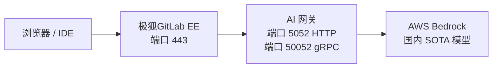



- Tier: 专业版，旗舰版
- Offering: 私有化部署



本指南将引导你使用 AWS Bedrock 部署带有自部署 AI 模型的极狐GitLab，从空白 EC2 实例到可用的 Duo Agent Platform (DAP) 流程。每个命令都可复制粘贴。每个常见错误都已记录。

本指南使用单个 EC2 实例，并排运行极狐GitLab（Docker）和 AI 网关（Docker Compose），以 AWS Bedrock 作为 LLM 提供商。此架构适用于概念验证和评估部署。

对于生产部署，请参见[参考架构](../../administration/reference_architectures/_index.md)。

<a id="prerequisites"></a>

## 先决条件

开始之前，你需要准备：

| 要求 | 详情 |
|-------------|---------|
| **AWS 账户** | 在目标区域（推荐 `us-east-1`）具有 Bedrock 访问权限。 |
| **EC2 实例** | 最低 `t3.xlarge`（4 vCPU，16 GB RAM）。生产环境推荐 `t3.2xlarge`（8 vCPU，32 GB）。 |
| **域名** | 两条指向 EC2 实例的 DNS 记录：`gitlab.example.com` 和 `aigw.example.com`。 |
| **极狐GitLab 许可证** | 专业版或旗舰版。经典 Duo 功能（聊天、代码建议）需要 [Duo 席位分配](../../subscriptions/subscription-add-ons.md)。使用在线许可证的 DAP（极狐GitLab 18.9 及更高版本）通过 [极狐GitLab Credits 按使用量计费](../../subscriptions/gitlab_credits.md)，无需 Duo Enterprise 席位。对于使用离线许可证的 DAP，请联系极狐GitLab 客户团队了解 ELA 选项。 |
| **SSH 访问** | 到你的 EC2 实例。 |
| **安全组** | 入站开放端口 80、443 和 8443。 |

<a id="architecture-overview"></a>

## 架构概览



AI 网关作为 sidecar 容器与极狐GitLab 并排运行。内置的极狐GitLab NGINX 将 HTTPS 和 gRPC 流量代理到 AI 网关。然后 AI 网关将 LLM 请求转发到 AWS Bedrock。

端口 8443 是 DAP 流程所必需的。DAP 使用 gRPC 与 AI 网关 Duo Workflow Service (DWS) 通信。极狐GitLab NGINX 必须将端口 8443 上的 gRPC TLS 代理到 AI 网关的 gRPC 端口 (50052)。

<a id="step-1-provision-aws-infrastructure"></a>

## 步骤 1：配置 AWS 基础设施

<a id="launch-an-ec2-instance"></a>

### 启动 EC2 实例

启动一个 Ubuntu 22.04 或更高版本的实例，配置如下：

- **实例类型：** `t3.xlarge`（最低）或 `t3.2xlarge`（推荐）
- **存储：** 100 GB gp3
- **AMI：** Ubuntu Server 22.04 LTS 或 24.04

<a id="configure-the-security-group"></a>

### 配置安全组

开放以下入站端口：

| 端口 | 协议 | 来源 | 用途 |
|------|----------|--------|---------|
| 22 | TCP | 你的 IP | SSH |
| 80 | TCP | `0.0.0.0/0` | HTTP（Let's Encrypt 验证） |
| 443 | TCP | `0.0.0.0/0` | HTTPS（极狐GitLab 和 AI 网关代理） |
| 8443 | TCP | `0.0.0.0/0` | gRPC TLS（DAP 流程） |

IDE 客户端（VS Code、JetBrains）直接连接到端口 8443 进行 DAP 流程。如果你的用户位于 VPN 之后，可以限制源 IP 范围。

<a id="install-docker"></a>

### 安装 Docker

通过 SSH 登录实例并安装 Docker：

```shell
sudo apt-get update && sudo apt-get upgrade -y

# 安装 Docker（官方方法）
curl --fail --silent --show-error --location "https://get.docker.com" | sudo bash

# 安装 Docker Compose 插件
sudo apt-get install -y docker-compose-plugin

# 验证
sudo docker --version
sudo docker compose version
```

<a id="set-up-dns"></a>

### 设置 DNS

创建两条指向 EC2 公有 IP 的 A 记录：

| 记录 | 类型 | 值 |
|--------|------|-------|
| `gitlab.example.com` | A | 你的 EC2 公有 IP |
| `aigw.example.com` | A | 你的 EC2 公有 IP |

两个域名指向同一个 IP。极狐GitLab NGINX 根据主机名路由流量。

验证 DNS 传播：

```shell
dig gitlab.example.com +short
dig aigw.example.com +short
```

两条命令都应返回你的 EC2 公有 IP。

<a id="step-2-install-gitlab"></a>

## 步骤 2：安装极狐GitLab

<a id="create-data-directories"></a>

### 创建数据目录

```shell
sudo mkdir -p /srv/gitlab/config /srv/gitlab/logs /srv/gitlab/data
```

<a id="run-gitlab"></a>

### 运行极狐GitLab

此命令安装并使用 Let's Encrypt 启动极狐GitLab EE：

```shell
sudo docker run --detach \
  --hostname gitlab.example.com \
  --env GITLAB_OMNIBUS_CONFIG="
    external_url 'https://gitlab.example.com';
    letsencrypt['enable'] = true;
    letsencrypt['auto_renew'] = true;
    letsencrypt['contact_emails'] = ['you@example.com'];
    gitlab_rails['gitlab_shell_ssh_port'] = 2222;
  " \
  --publish 443:443 \
  --publish 80:80 \
  --publish 2222:22 \
  --publish 8443:8443 \
  --name gitlab \
  --restart always \
  --volume /srv/gitlab/config:/etc/gitlab \
  --volume /srv/gitlab/logs:/var/log/gitlab \
  --volume /srv/gitlab/data:/var/opt/gitlab \
  --shm-size 256m \
  registry.gitlab.cn/omnibus/gitlab-jh:latest
```

> [!note]
> `--publish 8443:8443` 标志是 DAP（gRPC TLS）所必需的。如果省略，DAP 流程会静默失败。你不能向正在运行的容器添加端口，需要重新创建容器。

<a id="wait-for-gitlab-to-start"></a>

### 等待极狐GitLab 启动

极狐GitLab 首次运行需要 3-5 分钟初始化：

```shell
until curl --silent --fail "https://gitlab.example.com/-/health" > /dev/null 2>&1; do
  echo "等待极狐GitLab 启动..."
  sleep 10
done
echo "极狐GitLab 已启动！"
```

<a id="set-the-root-password"></a>

### 设置 root 密码

```shell
sudo docker exec gitlab cat /etc/gitlab/initial_root_password
```

使用用户名 `root` 和命令输出的密码登录 `https://gitlab.example.com`。立即更改密码。

<a id="apply-your-license"></a>

### 应用许可证

1. 前往 **管理员 > 订阅**。
1. 上传你的极狐GitLab 许可证文件。

<a id="step-3-deploy-the-ai-gateway"></a>

## 步骤 3：部署 AI 网关

<a id="find-the-correct-image-tag"></a>

### 查找正确的镜像标签

AI 网关镜像位于 `registry.gitlab.cn/model-gateway/model-gateway-self-hosted`。
你必须从[极狐GitLab AI 网关镜像资源](https://hub.gitlab.cn/model-gateway-self-hosted)中选择与极狐GitLab 版本匹配的版本标签。

> [!note]
> 没有 `latest` 标签。使用 `registry.gitlab.cn/model-gateway/model-gateway-self-hosted:latest` 会因找不到镜像而失败。

标签格式：`self-hosted-v{MAJOR}.{MINOR}.{PATCH}-jh`

<a id="generate-a-jwt-signing-key"></a>

### 生成 JWT 签名密钥

AI 网关需要 JWT 密钥来验证 DWS 请求：

```shell
sudo mkdir -p /srv/enterprise-sidecar
openssl genrsa -out /srv/enterprise-sidecar/duo_workflow_jwt.key 2048
```

<a id="create-the-environment-file"></a>

### 创建环境文件

创建 `/srv/enterprise-sidecar/.env`：

```shell
cat << 'EOF' | sudo tee /srv/enterprise-sidecar/.env
# AWS Bedrock 凭证
AWS_ACCESS_KEY_ID=<your-aws-access-key>
AWS_SECRET_ACCESS_KEY=<your-aws-secret-key>
AWS_REGION=us-east-1

# AI 网关：JWT 签名密钥（用于 DWS 认证）
AIGW_JWT_SIGNING_KEY=<paste contents of duo_workflow_jwt.key>
EOF
```

设置环境文件的严格权限：

```shell
sudo chmod 600 /srv/enterprise-sidecar/.env
```

要将 JWT 密钥嵌入环境文件，请将换行符替换为字面量 `\n`，使密钥适合单行：

```shell
JWT_KEY=$(sudo awk '{printf "%s\\n", $0}' /srv/enterprise-sidecar/duo_workflow_jwt.key)
sudo sed -i "s|AIGW_JWT_SIGNING_KEY=.*|AIGW_JWT_SIGNING_KEY=${JWT_KEY}|" /srv/enterprise-sidecar/.env
```

<a id="create-the-docker-compose-file"></a>

### 创建 Docker Compose 文件

创建 `/srv/enterprise-sidecar/docker-compose.yml`：

```yaml
services:
  ai-gateway:
    image: registry.gitlab.cn/model-gateway/model-gateway-self-hosted:self-hosted-v<VERSION>-jh  # 将 <VERSION> 替换为你的极狐GitLab 版本（例如 18.11.0）
    container_name: ai-gateway
    restart: unless-stopped
    environment:
      AIGW_GITLAB_URL: https://gitlab.example.com
      AIGW_GITLAB_API_URL: https://gitlab.example.com/api/v4/
      DUO_WORKFLOW_SELF_SIGNED_JWT__SIGNING_KEY: ${AIGW_JWT_SIGNING_KEY}
      AWS_ACCESS_KEY_ID: ${AWS_ACCESS_KEY_ID}
      AWS_SECRET_ACCESS_KEY: ${AWS_SECRET_ACCESS_KEY}
      AWS_REGION: ${AWS_REGION:-us-east-1}
      AIGW_LOGGING__LEVEL: INFO
      DUO_WORKFLOW_LOGGING__LEVEL: INFO
    ports:
      - "5052:5052"
      - "50052:50052"
    deploy:
      resources:
        limits:
          memory: 2048M
        reservations:
          memory: 512M
    healthcheck:
      test: ["CMD", "curl", "--silent", "--fail", "http://localhost:5052/monitoring/healthz"]
      interval: 30s
      timeout: 10s
      retries: 3
      start_period: 30s
```

<a id="start-the-ai-gateway"></a>

### 启动 AI 网关

```shell
cd /srv/enterprise-sidecar
sudo docker compose up -d
```

<a id="verify-ai-gateway-health"></a>

### 验证 AI 网关健康状态

```shell
# 检查容器是否运行
sudo docker ps | grep ai-gateway

# 检查 HTTP 健康端点（空 JSON 表示健康）
curl --silent "http://localhost:5052/monitoring/healthz"

# 检查日志中的错误
sudo docker logs ai-gateway --tail 20
```

<a id="step-4-configure-tls-for-the-ai-gateway"></a>

## 步骤 4：为 AI 网关配置 TLS

AI 网关需要 HTTPS（用于聊天和代码建议）和 gRPC TLS（用于 DAP 流程）。使用内置的极狐GitLab NGINX 作为反向代理，共享其 Let's Encrypt 证书。

<a id="add-the-ai-gateway-subdomain-to-lets-encrypt"></a>

### 将 AI 网关子域名添加到 Let's Encrypt

编辑极狐GitLab 配置：

```shell
sudo docker exec -it gitlab editor /etc/gitlab/gitlab.rb
```

找到 `letsencrypt` 部分并添加 `alt_names`：

```ruby
letsencrypt['alt_names'] = ['aigw.example.com']
```

如果你已有其他 `alt_names`（如 registry 子域名），请将 `aigw.example.com` 添加到现有数组中：

```ruby
letsencrypt['alt_names'] = ['registry.example.com', 'aigw.example.com']
```

更新证书以包含新的 SAN：

```shell
sudo docker exec gitlab gitlab-ctl renew-le-certs
```

验证证书包含 AI 网关子域名：

```shell
echo | openssl s_client -connect gitlab.example.com:443 2>/dev/null | \
  openssl x509 -noout -ext subjectAltName
```

输出中应看到 `DNS:aigw.example.com`。

<a id="create-the-nginx-proxy-configuration"></a>

### 创建 NGINX 代理配置

在主机上创建代理配置文件：

```shell
cat << 'NGINX' | sudo tee /srv/gitlab/config/nginx/aigw-proxy.conf
# AI 网关反向代理：HTTPS 用于 HTTP API，gRPC TLS 用于 DAP

# HTTP API：Duo Chat、代码建议
server {
    listen 443 ssl;
    server_name aigw.example.com;

    ssl_certificate /etc/gitlab/ssl/gitlab.example.com.crt;
    ssl_certificate_key /etc/gitlab/ssl/gitlab.example.com.key;
    ssl_protocols TLSv1.2 TLSv1.3;
    ssl_ciphers HIGH:!aNULL:!MD5;

    location / {
        proxy_pass http://172.17.0.1:5052;
        proxy_set_header Host $host;
        proxy_set_header X-Real-IP $remote_addr;
        proxy_set_header X-Forwarded-For $proxy_add_x_forwarded_for;
        proxy_set_header X-Forwarded-Proto https;
        proxy_read_timeout 600s;
        proxy_send_timeout 600s;
    }

    location /monitoring/healthz {
        proxy_pass http://172.17.0.1:5052/monitoring/healthz;
        access_log off;
    }
}

# gRPC TLS：DAP / Duo Agent Platform 流程
server {
    listen 8443 ssl http2;
    server_name aigw.example.com;

    ssl_certificate /etc/gitlab/ssl/gitlab.example.com.crt;
    ssl_certificate_key /etc/gitlab/ssl/gitlab.example.com.key;
    ssl_protocols TLSv1.2 TLSv1.3;
    ssl_ciphers HIGH:!aNULL:!MD5;

    location / {
        grpc_pass grpc://172.17.0.1:50052;
        grpc_read_timeout 600s;
        grpc_send_timeout 600s;
    }
}
NGINX
```

地址 `172.17.0.1` 是 Docker 的默认桥接网关 IP。从极狐GitLab 容器内部，此 IP 可达主机以及 AI 网关容器发布的端口。

<a id="include-the-configuration-in-the-gitlab-nginx"></a>

### 将配置包含到极狐GitLab NGINX 中

将配置文件复制到容器内的 NGINX 运行时目录：

```shell
sudo docker exec gitlab mkdir -p /var/opt/gitlab/nginx/conf
sudo docker cp /srv/gitlab/config/nginx/aigw-proxy.conf \
  gitlab:/var/opt/gitlab/nginx/conf/aigw-proxy.conf
```

> [!note]
> 不要将文件放在 `/etc/gitlab/nginx/` 中。只有 `gitlab.rb` 中通过 `custom_nginx_config` 引用的文件才会被加载。运行时目录是 `/var/opt/gitlab/nginx/conf/`。

将 include 指令添加到 `gitlab.rb`：

```shell
sudo docker exec -it gitlab editor /etc/gitlab/gitlab.rb
```

找到或添加 `nginx['custom_nginx_config']` 行：

```ruby
nginx['custom_nginx_config'] = "include /var/opt/gitlab/nginx/conf/aigw-proxy.conf;"
```

如果你已有自定义 NGINX 配置（例如 KeyCloak 代理），请用分号串联它们：

```ruby
nginx['custom_nginx_config'] = "include /var/opt/gitlab/nginx/conf/keycloak-proxy.conf; include /var/opt/gitlab/nginx/conf/aigw-proxy.conf;"
```

<a id="reconfigure-gitlab"></a>

### 重新配置极狐GitLab

```shell
sudo docker exec gitlab gitlab-ctl reconfigure
```

<a id="verify-tls"></a>

### 验证 TLS

```shell
# AI 网关 HTTP API 的 HTTPS
curl --silent "https://aigw.example.com/monitoring/healthz"
# 预期：{}

# DAP 的 gRPC TLS
openssl s_client -connect aigw.example.com:8443 < /dev/null 2>/dev/null | \
  grep "Verify return code"
# 预期：Verify return code: 0 (ok)
```

<a id="step-5-connect-aws-bedrock"></a>

## 步骤 5：连接 AWS Bedrock

<a id="create-an-iam-user-for-bedrock"></a>

### 为 Bedrock 创建 IAM 用户

在 AWS 控制台中，前往 **IAM > 用户 > 创建用户**：

- **名称：** `gitlab-bedrock`（或类似名称）
- **权限：** 附加 `AmazonBedrockFullAccess` 托管策略

创建访问密钥（使用场景：“在 AWS 之外运行的应用程序”）。保存 **访问密钥 ID** 和 **秘密访问密钥**。

作为替代方案，如果你的 EC2 实例具有带有 Bedrock 权限的 IAM 角色，则可以跳过访问密钥。AI 网关会自动使用实例配置文件。

<a id="activate-anthropic-models-on-bedrock"></a>

### 激活 Bedrock 上的国内 SOTA 模型

此步骤是必需的，并且常常让人措手不及：

1. 前往 **AWS 控制台 > Amazon Bedrock > 提供商 > Anthropic**。
1. 填写 **提交用例详情** 表单。
1. 等待大约 15 分钟以激活。

> [!note]
> 如果不填写此表单，所有对国内 SOTA 模型的 Bedrock API 调用都会返回：
> `“此账户尚未提交模型用例详细信息。”`
> 旧的“模型访问”页面已弃用。模型在首次调用时自动启用，但国内 SOTA 模型除外，它需要用例表单。

<a id="find-your-models-inference-profile-id"></a>

### 查找模型的推理配置文件 ID

较新的国内 SOTA 模型需要 **推理配置文件 ID**，而不是直接使用模型 ID。

```shell
aws bedrock list-inference-profiles --region us-east-1 --output json | \
  python3 -c "
import sys, json
profiles = json.load(sys.stdin)['inferenceProfileSummaries']
for p in profiles:
    if 'claude' in p['inferenceProfileId'].lower():
        print(p['inferenceProfileId'])
"
```

> [!note]
> 使用 `us.` 前缀（例如 `us.anthropic.claude-sonnet-4-6`），而不是基础模型 ID（`anthropic.claude-sonnet-4-6`）。
>
> | 模型标识符 | 结果 |
> |---|---|
> | `bedrock/anthropic.claude-sonnet-4-6` | **400 错误请求**：“不支持按需吞吐量” |
> | `bedrock/us.anthropic.claude-sonnet-4-6` | 正常 |
>
> `us.` 前缀路由到仅限美国的区域。`global.` 前缀路由到所有启用的区域。

<a id="restart-the-ai-gateway-with-credentials"></a>

### 使用凭证重启 AI 网关

如果尚未添加，请将 AWS 凭证添加到 `/srv/enterprise-sidecar/.env`，然后重启：

```shell
cd /srv/enterprise-sidecar
sudo docker compose down ai-gateway
sudo docker compose up -d ai-gateway
```

<a id="step-6-configure-gitlab-admin-settings"></a>

## 步骤 6：配置极狐GitLab 管理员设置

<a id="set-ai-gateway-urls"></a>

### 设置 AI 网关 URL

前往 **管理员 > 极狐GitLab Duo**，然后选择 **更改配置**。

| 设置 | 值 |
|---------|-------|
| 连接方式 | 通过私有化部署极狐GitLab 间接连接 |
| 本地 AI 网关 URL | `https://aigw.example.com` |
| 本地 DAP 服务 URL | `aigw.example.com:8443` |
| AI 网关请求超时 | `300`（秒） |

> [!note]
> 默认超时 60 秒对于 Bedrock 来说太短。单个 DAP 流程可能需要 5-10 分钟。请将其设置为至少 300。

选择 **保存更改**。

<a id="run-the-health-check"></a>

### 运行健康检查

在同一页面上，选择 **运行健康检查**。你应该看到四个绿色对勾：

| 检查 | 预期 |
|-------|----------|
| AI 网关 | 已连接 |
| 网络 | 可达 |
| 代码建议 | 可用 |
| DAP | 可用 |

<a id="add-a-self-hosted-model"></a>

### 添加自部署模型

前往 **管理员 > 极狐GitLab Duo > 为极狐GitLab Duo 配置模型**。

选择 **添加自部署模型** 并填写：

| 字段 | 值 |
|-------|-------|
| 部署名称 | `Bedrock 国内 SOTA 模型`（或任何描述性名称） |
| 平台 | `Amazon Bedrock` |
| 模型系列 | `Claude` |
| 模型标识符 | `bedrock/us.anthropic.claude-sonnet-4-6` |

> [!note]
> 模型标识符必须以 `bedrock/` 开头。

选择 **测试连接**。你应该看到：
*“成功连接到自部署模型。”*

如果看到“400 错误请求”，说明你使用了错误的模型标识符。请使用推理配置文件 ID（`us.anthropic.claude-sonnet-4-6`），而不是直接模型 ID。

选择 **添加模型**。

<a id="assign-the-model-to-features"></a>

### 将模型分配给功能

在同一页面上，选择 **AI 原生功能** 选项卡。

对于你希望通过 Bedrock 路由的每个功能，从下拉列表中选择你的自部署模型：

| 功能 | 推荐分配 |
|---------|----------------------|
| **极狐GitLab Duo Agent Platform > 代理与流程** | Bedrock 国内 SOTA 模型 |
| **极狐GitLab Duo Agent Platform > Agentic 聊天** | Bedrock 国内 SOTA 模型 |
| 代码建议 | 极狐GitLab 管理（默认）或 Bedrock |
| 聊天 | 极狐GitLab 管理（默认）或 Bedrock |
| 代码审查 | 极狐GitLab 管理（默认）或 Bedrock |

开始时仅将 DAP 功能分配给 Bedrock，将聊天和代码建议保留在极狐GitLab 管理的默认设置上。这样可以在不危及日常开发者体验的情况下验证 Bedrock 连接。确认一切正常后，再切换更多功能。

<a id="step-7-register-a-runner-for-dap-flows"></a>

## 步骤 7：为 DAP 流程注册 Runner

DAP 流程会创建 CI/CD 流水线。如果没有注册 Runner，DAP 流程将无限期处于待处理状态。

<a id="install-and-register-a-runner"></a>

### 安装并注册 Runner

在你的 EC2 实例（或单独的机器）上，安装极狐GitLab Runner：

```shell
curl --location "https://packages.gitlab.cn/install/repositories/runner/gitlab-runner/script.deb.sh" | sudo bash
sudo apt-get install -y gitlab-runner
```

向你的极狐GitLab 实例注册 Runner。前往 **管理员 > CI/CD > Runners** 并选择 **新实例 Runner** 以获取注册令牌，然后运行：

```shell
sudo gitlab-runner register \
  --url "https://gitlab.example.com" \
  --token "<REGISTRATION_TOKEN>" \
  --executor docker \
  --docker-image "ruby:3.2" \
  --tag-list "docker" \
  --description "用于 DAP 的 Docker Runner"
```

更多详情，请参见[安装极狐GitLab Runner](https://gitlab.cn/docs/runner/install/) 和[创建并注册 Runner](../../tutorials/create_register_first_runner/_index.md)。

> [!note]
> DAP 流程使用 Docker-in-Docker 工作流。Runner 必须使用 `docker` 执行器。

<a id="step-8-enable-duo-features-on-groups-and-projects"></a>

## 步骤 8：在群组和项目上启用 Duo 功能

管理员级别的配置（步骤 6）使 Duo 功能在实例范围内可用，但你还需要在群组和项目级别启用它们。

<a id="enable-duo-on-a-group"></a>

### 在群组上启用 Duo

1. 前往群组的 **设置 > 通用**。
1. 展开 **权限和群组功能**。
1. 在 **极狐GitLab Duo 功能** 下，选择 **启用极狐GitLab Duo 功能**。
1. 要使用 DAP，还需选择 **启用实验和测试版功能** 和 **允许流程执行**（勾选你要启用的流程类型）。
1. 选择 **保存更改**。

更多详情，请参见[开启或关闭极狐GitLab Duo](../../user/gitlab_duo/turn_on_off.md)。

<a id="enable-duo-on-a-project"></a>

### 在项目上启用 Duo

1. 前往项目的 **设置 > 通用**。
1. 展开 **可见性、项目功能、权限**。
1. 在 **极狐GitLab Duo** 下，开启 **使用极狐GitLab Duo 功能**。
1. 选择 **保存更改**。

更多详情，请参见[开启或关闭极狐GitLab Duo](../../user/gitlab_duo/turn_on_off.md)。

<a id="step-9-verify-end-to-end"></a>

## 步骤 9：端到端验证

<a id="health-checks"></a>

### 健康检查

```shell
# AI 网关 HTTP 健康检查
curl --silent "https://aigw.example.com/monitoring/healthz"
# 预期：{}

# gRPC TLS 连接
openssl s_client -connect aigw.example.com:8443 < /dev/null 2>/dev/null | \
  grep "Verify return code"
# 预期：Verify return code: 0 (ok)
```

在浏览器中，前往 **管理员 > 极狐GitLab Duo**，选择 **更改配置**，然后选择 **运行健康检查**。所有四项检查都应显示绿色。

<a id="run-the-rake-verification-task"></a>

### 运行 Rake 验证任务

```shell
sudo docker exec gitlab gitlab-rake "gitlab:duo:verify_self_hosted_setup[your_username]"
```

这将验证整个链路：许可证、功能标志、AI 网关连接和模型配置。

> [!note]
> Rake 任务的模型连接测试使用占位 URL (`bedrockselfhostedmodel.com`)，即使你的部署正常工作，也可能报告失败。所有其他检查（许可证、AI 网关、功能分配）都是有效的。

<a id="test-duo-chat"></a>

### 测试 Duo Chat

> [!note]
> 在某些 AI 网关版本上，使用 Bedrock 的 Duo Chat 可能返回 400 错误（`“此模型不支持助手消息预填充”`）。这仅影响 Duo Chat。DAP 流程使用不同的代码路径，可以正常工作。如果看到此错误，请将聊天保留在极狐GitLab 管理的模型上，仅将 Bedrock 用于 DAP 功能。

1. 打开极狐GitLab 实例中的任意项目。
1. 选择 **Duo Chat** 图标。
1. 问一个简单的问题，例如“什么是合并请求？”
1. 验证是否收到回复。

观察 AI 网关日志中的 Bedrock 活动：

```shell
sudo docker logs -f ai-gateway 2>&1 | grep -i "litellm\|bedrock\|chat"
```

<a id="test-a-dap-flow"></a>

### 测试 DAP 流程

这是真正的测试。在 Bedrock 上端到端运行 Duo Agent Platform 流程：

1. 创建或打开一个包含代码的项目。
1. 创建一个议题（例如，“为登录表单添加输入验证”）。
1. 在议题页面上，选择 **Duo > 启动工作流**。
1. 等待。使用 Bedrock 的 DAP 流程通常需要 3-10 分钟。
1. 检查流水线：**构建 > 流水线**。查找 `source: duo_workflow`。

在流程期间观察 AI 网关日志：

```shell
sudo docker logs -f ai-gateway 2>&1 | grep -i "workflow\|bedrock\|litellm"
```

DAP 流程期间的预期日志输出：

```plaintext
LiteLLM completion() 模型= 国内 SOTA 模型；提供商 = bedrock
```

> [!note]
> 如果流程在大约 10 秒内完成，则说明有问题。正常的流程需要几分钟，而不是几秒钟。检查 AI 网关日志中的错误。

<a id="step-10-monitoring-optional"></a>

## 步骤 10：监控（可选）

<a id="ai-gateway-prometheus-metrics"></a>

### AI 网关 Prometheus 指标

AI 网关在两个端口上公开指标：

| 端口 | 端点 | 内容 |
|------|----------|---------|
| 8082 | `/metrics` | AI 网关（FastAPI）指标：请求计数、延迟 |
| 8083 | `/metrics` | DWS 指标：gRPC 调用计数 |

要公开这些指标以供 Prometheus 抓取，请将它们添加到 `docker-compose.yml` 的端口：

```yaml
ports:
  - "5052:5052"
  - "50052:50052"
  - "8082:8082"
  - "8083:8083"
```

并添加相应的环境变量：

```yaml
environment:
  AIGW_FASTAPI__METRICS_HOST: "0.0.0.0"
  AIGW_FASTAPI__METRICS_PORT: "8082"
  PROMETHEUS_METRICS__ADDR: "0.0.0.0"
  PROMETHEUS_METRICS__PORT: "8083"
```

<a id="troubleshooting"></a>

## 故障排除

<a id="ai-gateway-does-not-start"></a>

### AI 网关无法启动

如果容器立即退出或健康检查从未通过：

```shell
sudo docker logs ai-gateway --tail 50
```

| 错误 | 修复 |
|-------|-----|
| `未找到镜像` | 你使用了 `latest` 标签。请使用明确的版本，如 `self-hosted-v18.9.0-ee`。 |
| `必须设置 AIGW_GITLAB_URL` | 将环境变量添加到 `docker-compose.yml`。 |
| 健康检查连接被拒绝 | 等待 30 秒启动。如果持续存在，检查端口绑定。 |

<a id="health-check-fails-in-admin-ui"></a>

### 管理界面健康检查失败

| 检查 | 常见原因 | 修复 |
|-------|-------------|-----|
| AI 网关：未连接 | 管理员设置中的 URL 错误 | 使用 `https://aigw.example.com`（不是 `http://`，不是端口 5052）。 |
| 网络：不可达 | 容器内 DNS 未解析 | 使用 `docker exec gitlab dig aigw.example.com` 验证。 |
| DAP：不可用 | 端口 8443 未发布 | 使用 `--publish 8443:8443` 重新创建极狐GitLab 容器。 |

<a id="400-bad-request-when-testing-model-connection"></a>

### 测试模型连接时出现 400 错误请求

你使用了直接模型 ID，而不是推理配置文件 ID。

将 `bedrock/anthropic.claude-sonnet-4-6` 更改为 `bedrock/us.anthropic.claude-sonnet-4-6`（注意 `us.` 前缀）。

<a id="model-use-case-details-have-not-been-submitted"></a>

### “模型用例详细信息尚未提交”

1. 前往 **AWS 控制台 > Amazon Bedrock > 提供商 > Anthropic**。
1. 提交用例详情表单。
1. 等待大约 15 分钟以激活。
1. 重试。

<a id="tls-errors"></a>

### TLS 错误

如果 `curl "https://aigw.example.com/monitoring/healthz"` 返回 SSL 错误：
1. 验证是否在 `gitlab.rb` 中将 `aigw.example.com` 添加到了 `letsencrypt['alt_names']`。
1. 验证是否运行了 `gitlab-ctl renew-le-certs`。
1. 验证 NGINX 配置是否使用了正确的证书路径。
1. 验证 NGINX 配置文件是否位于 `/var/opt/gitlab/nginx/conf/`（而非 `/etc/gitlab/nginx/`）。
1. 验证 `gitlab.rb` 中的 `custom_nginx_config` 是否引用了该文件。

### DAP 流未启动

如果选择了 **开始工作流** 但未出现流水线：

1. 验证是否已注册并且在线 Runner（**管理员 > CI/CD > Runners**）。请参阅 [步骤 7](#step-7-register-a-runner-for-dap-flows)。
1. 验证群组和项目是否已启用 Duo。请参阅 [步骤 8](#step-8-enable-duo-features-on-groups-and-projects)。
1. 验证用户是否拥有极狐GitLab 积分或 Duo 席位（**管理员 > 极狐GitLab Duo > 席位分配**）。
1. 验证端口 8443 是否已在极狐GitLab 容器上发布。

### NGINX 配置未生效

编辑 `gitlab.rb` 并运行 reconfigure 后：

1. 验证运行时目录中是否存在该文件：

   ```shell
   sudo docker exec gitlab ls -la /var/opt/gitlab/nginx/conf/
   ```

1. 如果缺失，请再次复制：

   ```shell
   sudo docker cp /srv/gitlab/config/nginx/aigw-proxy.conf \
     gitlab:/var/opt/gitlab/nginx/conf/aigw-proxy.conf
   ```

1. 执行 reconfigure 并重启 NGINX：

   ```shell
   sudo docker exec gitlab gitlab-ctl reconfigure
   sudo docker exec gitlab gitlab-ctl restart nginx
   ```