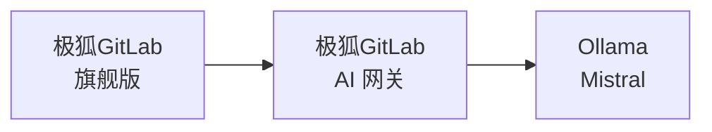



- Tier: 旗舰版
- Add-on: GitLab Duo Pro 或 Enterprise
- Offering: 私有化部署



本文档描述了极狐GitLab 和极狐GitLab Duo 与在 Ollama 上运行 Mistral 模型的私有化部署大语言模型 (LLM) 的安装和集成。本指南描述了使用 3 台不同虚拟机的设置过程，并可在 AWS 或 GCP 上按步骤操作。当然，该过程也适用于不同的部署平台。

本指南是一套全面的、端到端的说明，旨在让所需的设置成功运行。它引用了极狐GitLab 文档的许多领域，这些文档用于支持最终配置的创建。当需要更多背景信息来针对特定场景调整实施方案时，参考文档非常重要。

<!-- TOC -->

- 极狐GitLab Duo 私有化部署：与 Ollama 集成的完整 AWS/Google Cloud 部署指南
  - [先决条件](#prerequisites)
    - [虚拟机](#virtual-machines)
      - [资源与操作系统](#resources--operating-system)
      - [网络](#networking)
    - [极狐GitLab](#gitlab)
      - [许可证](#licensing)
      - [SSL/TLS](#ssltls)
- [介绍](#introduction)
  - [安装](#installation)
    - [AI 网关](#ai-gateway)
    - [Ollama](#ollama)
      - [安装](#installation-1)
      - [模型部署](#model-deployment)
  - [集成](#integration)
    - [为管理员用户启用极狐GitLab Duo](#enable-gitlab-duo-for-root-user)
    - [在极狐GitLab 中配置私有化部署模型](#configure-gitlab-duo-self-hosted-in-gitlab)
  - [验证](#verification)

<!-- /TOC -->

## 先决条件

<a id="prerequisites"></a>

### 虚拟机

<a id="virtual-machines"></a>

#### 资源与操作系统

<a id="resources--operating-system"></a>

我们将把极狐GitLab、极狐GitLab AI 网关和 Ollama 分别安装在不同的虚拟机中。虽然我们在本指南中使用了 Ubuntu 24.0x，但你可以灵活选择任何符合组织要求和偏好的基于 Unix 的操作系统。但是，此设置必须使用基于 Unix 的操作系统。这可以确保系统稳定性、安全性以及与所需软件栈的兼容性。该设置为测试和评估阶段提供了成本和性能之间的良好平衡，但在进入生产环境时，你可能需要根据使用需求和团队规模升级 GPU 实例类型。

|                | **GCP**       | **AWS**     | **操作系统**    | **磁盘** |
|----------------|---------------|-------------|-----------|----------|
| **极狐GitLab**     | c2-standard-4 | c6xlarge    | Ubuntu 24 | 50 GB    |
| **AI 网关** | e2-medium     | t2.medium   | Ubuntu 24 | 20 GB    |
| **Ollama**     | n1-standard-4 | g4dn.xlarge | Ubuntu 24 | 50 GB    |

有关此组件及其用途的更多信息，请参见 [AI 网关](../../administration/gitlab_duo/gateway.md)。



这些组件协同工作以实现私有化部署的 AI 功能。本指南提供了使用 Ollama 作为 LLM 服务器来构建完整的私有化部署 AI 环境的详细说明。

> [!note]
> 虽然对于完整生产环境，[官方文档](../../administration/gitlab_duo_self_hosted/supported_models_and_hardware_requirements.md)建议使用功能更强大的 GPU 实例，例如 1x NVIDIA A100 (40 GB)，但 g4dn.xlarge 实例类型对于小组用户的评估目的应该足够。

#### 网络

<a id="networking"></a>

为了能够访问极狐GitLab，需要一个静态公网 IP 地址（例如 AWS 中的弹性 IP 或 GCP 中的外部 IP）。所有其他组件可以并且应该使用静态内网 IP 地址进行内部通信。我们假设所有虚拟机都在同一网络上并且可以直接通信。

|                | **公网 IP** | **内网 IP** |
|----------------|---------------|----------------|
| **极狐GitLab**     | 是           | 是            |
| **AI 网关** | 否            | 是            |
| **Ollama**     | 否            | 是            |

为什么要使用内网 IP？

- 在 AWS/Google Cloud 中，内网 IP 在实例的整个生命周期内保持不变。
- 只有极狐GitLab 服务器需要外部访问，而其他组件（如 Ollama）则依赖内部通信。
- 这种方法通过避免公网 IP 地址费用来降低成本，并通过防止 LLM 服务器从互联网访问来增强安全性。

### 极狐GitLab

<a id="gitlab"></a>

本指南的其余部分假定你已经启动并运行了一个满足以下要求的极狐GitLab 实例：

#### 许可证

<a id="licensing"></a>

运营极狐GitLab Duo 私有化部署同时需要极狐GitLab 旗舰版许可证和极狐GitLab Duo Enterprise 许可证。极狐GitLab 旗舰版许可证可用于在线或离线许可选项。本文档假设两个许可证都已事先获得并可进行实施。


#### SSL/TLS

<a id="ssltls"></a>

必须为极狐GitLab 实例配置有效的 SSL 证书（例如 Let's Encrypt）。这不仅是最佳安全实践，也是一项技术要求，因为：

- AI 网关系统（截至 2025 年 1 月）在与极狐GitLab 通信时严格要求进行正确的 SSL 验证
- AI 网关不接受自签名证书
- 也不支持非 SSL 连接 (HTTP)

极狐GitLab 提供了便捷的自动化 SSL 设置过程：

- 在极狐GitLab 安装过程中，只需使用 `https://` 前缀指定你的 URL
- 极狐GitLab 将自动：
  - 获取 Let's Encrypt SSL 证书
  - 安装证书
  - 配置 HTTPS
- 无需手动管理 SSL 证书

在极狐GitLab 的安装过程中，过程大致如下：

1. 分配公网静态 IP 地址并将其关联到极狐GitLab 实例
1. 配置你的 DNS 记录指向该地址
1. 在极狐GitLab 安装期间，使用你的 HTTPS URL（例如 `https://gitlab.yourdomain.com`）
1. 让极狐GitLab 自动处理 SSL 证书设置

有关详细信息，请参考[文档](https://docs.gitlab.com/omnibus/settings/ssl/)页面。

## 介绍

<a id="introduction"></a>

在设置极狐GitLab Duo 私有化部署之前，了解 AI 的工作原理很重要。AI 模型是用数据训练出来的 AI“大脑”。这个大脑需要一个框架来运行，这个框架被称为 LLM 服务平台，或简称为“服务平台”。在 AWS 中，这是“Amazon Bedrock”；在 Azure 中，是“Azure OpenAI Service”；而对于 ChatGPT，则是它们自己的平台。对于自部署模型，Ollama 是一个常见的选择。

例如：

- 在 AWS 中，LLM 服务平台是 Amazon Bedrock。
- 在 Azure 中，是 Azure OpenAI Service。
- 对于 ChatGPT，是 OpenAI 的专有平台。
- 对于 Claude，LLM 服务平台是 Claude。

当你自己托管 AI 模型时，你也需要选择一个 LLM 服务平台。对于私有化部署模型，一个受欢迎的选择是 Ollama。

在这个类比中，ChatGPT 的大脑部分是 GPT-4 模型，而在 Claude 生态系统中，则是 Claude 3.7 Sonnet 模型。LLM 服务平台充当了连接大脑与世界的至关重要的框架，使其能够有效地“思考”和交互。

有关受支持的 LLM 服务平台和模型的更多信息，请参见 [LLM 服务平台](../../administration/gitlab_duo_self_hosted/supported_llm_serving_platforms.md)和[模型](../../administration/gitlab_duo_self_hosted/supported_models_and_hardware_requirements.md)。

**什么是 Ollama**？

Ollama 是一个精简的、开源的框架，用于在本地环境中运行大语言模型 (LLM)。它简化了传统复杂的 AI 模型部署过程，让寻求高效、灵活和可扩展 AI 解决方案的个人和组织都能轻松使用。

主要亮点：

1. **简化部署**：用户友好的命令行界面确保了快速设置和无障碍安装。
1. **广泛的模型支持**：与流行的开源模型如 Llama 2, Mistral 和 Code Llama 兼容。
1. **优化性能**：在 GPU 和 CPU 环境下都能无缝运行，以实现资源效率。
1. **集成就绪**：具备与 OpenAI 兼容的 API，方便与现有工具和工作流集成。
1. **无需容器**：直接在主机系统上运行，无需 Docker 或容器化环境。
1. **多功能托管选项**：可部署在本地机器、内部服务器或云 GPU 实例上。

Ollama 为简单性和性能而设计，让用户能够利用 LLM 的强大功能，而无需传统 AI 基础设施的复杂性。关于设置和支持模型的更多细节将在文档后面部分介绍。

- [Ollama 模型支持](https://ollama.com/search)

## 安装

<a id="installation"></a>

### AI 网关

<a id="ai-gateway"></a>

虽然官方安装指南可在[安装极狐GitLab AI 网关](../../install/install_ai_gateway.md)中找到，但这里提供了一个设置 AI 网关的简化方法。截至 2025 年 1 月，镜像 `gitlab/model-gateway:self-hosted-v17.6.0-ee` 已被验证可与极狐GitLab 17.7 配合使用。

1. 确保...

   - 允许访问 API 网关虚拟机的 TCP 端口 5052（检查安全组配置）
   - 在下面的代码片段中，将 `GITLAB_DOMAIN` 替换为你极狐GitLab 实例的域名：

1. 运行以下命令来启动极狐GitLab AI 网关：

   ```shell
   GITLAB_DOMAIN="gitlab.yourdomain.com"
   docker run -p 5052:5052 \
     -e AIGW_GITLAB_URL=$GITLAB_DOMAIN \
     -e AIGW_GITLAB_API_URL=https://${GITLAB_DOMAIN}/api/v4/ \
     -e AIGW_AUTH__BYPASS_EXTERNAL=true \
     gitlab/model-gateway:self-hosted-v17.6.0-ee
   ```

下表解释了关键环境变量及其在设置实例中的作用：

| **变量**                 | **描述** |
|------------------------------|-----------------|
| `AIGW_GITLAB_URL`            | 你的极狐GitLab 实例域名。 |
| `AIGW_GITLAB_API_URL`        | 你的极狐GitLab 实例的 API 端点。 |
| `AIGW_AUTH__BYPASS_EXTERNAL` | 处理身份验证的配置。 |

在初始设置和测试阶段，你可以设置 `AIGW_AUTH__BYPASS_EXTERNAL=true` 来绕过身份验证，避免出现问题。但是，绝不应在生产环境或暴露于互联网的服务器上使用此配置。

### Ollama

<a id="ollama"></a>

#### 安装

<a id="installation-1"></a>

1. 使用官方安装脚本安装 Ollama:

   ```shell
   curl --fail --silent --show-error --location "https://ollama.com/install.sh" | sh
   ```

1. 配置 Ollama 监听内网 IP，方法是添加 `OLLAMA_HOST` 环境变量到其启动配置中

   ```shell
   systemctl edit ollama.service
   ```

   ```ini
   [Service]
   Environment="OLLAMA_HOST=172.31.11.27"
   ```

   > [!note]
   > 将 IP 地址替换为你服务器实际的内网 IP 地址。
1. 重载并重启服务：

   ```shell
   systemctl daemon-reload
   systemctl restart ollama
   ```

#### 模型部署

<a id="model-deployment"></a>

1. 设置环境变量：

   ```shell
   export OLLAMA_HOST=172.31.11.27
   ```

1. 安装 Mistral Instruct 模型：

   ```shell
   ollama pull mistral:instruct
   ```

   `mistral:instruct` 模型需要大约 4.1 GB 的存储空间，并且根据你的连接速度，下载需要一些时间。
1. 验证模型安装：

   ```shell
   ollama list
   ```

   该命令应在列表中显示已安装的模型。
   

## 集成

<a id="integration"></a>

### 为管理员用户启用极狐GitLab Duo

<a id="enable-gitlab-duo-for-root-user"></a>

1. 访问极狐GitLab Web 界面

   - 以管理员用户身份登录
   - 导航到管理中心（扳手图标）

1. 配置 Duo 许可证

   - 转到左侧边栏的 **订阅** 部分
   - 你应该看到 "席位已使用：1/5"，表明有可用的 Duo 席位
   - 注意：管理员用户只需要一个席位

1. 将 Duo 许可证分配给管理员

   - 导航到 **管理中心** > **极狐GitLab Duo** > **席位使用情况**
   - 在用户列表中找到管理员用户
   - 在 **极狐GitLab Duo Enterprise** 列中，切换开关以为管理员用户启用 Duo
   - 启用后，切换按钮应变蓝


> [!note]
> 仅为管理员用户启用 Duo 对于初始设置和测试就足够了。如果需要，可以在席位许可限制内，稍后授予其他用户 Duo 访问权限。

### 在极狐GitLab 中配置私有化部署模型

<a id="configure-gitlab-duo-self-hosted-in-gitlab"></a>

1. 访问极狐GitLab Duo 私有化部署配置

   - 导航到 **管理中心** > **极狐GitLab Duo** > **配置私有化部署的极狐GitLab Duo**
   - 点击 **添加私有化部署模型** 按钮

   
1. 配置模型设置

   - **部署名称**：选择一个描述性名称（例如 `Mistral-7B-Instruct-v0.3 on AWS Tokyo`）
   - **模型系列**：从下拉列表中选择 **Mistral**
   - **端点**：按以下格式输入你的 Ollama 服务器 URL：

     ```plaintext
     http://[内网-IP]:11434/v1
     ```

     示例：`http://172.31.11.27:11434/v1`

   - **模型标识符**：输入 `custom_openai/mistral:instruct`
   - **API 密钥**：输入任何占位文本（例如 `test`），因为此字段不能为空


1. 启用 AI 功能

   - 导航到 **AI 原生功能** 标签页
   - 将配置好的模型分配给以下功能：
     - **代码建议** > **代码生成**
     - **代码建议** > **代码补全**
     - **极狐GitLab Duo Chat** > **通用聊天**
   - 为每个功能从下拉列表中选择你部署的模型


这些设置通过 AI 网关在你的极狐GitLab 实例与私有化部署的 Ollama 模型之间建立了连接，从而在极狐GitLab 中启用 AI 原生功能。

## 验证

<a id="verification"></a>

1. 在极狐GitLab 中创建一个测试群组
1. 极狐GitLab Duo Chat 图标应出现在右上角
1. 这表明极狐GitLab 与 AI 网关已成功集成

