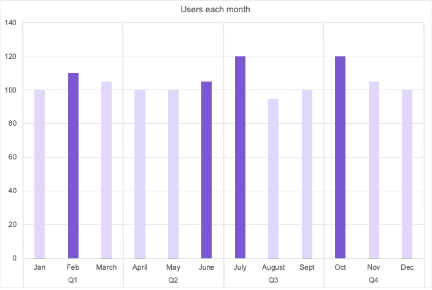



- Tier: 专业版，旗舰版
- Offering: JihuLab.com，私有化部署



当您的极狐GitLab订阅中的付费用户数量超过购买的席位时，您需要为额外的席位付费。

根据 [极狐GitLab订阅协议](https://gitlab.cn/terms/)，极狐GitLab会审核您的席位使用情况，并按季度（季度结算流程）或年度（年度对账流程）向您发送超额账单。

- **季度结算**：每个季度按比例收取订阅期限剩余部分的费用。您需为当季度使用的最大席位数付费。按季度付费年均费用更低，可大幅节省开支。
- **年度对账**：对全年任何时间添加的用户，需支付全额年度订阅费。

进一步了解：

- 在 JihuLab.com 上 [如何确定席位使用情况](manage_seats.md#gitlabcom-billing-and-usage)。
- 在私有化部署实例上 [极狐GitLab如何对用户计费](manage_seats.md#self-managed-billing-and-usage)。

为避免超额，您可以为 [群组](../user/group/manage.md#turn-on-restricted-access) 或 [实例](../administration/settings/sign_up_restrictions.md#turn-on-restricted-access) 开启受限访问。此设置可在订阅无剩余席位时，限制群组添加新付费用户。

## 示例

例如，您在一月份购买了一个100用户的年度许可证，每个额外席位费用为 $100。
全年用户数量在95至120之间波动。
这意味着您全年超出了许可证限额20个用户。

下图展示了全年每月和每季度的用户数量。

如果采用季度结算：

- 在第一季度，您有110个用户。超出订阅10个用户 × 每用户 $25 × 剩余3个季度 = $750。您现在按110个用户的许可证付费。
- 在第二季度，您有105个用户。未超过110个用户，因此不收费。
- 在第三季度，您有120个用户。超出订阅10个用户 × 每用户 $25 × 剩余1个季度 = $250。您现在按120个用户的许可证付费。
- 在第四季度，您有120个用户。未超过第三季度的用户数，因此不收费。但即使超出，也不会收费，因为第四季度不收取超出费用。
- 年度总成本为 $1000。

如果采用年度对账：

- 对额外席位，您支付 $100 × 20个用户。
- 年度总成本为 $2000。

## 季度结算

### 资格

如果您满足以下条件，将自动加入季度结算：
- 用于购买订阅的信用卡仍关联到您的极狐GitLab账户。
- 您通过发票购买了订阅。

如果您满足以下任一条件，将被排除在季度结算之外：
- 通过经销商或其他渠道合作伙伴购买订阅。
- 购买的订阅期限不是12个月（包括多年期和非标准期限订阅）。
- 使用采购订单购买订阅。
- 购买了 [Enterprise Agile Planning](manage_seats.md#enterprise-agile-planning) 产品。
- 您是公共部门客户。
- 您拥有离线环境并使用许可证文件激活订阅。
- 已加入某项提供免费版的计划，例如极狐GitLab教育版、极狐GitLab开源项目计划或极狐GitLab初创企业计划。

如果您被排除在季度结算之外且未使用免费版，则对账将按年度进行。
或者，您可以通过 [购买额外席位](manage_seats.md#buy-more-seats) 来结算任何超额部分。

### 发票和付款

在每个订阅季度结束时，极狐GitLab会通知您超额情况。
通知您超额情况的日期与您被收费的日期不同。

1. 一封通知邮件会发送，说明 [超额席位数量](manage_seats.md#users-over-subscription-limit) 及预期发票金额：

   - JihuLab.com：在结算日期发送给群组所有者和计费账户管理员。
   - 私有化部署：结算日期后六天发送给计费账户管理员。

1. 邮件通知七天后，订阅将更新以包含额外席位，并按比例生成发票。
   如果存档了信用卡，付款将自动扣除。
   否则，您会收到一张发票，需按照您的付款条款支付。

## 年度对账

如果您满足以下条件，您的订阅计费将默认为年度对账流程：
- 通过合同修订明确选择退出季度结算。
- 不符合季度结算资格。

## 故障排除

### 付款失败

如果在季度结算过程中您的信用卡被拒，您将收到一封主题为 `需要操作：您的极狐GitLab订阅对账失败` 的邮件。要解决此问题：

1. [更新您的付款信息](billing_account.md#change-your-payment-method)。
1. [将所选付款方式设置为默认](billing_account.md#set-a-default-payment-method)。

付款方式更新后，结算将自动重试。