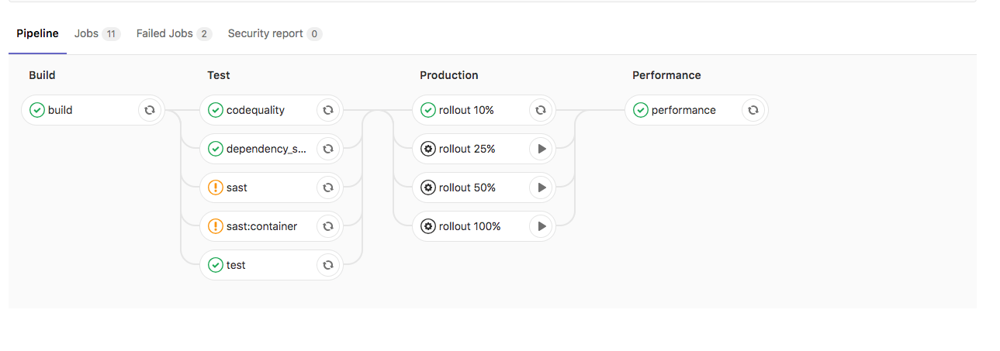
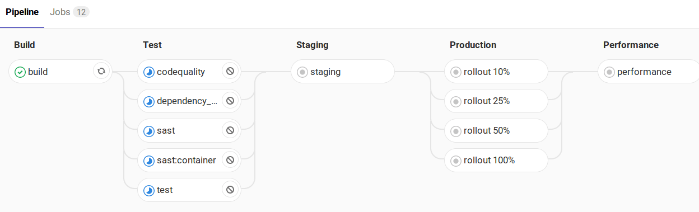

使用 CI/CD 变量设置 Auto DevOps 域、提供自定义 Helm Chart 或扩展应用。

## 构建和部署变量

使用这些变量自定义和部署构建。

| **CI/CD 变量**                      | **描述** |
|-----------------------------------------|-----------------|
| `ADDITIONAL_HOSTS`                      | 以逗号分隔列表形式指定的完全限定域名，这些域名将添加到 Ingress 主机中。 |
| `<ENVIRONMENT>_ADDITIONAL_HOSTS`        | 针对特定环境，以逗号分隔列表形式指定的完全限定域名，这些域名将添加到 Ingress 主机中。此变量优先于 `ADDITIONAL_HOSTS`。 |
| `AUTO_BUILD_IMAGE_VERSION`              | 自定义用于 `build` 作业的镜像版本。请参阅[版本列表](https://jihulab.com/gitlab-cn/cluster-integration/auto-build-image/-/releases)。 |
| `AUTO_DEPLOY_IMAGE_VERSION`             | 自定义用于 Kubernetes 部署作业的镜像版本。请参阅[版本列表](https://jihulab.com/gitlab-cn/cluster-integration/auto-deploy-image/-/releases)。 |
| `AUTO_DEVOPS_ATOMIC_RELEASE`            | Auto DevOps 默认使用 [`--atomic`](https://v2.helm.sh/docs/helm/#options-43) 进行 Helm 部署。将此变量设置为 `false` 可禁用 `--atomic` 的使用。 |
| `AUTO_DEVOPS_BUILD_IMAGE_CNB_BUILDER`   | 使用云原生 Buildpacks 构建时使用的构建器。默认构建器为 `heroku/buildpacks:22`。[更多详情](stages.md#auto-build-using-cloud-native-buildpacks)。 |
| `AUTO_DEVOPS_BUILD_IMAGE_EXTRA_ARGS`    | 传递给 `docker build` 命令的额外参数。使用引号不会阻止单词拆分。[更多详情](customize.md#pass-arguments-to-docker-build)。 |
| `AUTO_DEVOPS_BUILD_IMAGE_FORWARDED_CI_VARIABLES` | 要转发到构建环境（buildpack 构建器或 `docker build`）的[以逗号分隔的 CI/CD 变量名称列表](customize.md#forward-cicd-variables-to-the-build-environment)。 |
| `AUTO_DEVOPS_BUILD_IMAGE_CNB_PORT`      | 在极狐GitLab 15.0 及更高版本中，生成的 Docker 镜像暴露的端口。设置为 `false` 可防止暴露任何端口。默认为 `5000`。 |
| `AUTO_DEVOPS_BUILD_IMAGE_CONTEXT`       | 用于设置 Dockerfile 和云原生 Buildpacks 的构建上下文目录。默认为根目录。 |
| `AUTO_DEVOPS_CHART`                     | 用于部署应用的 Helm Chart。默认为[极狐GitLab 提供的](https://jihulab.com/gitlab-cn/cluster-integration/auto-deploy-image/-/tree/master/assets/auto-deploy-app)。 |
| `AUTO_DEVOPS_CHART_REPOSITORY`          | 用于搜索 Chart 的 Helm Chart 仓库。默认为 `https://charts.gitlab.io`。 |
| `AUTO_DEVOPS_CHART_REPOSITORY_NAME`     | 用于设置 Helm 仓库的名称。默认为 `gitlab`。 |
| `AUTO_DEVOPS_CHART_REPOSITORY_USERNAME` | 用于设置连接到 Helm 仓库的用户名。默认无凭据。还需设置 `AUTO_DEVOPS_CHART_REPOSITORY_PASSWORD`。 |
| `AUTO_DEVOPS_CHART_REPOSITORY_PASSWORD` | 用于设置连接到 Helm 仓库的密码。默认无凭据。还需设置 `AUTO_DEVOPS_CHART_REPOSITORY_USERNAME`。 |
| `AUTO_DEVOPS_CHART_REPOSITORY_PASS_CREDENTIALS` | 设置为非空值可启用将 Helm 仓库凭据转发到 Chart 服务器，当 Chart 产物与仓库位于不同主机时。 |
| `AUTO_DEVOPS_CHART_REPOSITORY_INSECURE` | 设置为非空值可为 Helm 命令添加 `--insecure-skip-tls-verify` 参数。默认情况下，Helm 使用 TLS 验证。 |
| `AUTO_DEVOPS_CHART_CUSTOM_ONLY`         | 设置为非空值可仅使用自定义 Chart。默认情况下，会从极狐GitLab 下载最新 Chart。 |
| `AUTO_DEVOPS_CHART_VERSION`             | 设置部署 Chart 的版本。默认为最新可用版本。 |
| `AUTO_DEVOPS_COMMON_NAME`               | 从极狐GitLab 15.5 开始，设置为有效域名可自定义用于 TLS 证书的通用名称。默认为 `le-$CI_PROJECT_ID.$KUBE_INGRESS_BASE_DOMAIN`。设置为 `false` 可不在 Ingress 上设置此备用主机。 |
| `AUTO_DEVOPS_DEPLOY_DEBUG`              | 如果存在此变量，Helm 将输出调试日志。 |
| `AUTO_DEVOPS_ALLOW_TO_FORCE_DEPLOY_V<N>` | 从 [auto-deploy-image](https://jihulab.com/gitlab-cn/cluster-integration/auto-deploy-image) v1.0.0 开始，如果存在此变量，则会强制部署新的主要版本 Chart。有关更多信息，请参阅[忽略警告并继续部署](upgrading_auto_deploy_dependencies.md#ignore-warnings-and-continue-deploying)。 |
| `BUILDPACK_URL`                         | 完整的 Buildpack URL。[必须指向 Pack 支持的 URL](customize.md#custom-buildpacks)。 |
| `CANARY_ENABLED`                        | 用于定义[金丝雀环境的部署策略](#deploy-policy-for-canary-environments)。 |
| `BUILDPACK_VOLUMES`                     | 指定一个或多个[要挂载的 Buildpack 卷](stages.md#mount-volumes-into-the-build-container)。使用竖线 `\|` 作为列表分隔符。 |
| `CANARY_PRODUCTION_REPLICAS`            | 在生产环境中为[金丝雀部署](../../user/project/canary_deployments.md)部署的金丝雀副本数量。优先于 `CANARY_REPLICAS`。默认为 1。 |
| `CANARY_REPLICAS`                       | 为[金丝雀部署](../../user/project/canary_deployments.md)部署的金丝雀副本数量。默认为 1。 |
| `CI_APPLICATION_REPOSITORY`             | 正在构建或部署的容器镜像仓库，`$CI_APPLICATION_REPOSITORY:$CI_APPLICATION_TAG`。有关更多详情，请阅读[自定义容器镜像](customize.md#custom-container-image)。 |
| `CI_APPLICATION_TAG`                    | 正在构建或部署的容器镜像标签，`$CI_APPLICATION_REPOSITORY:$CI_APPLICATION_TAG`。有关更多详情，请阅读[自定义容器镜像](customize.md#custom-container-image)。 |
| `DAST_AUTO_DEPLOY_IMAGE_VERSION`        | 自定义用于默认分支上 DAST 部署的镜像版本。通常应与 `AUTO_DEPLOY_IMAGE_VERSION` 相同。请参阅[版本列表](https://jihulab.com/gitlab-cn/cluster-integration/auto-deploy-image/-/releases)。 |
| `DOCKERFILE_PATH`                       | 允许覆盖[构建阶段的默认 Dockerfile 路径](customize.md#custom-dockerfiles) |
| `HELM_RELEASE_NAME`                     | 允许覆盖 `helm` 发布名称。可用于在将多个项目部署到单个命名空间时分配唯一的发布名称。 |
| `HELM_UPGRADE_VALUES_FILE`              | 允许覆盖 `helm upgrade` values 文件。默认为 `.gitlab/auto-deploy-values.yaml`。 |
| `HELM_UPGRADE_EXTRA_ARGS`               | 允许在部署应用时在 `helm upgrade` 命令中添加额外选项。使用引号不会阻止单词拆分。 |
| `INCREMENTAL_ROLLOUT_MODE`              | 如果存在，可用于为生产环境启用应用的[增量上线](#incremental-rollout-to-production)。设置为 `manual` 可进行手动部署作业，或设置为 `timed` 可进行自动上线部署，每次间隔 5 分钟。 |
| `K8S_SECRET_*`                          | 任何以 [`K8S_SECRET_`](#configure-application-secret-variables) 为前缀的变量都会被 Auto DevOps 作为环境变量提供给已部署的应用。 |
| `KUBE_CONTEXT`                          | 可用于从 `KUBECONFIG` 中选择要使用的上下文。当 `KUBE_CONTEXT` 为空时，将使用 `KUBECONFIG` 中的默认上下文（如果有）。当[与 Kubernetes 的 agent 一起使用](../../user/clusters/agent/ci_cd_workflow.md)时，必须选择一个上下文。 |
| `KUBE_INGRESS_BASE_DOMAIN`              | 可用于为每个集群设置域。有关更多信息，请参阅[集群域](../../user/project/clusters/gitlab_managed_clusters.md#base-domain)。 |
| `KUBE_NAMESPACE`                        | 用于部署的命名空间。当使用基于证书的集群时，[不应直接覆盖此值](../../user/project/clusters/deploy_to_cluster.md#custom-namespace)。 |
| `KUBECONFIG`                            | 用于部署的 kubeconfig。用户提供的值优先于极狐GitLab 提供的值。 |
| `PRODUCTION_REPLICAS`                   | 在生产环境中部署的副本数量。优先于 `REPLICAS`，默认为 1。对于零停机升级，设置为 2 或更大。 |
| `REPLICAS`                              | 要部署的副本数量。默认为 1。更改此变量，而不是[修改](customize.md#customize-helm-chart-values) `replicaCount`。 |
| `ROLLOUT_RESOURCE_TYPE`                 | 允许在使用自定义 Helm Chart 时指定正在部署的资源类型。默认值为 `deployment`。 |
| `ROLLOUT_STATUS_DISABLED`               | 用于禁用上线状态检查，因为它不支持所有资源类型，例如 `cronjob`。 |
| `STAGING_ENABLED`                       | 用于定义[预发布环境和生产环境的部署策略](#deploy-policy-for-staging-and-production-environments)。 |
| `TRACE`                                 | 设置为任何值可使 Helm 命令产生详细输出。你可以使用此设置来帮助诊断 Auto DevOps 部署问题。 |

## 数据库变量

> [!warning]
> 从[极狐GitLab 16.0](https://jihulab.com/gitlab-cn/gitlab/-/issues/343988) 开始，`POSTGRES_ENABLED` 不再默认设置。

使用这些变量将 CI/CD 与 PostgreSQL 数据库集成。

| **CI/CD 变量**                            | **描述**                    |
|-----------------------------------------|------------------------------------|
| `DB_INITIALIZE`                         | 用于指定运行以初始化应用 PostgreSQL 数据库的命令。在应用 Pod 内运行。 |
| `DB_MIGRATE`                            | 用于指定运行以迁移应用 PostgreSQL 数据库的命令。在应用 Pod 内运行。 |
| `POSTGRES_ENABLED`                      | 是否启用 PostgreSQL。设置为 `true` 可启用 PostgreSQL 的自动部署。 |
| `POSTGRES_USER`                         | PostgreSQL 用户。默认为 `user`。设置以使用自定义用户名。 |
| `POSTGRES_PASSWORD`                     | PostgreSQL 密码。默认为 `testing-password`。设置以使用自定义密码。 |
| `POSTGRES_DB`                           | PostgreSQL 数据库名称。默认为 [`$CI_ENVIRONMENT_SLUG`](../../ci/variables/_index.md#predefined-cicd-variables) 的值。设置以使用自定义数据库名称。 |
| `POSTGRES_VERSION`                      | 要使用的 [`postgres` Docker 镜像](https://hub.docker.com/_/postgres) 的标签。对于测试和部署，默认为 `9.6.16`。如果 `AUTO_DEVOPS_POSTGRES_CHANNEL` 设置为 `1`，部署将使用默认版本 `9.6.2`。 |
| `POSTGRES_HELM_UPGRADE_VALUES_FILE`     | 当使用 [auto-deploy-image v2](upgrading_auto_deploy_dependencies.md) 时，此变量允许覆盖 PostgreSQL 的 `helm upgrade` values 文件。默认为 `.gitlab/auto-deploy-postgres-values.yaml`。 |
| `POSTGRES_HELM_UPGRADE_EXTRA_ARGS`      | 当使用 [auto-deploy-image v2](upgrading_auto_deploy_dependencies.md) 时，此变量允许在部署应用时在 `helm upgrade` 命令中添加额外的 PostgreSQL 选项。使用引号不会阻止单词拆分。 |
| `POSTGRES_CHART_REPOSITORY`             | 用于搜索 PostgreSQL Chart 的 Helm Chart 仓库。默认为 `https://raw.githubusercontent.com/bitnami/charts/eb5f9a9513d987b519f0ecd732e7031241c50328/bitnami`。 |
| `POSTGRES_CHART_VERSION`                | 用于 PostgreSQL Chart 的 Helm Chart 版本。默认为 `8.2.1`。 |

## 作业跳过变量

使用这些变量跳过特定类型的 CI/CD 作业。当跳过时，CI/CD 作业不会被创建或运行。

| **作业名称**                           | **CI/CD 变量**              | **极狐GitLab 版本**    | **描述** |
|----------------------------------------|---------------------------------|-----------------------|-----------------|
| `.fuzz_base`                           | `COVFUZZ_DISABLED`              |                       | [阅读更多](../../user/application_security/coverage_fuzzing/_index.md) 了解 `.fuzz_base` 如何为你自己的作业提供能力。如果值为 `"true"`，则不会创建该作业。 |
| `apifuzzer_fuzz`                       | `API_FUZZING_DISABLED`          |                       | 如果值为 `"true"`，则不会创建该作业。 |
| `build`                                | `BUILD_DISABLED`                |                       | 如果存在该变量，则不会创建该作业。 |
| `build_artifact`                       | `BUILD_DISABLED`                |                       | 如果存在该变量，则不会创建该作业。 |
| `brakeman-sast`                        | `SAST_DISABLED`                 |                       | 如果值为 `"true"`，则不会创建该作业。 |
| `canary`                               | `CANARY_ENABLED`                |                       | 如果存在该变量，则会创建此手动作业。 |
| `code_intelligence`                    | `CODE_INTELLIGENCE_DISABLED`    |                       | 如果存在该变量，则不会创建该作业。 |
| `code_quality`                         | `CODE_QUALITY_DISABLED`         |                       | 如果值为 `"true"`，则不会创建该作业。 |
| `container_scanning`                   | `CONTAINER_SCANNING_DISABLED`   |                       | 如果值为 `"true"`，则不会创建该作业。 |
| `dast`                                 | `DAST_DISABLED`                 |                       | 如果值为 `"true"`，则不会创建该作业。 |
| `dast_environment_deploy`              | `DAST_DISABLED_FOR_DEFAULT_BRANCH` 或 `DAST_DISABLED`  |                        | 如果值为 `"true"`，则不会创建该作业。 |
| `dependency_scanning`                  | `DEPENDENCY_SCANNING_DISABLED`  |                       | 如果值为 `"true"`，则不会创建该作业。 |
| `flawfinder-sast`                      | `SAST_DISABLED`                 |                       | 如果值为 `"true"`，则不会创建该作业。 |
| `gemnasium-dependency_scanning`        | `DEPENDENCY_SCANNING_DISABLED`  |                       | 如果值为 `"true"`，则不会创建该作业。 |
| `gemnasium-maven-dependency_scanning`  | `DEPENDENCY_SCANNING_DISABLED`  |                       | 如果值为 `"true"`，则不会创建该作业。 |
| `gemnasium-python-dependency_scanning` | `DEPENDENCY_SCANNING_DISABLED`  |                       | 如果值为 `"true"`，则不会创建该作业。 |
| `kubesec-sast`                         | `SAST_DISABLED`                 |                       | 如果值为 `"true"`，则不会创建该作业。 |
| `license_management`                   | `LICENSE_MANAGEMENT_DISABLED`   | 极狐GitLab 12.7 及更早版本 | 如果存在该变量，则不会创建该作业。作业从[极狐GitLab 12.8](https://jihulab.com/gitlab-cn/gitlab/-/merge_requests/22773) 开始已弃用。 |
| `license_scanning`                     | `LICENSE_MANAGEMENT_DISABLED`   |                       | 如果值为 `"true"`，则不会创建该作业。作业从[极狐GitLab 15.9](https://jihulab.com/gitlab-cn/gitlab/-/merge_requests/111071) 开始已弃用。 |
| `load_performance`                     | `LOAD_PERFORMANCE_DISABLED`     |                       | 如果存在该变量，则不会创建该作业。 |
| `nodejs-scan-sast`                     | `SAST_DISABLED`                 |                       | 如果值为 `"true"`，则不会创建该作业。 |
| `performance`                          | `PERFORMANCE_DISABLED`          | 极狐GitLab 13.12 及更早版本 | 浏览器性能。如果存在该变量，则不会创建该作业。已被 `browser_performance` 取代。 |
| `browser_performance`                  | `BROWSER_PERFORMANCE_DISABLED`  |                       | 浏览器性能。如果存在该变量，则不会创建该作业。取代 `performance`。 |
| `phpcs-security-audit-sast`            | `SAST_DISABLED`                 |                       | 如果值为 `"true"`，则不会创建该作业。 |
| `pmd-apex-sast`                        | `SAST_DISAB

当 `INCREMENTAL_ROLLOUT_MODE` 设为 `manual` 且 `STAGING_ENABLED` 启用时：

## 定时增量部署到生产环境



- Tier: 专业版，旗舰版
- Offering: JihuLab.com，私有化部署



使用定时增量部署，从少量 Pod 开始，逐步将您的应用程序部署到生产环境。

您可以在[项目设置](requirements.md#auto-devops-deployment-strategy)中启用定时增量部署，或将 `INCREMENTAL_ROLLOUT_MODE` CI/CD 变量设置为 `timed`。

如果将 `INCREMENTAL_ROLLOUT_MODE` 设置为 `timed`，极狐GitLab 会创建四个作业：

1. `定时部署 10%`
1. `定时部署 25%`
1. `定时部署 50%`
1. `定时部署 100%`

作业之间有五分钟的延迟。