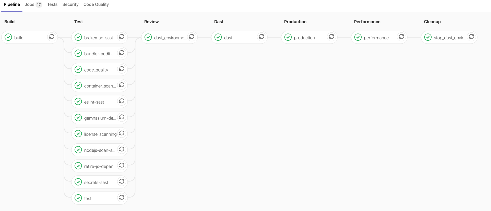
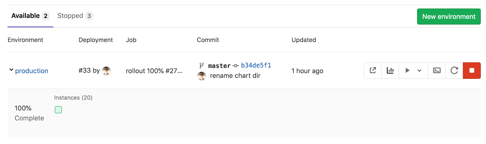
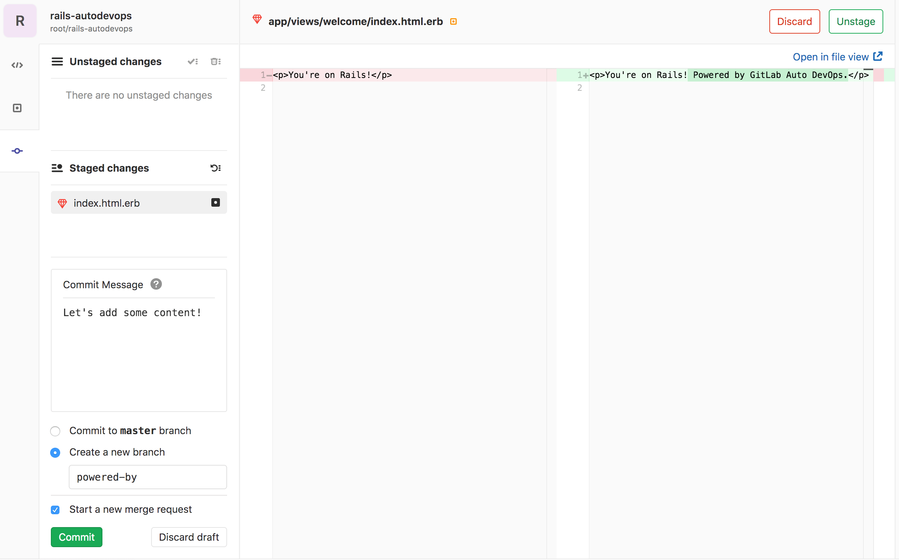

```markdown
---
stage: Verify
group: Runner Core
info: To determine the technical writer assigned to the Stage/Group associated with this page, see <https://handbook.gitlab.com/handbook/product/ux/technical-writing/#assignments>
title: 使用 Auto DevOps 将应用部署到 Google Kubernetes Engine
---



- Tier: 基础版，专业版，旗舰版
- Offering: JihuLab.com，私有化部署



本教程通过一个将应用部署到 Google Kubernetes Engine (GKE) 的示例，助你入门 [Auto DevOps](../_index.md)。

你将使用极狐GitLab 原生 Kubernetes 集成，因此无需通过 Google Cloud Platform 控制台手动创建 Kubernetes 集群。你将创建并部署一个从极狐GitLab 模板创建的应用。

这些说明同样适用于极狐GitLab 私有化部署。
确保你已[配置好自己的 runner](../../../ci/runners/_index.md) 并
[启用了 Google OAuth](../../../integration/google.md)。

要将项目部署到 Google Kubernetes Engine，请遵循以下步骤：

1. [配置你的 Google 账户](#configure-your-google-account)
1. [创建 Kubernetes 集群并部署代理](#create-a-kubernetes-cluster)
1. [从模板创建新项目](#create-an-application-project-from-a-template)
1. [配置代理](#configure-the-agent)
1. [安装 Ingress](#install-ingress)
1. [配置 Auto DevOps](#configure-auto-devops)
1. [启用 Auto DevOps 并运行流水线](#enable-auto-devops-and-run-the-pipeline)
1. [部署应用](#deploy-the-application)

<a id="configure-your-google-account"></a>

## 配置你的 Google 账户

在创建 Kubernetes 集群并将其连接到你的极狐GitLab 项目之前，你需要一个 [Google Cloud Platform 账户](https://console.cloud.google.com)。
使用现有的 Google 账户（例如你用于访问 Gmail 或 Google Drive 的账户）登录，或创建一个新账户。

1. 遵循 Kubernetes Engine 文档中[“开始之前”部分](https://cloud.google.com/kubernetes-engine/docs/deploy-app-cluster#before-you-begin)描述的步骤，以启用所需的 API 和相关服务。
1. 确保你已为 Google Cloud Platform 创建了[结算账户](https://cloud.google.com/billing/docs/how-to/manage-billing-account)。

<a id="create-a-kubernetes-cluster"></a>

## 创建 Kubernetes 集群

要在 Google Kubernetes Engine (GKE) 上创建新集群，请使用基础设施即代码 (IaC) 方法，按照[使用 OpenTofu 和极狐GitLab 创建 Google GKE 集群](../../../user/infrastructure/iac/_index.md)指南中的步骤操作。该指南要求你创建一个使用 [Terraform](https://www.terraform.io/) 的新项目来创建 GKE 集群并安装极狐GitLab Kubernetes 代理。此项目是存放极狐GitLab Kubernetes 代理配置的位置。

<a id="create-an-application-project-from-a-template"></a>

## 从模板创建应用项目

使用极狐GitLab 项目模板快速开始。顾名思义，这些项目提供了基于一些知名框架构建的简约应用。

> [!warning]
> 请在群组层次结构中，与集群管理项目同级或在其下方的层级创建应用项目。否则，[授权代理](../../../user/clusters/agent/ci_cd_workflow.md#authorize-agent-access)将失败。

1. 在右上角，选择 **新建** () 和 **新建项目/代码仓**。
1. 选择 **从模板创建**。
1. 选择 **Ruby on Rails** 模板。
1. 为你的项目命名，可选填描述，并使其公开，以便你可以充分利用[极狐GitLab 旗舰版](https://about.gitlab.com/pricing/)中提供的功能。
1. 选择 **创建项目**。

现在你已拥有一个将要部署到 GKE 集群的应用项目。

<a id="configure-the-agent"></a>

## 配置代理

现在，配置极狐GitLab Kubernetes 代理，以便你可以使用它来部署应用项目。

1. 前往你[为管理集群而创建的项目](#create-a-kubernetes-cluster)。
1. 找到[代理配置文件](../../../user/clusters/agent/install/_index.md#create-an-agent-configuration-file) (`.gitlab/agents/<agent-name>/config.yaml`) 并进行编辑。
1. 配置 `ci_access:projects` 属性。使用应用的项目路径作为 `id`：

```yaml
ci_access:
  projects:
    - id: path/to/application-project
```

<a id="install-ingress"></a>

## 安装 Ingress

集群运行后，你必须安装 NGINX Ingress Controller 作为负载均衡器，以将流量从互联网路由到你的应用。
通过极狐GitLab [集群管理项目模板](../../../user/clusters/management_project_template.md)安装 NGINX Ingress Controller，
或者通过 Google Cloud Shell 手动安装：

1. 前往你的集群详情页面，并选择 **高级设置** 标签页。
1. 选择 Google Kubernetes Engine 的链接，在 Google Cloud Console 上访问该集群。
1. 在 GKE 集群页面上，选择 **连接**，然后选择 **在 Cloud Shell 中运行**。
1. Cloud Shell 启动后，运行以下命令来安装 NGINX Ingress Controller：

   ```shell
   helm upgrade --install ingress-nginx ingress-nginx \
   --repo https://kubernetes.github.io/ingress-nginx \
   --namespace gitlab-managed-apps --create-namespace

   # 检查 ingress controller 是否安装成功
   kubectl get service ingress-nginx-controller -n gitlab-managed-apps
   ```

<a id="configure-auto-devops"></a>

## 配置 Auto DevOps

按照以下步骤配置 Auto DevOps 所需的基础域名和其他设置。

1. 安装 NGINX 几分钟后，负载均衡器会获取一个 IP 地址，你可以使用以下命令获取外部 IP 地址：

   ```shell
   kubectl get service ingress-nginx-controller -n gitlab-managed-apps -ojson | jq -r '.status.loadBalancer.ingress[].ip'
   ```

   如果你已覆盖命名空间，请将 `gitlab-managed-apps` 替换掉。

   复制此 IP 地址，你将在下一步中用到它。
1. 返回应用项目。
1. 在左侧边栏中，选择 **设置** > **CI/CD** 并展开 **变量**。
   - 添加一个键名为 `KUBE_INGRESS_BASE_DOMAIN`，值为应用部署域名的变量。在此示例中，使用域名 `<IP address>.nip.io`。
   - 添加一个键名为 `KUBE_NAMESPACE`，值为你的部署目标 Kubernetes 命名空间的变量。你可以为不同环境使用不同命名空间。配置环境时，请使用环境范围。
   - 添加一个键名为 `KUBE_CONTEXT`，值为 `<path/to/agent/project>:<agent-name>` 的变量。选择你选择的环境范围。
   - 选择 **保存更改**。

<a id="enable-auto-devops-and-run-the-pipeline"></a>

## 启用 Auto DevOps 并运行流水线

虽然 Auto DevOps 默认启用，但 Auto DevOps 在以下两种情况下可能会被禁用：
实例级别（针对极狐GitLab 私有化部署实例）和群组级别。如果被禁用，请完成以下步骤以启用 Auto DevOps：

1. 在顶部导航栏中，选择 **搜索或跳转到** 并查找应用项目。
1. 选择 **设置** > **CI/CD**。
1. 展开 **Auto DevOps**。
1. 选择 **默认使用 Auto DevOps 流水线** 以显示更多选项。
1. 在 **部署策略** 中，选择你希望的[持续部署策略](../requirements.md#auto-devops-deployment-strategy)，以便在默认分支上流水线成功运行后将应用部署到生产环境。
1. 选择 **保存更改**。
1. 编辑 `.gitlab-ci.yml` 文件以包含 Auto DevOps 模板，并将更改提交到 `master` 分支：

   ```yaml
   include:
   - template: Auto-DevOps.gitlab-ci.yml
   ```

该提交应触发一个流水线。下一节将解释流水线中各个作业的作用。

<a id="deploy-the-application"></a>

## 部署应用

当你的流水线运行时，它在做什么？

要查看流水线中的作业，请选择流水线的状态徽章。
当流水线作业正在运行时，会显示  图标，并在作业完成时无需刷新页面即更新为 （表示成功）或 （表示失败）。

作业分为几个阶段：



- **构建** - 应用构建一个 Docker 镜像并将其上传到你项目的[容器镜像仓库](../../../user/packages/container_registry/_index.md)（[自动构建](../stages.md#auto-build)）。
- **测试** - 极狐GitLab 在应用上运行各种检查，但在测试阶段，除 `test` 之外的所有作业都允许失败：

  - `test` 作业通过检测语言和框架来运行单元测试和集成测试（[自动测试](../stages.md#auto-test)）
  - `code_quality` 作业检查代码质量并被允许失败（[自动代码质量](../stages.md#auto-code-quality)）
  - `container_scanning` 作业检查 Docker 容器是否存在任何漏洞并被允许失败（[自动容器扫描](../stages.md#auto-container-scanning)）
  - `dependency_scanning` 作业检查应用是否有任何易受漏洞影响的依赖项并被允许失败（[自动依赖项扫描](../stages.md#auto-dependency-scanning)）
  - 后缀为 `-sast` 的作业对当前代码运行静态分析以检查潜在的安全问题，并被允许失败（[自动 SAST](../stages.md#auto-sast)）
  - `secret-detection` 作业检查泄露的密钥并被允许失败（[自动密钥检测](../stages.md#auto-secret-detection)）
- **评审** - 默认分支上的流水线包含此阶段，其中有一个 `dast_environment_deploy` 作业。
  更多信息，请参见[动态应用安全测试 (DAST)](../../../user/application_security/dast/_index.md)。
- **生产** - 在测试和检查完成后，应用在 Kubernetes 中部署（[自动部署](../stages.md#auto-deploy)）。
- **性能** - 对已部署的应用运行性能测试（[自动浏览器性能测试](../stages.md#auto-browser-performance-testing)）。
- **清理** - 默认分支上的流水线包含此阶段，其中有一个 `stop_dast_environment` 作业。

运行流水线后，你应该查看已部署的网站并了解如何监控它。

<a id="monitor-your-project"></a>

### 监控你的项目

成功部署应用后，你可以通过导航到 **运维** > **环境** 在 **环境** 页面上查看其网站并检查其健康状况。此页面显示已部署应用的详细信息，右侧列显示链接到常见环境任务的图标：



- **打开实时环境** () - 打开部署到生产环境的应用的 URL
- **监控** () - 打开 Prometheus 收集有关 Kubernetes 集群以及应用在内存使用、CPU 使用和延迟方面如何影响集群的数据的指标页面
- **部署到** ( ) - 显示你可以部署到的环境列表
- **终端** () - 在运行应用的容器内打开一个 [Web 终端](../../../ci/environments/_index.md#web-terminals-deprecated) 会话
- **重新部署到环境** () - 更多信息，请参见[重试和回滚](../../../ci/environments/deployments.md#retry-or-roll-back-a-deployment)
- **停止环境** () - 更多信息，请参见[停止环境](../../../ci/environments/_index.md#stopping-an-environment)

极狐GitLab 在环境信息下方显示[部署面板](../../../user/project/deploy_boards.md)，其中有代表你 Kubernetes 集群中 Pod 的方块，用颜色编码显示其状态。将鼠标悬停在部署面板的方块上会显示部署的状态，选择该方块则会带你进入 Pod 的日志页面。

> [!note]
> 该示例目前仅显示一个托管应用的 Pod，但你可以通过在 **设置** > **CI/CD** > **变量** 中定义 [`REPLICAS` CI/CD 变量](../cicd_variables.md) 来添加更多 Pod。

<a id="work-with-branches"></a>

### 使用分支

接下来，创建一个功能分支来为你的应用添加内容：

1. 在你的项目代码仓中，转到以下文件：`app/views/welcome/index.html.erb`。
   此文件应只包含一个段落：`<p>You're on Rails!</p>`。
1. 打开极狐GitLab [Web IDE](../../../user/project/web_ide/_index.md) 进行更改。
1. 编辑文件，使其包含：

   ```html
   <p>You're on Rails! 由极狐GitLab Auto DevOps 提供支持。</p>
   ```

1. 暂存此文件。添加提交消息，然后通过选择 **提交** 来创建一个新分支和一个合并请求。

   

提交合并请求后，极狐GitLab 会运行你的流水线以及其中的所有作业，如[之前所述](#deploy-the-application)，此外还会运行一些仅在非默认分支上运行的额外作业。

几分钟后，一个测试失败了，这意味着你的更改“破坏了”某个测试。选择失败的 `test` 作业以查看更多相关信息：

```plaintext
Failure:
WelcomeControllerTest#test_should_get_index [/app/test/controllers/welcome_controller_test.rb:7]:
<You're on Rails!> expected but was
<You're on Rails! 由极狐GitLab Auto DevOps 提供支持。>..
Expected 0 to be >= 1.

bin/rails test test/controllers/welcome_controller_test.rb:4
```

要修复这个失败的测试：

1. 返回你的合并请求。
1. 在右上角，选择 **代码**，然后选择 **在 Web IDE 中打开**。
1. 在左侧的文件目录中，找到 `test/controllers/welcome_controller_test.rb` 文件，并选择它将其打开。
1. 将第 7 行更改为 `You're on Rails! 由极狐GitLab Auto DevOps 提供支持。`
1. 在左侧边栏中，选择 **源代码控制** ()。
1. 编写提交消息，并选择 **提交**。

返回合并请求的 **概览** 页面，你不仅应该看到测试通过，还应该看到应用已作为一个[评审应用](../stages.md#auto-review-apps)部署。你可以通过选择 **查看应用**  按钮来访问它，以查看你部署的更改。

合并合并请求后，极狐GitLab 会在默认分支上运行流水线，然后将应用部署到生产环境。

<a id="conclusion"></a>

## 总结

实现此项目后，你应对 Auto DevOps 的基础知识有了扎实的理解。你从构建和测试开始，到在极狐GitLab 中部署和监控应用。尽管具有自动化特性，Auto DevOps 也可以进行配置和定制以满足你的工作流程。以下是一些进一步阅读的有用资源：

1. [Auto DevOps](../_index.md)
1. [多个 Kubernetes 集群](../multiple_clusters_auto_devops.md)
1. [增量发布到生产环境](../cicd_variables.md#incremental-rollout-to-production)
1. [使用 CI/CD 变量禁用你不需要的作业](../cicd_variables.md)
1. [使用你自己的构建包来构建你的应用](../customize.md#custom-buildpacks)

```