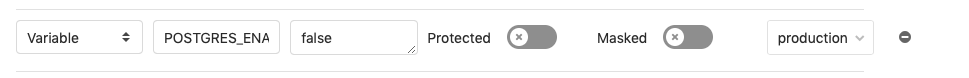



- Tier: 基础版，专业版，旗舰版
- Offering: JihuLab.com，私有化部署



您可以根据需要自定义 Auto DevOps 的组件。例如，您可以：

- 添加自定义 [Buildpacks](#custom-buildpacks)、[Dockerfiles](#custom-dockerfiles) 和 [Helm charts](#custom-helm-chart)。
- 使用自定义 [CI/CD 配置](#customize-gitlab-ciyml) 启用预发布和灰度部署。
- 通过 [极狐GitLab API](#extend-auto-devops-with-the-api) 扩展 Auto DevOps。

<a id="custom-buildpacks"></a>

## 自定义 Buildpacks

在以下情况下，您可以自定义 Buildpacks：

- 自动 Buildpack 检测对您的项目失败。
- 您需要对构建过程进行更多控制。

<a id="customize-buildpacks-with-cloud-native-buildpacks"></a>

### 使用 Cloud Native Buildpacks 自定义 Buildpacks

指定以下任一内容：

- CI/CD 变量 `BUILDPACK_URL`，格式可以是 [`pack` 的 URI 规范](https://buildpacks.io/docs/app-developer-guide/specify-buildpacks/)。
- 包含所需 Buildpacks 的 [`project.toml` 项目描述符](https://buildpacks.io/docs/app-developer-guide/using-project-descriptor/)。

<a id="multiple-buildpacks"></a>

### 多个 Buildpacks

由于 Auto Test 无法使用 `.buildpacks` 文件，Auto DevOps 不支持多个 Buildpacks。后台用于解析 `.buildpacks` 文件的 buildpack [heroku-buildpack-multi](https://github.com/heroku/heroku-buildpack-multi/) 未提供必要的 `bin/test-compile` 和 `bin/test` 命令。

要仅使用单个自定义 Buildpack，您应提供项目 CI/CD 变量 `BUILDPACK_URL` 代替。

<a id="custom-dockerfiles"></a>

## 自定义 Dockerfiles

如果您的项目仓库根目录下存在 Dockerfile，Auto DevOps 会基于该 Dockerfile 构建 Docker 镜像。这通常比使用 Buildpack 更快，且镜像体积更小，特别是如果您的 Dockerfile 基于 [Alpine](https://hub.docker.com/_/alpine/)。

如果您设置了 `DOCKERFILE_PATH` CI/CD 变量，Auto Build 会改为在指定位置查找 Dockerfile。

<a id="pass-arguments-to-docker-build"></a>

### 传递参数到 `docker build`

您可以通过项目 CI/CD 变量 `AUTO_DEVOPS_BUILD_IMAGE_EXTRA_ARGS` 向 `docker build` 传递参数。

例如，要构建基于 `ruby：alpine` 而非默认的 `ruby：latest` 的 Docker 镜像：

1. 将 `AUTO_DEVOPS_BUILD_IMAGE_EXTRA_ARGS` 设置为 `--build-arg=RUBY_VERSION=alpine`。
1. 在自定义 Dockerfile 中添加以下内容：

   ```dockerfile
   ARG RUBY_VERSION=latest
   FROM ruby：$RUBY_VERSION

   # 在此处包含您的内容
   ```

要传递包含空格和换行符的复杂值，请使用 Base64 编码。未编码的复杂值可能会导致字符转义问题。

> [!warning]
> 请勿将密钥作为 Docker 构建参数传递。密钥可能会残留在镜像中。有关更多信息，请参阅
> [此关于密钥最佳实践的讨论](https://github.com/moby/moby/issues/13490)。

<a id="custom-container-image"></a>

## 自定义容器镜像

默认情况下，[Auto Deploy](stages.md#auto-deploy) 部署由 [Auto Build](stages.md#auto-build) 构建并推送至极狐GitLab 镜像仓库的容器镜像。您可以通过设置特定变量来覆盖此行为：

| 入口 | 默认值 | 可被覆盖 |
| ----- | -----   | -----    |
| 镜像路径 | 分支流水线使用 `$CI_REGISTRY_IMAGE/$CI_COMMIT_REF_SLUG`。标签流水线使用 `$CI_REGISTRY_IMAGE`。 | `$CI_APPLICATION_REPOSITORY` |
| 镜像标签 | 分支流水线使用 `$CI_COMMIT_SHA`。标签流水线使用 `$CI_COMMIT_TAG`。 | `$CI_APPLICATION_TAG` |

这些变量同样影响 Auto Build 和自动容器扫描。如果您不希望将镜像构建并推送到 `$CI_APPLICATION_REPOSITORY：$CI_APPLICATION_TAG`，请仅包含 `Jobs/Deploy.gitlab-ci.yml`，或[跳过 `build` 作业](cicd_variables.md#job-skipping-variables)。

如果您使用自动容器扫描并设置了 `$CI_APPLICATION_REPOSITORY` 的值，则还应更新 `$CS_DEFAULT_BRANCH_IMAGE`。有关更多信息，请参阅[设置默认分支镜像](../../user/application_security/container_scanning/_index.md#setting-the-default-branch-image)。

以下是 `.gitlab-ci.yml` 中的示例配置：

```yaml
variables：
  CI_APPLICATION_REPOSITORY：<your-image-repository>
  CI_APPLICATION_TAG：<the-tag>
```

<a id="extend-auto-devops-with-the-api"></a>

## 通过 API 扩展 Auto DevOps

您可以使用极狐GitLab API 扩展和管理 Auto DevOps 配置：

- [使用 API 调用访问设置](../../api/settings.md#available-settings)，其中包括 `auto_devops_enabled`，默认为项目启用 Auto DevOps。
- [创建新项目](../../api/projects.md#create-a-project)。
- [编辑群组](../../api/groups.md#update-group-attributes)。
- [编辑项目](../../api/projects.md#update-a-project)。

<a id="forward-cicd-variables-to-the-build-environment"></a>

## 将 CI/CD 变量转发到构建环境

要将 CI/CD 变量转发到构建环境，请将要转发的变量名称添加到 `AUTO_DEVOPS_BUILD_IMAGE_FORWARDED_CI_VARIABLES` CI/CD 变量中。多个变量之间用英文逗号分隔。

例如，要转发变量 `CI_COMMIT_SHA` 和 `CI_ENVIRONMENT_NAME`：

```yaml
variables：
  AUTO_DEVOPS_BUILD_IMAGE_FORWARDED_CI_VARIABLES：CI_COMMIT_SHA,CI_ENVIRONMENT_NAME
```

如果您使用 Buildpacks，转发的变量可作为环境变量自动使用。

如果您使用 Dockerfile：

1. 要启用实验性 Dockerfile 语法，请在 Dockerfile 中添加：

   ```dockerfile
   # syntax = docker/dockerfile：experimental
   ```

1. 要在 Dockerfile 的任何 `RUN $COMMAND` 中使用密钥，请挂载密钥文件并在执行 `$COMMAND` 之前加载它：

   ```dockerfile
   RUN --mount=type=secret,id=auto-devops-build-secrets . /run/secrets/auto-devops-build-secrets && $COMMAND
   ```

当设置了 `AUTO_DEVOPS_BUILD_IMAGE_FORWARDED_CI_VARIABLES` 时，Auto DevOps 会启用实验性的 [Docker BuildKit](https://docs.docker.com/build/buildkit/) 功能以使用 `--secret` 标志。

<a id="custom-helm-chart"></a>

## 自定义 Helm Chart

Auto DevOps 使用 [Helm](https://helm.sh/) 将应用部署到 Kubernetes。您可以通过在项目仓库中捆绑 Chart 文件或指定项目 CI/CD 变量来覆盖使用的 Helm Chart：

- **捆绑的 Chart** - 如果您的项目有一个 `./chart` 目录，其中包含 `Chart.yaml` 文件，Auto DevOps 会检测到此 Chart 并将其替换为[默认 Chart](https://jihulab.com/gitlab-cn/cluster-integration/auto-deploy-image/-/tree/master/assets/auto-deploy-app)。
- **项目变量** - 创建一个带有自定义 Chart URL 的[项目 CI/CD 变量](../../ci/variables/_index.md) `AUTO_DEVOPS_CHART`。您还可以创建以下五个项目变量：

  - `AUTO_DEVOPS_CHART_REPOSITORY` - 自定义 Chart 仓库的 URL。
  - `AUTO_DEVOPS_CHART` - Chart 的路径。
  - `AUTO_DEVOPS_CHART_REPOSITORY_INSECURE` - 设置为非空值以向 Helm 命令添加 `--insecure-skip-tls-verify` 参数。
  - `AUTO_DEVOPS_CHART_CUSTOM_ONLY` - 设置为非空值以仅使用自定义 Chart。默认情况下，会从极狐GitLab 下载最新的 Chart。
  - `AUTO_DEVOPS_CHART_VERSION` - 部署 Chart 的版本。

<a id="customize-helm-chart-values"></a>

### 自定义 Helm Chart 值

要覆盖[默认 Helm Chart](https://jihulab.com/gitlab-cn/cluster-integration/auto-deploy-image/-/tree/master/assets/auto-deploy-app) 中 `values.yaml` 的默认值，您可以：

- 在仓库中添加名为 `.gitlab/auto-deploy-values.yaml` 的文件。如果找到，此文件会自动用于 Helm 升级。
- 在仓库中添加一个不同名称或路径的文件，并使用 `HELM_UPGRADE_VALUES_FILE` [CI/CD 变量](cicd_variables.md) 设置该文件的路径和名称。

某些值不能使用前面的选项覆盖。要覆盖 `replicaCount` 等设置，请使用 `REPLICAS` [构建和部署](cicd_variables.md#build-and-deployment-variables) CI/CD 变量。

<a id="customize-helm-upgrade"></a>

### 自定义 `helm upgrade`

[auto-deploy-image](https://jihulab.com/gitlab-cn/cluster-integration/auto-deploy-image) 使用 `helm upgrade` 命令。要自定义此命令，请通过 `HELM_UPGRADE_EXTRA_ARGS` CI/CD 变量传递选项。

例如，要在运行 `helm upgrade` 时停用升级前后的钩子：

```yaml
variables：
  HELM_UPGRADE_EXTRA_ARGS：--no-hooks
```

有关选项的完整列表，请参阅 [官方 `helm upgrade` 文档](https://helm.sh/docs/helm/helm_upgrade/)。

<a id="limit-a-helm-chart-to-one-environment"></a>

### 限制 Helm Chart 到一个环境

要将自定义 Chart 限制在一个环境中，请为 CI/CD 变量添加环境范围。有关更多信息，请参阅[限制 CI/CD 变量的环境范围](../../ci/environments/_index.md#limit-the-environment-scope-of-a-cicd-variable)。

<a id="customize-gitlab-ciyml"></a>

## 自定义 `.gitlab-ci.yml`

Auto DevOps 的高度可定制性得益于 [Auto DevOps 模板](https://jihulab.com/gitlab-cn/gitlab/-/blob/master/lib/gitlab/ci/templates/Auto-DevOps.gitlab-ci.yml)本质上就是一个 `.gitlab-ci.yml` 文件。该模板仅使用任何 `.gitlab-ci.yml` 实现都可用的功能。

要为由 Auto DevOps 使用的 CI/CD 流水线添加自定义行为：

1. 在仓库根目录添加一个包含以下内容的 `.gitlab-ci.yml` 文件：

   ```yaml
   include：
     - template：Auto-DevOps.gitlab-ci.yml
   ```

1. 在 `.gitlab-ci.yml` 文件中添加您的更改。您的更改将与 Auto DevOps 模板合并。有关 `include` 如何合并更改的更多信息，请参阅 [`include` 文档](../../ci/yaml/_index.md#include)。

要从 Auto DevOps 流水线中移除行为：

1. 将 [Auto DevOps 模板](https://jihulab.com/gitlab-cn/gitlab/-/blob/master/lib/gitlab/ci/templates/Auto-DevOps.gitlab-ci.yml)复制到您的项目中。
1. 根据需要编辑您复制的模板。

<a id="use-individual-components-of-auto-devops"></a>

### 使用 Auto DevOps 的单个组件

如果您只需要 Auto DevOps 提供的部分功能，可以在自己的 `.gitlab-ci.yml` 中包含单独的 Auto DevOps 作业。请务必在您的 `.gitlab-ci.yml` 文件中定义每个作业所需的阶段。

例如，要使用 [Auto Build](stages.md#auto-build)，可以在 `.gitlab-ci.yml` 中添加以下内容：

```yaml
stages：
  - build

include：
  - template：Jobs/Build.gitlab-ci.yml
```

有关可用作业的列表，请参阅 [Auto DevOps 模板](https://jihulab.com/gitlab-cn/gitlab/-/blob/master/lib/gitlab/ci/templates/Auto-DevOps.gitlab-ci.yml)。

<a id="use-multiple-kubernetes-clusters"></a>

## 使用多个 Kubernetes 集群

请参阅 [Auto DevOps 的多 Kubernetes 集群](multiple_clusters_auto_devops.md)。

<a id="customizing-the-kubernetes-namespace"></a>

## 自定义 Kubernetes 命名空间

在极狐GitLab 14.5 及更早版本中，您可以使用 `environment：kubernetes：namespace` 为环境指定命名空间。但是，该功能连同基于证书的集成已[被弃用](https://jihulab.com/groups/gitlab-cn/configure/-/epics/8)。

现在您应使用 `KUBE_NAMESPACE` 环境变量并[限制其环境范围](../../ci/environments/_index.md#limit-the-environment-scope-of-a-cicd-variable)。

<a id="use-images-hosted-in-a-local-docker-registry"></a>

## 使用本地 Docker 镜像仓库中的镜像

您可以将许多 Auto DevOps 作业配置为在[离线环境](../../user/application_security/offline_deployments/_index.md)中运行：

1. 将所需的 Auto DevOps Docker 镜像从 Docker Hub 和 `registry.gitlab.com` 复制到本地的极狐GitLab 容器镜像仓库。
1. 当镜像托管在本地仓库并可用后，编辑 `.gitlab-ci.yml` 以指向本地托管的镜像。例如：

   ```yaml
   include：
     - template：Auto-DevOps.gitlab-ci.yml

   variables：
     REGISTRY_URL："registry.gitlab.example"

   build：
     image："$REGISTRY_URL/docker/auto-build-image：v0.6.0"
     services：
       - name："$REGISTRY_URL/greg/docker/docker：20.10.16-dind"
         command：['--tls=false', '--host=tcp：//0.0.0.0：2375']
   ```

<a id="postgresql-database-support"></a>

## PostgreSQL 数据库支持

> [!warning]
> 默认情况下提供 PostgreSQL 数据库的功能已于极狐GitLab 15.8 中[被弃用](https://jihulab.com/gitlab-cn/gitlab/-/issues/387766)，并在 16.0 起不再是默认行为。要启用数据库预置，请设置相关联的 [CI/CD 变量](cicd_variables.md#database-variables)。

为了支持需要数据库的应用，默认会提供 [PostgreSQL](https://www.postgresql.org/)。访问数据库的凭证已预先配置。

要自定义凭证，请设置相关联的 [CI/CD 变量](cicd_variables.md)。您还可以定义自定义的 `DATABASE_URL`：

```text
postgres：//user：password@postgres-host：postgres-port/postgres-database
```

<a id="upgrading-postgresql"></a>

### 升级 PostgreSQL

极狐GitLab 默认使用 Chart 版本 8.2.1 提供 PostgreSQL。您可以从 0.7.1 到 8.2.1 之间设置版本。

如果您使用较旧的 Chart 版本，应[迁移您的数据库](upgrading_postgresql.md)到较新的 PostgreSQL。

控制默认提供 PostgreSQL 的 CI/CD 变量 `AUTO_DEVOPS_POSTGRES_CHANNEL` 在[极狐GitLab 13.0](https://jihulab.com/gitlab-cn/gitlab/-/issues/210499) 中更改为 `2`。要使用旧的 PostgreSQL，请将 `AUTO_DEVOPS_POSTGRES_CHANNEL` 变量设置为 `1`。

<a id="customize-values-for-postgresql-helm-chart"></a>

### 自定义 PostgreSQL Helm Chart 的值

要设置自定义值，请执行以下任一操作：

- 在仓库中创建一个名为 `.gitlab/auto-deploy-postgres-values.yaml` 的文件。如果存在，该文件会自动使用。此文件默认用于 PostgreSQL Helm 升级。
- 在仓库中添加一个不同名称或路径的文件，并使用 `POSTGRES_HELM_UPGRADE_VALUES_FILE` [环境变量](cicd_variables.md#database-variables) 设置路径和名称。
- 设置 `POSTGRES_HELM_UPGRADE_EXTRA_ARGS` [环境变量](cicd_variables.md#database-variables)。

<a id="use-external-postgresql-database-providers"></a>

### 使用外部 PostgreSQL 数据库提供商

Auto DevOps 为生产环境提供了开箱即用的 PostgreSQL 容器支持。不过，您可能希望使用外部托管提供商，如 AWS Relational Database Service。

要使用外部托管提供商：

1. 通过具有环境范围的 [CI/CD 变量](../../ci/environments/_index.md#limit-the-environment-scope-of-a-cicd-variable) 禁用针对所需环境的内置 PostgreSQL 安装。由于评审应用和预发布环境的内置 PostgreSQL 设置可能已经足够，您可能只需要禁用 `production` 环境的安装。

   
1. 将 `DATABASE_URL` 变量定义为一个环境范围变量，并使其对您的应用可用。该变量的格式应为以下 URL：

   ```text
   postgres：//user：password@postgres-host：postgres-port/postgres-database
   ```

1. 确保您的 Kubernetes 集群具有访问托管 PostgreSQL 所在位置的网络权限。