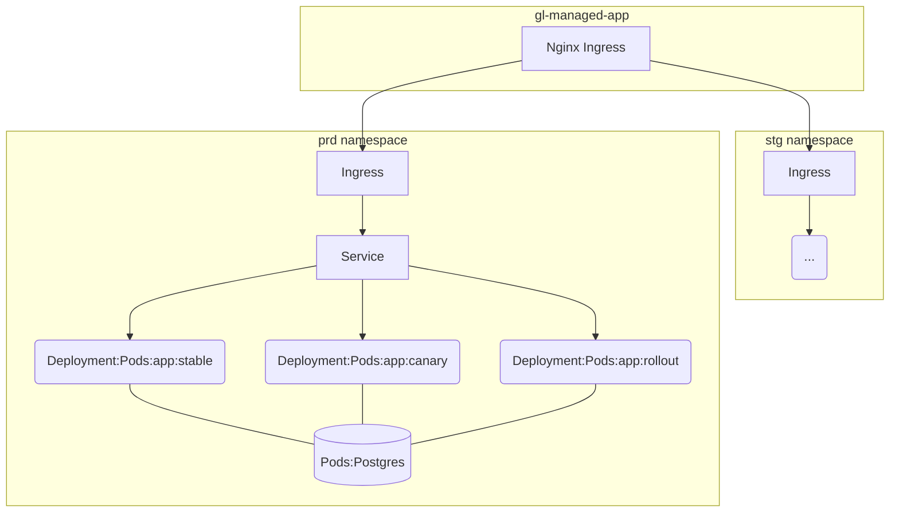
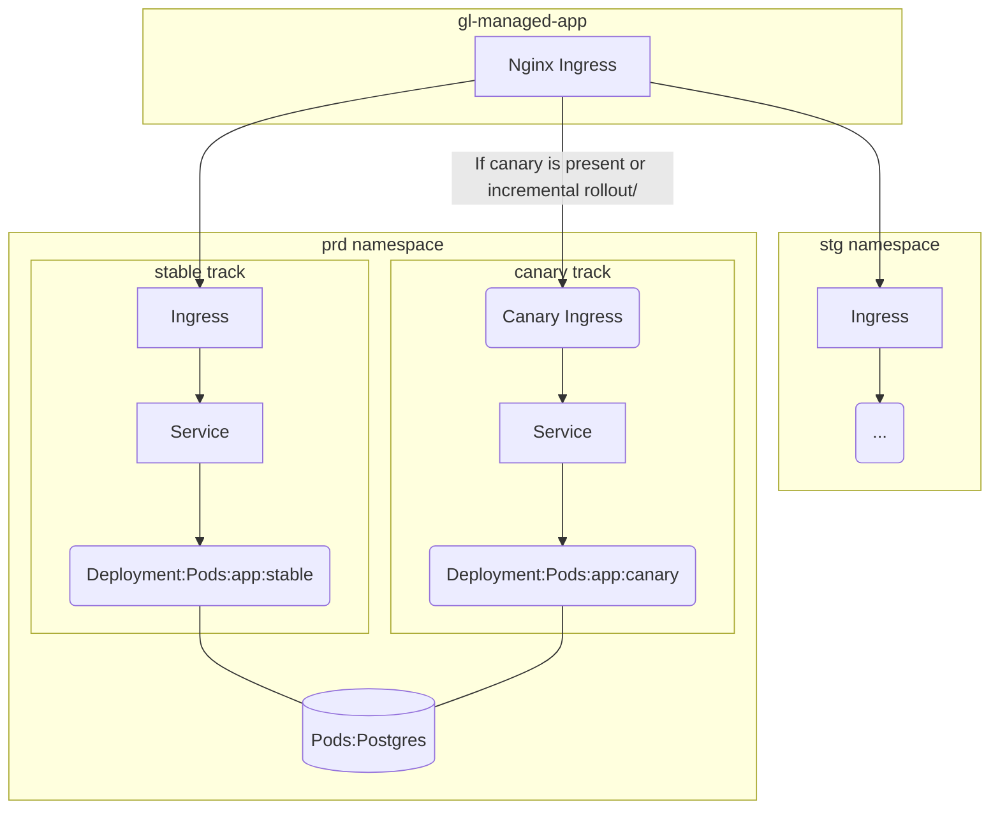



- Tier: 基础版，专业版，旗舰版
- Offering: JihuLab.com，私有化部署



[Auto Deploy](stages.md#auto-deploy) 是一项将应用部署到 Kubernetes 集群的特性。
它由以下几个依赖项组成：

- [Auto Deploy 模板](https://jihulab.com/gitlab-cn/gitlab/-/blob/master/lib/gitlab/ci/templates/Jobs/Deploy.gitlab-ci.yml) 是一组流水线作业和脚本，它们使用了 `auto-deploy-image`。
- [`auto-deploy-image`](https://jihulab.com/gitlab-cn/cluster-integration/auto-deploy-image) 是与 Kubernetes 集群通信的可执行镜像。
- [`auto-deploy-app` 图表](https://jihulab.com/gitlab-cn/cluster-integration/auto-deploy-image/-/tree/master/assets/auto-deploy-app) 是用于部署应用的 Helm 图表。

`auto-deploy-image` 和 `auto-deploy-app` 图表遵循[语义化版本](https://semver.org/)。
默认情况下，你的 Auto DevOps 项目会继续使用稳定且不产生破坏性变更的版本。
然而，这些依赖项可能在极狐GitLab 的主版本发布中升级，并引入破坏性变更，要求你升级部署。

本指南介绍了如何使用更新或不同的主版本 Auto Deploy 依赖项升级你的部署。

<a id="verify-dependency-versions"></a>

## 验证依赖版本

检查当前版本的过程取决于你使用的模板。首先验证正在使用的模板：

- 对于私有化部署实例，使用的是[内置于极狐GitLab 软件包中的稳定 Auto Deploy 模板](https://jihulab.com/gitlab-cn/gitlab/-/blob/master/lib/gitlab/ci/templates/Jobs/Deploy.gitlab-ci.yml)。
- 如果满足以下**任一**条件，则使用的是 [JihuLab.com 上的稳定 Auto Deploy 模板](https://jihulab.com/gitlab-cn/gitlab/-/blob/master/lib/gitlab/ci/templates/Jobs/Deploy.gitlab-ci.yml)：
  - 你的 Auto DevOps 项目没有 `.gitlab-ci.yml` 文件。
  - 你的 Auto DevOps 项目有 `.gitlab-ci.yml` 文件，并且[包含](../../ci/yaml/_index.md#includetemplate)了 `Auto-DevOps.gitlab-ci.yml` 模板。
- 如果满足以下**所有**条件，则使用的是[最新版 Auto Deploy 模板](https://jihulab.com/gitlab-cn/gitlab/-/blob/master/lib/gitlab/ci/templates/Jobs/Deploy.latest.gitlab-ci.yml)：
  - 你的 Auto DevOps 项目有 `.gitlab-ci.yml` 文件，并且[包含](../../ci/yaml/_index.md#includetemplate)了 `Auto-DevOps.gitlab-ci.yml` 模板。
  - 它还包含了[最新版 Auto Deploy 模板](#early-adopters)

如果知道使用的是哪个模板：

- `auto-deploy-image` 的版本在模板中（例如 `auto-deploy-image:v1.0.3`）。
- `auto-deploy-app` 图表的版本在 [auto-deploy-image 仓库中](https://jihulab.com/gitlab-cn/cluster-integration/auto-deploy-image/-/blob/v1.0.3/assets/auto-deploy-app/Chart.yaml)（例如 `version: 1.0.3`）。

<a id="compatibility"></a>

## 兼容性

下表解释了极狐GitLab 与 Auto Deploy 依赖项之间的版本兼容性：

| 极狐GitLab 版本   | `auto-deploy-image` 版本 | 备注 |
|------------------|-----------------------------|-------|
| v10.0 到 v14.0   | v0.1.0 到 v2.0.0            | v0 和 v1 auto-deploy-image 向后兼容。 |
| v13.4 及更高版本  | v2.0.0 及更高版本            | v2 auto-deploy-image 包含破坏性变更，如[升级指南](#upgrade-deployments-to-the-v2-auto-deploy-image)所述。 |

你可以在 [Auto Deploy 稳定版模板](https://jihulab.com/gitlab-cn/gitlab/-/blob/master/lib/gitlab/ci/templates/Jobs/Deploy.gitlab-ci.yml)中找到当前稳定版 auto-deploy-image 的版本。

<a id="upgrade-guide"></a>

## 升级指南

使用 Auto DevOps 的项目必须使用极狐GitLab 管理的未经修改的图表。
不支持[自定义图表](customize.md#custom-helm-chart)。

<a id="upgrade-deployments-to-the-v1-auto-deploy-image"></a>

### 升级部署到 v1 `auto-deploy-image`

v1 图表向后兼容 v0 图表，因此无需更改配置。

<a id="upgrade-deployments-to-the-v2-auto-deploy-image"></a>

### 升级部署到 v2 `auto-deploy-image`

v2 auto-deploy-image 包含多项依赖项和架构变更。
如果你的 Auto DevOps 项目有一个使用 v1 `auto-deploy-image` 部署的活动环境，请按照以下升级指南操作。否则，可以跳过此过程。

<a id="kubernetes-1-16"></a>

#### Kubernetes 1.16+

v2 auto-deploy-image 不再支持 Kubernetes 1.15 及更早版本。如果需要升级 Kubernetes 集群，请遵循云提供商的说明。这里以 GKE 上的[一个示例](https://cloud.google.com/kubernetes-engine/docs/how-to/upgrading-a-cluster)为例。

<a id="helm-v3"></a>

#### Helm v3

`auto-deploy-image` 使用 Helm 二进制文件来管理发布。
之前，`auto-deploy-image` 使用的是 Helm v2，它在集群中使用了 Tiller。
在 v2 `auto-deploy-image` 中，它使用 Helm v3，不再需要 Tiller。

如果你的 Auto DevOps 项目有一个使用 v1 `auto-deploy-image` 部署的活动环境，请按照以下步骤升级到使用 Helm v3 的 v2：

1. 包含 [Helm 2 到 3 迁移 CI/CD 模板](https://jihulab.com/gitlab-cn/gitlab/-/raw/master/lib/gitlab/ci/templates/Jobs/Helm-2to3.gitlab-ci.yml)：

   - 如果你使用的是 JihuLab.com 或极狐GitLab 14.0.1 及更高版本，该模板已包含在 Auto DevOps 中。
   - 在其他版本的极狐GitLab 上，你可以修改 `.gitlab-ci.yml` 来包含这些模板：

     ```yaml
     include:
       - template: Auto-DevOps.gitlab-ci.yml
       - remote: https://gitlab.com/gitlab-org/gitlab/-/raw/master/lib/gitlab/ci/templates/Jobs/Helm-2to3.gitlab-ci.yml
     ```

1. 设置以下 CI/CD 变量：

   - 将 `MIGRATE_HELM_2TO3` 设置为 `true`。如果未设置此变量，迁移作业将不会运行。
   - 将 `AUTO_DEVOPS_FORCE_DEPLOY_V2` 设置为 `1`。
   - **可选**：将 `BACKUP_HELM2_RELEASES` 设置为 `1`。如果设置了此变量，迁移作业会将备份保存一周，存放在名为 `helm-2-release-backups` 的作业产物中。如果你不小心过早删除了 Helm v2 发布，可以使用 `kubectl apply -f $backup` 从这个 Kubernetes 清单文件中恢复备份。

     > [!warning]
     > 如果你的流水线是公开的，请勿使用此变量。
     > 该产物可能包含密钥，任何能看到你作业的用户都能看到它。

1. 运行一条流水线，并触发 `<environment-name>:helm-2to3:migrate` 作业。
1. 像往常一样部署环境。这次部署会使用 Helm v3。
1. 如果部署成功，你可以安全地运行 `<environment-name>:helm-2to3:cleanup`。这会从命名空间中删除所有 Helm v2 发布数据。
1. 删除 `MIGRATE_HELM_2TO3` CI/CD 变量，或将其设置为 `false`。你可以使用[环境范围](../../ci/environments/_index.md#limit-the-environment-scope-of-a-cicd-variable)一次处理一个环境。

<a id="in-cluster-postgresql-channel-2"></a>

#### 集群内 PostgreSQL Channel 2

v2 auto-deploy-image 不再支持[旧版集群内 PostgreSQL](upgrading_postgresql.md)。
如果你的 Kubernetes 集群仍依赖它，请使用 [v1 auto-deploy-image](#use-a-specific-version-of-auto-deploy-dependencies) [升级并迁移你的数据](upgrading_postgresql.md)。

<a id="traffic-routing-change-for-canary-deployments-and-incremental-rollouts"></a>

#### 针对 Canary 部署和增量发布的路由变更

Auto Deploy 支持高级部署策略，例如 [Canary 部署](cicd_variables.md#deploy-policy-for-canary-environments)和[增量发布](../../ci/environments/incremental_rollouts.md)。

之前，`auto-deploy-image` 通过改变副本比例来创建一个服务，在非稳定轨和稳定轨之间平衡流量。在 v2 `auto-deploy-image` 中，它通过 [Canary Ingress](https://kubernetes.github.io/ingress-nginx/user-guide/nginx-configuration/annotations/#canary) 来控制流量。

更多详情，请参阅 [v2 `auto-deploy-app` 图表资源架构](#v2-chart-resource-architecture)。

如果你的 Auto DevOps 项目在 `production` 环境中存在使用 v1 `auto-deploy-image` 部署的活跃 `canary` 或 `rollout` 轨发布，请按以下步骤升级到 v2：

1. 验证你的项目[是否正在使用 v1 `auto-deploy-image`](#verify-dependency-versions)。如果没有，请[指定版本](#use-a-specific-version-of-auto-deploy-dependencies)。
1. 如果你正在进行 `canary` 或 `rollout` 部署，请先将它们提升到 `production`，以删除非稳定轨。
1. 验证你的项目[是否正在使用 v2 `auto-deploy-image`](#verify-dependency-versions)。如果没有，请[指定版本](#use-a-specific-version-of-auto-deploy-dependencies)。
1. 在极狐GitLab CI/CD 设置中添加一个名为 `AUTO_DEVOPS_FORCE_DEPLOY_V2`、值为 `true` 的 CI/CD 变量。
1. 创建一条新的流水线，并运行 `production` 作业，以使用 v2 `auto-deploy-app` 图表重建资源架构。
1. 删除 `AUTO_DEVOPS_FORCE_DEPLOY_V2` 变量。

<a id="use-a-specific-version-of-auto-deploy-dependencies"></a>

### 使用特定版本的 Auto Deploy 依赖项

要使用特定版本的 Auto Deploy 依赖项，请指定包含[所需版本 `auto-deploy-image` 和 `auto-deploy-app`](#verify-dependency-versions) 的先前 Auto Deploy 稳定模板。

例如，如果模板内置在极狐GitLab 16.10 中，可以这样修改你的 `.gitlab-ci.yml`：

```yaml
include:
  - template: Auto-DevOps.gitlab-ci.yml
  - remote: https://gitlab.com/gitlab-org/gitlab/-/raw/v16.10.0-ee/lib/gitlab/ci/templates/Jobs/Deploy.gitlab-ci.yml
```

<a id="ignore-warnings-and-continue-deploying"></a>

### 忽略警告并继续部署

如果你确定新图表版本可以安全部署，可以添加 `AUTO_DEVOPS_FORCE_DEPLOY_V<主版本号>` [CI/CD 变量](cicd_variables.md#build-and-deployment-variables)，以强制继续部署。

例如，如果你想在之前使用 `v0.17.0` 图表的部署上部署 `v2.0.0` 图表，可以添加 `AUTO_DEVOPS_FORCE_DEPLOY_V2`。

<a id="early-adopters"></a>

## 早期采用者

如果你想使用 `auto-deploy-image` 的最新[测试版](../../policy/development_stages_support.md#beta)或不稳定版本，请将最新版 Auto Deploy 模板包含到你的 `.gitlab-ci.yml` 中：

```yaml
include:
  - template: Auto-DevOps.gitlab-ci.yml
  - template: Jobs/Deploy.latest.gitlab-ci.yml
```

> [!warning]
> 使用[测试版](../../policy/development_stages_support.md#beta)或不稳定的 `auto-deploy-image` 可能会对你的环境造成不可恢复的损坏。请勿在重要项目或环境中进行测试。

<a id="resource-architectures-of-the-auto-deploy-app-chart"></a>

## `auto-deploy-app` 图表的资源架构

<a id="v0-and-v1-chart-resource-architecture"></a>

### v0 和 v1 图表的资源架构



<a id="v2-chart-resource-architecture"></a>

### v2 图表的资源架构



<a id="troubleshooting"></a>

## 故障排除

<a id="major-version-mismatch-warning"></a>

### 主要版本不匹配警告

如果部署的图表主版本与之前的版本不同，新图表可能无法正确部署。这可能是由于架构变更所致。如果发生这种情况，部署作业会失败，并显示类似以下的消息：

```plaintext
*************************************************************************************
                                   [警告]
检测到当前部署的图表（auto-deploy-app-v0.7.0）与之前部署的图表（auto-deploy-app-v1.0.0）之间存在主版本差异。
新主版本可能无法与当前发布（production）向后兼容。部署可能失败或陷入无法恢复的状态。
...
```

要清除此错误消息并恢复部署，你必须执行以下操作之一：

- 手动[升级图表版本](#upgrade-guide)。
- [使用特定的图表版本](#use-a-specific-version-of-auto-deploy-dependencies)。

<a id="error-missing-key-appkubernetesio-managed-by-must-be-set-to-helm"></a>

### 错误：`missing key "app.kubernetes.io/managed-by": must be set to "Helm"`

如果你的集群中有使用 v1 `auto-deploy-image` 部署的部署，你可能会遇到以下错误：

- `Error: rendered manifests contain a resource that already exists. Unable to continue with install: Secret "production-postgresql" in namespace "<project-name>-production" exists and cannot be imported into the current release: invalid ownership metadata; label validation error: missing key "app.kubernetes.io/managed-by": must be set to "Helm"; annotation validation error: missing key "meta.helm.sh/release-name": must be set to "production-postgresql"; annotation validation error: missing key "meta.helm.sh/release-namespace": must be set to "<project-name>-production"`

这是因为之前的部署使用了 Helm2，且与 Helm3 不兼容。
要解决此问题，请按照[升级指南](#upgrade-deployments-to-the-v2-auto-deploy-image)操作。