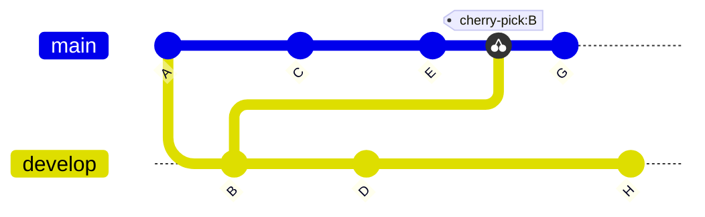



- Tier: 基础版，专业版，旗舰版
- Offering: JihuLab.com，私有化部署



当您在命令行中使用 `git cherry-pick` 时，您可以将现有分支中的特定更改复制到当前分支中。Cherry-pick 在以下情况中十分有用：

- 将错误修复向后移植到旧的发布分支，而无需引入新功能。
- 复用无法合并的分支中的工作。
- 将小功能向后移植到以前的版本，而不包含实验性更改。
- 将紧急生产修复（热修复）应用到开发分支。
- 将更改从派生复制到上游仓库。

有关从极狐GitLab UI 进行 cherry-pick 的更多信息，请参见[cherry-pick 更改](../../user/project/merge_requests/cherry_pick_changes.md)。

当您 cherry-pick 一个提交时，Git：

- 在当前分支上创建一个具有相同更改的新提交。
- 保留原始提交信息和作者信息。
- 生成一个新的提交 SHA。（原始提交保持不变。）

<!-- Diagram reused in doc/user/projects/merge_requests/cherry_pick_changes.md -->



请谨慎使用 `git cherry-pick`，因为它可能会创建内容相同但安全哈希算法 (SHA) 不同的重复提交。这可能会使您的项目历史复杂化。请首先考虑以下替代方案：

- 如果您需要分支中的大部分更改，并且该分支历史清晰，请将整个分支合并到当前分支。
- 如果原始提交包含您在新分支中不需要的复杂依赖项，请创建一个新提交，而不是 cherry-pick 旧提交。

<a id="apply-one-commit-to-another-branch"></a>

## 将一个提交应用到另一个分支

要将单个提交 cherry-pick 到当前工作分支：

1. 确定要 cherry-pick 的提交的 SHA。要查找此信息，请检查提交历史或使用 `git log` 命令。例如：

   ```shell
   $ git log

   commit abc123f
   Merge: 88888999999 aaaaabbbbbb
   Author: user@example.com
   Date:   Tue Aug 31 21:19:41 2021 +0000

       Fixes a regression we found yesterday
   ```

1. 检出要 cherry-pick 到的目标分支：

   ```shell
   git checkout release
   ```

1. 使用 `git cherry-pick` 命令将提交 `abc123f` 从 feature 分支复制到 `release` 分支。将 `abc123f` 替换为您确定的提交 SHA：

   ```shell
   git cherry-pick abc123f
   ```

Git 将提交 `abc123f` 的更改复制到 `release` 分支，如果发生冲突，会显示通知。解决冲突后，继续 cherry-pick 过程。对每个需要提交 `abc123f` 内容的分支重复此操作。

<a id="apply-multiple-commits-to-another-branch"></a>

## 将多个提交应用到另一个分支

如果您需要的代码是通过多个提交逐步添加的，请将每个提交 cherry-pick 到所需的目标分支：

1. 确定要 cherry-pick 的提交的 SHA。要查找此信息，请检查提交历史或使用 `git log` 命令。例如，如果代码更改在一个提交中，而改进的测试覆盖率在下一个提交中：

   ```shell
   $ git log

   commit abc123f
   Merge: 88888999999 aaaaabbbbbb
   Author: user@example.com
   Date:   Tue Aug 31 21:19:41 2021 +0000

       Fixes a regression we found yesterday

   commit ghi456j
   Merge: 44444666666 cccccdddddd
   Author: user@example.com
   Date:   Tue Aug 31 21:19:41 2021 +0000

       Adds tests to ensure the problem does not happen again
   ```

1. 检出要 cherry-pick 到的目标分支 (`release`)：

   ```shell
   git checkout release
   ```

1. 将提交复制到 `release` 分支。

   - 要将每个提交单独复制到 `release` 分支，请为每个提交使用 `git cherry-pick` 命令。将 `abc123f` 和 `ghi456j` 替换为您所需提交的 SHA：

     ```shell
     git cherry-pick abc123f
     git cherry-pick ghi456j
     ...
     ```

   - 要使用 `..` 表示法将一系列提交 cherry-pick 到 `release` 分支，使用 SHA 标记开始和结束位置。此命令将应用 `abc123f` 和 `ghi456j` 之间的所有提交：

     ```shell
     git cherry-pick abc123f..ghi456j
     ```

<a id="copy-the-contents-of-an-entire-branch"></a>

## 复制整个分支的内容

当您 cherry-pick 一个分支的合并提交时，您的 cherry-pick 会将该分支的所有更改复制到当前工作分支。Cherry-pick 一个合并提交需要 `-m` 标志。该标志告诉 Git 应使用哪个父提交。合并提交根据其创建方式，可以有多个父提交。

在简单情况下，`-m 1` 使用第一个父提交，即分支的合并提交。要指定第二个父提交（通常是功能分支合并前的最后一个提交），请使用 `-m 2`。这些标志决定了 Git 会将哪些更改应用到当前分支。

要将分支 `feature-1` 的合并提交 cherry-pick 到当前工作分支：

1. 确定要 cherry-pick 的提交的 SHA。要查找此信息，请检查提交历史或使用 `git log` 命令。例如：

   ```shell
   $ git log

   commit 987pqr6
   Merge: 88888999999 aaaaabbbbbb
   Author: user@example.com
   Date:   Tue Aug 31 21:19:41 2021 +0000

       Merges feature-1 into main
   ```

1. 检出要 cherry-pick 到的目标分支：

   ```shell
   git checkout feature-2
   ```

1. 使用带 `-m` 选项的 `git cherry-pick` 命令以及您要用作主线的父提交的索引。将 `<merge-commit-hash>` 替换为合并提交的 SHA，将 `<parent_index>` 替换为父提交的索引。索引从 `1` 开始。例如：

   ```shell
   # git cherry-pick -m <parent_index> <merge-commit-hash>
   git cherry-pick -m 1 987pqr6
   ```

运行此命令时，Git 会将 `987pqr6` 合并提交的内容复制到 `feature-2` 分支。如果您想使用 `feature-1` 分支的最后一个提交，而不是合并提交 `987pqr6`，请改用 `-m 2`。

<a id="troubleshooting"></a>

## 故障排除

如果您在 cherry-pick 过程中遇到冲突：

1. 手动在受影响的文件中解决冲突。
1. 暂存已解决的文件：

   ```shell
   git add <resolved_file>
   ```

1. 继续 cherry-pick 过程：

   ```shell
   git cherry-pick --continue
   ```

要中止 cherry-pick 过程并返回到之前的状态，请使用以下命令：

```shell
git cherry-pick --abort
```

这将撤消在 cherry-pick 过程中所做的所有更改。

