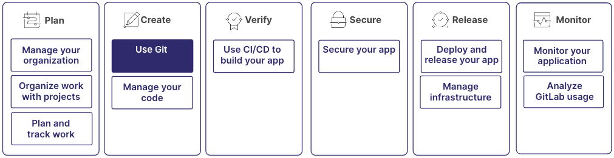

Git 是一个版本控制系统，用于跟踪代码变更并与他人协作。
极狐GitLab 是一个基于 Web 的 Git 仓库管理器，提供 CI/CD 和其他功能，帮助您管理软件开发生命周期。

您可以使用极狐GitLab Web 界面执行许多 Git 操作，但了解 Git 命令可以为您提供额外的灵活性和控制力。

学习 Git 是更大工作流程的一部分：

选择您的学习路径：

- [安装 Git](how_to_install_git/_index.md)
- [教程：进行您的第一次 Git 提交](../../tutorials/make_first_git_commit/_index.md)
- 理解 Git 概念：继续阅读

## 仓库

一个 Git 仓库是一个目录，包含项目的所有文件、文件夹和版本历史。
它是 Git 管理和跟踪代码变更的中心枢纽。

当您初始化一个 Git 仓库或克隆一个现有仓库时，Git 会在项目目录内创建一个隐藏目录 `.git`。
该目录包含 Git 用于管理仓库的所有必要元数据和对象，包括对文件所作所有变更的完整历史。
Git 在文件级别跟踪变更，因此您可以查看单个文件随时间推移的修改情况。

更多信息，请参见[仓库](../../user/project/repository/_index.md)。

## 工作目录

您的工作目录是您对代码进行变更的地方。
当您克隆一个 Git 仓库时，您会在工作目录中创建该仓库的本地副本。
您可以编辑文件、添加新文件并测试您的代码。

要进行协作，您可以：

- 提交：在工作目录中进行变更后，将这些变更提交到本地仓库。
- 推送：将您的变更推送到托管在极狐GitLab 上的远程 Git 仓库。这将使您的变更可供其他团队成员使用。
- 拉取：从远程仓库拉取其他人的变更，并确保您的本地仓库已更新为最新变更。

更多信息，请参见[常用 Git 命令](commands.md)。

## 分支

在 Git 中，您可以使用分支同时处理不同的功能、错误修复或实验，而不会相互干扰。
分支使您能够创建一个隔离的环境，在其中可以进行和测试变更而不会影响默认分支。
在极狐GitLab 中，默认分支通常称为 `main`。

### 合并分支

当功能完成或错误修复后，您可以将您的分支合并到默认分支。
您可以在[合并请求](../../user/project/merge_requests/_index.md)中执行此操作。
合并是一种安全的方式，可以将变更从一个分支引入另一个分支，同时保留变更的历史。

如果分支之间存在冲突，例如，如果您在两个分支中修改了相同的代码行，极狐GitLab 会将这些标记为[合并冲突](../../user/project/merge_requests/conflicts.md)。
这些必须通过审查和编辑代码来手动解决。

### 删除分支

成功合并后，如果不再需要分支，您可以将其删除。
删除不必要的分支有助于保持仓库的有序和可管理。

> [!note]
> 为确保没有工作丢失，请验证所有变更都已合并到默认分支，然后再在最终合并后删除分支。

更多信息，请参见[分支](../../user/project/repository/branches/_index.md)。

## 理解 Git 工作流

通过 Git 工作流，您可以管理代码、与他人协作并使项目保持有序。
标准的 Git 工作流包括以下步骤：

1. 克隆仓库：通过将仓库克隆到您的机器上，创建仓库的本地副本。您可以在不影响原始仓库的情况下处理项目。
1. 创建新分支：在您进行任何更改之前，建议创建一个新分支。这可以确保您的更改是隔离的，不会干扰他人在默认分支上的工作。
1. 进行更改：在工作目录中对文件进行更改。您可以添加新功能、修复错误或进行其他修改。
1. 暂存更改：在对文件进行更改后，暂存您想要提交的更改。暂存告诉 Git 哪些更改应包含在下一次提交中。
1. 提交更改：将暂存的更改提交到本地仓库。提交会保存您工作的快照，并创建文件更改的历史记录。
1. 推送更改：要将您的更改共享给他人，请将它们推送到远程仓库。这使您的更改对其他协作者可用。
1. 合并您的分支：在您的更改经过审核和批准后，将您的分支合并到默认分支，例如 `main`。此步骤将您的更改纳入项目。

## 派生

一些组织，特别是那些参与开源项目的组织，可能会使用不同的工作流。例如，[派生](../../user/project/repository/forking_workflow.md)。

派生是存在于您自己命名空间中的仓库的个人副本。在贡献开源项目或您的团队使用集中式仓库时，可以使用此工作流。

## 安装 Git

要使用 Git 命令并为极狐GitLab 项目做贡献，您应该下载并在计算机上安装 Git 客户端。

安装过程因您的操作系统而异。例如，Windows、MacOS 或 Linux。有关如何安装 Git 的信息，请参见[安装 Git](how_to_install_git/_index.md)。

## Git 命令

要从命令行与 Git 交互，您可以使用 Git 命令：

- `git clone`：将仓库克隆到本地机器。
- `git branch`：列出、创建或删除本地仓库中的分支。
- `git checkout`：在本地仓库中的不同分支之间切换。
- `git add`：暂存更改以供提交。
- `git commit`：将暂存的更改提交到本地仓库。
- `git push`：将本地提交推送到远程仓库。
- `git pull`：从远程仓库获取更改，并将其合并到本地分支。

有关更全面的信息和详细的解释，请参见[常用 Git 命令](commands.md)指南。

### 使用 SSH 与 Git

当您使用远程仓库时，应使用 SSH 进行安全通信。

极狐GitLab 使用 SSH 协议与 Git 进行安全通信。当您使用 SSH 密钥向极狐GitLab 远程服务器进行身份验证时，您无需每次都提供用户名和密码。

要将 SSH 与极狐GitLab 一起使用，您必须：

1. 在本地系统上生成 SSH 密钥对。
1. 将您的 SSH 密钥添加到您的极狐GitLab 账户。
1. 验证您到极狐GitLab 的 SSH 连接。

更多信息，请参见[将 SSH 密钥与极狐GitLab 结合使用](../../user/ssh.md)。

## 相关主题

- [教程：学习 Git](../../tutorials/learn_git.md)