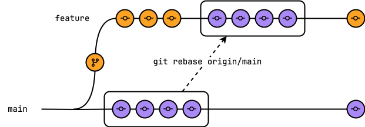

Git 变基通过将您的提交移动到目标分支的顶端，将一个分支的变更合并到另一个分支中。此操作：

- 使用目标分支的最新代码更新分支。
- 保持干净、线性的提交历史，便于调试和代码审查。
- 在提交级别解决[合并冲突](../../user/project/merge_requests/conflicts.md)以进行冲突解决。
- 保留代码变更的时间顺序。

当您执行变基时：

1. Git 会导入自您最初从中创建分支以来提交到目标分支的所有提交。
1. Git 会将您分支上的提交应用到导入的提交之上。在此示例中，在创建名为 `feature` 的分支后（橙色），来自 `main` 的四个提交（紫色）被导入到 `feature` 分支：

   

虽然大多数变基是针对 `main` 执行的，但您可以针对任何其他分支进行变基。您还可以指定不同的远程仓库。
例如，`upstream` 而不是 `origin`。

> [!warning]
> `git rebase` 会重写提交历史。它可能导致共享分支中的冲突和复杂的合并冲突。
> 与其将您的分支变基到默认分支，不如考虑使用 `git pull origin master`。拉取具有类似效果，且损坏他人工作的风险更小。

<a id="rebase"></a>

## 变基

当您使用 Git 进行变基时，每个提交都会被应用到您的分支上。当出现合并冲突时，系统会提示您解决。

要对提交使用更高级的选项，请使用[交互式变基](#interactive-rebase)。

先决条件：

- 您必须拥有[权限](../../user/permissions.md)才能强制推送到分支。

要使用 Git 将您的分支变基到目标分支：

1. 打开终端并切换到您的项目目录。
1. 确保您拥有目标分支的最新内容。
   在此示例中，目标分支是 `main`：

   ```shell
   git fetch origin main
   ```

1. 检出您的分支：

   ```shell
   git checkout my-branch
   ```

1. 可选。创建您的分支的备份：

   ```shell
   git branch my-branch-backup
   ```

   如果从备份分支恢复，在此之后添加到 `my-branch` 的更改将会丢失。

1. 对 `main` 分支进行变基：

   ```shell
   git rebase origin/main
   ```

1. 如果存在合并冲突：
   1. 在编辑器中解决冲突。

   1. 暂存更改：

      ```shell
      git add .
      ```

   1. 继续变基：

      ```shell
      git rebase --continue
      ```

1. 强制推送您的更改到目标分支，同时保护他人的提交：

   ```shell
   git push origin my-branch --force-with-lease
   ```

<a id="interactive-rebase"></a>

## 交互式变基

使用交互式变基来指定如何处理每个提交。
以下说明使用 [Vim](https://www.vim.org/) 文本编辑器来编辑提交。

进行交互式变基：

1. 打开终端并切换到您的项目目录。
1. 确保您拥有目标分支的最新内容。在此示例中，目标分支是 `main`：

   ```shell
   git fetch origin main
   ```

1. 检出您的分支：

   ```shell
   git checkout my-branch
   ```

1. 可选。创建您的分支的备份：

   ```shell
   git branch my-branch-backup
   ```

   如果从备份分支恢复，在此之后添加到 `my-branch` 的更改将会丢失。

1. 在极狐GitLab UI 中，在您的合并请求里，在 **提交** 选项卡中确认要变基的提交数量。
1. 打开这些提交。例如，要编辑最近的五个提交：

   ```shell
   git rebase -i HEAD~5
   ```

   Git 会在您的终端文本编辑器中打开提交，最旧的提交在最前面。
   每个提交显示要执行的操作、SHA 和提交标题。例如：

   ```shell
   pick 111111111111 第二轮结构修订
   pick 222222222222 更新指向此已更改页面的入站链接
   pick 333333333333 从 H4 转移到 H3
   pick 444444444444 添加编辑修订
   pick 555555555555 修订继续构建概念部分

   # 变基 111111111111..222222222222 到 zzzzzzzzzzzz（5 个命令）
   #
   # 命令：
   # p, pick <commit> = 使用提交
   # r, reword <commit> = 使用提交，但编辑提交信息
   # e, edit <commit> = 使用提交，但停下来进行修改
   # s, squash <commit> = 使用提交，但合并到上一个提交中
   # f, fixup [-C | -c] <commit> = 类似 "squash"，但只保留上一个提交的信息
   ```

1. 按 <kbd>i</kbd> 切换到 Vim 的编辑模式。
1. 使用箭头键将光标移动到您想要编辑的提交上。
1. 对于除第一个之外的每个提交，将 `pick` 更改为 `squash` 或 `fixup`（或 `s` 或 `f`）。
1. 对剩余的提交重复操作。
1. 结束编辑模式，保存并退出：

   - 按 <kbd>ESC</kbd>。
   - 输入 `:wq`。

1. 进行压缩（squashing）时，Git 会提示您编辑提交信息：

   - 以 `#` 开头的行将被忽略，不会包含在提交信息中。
   - 要保留当前信息，输入 `:wq`。
   - 要编辑提交信息，切换到编辑模式，进行更改，然后保存。

1. 将您的更改推送到目标分支。

   - 如果在变基之前您没有将提交推送到目标分支：

     ```shell
     git push origin my-branch
     ```

   - 如果您已经推送了这些提交：

     ```shell
     git push origin my-branch --force-with-lease
     ```

     某些操作需要强制推送才能更改分支。更多信息，请参见[强制推送到远程分支](#force-push-to-a-remote-branch)。

<a id="resolve-conflicts-from-the-command-line"></a>

## 通过命令行解决冲突

为了更好地控制每个更改，您应该在本地通过命令行修复复杂的冲突，而不是在极狐GitLab 中。

先决条件：

- 您必须拥有[权限](../../user/permissions.md)才能强制推送到分支。

1. 打开终端并检出您的功能分支：

   ```shell
   git switch my-feature-branch
   ```

1. 将您的分支变基到目标分支。在此示例中，目标分支是 `main`：

   ```shell
   git fetch
   git rebase origin/main
   ```

1. 在您喜欢的代码编辑器中打开冲突文件。
1. 找到并解决冲突块：
   1. 选择您想要保留的版本（在 `=======` 之前或之后）。
   1. 删除您不想保留的版本。
   1. 删除冲突标记。
1. 保存文件。
1. 对每个有冲突的文件重复此过程。
1. 暂存您的更改：

   ```shell
   git add .
   ```

1. 提交您的更改：

   ```shell
   git commit -m "解决合并冲突"
   ```

   > [!warning]
   > 您可以在此之前运行 `git rebase --abort` 来停止该过程。
   > Git 会中止变基并将分支回退到运行 `git rebase` 之前的状态。
   > 在运行 `git rebase --continue` 之后，您将无法中止变基。

1. 继续变基：

   ```shell
   git rebase --continue
   ```

1. 将更改强制推送到您的远程分支：

   ```shell
   git push origin my-feature-branch --force-with-lease
   ```

<a id="force-push-to-a-remote-branch"></a>

## 强制推送到远程分支

复杂的 Git 操作，如压缩提交、重置分支或变基，都会重写分支历史。
Git 要求对这些更改进行强制更新。

不建议在共享分支上进行强制推送，因为您可能会破坏他人的更改。

如果分支受到[保护](../../user/project/repository/branches/protected.md)，除非您执行以下操作，否则无法强制推送：

- 取消保护。
- 允许强制推送。

有关更多信息，请参见[在受保护分支上允许强制推送](../../user/project/repository/branches/protected.md#allow-force-push)。

<a id="restore-your-backed-up-branch"></a>

## 恢复您的备份分支

如果变基或强制推送失败，请从备份恢复您的分支：

1. 确保您位于正确的分支上：

   ```shell
   git checkout my-branch
   ```

1. 将您的分支重置为备份：

   ```shell
   git reset --hard my-branch-backup
   ```

<a id="approving-after-rebase"></a>

## 变基后审批

如果您对一个分支进行了变基，您已经添加了提交。如果您的项目被配置为
[阻止添加提交的用户进行审批](../../user/project/merge_requests/approvals/settings.md#prevent-approvals-by-users-who-add-commits)，
那么您将无法审批已变基的合并请求。此外，原本无法审批的提交者，现在可能能够审批这些更改。

此外，审批过然后又执行了变基的用户可能仍然显示为已审批该合并请求。但是，该用户的审批不计入合并请求所需的审批数。

<a id="troubleshooting"></a>

## 故障排除

有关 CI/CD 流水线故障排除信息，请参见[调试 CI/CD 流水线](../../ci/debugging.md)。

<a id="unmergeable-state-after-rebase-quick-action"></a>

### `/rebase` 快速操作后的“不可合并状态”

`/rebase` 命令会安排一个后台任务。该任务尝试将源分支上的更改变基到目标分支的最新提交上。
如果使用
[`/rebase` 快速操作](../../user/project/quick_actions.md#rebase)
后，您看到此错误，则表示无法安排变基：

```plaintext
此合并请求当前处于不可合并状态，无法变基。
```

如果以下任何条件成立，则会出现此错误：

- 源分支和目标分支之间存在冲突。
- 源分支不包含任何提交。
- 源分支或目标分支不存在。
- 发生错误，导致没有生成差异。

要解决 `不可合并状态` 错误：

1. 解决所有合并冲突。
1. 确认源分支存在且包含提交。
1. 确认目标分支存在。
1. 确认差异已生成。

<a id="merge-quick-action-ignored-after-rebase"></a>

### `/rebase` 后忽略 `/merge` 快速操作

如果使用了 `/rebase`，则 `/merge` 会被忽略，以避免在源分支变基之前被合并或删除的竞争条件。