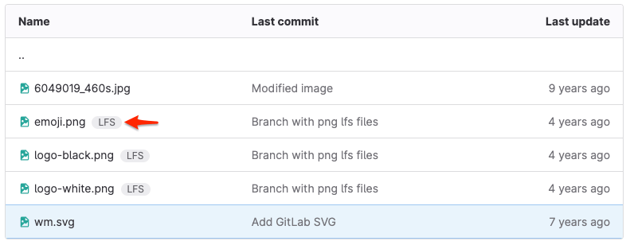

Git 大文件存储 (LFS) 是一款开源 Git 扩展，可帮助 Git 仓库高效管理大型二进制文件。Git 无法像跟踪文本文件那样跟踪二进制文件（如音频、视频或图像文件）的变化。文本文件可以生成纯文本差异，而对二进制文件的任何更改都需要 Git 完全替换仓库中的文件。对大文件进行反复更改会增大仓库大小。随着时间的推移，这种大小的增加会减慢常规 Git 操作（如 `clone`、`fetch` 或 `pull`）。

使用 Git LFS 将大型二进制文件存储在 Git 仓库之外，仅留下一个小的、基于文本的指针供 Git 管理。当你使用 Git LFS 向仓库添加文件时，极狐GitLab 会：

1. 将文件添加到你项目配置的对象存储中，而非 Git 仓库中。
1. 在 Git 仓库中添加一个指针，而非大文件。该指针包含有关文件的信息，如下所示：

   ```plaintext
   version https://git-lfs.github.com/spec/v1
   oid sha256:lpca0iva5kpz9wva5rgsqsicxrxrkbjr0bh4sy6rz08g2c4tyc441rto5j5bctit
   size 804
   ```

   - Version - 使用的 Git LFS 规范版本
   - OID - 使用的哈希方法，以及形式为 `{hash-method}:{hash}` 的唯一对象 ID。
   - Size - 文件大小，以字节为单位。

1. 排队一个作业来重新计算项目的统计信息，包括存储大小和 LFS 对象存储。你的 LFS 对象存储是与仓库关联的所有 LFS 对象的大小总和。

通过 Git LFS 管理的文件会在文件名旁边显示一个 **LFS** 徽章：



Git LFS 客户端使用 HTTP 基本认证，并通过 HTTPS 与你的服务器通信。在你认证请求后，Git LFS 客户端会收到有关在何处拉取（或推送）大文件的指令。

你的 Git 仓库保持较小体积，这有助于你遵守仓库大小限制。更多信息，请参阅仓库大小限制 [适用于私有化部署版极狐GitLab](../../../administration/settings/account_and_limit_settings.md#repository-size-limit) 和 [适用于 JihuLab.com](../../../user/jihulab_com/_index.md#account-and-limit-settings)。

<a id="understand-how-git-lfs-works-with-forks"></a>

## 了解 Git LFS 在 fork 下的工作原理

当你 fork 一个仓库时，你的 fork 包含了上游仓库中在 fork 时已存在的 LFS 对象。如果你向自己的 fork 添加新的 LFS 对象，它们只属于你的 fork，不属于上游仓库。总的对象存储只会针对你的 fork 增加。

当你从 fork 向上游项目创建合并请求，并且你的合并请求包含新的 Git LFS 对象时，极狐GitLab 会在合并后将新的 LFS 对象与上游项目关联。

<a id="configure-git-lfs-for-a-project"></a>

## 为项目配置 Git LFS



- Tier: 基础版，专业版，旗舰版
- Offering: 私有化部署



极狐GitLab 默认为私有化部署版极狐GitLab 和 JihuLab.com 启用 Git LFS。它提供了服务器设置和项目专属设置。

- 要在你的实例上配置 Git LFS，例如设置远程对象存储，请参阅 [Git 大文件存储 (LFS) 管理](../../../administration/lfs/_index.md)。
- 要为特定项目配置 Git LFS：

  1. 在仓库本地副本的根目录下，运行 `git lfs install`。此命令会添加：
     - 一个预推送 Git 钩子到你的仓库。
     - 一个 [`.gitattributes` 文件](../../../user/project/repository/files/git_attributes.md) 来跟踪各个文件和文件类型的处理方式。
  1. 添加你想要用 Git LFS 跟踪的文件和文件类型。

<a id="enable-or-disable-git-lfs-for-a-project"></a>

## 为项目启用或禁用 Git LFS

Git LFS 默认为私有化部署版极狐GitLab 和 JihuLab.com 启用。

先决条件：

- 你必须具有项目的开发者、维护者或所有者角色。

要为项目启用或禁用 Git LFS：

1. 在顶部栏中，选择 **搜索或跳转到** 并找到你的项目。
1. 在左侧边栏中，选择 **设置** > **通用**。
1. 展开 **可见性、项目功能、权限** 部分。
1. 选择 **Git 大文件存储 (LFS)** 切换开关。
1. 选择 **保存更改**。

<a id="add-and-track-files"></a>

## 添加并跟踪文件

你可以将大文件添加到 Git LFS。这有助于你管理 Git 仓库中的文件。使用 Git LFS 跟踪文件时，它们会被 Git 中的文本指针替换，并存储在远程服务器上。更多信息，请参阅 [Git LFS](../file_management.md#git-lfs)。

当你 [为项目配置 Git LFS](#configure-git-lfs-for-a-project) 时，请确保项目根目录下有 `.gitattributes` 文件。如果没有根级的 `.gitattributes` 文件，即使你在项目子目录中正确配置了 LFS，界面也会显示警告。更多信息，请参阅 [LFS 配置警告消息](troubleshooting.md#warning-possible-lfs-configuration-issue)。

<a id="clone-a-repository-that-uses-git-lfs"></a>

## 克隆使用 Git LFS 的仓库

当你克隆使用 Git LFS 的仓库时，Git 会检测到 LFS 跟踪的文件并通过 HTTPS 克隆它们。如果你使用 SSH URL 运行 `git clone`，例如 `user@hostname.com:group/project.git`，你必须再次输入极狐GitLab 凭据进行 HTTPS 认证。

默认情况下，Git LFS 操作通过 HTTPS 进行，即使 Git 通过 SSH 与你的仓库通信也是如此。在极狐GitLab 17.2 中，引入了 [LFS 的纯 SSH 支持](https://jihulab.com/groups/gitlab-cn/-/epics/11872)。有关如何启用此功能的信息，请参阅 [纯 SSH 传输协议](../../../administration/lfs/_index.md#pure-ssh-transfer-protocol)。

要为已经克隆的仓库拉取新的 LFS 对象，请运行以下命令：

```shell
git lfs fetch origin main
```

<a id="migrate-an-existing-repository-to-git-lfs"></a>

## 将现有仓库迁移至 Git LFS

请阅读 [`git-lfs-migrate` 文档](https://github.com/git-lfs/git-lfs/blob/main/docs/man/git-lfs-migrate.adoc)，了解如何使用 Git LFS 迁移现有 Git 仓库。

<a id="delete-a-git-lfs-file-from-repository-history"></a>

## 从仓库历史中删除 Git LFS 文件

理解在 Git LFS 中取消跟踪文件和删除文件之间的区别很重要：

- 取消跟踪：文件仍保留在磁盘和仓库历史中。
  如果用户检出历史分支或标签，他们仍需要文件的 LFS 版本。
- 删除：文件被移除，但仍保留在仓库历史中。

要使用 Git LFS 删除跟踪文件，请参阅 [移除文件](../undo.md#remove-a-file-from-a-repository)。

要彻底清除文件的全部历史记录（包括过去和现在），请参阅 [处理敏感信息](../undo.md#handle-sensitive-information)。

> [!warning]
> 清除文件历史记录需要重写 Git 历史。此操作具有破坏性且不可逆。

<a id="reduce-repository-size-after-removing-large-files"></a>

## 移除大文件后减小仓库大小

如果你需要从仓库历史中移除大文件以减小仓库总大小，请参阅 [减小仓库大小](../../../user/project/repository/repository_size.md#methods-to-reduce-repository-size)。