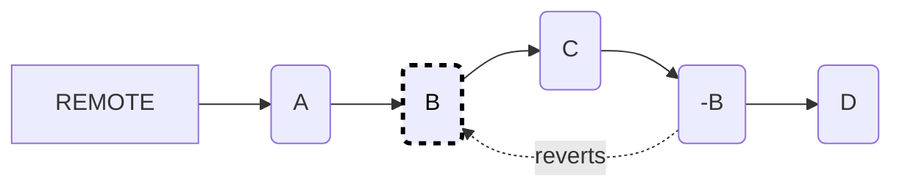
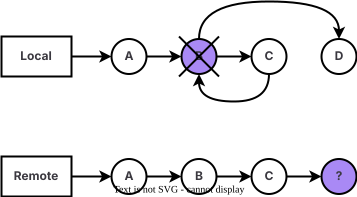

使用 Git 进行开发涉及实验和迭代。在开发过程中难免犯错，有时你需要还原更改。Git 让你能够控制代码历史记录，通过相关功能可以在你的 [Git 工作流](get_started.md#understand-the-git-workflow) 的任何时间点撤销更改。

从意外提交中恢复、删除敏感数据、修复不正确的合并，并保持干净的仓库历史记录。与他人协作时，通过新的回滚提交来保持透明度，或在共享之前本地重置你的工作。使用的方法取决于这些更改是：
- 仅在你的本地计算机上。
- 远程存储在 Git 服务器上，例如 JihuLab.com。

<a id="undo-local-changes"></a>

## 撤销本地更改

在你将更改推送到远程仓库之前，你在 Git 中所做的更改仅存在于你的本地开发环境中。

当你在 Git 中 _暂存_ 一个文件时，你指示 Git 跟踪这个文件的更改，以为提交做准备。若要忽略对文件的更改，不将其包含在下一次提交中，可以 _取消暂存_ 该文件。

<a id="revert-unstaged-local-changes"></a>

### 回滚未暂存的本地更改

撤销尚未暂存的本地更改：

1. 通过运行 `git status` 确认该文件未暂存（你没有使用 `git add <file>`）：

   ```shell
   git status
   ```

   示例输出：

   ```shell
   在分支 main 上
   你的分支与 'origin/main' 保持一致。
   尚未暂存以备提交的变更：
     （使用 "git add <file>..." 更新要提交的内容）
     （使用 "git checkout -- <file>..." 丢弃工作区的改动）

       修改：   <file>
   修改尚未加入提交（使用 "git add" 和/或 "git commit -a"）
   ```

1. 选择一个选项并撤销你的更改：

   - 覆盖本地更改：

     ```shell
     git checkout -- <file>
     ```

   - 永久放弃所有文件的本地更改：

     ```shell
     git reset --hard
     ```

<a id="revert-staged-local-changes"></a>

### 回滚已暂存的本地更改

你可以撤销已经暂存的本地更改。在以下示例中，一个文件已被添加到暂存区，但尚未提交：

1. 通过 `git status` 确认该文件已暂存：

   ```shell
   git status
   ```

   示例输出：

   ```shell
   在分支 main 上
   你的分支与 'origin/main' 保持一致。
   要提交的变更：
     （使用 "git restore --staged <file>..." 取消暂存）

     新文件：   <file>
   ```

1. 选择一个选项并撤销你的更改：

   - 取消暂存文件但保留更改：

     ```shell
     git restore --staged <file>
     ```

   - 取消暂存所有内容但保留更改：

     ```shell
     git reset
     ```

   - 取消暂存文件到当前提交（HEAD）：

     ```shell
     git reset HEAD <file>
     ```

   - 永久放弃所有内容：

     ```shell
     git reset --hard
     ```

<a id="undo-local-commits"></a>

## 撤销本地提交

当你使用 `git commit` 提交到本地仓库时，Git 会记录你的更改。因为你尚未推送到远程仓库，你的更改尚未公开或与他人共享。此时，你可以撤销你的更改。

<a id="revert-commits-without-altering-history"></a>

### 在不修改历史记录的情况下回滚提交

你可以在保留提交历史记录的同时回滚提交。

本示例使用五个提交 `A`、`B`、`C`、`D`、`E`，它们按顺序提交：`A-B-C-D-E`。你想要撤销的提交是 `B`。

1. 找到要回滚到的提交的 SHA。要查看提交日志，请使用命令 `git log`。
2. 选择一个选项并撤销你的更改：

   - 回滚由提交 `B` 引入的更改：

     ```shell
     git revert <commit-B-SHA>
     ```

   - 撤销提交 `B` 中单个文件或目录的更改，但将其保留在已暂存状态：

     ```shell
     git checkout <commit-B-SHA> <file>
     ```

   - 撤销提交 `B` 中单个文件或目录的更改，但将其保留在未暂存状态：

     ```shell
     git reset <commit-B-SHA> <file>
     ```

<a id="revert-commits-and-modify-history"></a>

### 回滚提交并修改历史记录

以下章节记录了重写 Git 历史记录的任务。更多信息，请参见 [变基与解决冲突](git_rebase.md)。

<a id="delete-a-specific-commit"></a>

#### 删除特定提交

你可以删除特定提交。例如，如果你有提交 `A-B-C-D`，想要删除提交 `B`。

1. 从当前提交 `D` 到 `B` 的范围执行变基：

   ```shell
   git rebase -i A
   ```

   编辑器中会显示提交列表。

2. 在提交 `B` 前面，将 `pick` 替换为 `drop`。
3. 对于所有其他提交，保留默认值 `pick`。
4. 保存并退出编辑器。

<a id="edit-a-specific-commit"></a>

#### 编辑特定提交

你可以编辑特定提交。例如，如果你有提交 `A-B-C-D`，想要修改提交 `B` 中引入的内容。

1. 从当前提交 `D` 到 `B` 的范围执行变基：

   ```shell
   git rebase -i A
   ```

   编辑器中会显示提交列表。

2. 在提交 `B` 前面，将 `pick` 替换为 `edit`。
3. 对于所有其他提交，保留默认值 `pick`。
4. 保存并退出编辑器。
5. 在编辑器中打开文件，进行编辑，然后提交更改：

   ```shell
   git commit -a
   ```

<a id="undo-multiple-commits"></a>

### 撤销多个提交

如果你在分支上创建了多个提交（`A-B-C-D`），然后意识到提交 `C` 和 `D` 有误，可以撤销这两个错误的提交：

1. 检出最后一个正确的提交。在本示例中，是 `B`。

   ```shell
   git checkout <commit-B-SHA>
   ```

2. 创建一个新分支。

   ```shell
   git checkout -b new-path-of-feature
   ```

3. 添加、推送并提交你的更改。

   ```shell
   git add .
   git commit -m "Undo commits C and D"
   git push --set-upstream origin new-path-of-feature
   ```

现在提交记录为 `A-B-C-D-E`。

或者，[挑拣（cherry-pick）](../../user/project/merge_requests/cherry_pick_changes.md#cherry-pick-a-single-commit) 该提交到新的合并请求中。

> [!note]
> 另一种解决方案是重置到 `B` 并提交 `E`。但是，此方案的结果是 `A-B-E`，这会与其他本地开发者的内容发生冲突。如果你的分支是共享的，请勿使用此方案。

<a id="recover-undone-commits"></a>

### 恢复已撤销的提交

你可以找回之前的本地提交。但并非所有之前的提交都可用，因为 Git 会定期 [清理分支或标签无法访问的提交](https://git-scm.com/book/en/v2/Git-Internals-Maintenance-and-Data-Recovery)。

要查看仓库历史记录并跟踪先前的提交，请运行 `git reflog show`。例如：

```shell
$ git reflog show

# 示例输出：
b673187 HEAD@{4}: merge 6e43d5987921bde189640cc1e37661f7f75c9c0b: 使用 'recursive' 策略完成合并。
eb37e74 HEAD@{5}: rebase -i (finish): 返回 refs/heads/master
eb37e74 HEAD@{6}: rebase -i (pick): 提交 C
97436c6 HEAD@{7}: rebase -i (start): 检出 97436c6eec6396c63856c19b6a96372705b08b1b
...
88f1867 HEAD@{12}: commit: 提交 D
97436c6 HEAD@{13}: checkout: 从 97436c6eec6396c63856c19b6a96372705b08b1b 移动到 test
97436c6 HEAD@{14}: checkout: 从 master 移动到 97436c6
05cc326 HEAD@{15}: commit: 提交 C
6e43d59 HEAD@{16}: commit: 提交 B
```

此输出显示了仓库历史记录，包括：
- 提交 SHA。
- 该提交是在多少次 `HEAD` 更改操作之前进行的（`HEAD@{12}` 表示 12 次 `HEAD` 更改操作之前）。
- 执行的操作，例如：提交、变基、合并。
- 更改 `HEAD` 的操作描述。

<a id="undo-remote-changes"></a>

## 撤销远程更改

你可以撤销自己分支上的远程更改。但是，你无法撤销已合并到你分支中的分支上的更改。在这种情况下，你必须回滚远程分支上的更改。

<a id="revert-remote-changes-without-altering-history"></a>

### 在不修改历史记录的情况下回滚远程更改

要撤销远程仓库中的更改，你可以创建一个新的提交，其中包含要撤销的更改。此过程会保留历史记录并提供清晰的时间线和开发结构：



要回滚特定提交 `B` 中引入的更改：

```shell
git revert B
```

<a id="revert-remote-changes-and-modify-history"></a>

### 回滚远程更改并修改历史记录

你可以撤销远程更改并修改历史记录。

即使历史记录已更新，旧的提交仍然可以通过提交 SHA 访问到，至少在系统执行所有孤立提交的自动清理或手动运行清理之前。如果仍有引用指向它们，清理操作也可能不会删除旧的提交。



当你在公共分支或其他可能由他人使用的分支上工作时，不应修改历史记录。

> [!note]
> 永远不要修改你的 [默认分支](../../user/project/repository/branches/default.md) 或共享分支的提交历史记录。

<a id="modify-history-with-git-rebase"></a>

### 使用 `git rebase` 修改历史记录

合并请求的分支是公共分支，可能被其他开发者使用。然而，项目规则可能要求你使用 `git rebase` 来减少审查完成后目标分支上显示的提交数量。

你可以通过 `git rebase -i` 来修改历史记录。使用此命令可以修改、压缩和删除提交。

```shell
#
# 命令：
# p, pick = 使用提交
# r, reword = 使用提交，但编辑提交信息
# e, edit = 使用提交，但暂停以进行修正
# s, squash = 使用提交，但将其合并到上一个提交
# f, fixup = 类似 "squash"，但丢弃此提交的日志消息
# x, exec = 使用 shell 运行命令（该行的其余部分）
# d, drop = 删除提交
#
# 这些行可以重新排序；它们从上到下执行。
#
# 如果你删除一行，对应的提交将会丢失。
#
# 但是，如果你删除所有内容，变基将被中止。
#
# 空提交将被注释掉
```

> [!note]
> 如果你决定停止变基，请不要关闭编辑器。
> 而是删除所有未注释的行并保存。

在共享和远程分支上谨慎使用 `git rebase`。
在推送到远程仓库之前，先在本地进行试验。

```shell
# 从 commit-id 修改历史记录至 HEAD（当前提交）
git rebase -i commit-id
```

<a id="modify-history-with-git-merge-squash"></a>

### 使用 `git merge --squash` 修改历史记录

向大型开源仓库贡献代码时，考虑将你的多个提交压缩为一个提交。此做法：

- 有助于维护干净线性的项目历史记录。
- 简化回滚更改的过程，因为所有更改都集中在一个提交中。

要在合并时将分支上的多个提交压缩为目标分支上的单个提交，请使用 `git merge --squash`。例如：

1. 检出基础分支。在此示例中，基础分支是 `main`：

   ```shell
   git checkout main
   ```

2. 使用 `--squash` 合并你的目标分支：

   ```shell
   git merge --squash <target-branch>
   ```

3. 提交更改：

   ```shell
   git commit -m "从特征分支压缩提交"
   ```

关于如何从 极狐GitLab 界面压缩提交的信息，请参见 [压缩并合并](../../user/project/merge_requests/squash_and_merge.md)。

<a id="revert-a-merge-commit-to-a-different-parent"></a>

### 将合并提交回滚到另一个父提交

当你回滚一个合并提交时，你合并到的分支始终是第一个父提交。例如，[默认分支](../../user/project/repository/branches/default.md) 或 `main`。
要将合并提交回滚到另一个父提交，你必须从命令行回滚该提交：

1. 确定你要回滚到的父提交的 SHA。
2. 确定你要回滚到的提交的父编号。（默认为 `1`，代表第一个父提交。）
3. 运行此命令，将 `2` 替换为父编号，将 `7a39eb0` 替换为提交 SHA：

   ```shell
   git revert -m 2 7a39eb0
   ```

关于如何从 极狐GitLab 界面回滚更改的信息，请参见 [回滚更改](../../user/project/merge_requests/revert_changes.md)。

<a id="handle-sensitive-information"></a>

## 处理敏感信息

敏感信息，如密码和 API 密钥，可能会被意外提交到 Git 仓库。本节介绍了处理此类情况的方法。

<a id="redact-information"></a>

### 编辑信息

永久删除意外提交的敏感或机密信息，并确保它在仓库历史记录中不再可访问。此过程将一组字符串替换为 `***REMOVED***`。

作为替代方案，要完全从仓库中删除特定文件，请参见 [删除二进制大对象](../../user/project/repository/repository_size.md#remove-blobs)。

要从仓库中编辑文本，请参见 [从仓库编辑文本](../../user/project/repository/repository_size.md#redact-text-from-repository)。

<a id="remove-information-from-commits"></a>

### 从提交中移除信息

你可以使用 Git 从过去的提交中删除敏感信息。但是，在此过程中历史记录会被修改。

要使用 [特定过滤器](https://git-scm.com/docs/git-filter-branch#_options) 重写历史记录，请运行 `git filter-branch`。

要完全从历史记录中删除文件，请使用：

```shell
git filter-branch --tree-filter 'rm filename' HEAD
```

在大型仓库上，`git filter-branch` 命令可能较慢。有一些工具可以更快地执行 Git 命令。这些工具速度更快，因为它们不提供与 `git filter-branch` 相同的功能集，而是专注于特定用例。

有关从仓库历史记录和 极狐GitLab 存储中清除文件的更多信息，请参见 [缩减仓库大小](../../user/project/repository/repository_size.md#methods-to-reduce-repository-size)。

<a id="undo-and-remove-commits"></a>

## 撤销并移除提交

- 撤销你的上一个提交并将所有内容放回暂存区：

  ```shell
  git reset --soft HEAD^
  ```

- 添加文件并更改提交信息：

  ```shell
  git commit --amend -m "新信息"
  ```

- 撤销上一个更改并移除所有其他更改，如果你尚未推送：

  ```shell
  git reset --hard HEAD^
  ```

- 撤销上一个更改并移除最后两个提交，如果你尚未推送：

  ```shell
  git reset --hard HEAD^^
  ```

<a id="example-git-reset-workflow"></a>

### `git reset` 工作流示例

以下是一个常见的 Git 重置工作流程：

1. 编辑文件。
2. 检查分支的状态：

   ```shell
   git status
   ```

3. 使用错误的提交信息将更改提交到分支：

   ```shell
   git commit -am "kjkfjkg"
   ```

4. 检查 Git 日志：

   ```shell
   git log
   ```

5. 使用正确的提交信息修正提交：

   ```shell
   git commit --amend -m "添加了新注释"
   ```

6. 再次检查 Git 日志：

   ```shell
   git log
   ```

7. 软重置分支：

   ```shell
   git reset --soft HEAD^
   ```

8. 再次检查 Git 日志：

   ```shell
   git log
   ```

9. 从远程拉取分支的更新：

   ```shell
   git pull origin <branch>
   ```

10. 将分支的更改推送到远程：

    ```shell
    git push origin <branch>
    ```

<a id="undo-commits-with-a-new-commit"></a>

## 使用新提交撤销提交

如果文件中某个提交的更改你希望恢复为前一个提交中的状态，但保留提交历史记录，可以使用 `git revert`。该命令会创建一个新提交，用于撤销原始提交中所做的所有操作。

例如，要移除提交 `B` 中文件的更改，并将其内容恢复为提交 `A` 中的状态，请运行：

```shell
git revert <commit-sha>
```

<a id="remove-a-file-from-a-repository"></a>

## 从仓库中移除文件

- 要从磁盘和仓库中移除文件，请使用 `git rm`。要移除目录，请使用 `-r` 标志：

  ```shell
  git rm '*.txt'
  git rm -r <dirname>
  ```

- 要将文件保留在磁盘上但从仓库中移除（例如你想添加到 `.gitignore` 的文件），请使用带有 `--cache` 标志的 `rm` 命令：

  ```shell
  git rm <filename> --cache
  ```

这些命令会从当前分支中移除文件，但不会从仓库历史记录中彻底删除。要从仓库中完全删除该文件的所有过去和现在的痕迹，请参见 [删除二进制大对象](../../user/project/repository/repository_size.md#remove-blobs)。

<a id="compare-git-revert-and-git-reset"></a>

## 比较 `git revert` 与 `git reset`

- `git reset` 命令会完全移除提交。
- `git revert` 命令会移除更改，但保留提交本身。它更安全，因为你可以回滚一次回滚。

```shell
# 更改文件
git commit -am "引入了 bug"
git revert HEAD
# 创建了一个新提交来撤销更改
# 接下来，重新应用被撤销的提交
git log # 获取回滚提交的哈希值
git revert <回滚提交的哈希>
# 被撤销的提交又回来了（又创建了一个新提交）
```